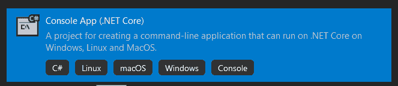
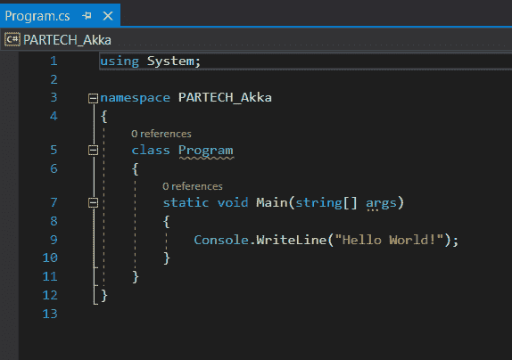
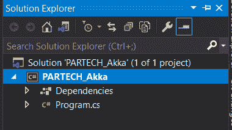
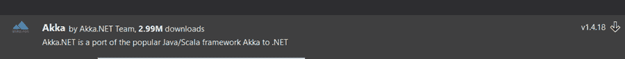
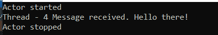

# 点网核心中的 Akka

> 原文：<https://medium.com/codex/akka-in-dot-net-core-816795ae4ec6?source=collection_archive---------7----------------------->


在软件开发的初期，可伸缩性是世界上的一个主要问题。组织要么购买多处理器服务器来扩展现有系统，要么继续购买可以并行运行的多个系统。这样做是希望满足扩展模型中的负载。

你认为将一个系统从放大版转换成缩小版容易吗，反之亦然？不，这并不容易，因为它涉及底层编码，需要小心翼翼地处理与并发和分布式计算相关的问题。

即使在云出现之后，这个问题在现代仍然存在。这就是 Akka 的用武之地，它提供了一种构建并发和容错系统的优秀方法。让我们详细看看什么是 Akka，它带来了什么，以及如何在中实现基于 Akka 的系统。网芯。

**目录**

1.  Akka 是什么？
2.  什么是演员模特？
3.  Akka 在。网络核心
4.  结论

# Akka 是什么？

Akka 是一个设计用于处理和构建高度并发、分布式和容错系统的工具包。它是用 Scala 构建的，为开发者提供了 Scala 和 Java APIs。它开发并发分布式系统的方法是基于 Actor 模型的(我们将在下一节看到)。

Akka 在参与者和底层域系统之间提供了一个层，参与者的角色是处理传入的消息。在此之上，创建、处理、调度线程、同步的复杂性由框架来处理。这使得开发人员更容易专注于业务逻辑，而不是并发机制的底层实现。

以下是 Akka 的主要优势。

1.  无需编码的多线程和并发行为。
2.  系统之间的透明通信，以及
3.  基于需求的高可用性和可扩展性。

# 什么是演员模特？

简单地说，它是一个有助于更容易实现并发计算的模型。它提供了一组关于系统组件之间应该如何进行交互的规则。类似于面向对象编程中对象扮演主要角色，这里参与者扮演主要角色。所有的动作都是围绕着演员来驱动的。

参与者有各自的邮箱，不共享内存，他们是有状态的，彼此隔离。与此同时，参与者可以创建新的参与者，向其他参与者发送消息，并决定如何处理下一条消息。

就容错而言，每个参与者都有一个主管。参与者模型背后的逻辑不是为所有的失败场景编写防御性的代码(来处理它们)，相反，错误必须被动态地处理。比方说，如果一个参与者出错了，管理者将采取行动，将参与者恢复到已知的一致状态，并通过自我修复的方法使参与者恢复行动。如果多个消息被发送到同一个参与者，那么参与者将按顺序处理这些消息。

# Akka 在。网络核心

在本节中，我们将实现一个简单的项目，该项目使用基于控制台的应用程序来消费 Akka 包。

## 第一步

创建一个基于. Net Core 的控制台应用程序，并为项目提供一个有效的名称。



## 第二步

创建项目后，它将有一个 program.cs 文件，内容如下。



项目的文件夹结构如下所示。



## 第三步

是时候在项目中添加 Akka 的引用了。要使用 Akka 服务，你需要安装一个 NuGet 包。为此，右键单击项目并选择 Manage NuGet package 选项。搜索“Akka”并安装软件包—“Akka”



## 第四步

创建一个您希望由 Akka Actor 模型调用和维护的业务逻辑类。为了简单和方便，我们在这里创建一个名为 Logic 的类。它有一个构造函数，并期望注入字符串参数。

```
public class Logic { ​ public Logic(string inputMessage) ​ { ​ Message = inputMessage; ​ } ​ public string Message { get; set; } }
```

## 第五步

下一步是通过从 Akka 继承 ReceiveActor 类来引入 actor 类。演员参考。这里，在这个例子中，LogicActor 充当参与者模型，处理从 Logic 接收的输入消息，并处理业务逻辑。Actor 模型创建一个新线程，并处理其中的信息。除此之外，我们还记录参与者开始和停止流程时的消息。

```
public class LogicActor : ReceiveActor { ​ public LogicActor() ​ { ​ Receive<Logic>(x => { Console.WriteLine($"Thread - {Thread.CurrentThread.ManagedThreadId} Message received. {x.Message}"); }); ​ } ​ protected override void PreStart() => Console.WriteLine("Actor started"); ​ protected override void PostStop() => Console.WriteLine("Actor stopped"); }
```

## 第六步

在 main 方法中，执行元的调用发生了。为了做到这一点，已经创建了一个 actor 系统并提供了一个名称。第二，专门创建了一个 actor 来处理逻辑 actor，并为它提供了一个有效的名称。接下来，“告诉”将业务逻辑分配给参与者进行处理的方法。这个角色负责维护应用程序中的所有线程。这里，我们引入了一个 5 秒钟的线程睡眠机制，这样我们就可以测试 actor 停止日志消息。

```
static void Main(string[] args) ​ { ​ var actorSystem = ActorSystem.Create("partech-actor-system"); ​ var actor = actorSystem.ActorOf<LogicActor>("logic"); ​ actor.Tell(new Logic("Hello there!")); ​ Thread.Sleep(5000); ​ actorSystem.Stop(actor); ​ Console.ReadLine(); ​ }
```

## 第七步

运行解决方案。观察结果，因为它显示了由参与者维护和控制的线程号，以处理业务逻辑。除此之外，actor 的“开始”和“停止”消息也会出现在控制台窗口中已处理消息的上方和下方。



# 最后的话

Akka 为实现并发和分布式系统提供了大量的选择。最好的部分是你可以实现它们，而不需要编写复杂的逻辑来维护它们。

*原载于*[*https://www . partech . nl*](https://www.partech.nl/nl/publicaties/2021/05/akka-in-dot-net-core)*。*