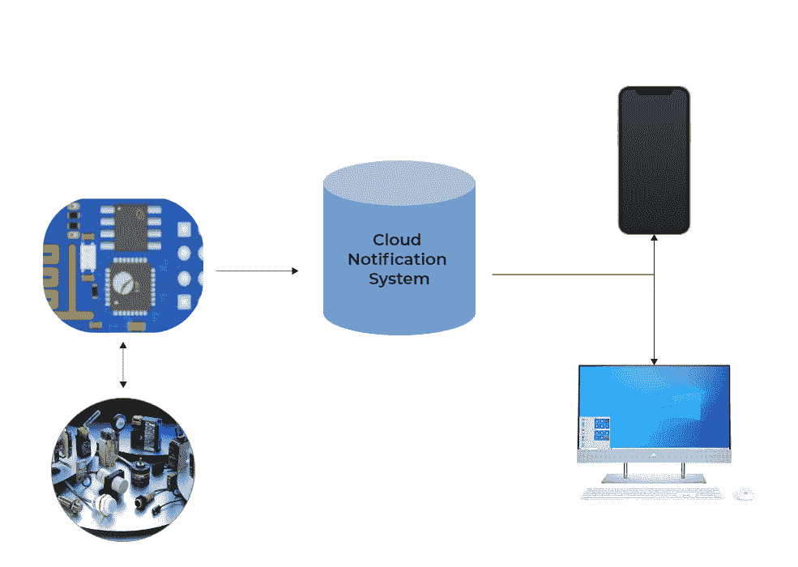
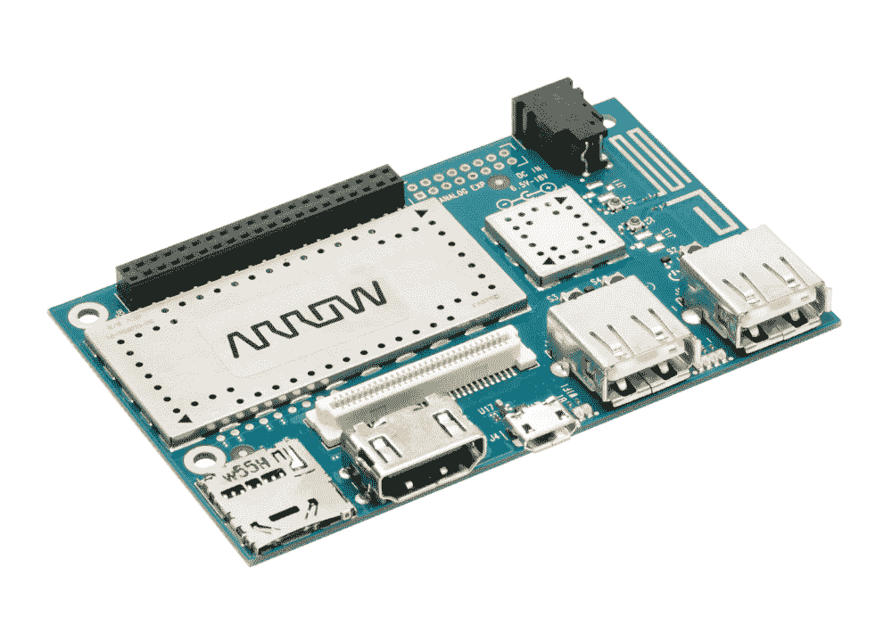
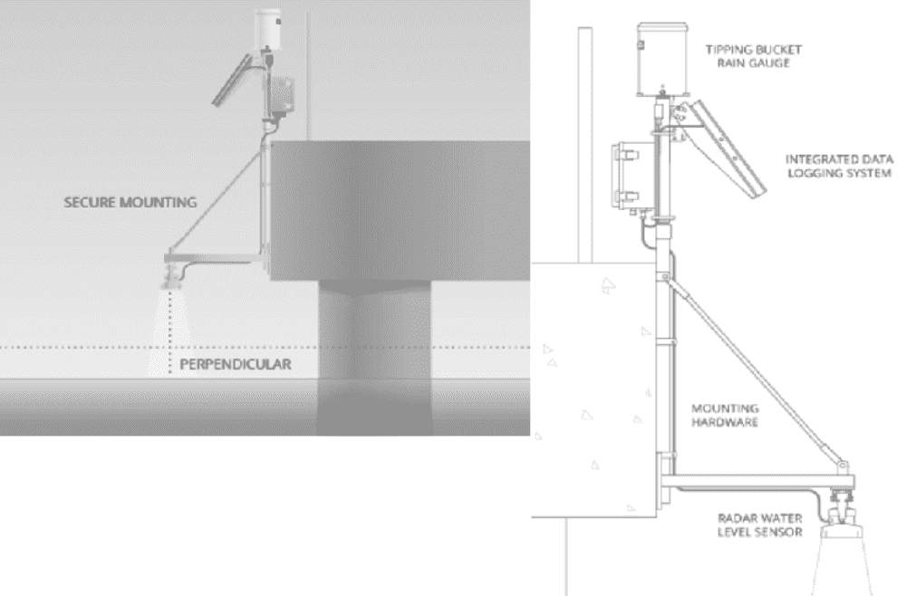
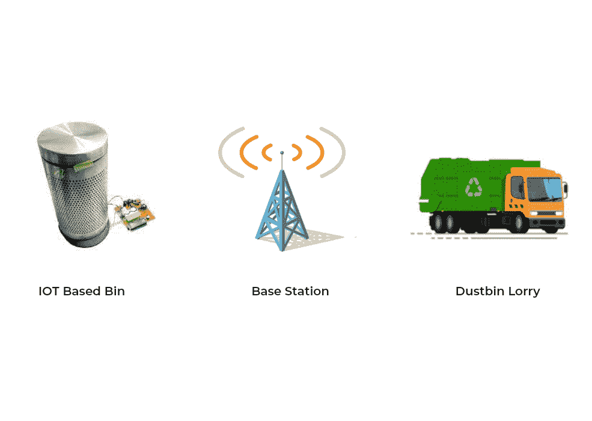
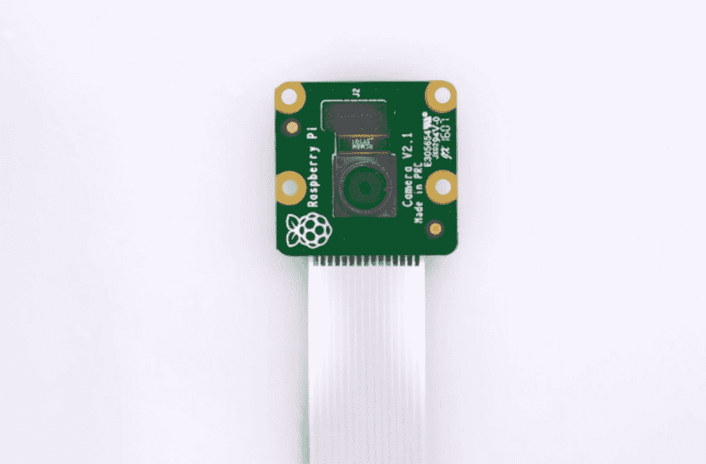
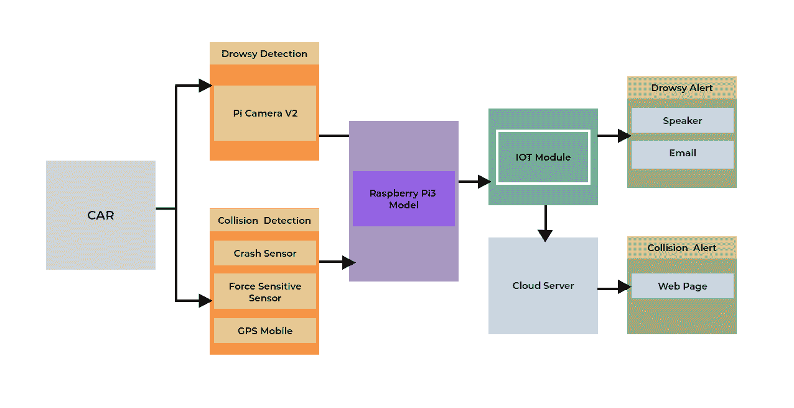

# 物联网应用中的警报处理

> 原文：<https://medium.com/codex/alert-handling-in-iot-applications-a538f6b27d63?source=collection_archive---------21----------------------->

## **什么是物联网警报处理系统？**

物联网警报系统提供了一种经济高效的方式，将即时消息传达给指定人员，以便采取适当的措施。它们的实现有很多，并且是跨领域的。物联网警报处理系统最重要的组件是传感器，可以是有线或无线传感器。传感器用于检测和测量各种物理现象，如热和压力，以及人类的五种感官——视觉、听觉、触觉、味觉和嗅觉。

如果传感器是警报处理系统的心脏，那么通知就像传递信息的动脉。通过通知，我们可以向用户传递任何类型的信息。这篇文章详细介绍了物联网警报系统如何被用来解决各行各业的紧迫问题。

**警报处理系统是如何运作的？**

它使用射频(RF)检测器来检测由 RF 发射器发射的 RF 信号的独特组合。Raspberry Pi 有助于处理和分析接收到的信号，并生成针对每种信号类型配置的警报。花费不多，也很容易实现。

**树莓派**

这是一台小巧、价格适中的电脑，你可以通过有趣、实用的项目来学习编程。这看起来像信用卡，可以和电脑、电视、标准键盘和鼠标一起使用。它是由英国的覆盆子公司开发的

与 Broadcom 合作的基金会。这是一个功能强大的小设备，可以帮助所有年龄的人探索计算，并学习使用 Scratch 和 Python 等语言进行编码。

有趣的事实:“**覆盆子**”源自微型计算机基于水果的**命名**传统。“ **Pi** 指的是“Python”，因为 Python 是第一批移植到 **Raspberry Pi** 上运行的程序之一。

**警报处理系统的实际应用**

现在是时候看看这些警报系统在现实世界中的应用了。它们广泛用于商业和家庭用途。

*   洪水警报系统
*   渔民警报系统
*   智能垃圾监控报警系统
*   困倦驾驶员警报系统

**洪水警报系统:-**

洪水**警报系统**具有自动传感器，这些传感器被放置在河床上、河边、岸边或水库的边缘，遍布一个确定的区域。数据被收集并立即发送到控制站或无线连接的个人电脑。

一般来说，洪水警报分为以下几类:

*   当洪水预计在 12-48 小时内到来时，洪水观察将会发布。
*   洪水预警更加严重，如果预计大面积地区会发生洪水，或者洪水正在发生，就会发布洪水预警。
*   **山洪爆发监测**和警告遵循相同的协议，但它是专门用于快速洪水，通常是由暴雨或大坝溃决引起的。
*   **洪水声明**当预测洪水将沿主要河流发生，但不会对人员和财产构成威胁时，向媒体和公众发布。

基于上述标准通信标准，各种物联网制造商开发和生产警报硬件和软件，其中大多数都是交叉兼容的，因此可以用于任何行业。

**物联网洪水预警系统工作原理**

如上图所示，翻斗式雨量计的功能是收集设定的降雨量，然后容器倾倒收集的水，并向数据传输器发送电信号。下一级是集成数据记录系统，它是一个实时监控站，内置数据记录器、遥测模块和电源/充电电源。

根据位置和推荐的监控计划，安装硬件数据记录器可以直接安装在桥上的柱子上。

使用雷达技术的水位传感器提供了额外的支持水位测量方法，如潜水压力传感器，将在监测难以到达的位置时使用。

任何监测项目最重要的部分是收集数据的传输和访问。现场记录测量值并从设备中读取是一种方法，但这很耗时。在远离现场的计算机上实时收集、发送和查看监控数据的能力要高效得多。

**智能垃圾监控&预警系统**

随着全球人口的持续增长，废物管理变得越来越具有挑战性，特别是在印度这样的国家，卫生设施是一个巨大的问题。这主要是由于不当的废物监测和管理程序。这里的关键问题是，在下一个清洁过程开始之前，公共垃圾箱会提前装满并溢出。这导致各种健康危害和难闻的气味，从而导致各种疾病的传播。

**解决方案**

解决这个问题需要一个智能垃圾监控和警报系统来进行适当的垃圾管理。该警报系统向其各自的废物管理网络服务器发出信号，请求进行消毒。它使用超声波传感器持续监控垃圾箱中的垃圾水平。这种超声波传感器检查垃圾箱中的垃圾填充水平，一旦达到指定水平，就向市政网络服务器发送警报。市政办公室随后会派一名环卫工人在垃圾箱完全装满或溢出之前对其进行清理。清洁完垃圾箱后，环卫员工借助 RFID 标签确认清空垃圾的任务。

**渔民警报系统**

生活在沿海地区的人们主要依靠捕鱼来获取收入。如果渔民越过他们国家的海洋边界，将被视为严重违法行为。由于他们不知道边界，渔民可能会越过这些边界。一旦他们这么做了，他们和他们的船就会被邻国的海岸警卫队抓获。基于物联网的边界警报系统可以帮助渔民准确知道他们在哪里，边界在哪里。

**渔民报警系统工作机制**

Zigbee 是一种无线技术，是作为一种开放式全球标准开发的，旨在满足低成本、低功耗无线物联网网络的独特需求。它的通信是专门为控制和传感器网络而构建的。

通过使用位于船上的 GPS 设备，将确定船位置的当前纬度和经度值，并将该值与边界所在的预定义纬度和经度值进行比较。ZigBee 设备可以通过中间设备网络中继数据，从而远距离传输数据。它最适合传感器或输入设备的间歇数据传输。如果一艘船在不知情的情况下越过边境，附近所有其他装有类似警报系统的渔船也会收到警报。该系统向该区域的渔民和海岸警卫队发出警报。

**瞌睡司机警报系统**

司机的疲劳或困倦是交通事故的主要原因之一。物联网解决方案研究驾驶员的视觉姿态、面部运动和眨眼频率，并得出结论。眨眼是检测驾驶员睡意的关键区分因素。当驾驶员无意中闭上眼睛时，眼睛纵横比(EAR)的阈值低于给定范围。困倦眨眼样本的阈值表示在特定时间间隔内获取的驾驶员闭眼的视频帧的数量。如果连续计数帧增加到指定计数的范围以上，则确认驾驶员困倦。

这里，使用 Raspberry Pi 摄像机连续监控驾驶员眼睛的运动，通过该运动计算耳朵的阈值。还包括计数器，用于对 EAR 等于或低于阈值集的帧的出现进行计数。如果达到耳朵低于阈值的连续帧的阈值计数，则由放置在车辆中的扬声器激活并播放提醒驾驶员的特定频率的噪声，并且向驾驶员的替代联系人发送/发出邮件或自动语音呼叫，该替代联系人然后可以呼叫并提醒驾驶员。

在为我们的日常问题提供简单而廉价的解决方案方面，技术已经取得了长足的进步，而物联网处于这一切的最前沿。

**作者:Sathiyapriya S**