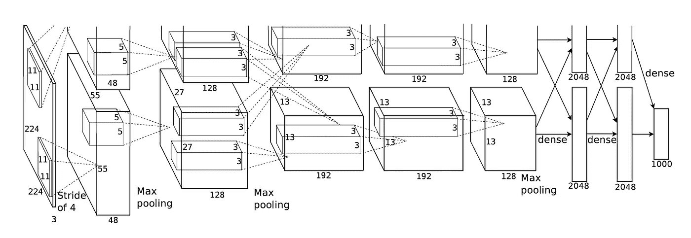
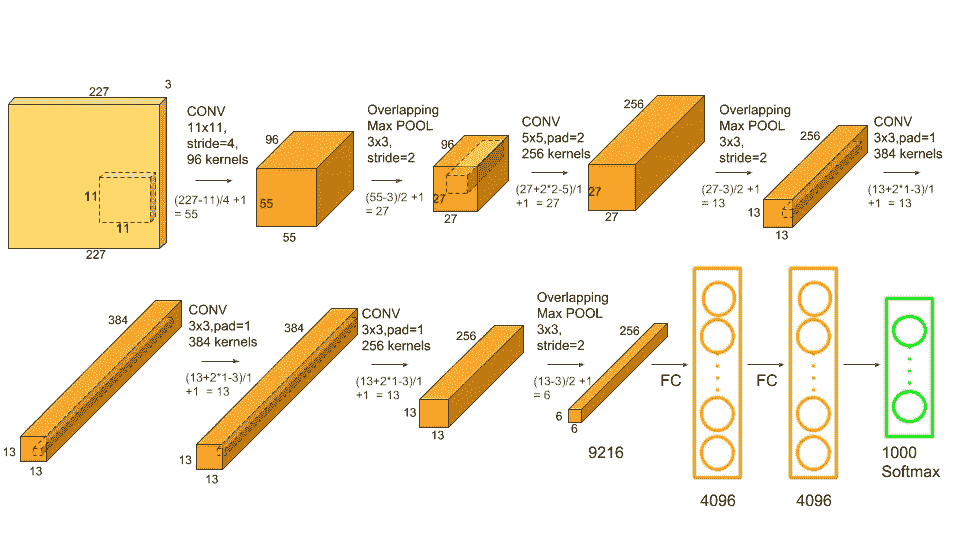
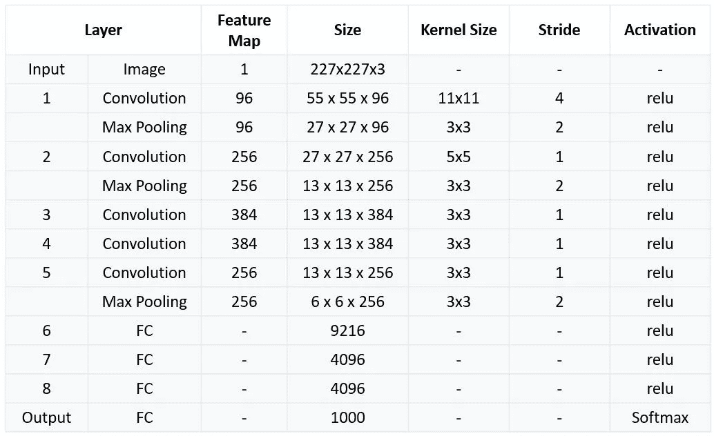
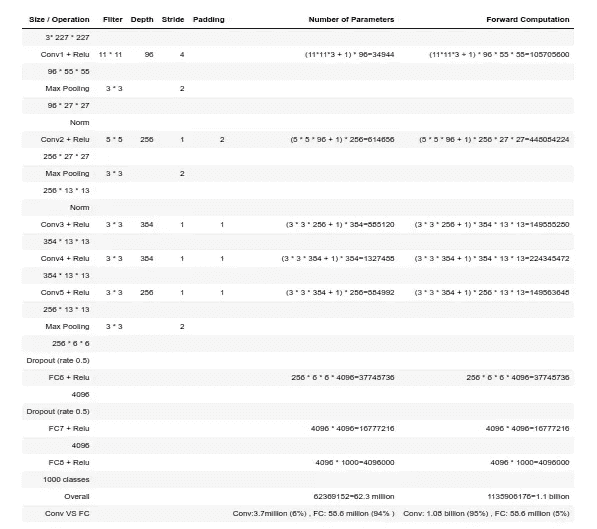
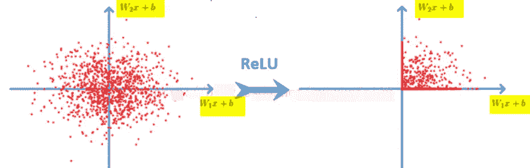
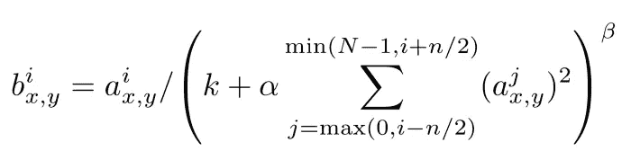
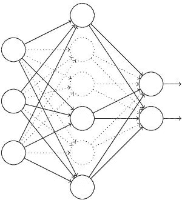

# AlexNet 完整架构

> 原文：<https://medium.com/codex/alexnet-complete-architecture-dc3a9920cdd?source=collection_archive---------17----------------------->

# 介绍

AlexNet 由 2012 年 ***ImageNet 竞赛*** 冠军 ***的**辛顿**和他的学生 Alex Krizhevsky 设计。也是在那一年之后，更多更深入的神经网络被提出，比如优秀的 VGG，GoogleLeNet。其官方数据模型准确率 **57.1%** ，top 1-5 达到 **80.2%** 。这对于传统的机器学习分类算法来说已经是相当出色的了。***



## 下表解释了 AlexNet 的网络结构:



# 为什么 AlexNet 能取得更好的效果？

1.  **使用 Relu 激活功能:**

使用 ReLu 的主要原因是因为**它简单、快速，并且从经验上看它似乎工作得很好**。根据经验，早期的论文观察到，用 ReLu 训练深度网络往往比用 sigmoid 激活训练深度网络收敛得更快更可靠。

**Relu 函数:f (x) = max (0，x)**

ReLu 是**用于多层神经网络或深度神经网络**的非线性激活函数。这个函数可以表示为:其中 x =一个输入值。根据等式，ReLu 的输出是零和输入值之间的最大值。



**2。标准化(本地响应标准化):**

要深入了解 LRN，请参考:[https://towards data science . com/difference-between-local-response-normalization-and-batch-normalization-272308 c 034 AC](https://towardsdatascience.com/difference-between-local-response-normalization-and-batch-normalization-272308c034ac)

使用 ReLU f (x) = max (0，x)后，你会发现激活函数后的值没有像 tanh 和 sigmoid 函数那样的值域，所以 ReLU 后一般会做一个归一化，LRU 是一个稳健的建议(这里不确定，应该会提出？)神经科学中有一种方法叫做“侧抑制”，讲的是活动神经元对其周围神经元的作用。

下面的等式指的是**通道间 LRN:**



**3。辍学:**

Dropout 也是常说的一个概念，可以有效防止神经网络的过拟合。与一般的线性模型相比，采用了一种常规的方法来防止模型过拟合。在神经网络中，通过修改神经网络本身的结构来实现退出。对于某一层神经元，在保持输入层和输出层神经元个体不变的情况下，随机删除一部分定义概率的神经元，然后根据神经网络的学习方法更新参数。在下一次迭代中，重新随机化，去掉一些神经元，直到训练结束。



**4。数据扩充:**

更深入的了解:[https://medium . com/lansaar/what-is-data-augmentation-3da 1373 E3 fa 1](/lansaar/what-is-data-augmentation-3da1373e3fa1)

**在深度学习中，当数据量不够大时，一般有 4 种解决方案:**

*   数据扩充——人为地增加训练集的大小——通过翻译、翻转、噪声
*   正则化— —相对少量的数据会导致模型过拟合，使得训练误差很小，测试误差特别大。通过在损失函数后增加一个正则项，可以抑制过拟合。缺点是需要引入手动调节的超参数。
*   辍学-也是一种正规化的方法。但与上述不同的是，它是通过随机将某些神经元的输出设置为零来实现的
*   无监督预训练-使用自动编码器或 RBM 卷积形式逐层进行无监督预训练，最后添加一个分类层进行监督微调

# 代码实现:

```
!pip install tflearnimport keras
from keras.models import Sequential
from keras.layers import Dense, Activation, Dropout, Flatten,\
 Conv2D, MaxPooling2D
from keras.layers.normalization import BatchNormalization
import numpy as np
np.random.seed(1000)# (2) Get Data
import tflearn.datasets.oxflower17 as oxflower17
x, y = oxflower17.load_data(one_hot=True)# (3) Create a sequential model
model = Sequential()# 1st Convolutional Layer
model.add(Conv2D(filters=96, input_shape=(224,224,3), kernel_size=(11,11),\
 strides=(4,4), padding='valid'))
model.add(Activation('relu'))
# Pooling 
model.add(MaxPooling2D(pool_size=(2,2), strides=(2,2), padding='valid'))
# Batch Normalisation before passing it to the next layer
model.add(BatchNormalization())# 2nd Convolutional Layer
model.add(Conv2D(filters=256, kernel_size=(11,11), strides=(1,1), padding='valid'))
model.add(Activation('relu'))
# Pooling
model.add(MaxPooling2D(pool_size=(2,2), strides=(2,2), padding='valid'))
# Batch Normalisation
model.add(BatchNormalization())# 3rd Convolutional Layer
model.add(Conv2D(filters=384, kernel_size=(3,3), strides=(1,1), padding='valid'))
model.add(Activation('relu'))
# Batch Normalisation
model.add(BatchNormalization())# 4th Convolutional Layer
model.add(Conv2D(filters=384, kernel_size=(3,3), strides=(1,1), padding='valid'))
model.add(Activation('relu'))
# Batch Normalisation
model.add(BatchNormalization())# 5th Convolutional Layer
model.add(Conv2D(filters=256, kernel_size=(3,3), strides=(1,1), padding='valid'))
model.add(Activation('relu'))
# Pooling
model.add(MaxPooling2D(pool_size=(2,2), strides=(2,2), padding='valid'))
# Batch Normalisation
model.add(BatchNormalization())# Passing it to a dense layer
model.add(Flatten())
# 1st Dense Layer
model.add(Dense(4096, input_shape=(224*224*3,)))
model.add(Activation('relu'))
# Add Dropout to prevent overfitting
model.add(Dropout(0.4))
# Batch Normalisation
model.add(BatchNormalization())# 2nd Dense Layer
model.add(Dense(4096))
model.add(Activation('relu'))
# Add Dropout
model.add(Dropout(0.4))
# Batch Normalisation
model.add(BatchNormalization())# 3rd Dense Layer
model.add(Dense(1000))
model.add(Activation('relu'))
# Add Dropout
model.add(Dropout(0.4))
# Batch Normalisation
model.add(BatchNormalization())# Output Layer
model.add(Dense(17))
model.add(Activation('softmax'))model.summary()# (4) Compile 
model.compile(loss='categorical_crossentropy', optimizer='adam',\
 metrics=['accuracy'])# (5) Train
model.fit(x, y, batch_size=64, epochs=1, verbose=1, \
validation_split=0.2, shuffle=True)
```

在这里，我使用不同的数据集和使用批量标准化和不同的输入维数来减少可训练参数，以便它可以在 CPU 上运行。最初的架构有 11 亿个参数，这将需要 GPU 平稳运行。