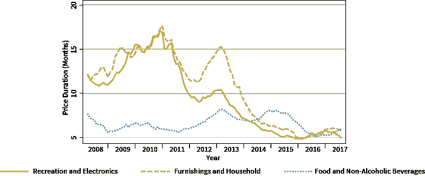
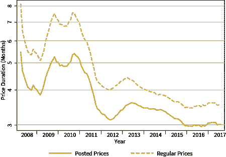
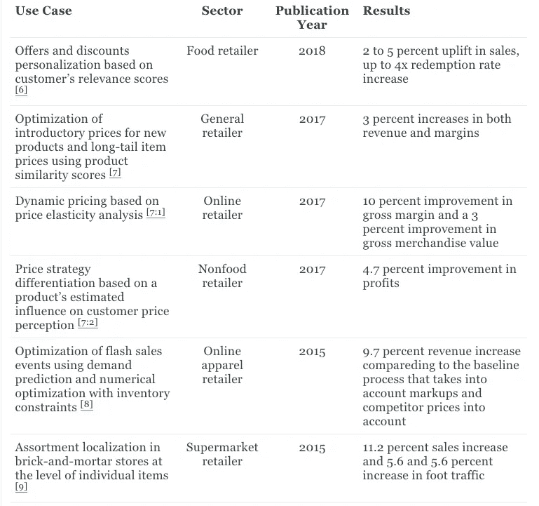
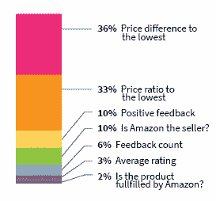
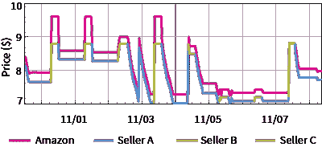
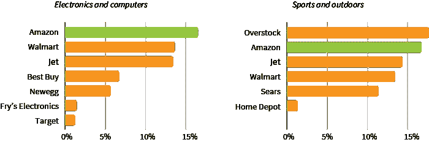

# 算法定价，第一部分:风险和机遇

> 原文：<https://medium.com/codex/algorithmic-pricing-part-i-the-risks-and-opportunities-d7ae8a9e9484?source=collection_archive---------7----------------------->

文章最初发表在 [Grid Dynamics 博客](https://blog.griddynamics.com/?utm_source=medium&utm_medium=referral&utm_campaign=algorithmic-pricing-part-i-the-risks-and-opportunities/)

人工智能具有改变甚至扰乱企业运营的巨大潜力，价格管理是直接影响企业盈利能力和效率的最重要的业务功能之一。人工智能(AI)技术对价格管理过程的影响并不总是直接的。例如，基本的机器学习方法被广泛用于价格弹性分析，它们的好处是众所周知的。然而，更先进的新兴方法，如自然语言处理、图像分类、强化学习等，在企业运营中的应用较少。它们对价格管理的适用性不太明显。尽管如此，正如我们将在后面讨论的，这些方法在某些定价用例中可以带来实质性的好处。

这是一系列文章的第一篇，探讨了数据科学方法和人工智能技术的日益采用如何影响零售和消费品制造公司的价格管理流程。在这一系列的帖子中，我们将使用术语“算法定价”来指通过统计分析、机器学习或其他人工智能方法和技术进行完全或部分自动化决策的价格管理过程。

在第一篇文章中，我们将通过观察行业趋势和统计数据，检查已知的案例研究，并转述包括亚马逊在内的大中型零售商采用算法方法的事实，试图量化算法定价带来的风险和机遇。

# 算法定价的特点

算法定价是一个宽泛的术语，通常指在价格管理中使用基于规则或自学算法的自动化决策。在大多数零售和消费品应用中，这一通用概念通常转化为以下特性和功能的某种组合:

*   **动态定价**。自动化决策支持更频繁、更精确地改变价格瀑布的各个组成部分，包括基价、促销和特价。这些变化有助于定价以利润最佳的方式适应竞争对手的行动、库存周转、清仓目标和需求高峰。
*   **个性化**。算法方法有助于细分或个性化价格瀑布的某些元素，如折扣和特价。它还考虑了消费者口味、价格敏感度和其他潜在买家的统计信息的差异。
*   **差异化定价策略**。数据驱动的方法有助于根据产品对消费者价值感知的影响、与其他产品的相似性和其他因素，优化不同产品和类别的定价策略。
*   **最优保证**。数据驱动的方法有助于确定接近最优的定价参数，并发现错过的机会。例如，算法促销管理系统可以建议可以提高基线促销日历的性能的新促销。
*   **高级内外信号**。算法定价通常依赖于对交易、库存和目录数据以及外部信号(如竞争对手定价)的统计分析，以提高决策质量并对趋势做出反应。在某些情况下，它使用自然语言处理(NLP)和图像识别技术来利用文本和视觉数据，如产品描述和图像。
*   **整合销售和库存管理**。算法定价将库存水平和销售速度数据纳入价格优化，以提高或降低价格，避免缺货和库存积压。另一方面，算法定价通常需要的基本功能，如需求建模，通常应用于其他用例，如分类和库存优化。

根据战略考虑和其他因素，可以不同地实现和使用这些特性和功能。换句话说，算法定价不是定价策略，而是高效执行定价策略的工具包。我们将把算法定价和定价策略之间关系的详细讨论推迟到本系列的下一篇文章。相反，在这篇文章的剩余部分，我们将重点关注算法定价的潜力和采用情况。

# 算法定价的颠覆性潜力

企业可以从使用某种算法做出更智能、更动态的定价决策中获益，这种想法并不新鲜。算法价格管理的历史可以追溯到 1985 年，当时美国航空公司推出了第一个收益管理系统。这家航空公司开发这个系统有一个很好的理由:它受到了当时新兴的低成本航空公司的巨大压力。票价设定的最优化是一个生死存亡的问题。动态价格和座位库存管理系统一经推出，它不仅成为公司生存的关键因素，还震动了整个航空市场。廉价航空公司受到了非常严重的打击，因为美国人现在可以赶上或超过他们的价格。这一过程在收益管理系统推出一年后，以美国主要低成本竞争对手 People Express 的破产而告终。人民快递的首席执行官唐纳德·伯尔(Donald Burr)评论了该公司的失败:

*从 1981 年到 1985 年，我们是一家充满活力、盈利的公司，但后来我们一蹶不振，每月亏损 5000 万美元。我们还是同一家公司。改变的是美国人在我们每个市场进行广泛收益管理的能力。…我们做了很多正确的事情。但是，我们没有解决产量管理和自动化问题。…[如果让我再做一次，]我每天清单上的第一要务将是确保我的员工获得最好的信息技术工具。*

如今，航空公司收益管理系统带来的增量收入与利润率相当；换句话说，算法定价实际上是一种生存手段。

将一家航空公司作为零售和制造业的模型可能看起来很奇怪。尽管如此，这个古老的故事证明了算法操作的颠覆性潜力，并提出了一个非常及时的问题:如果市场中有相当一部分参与者采用算法方法来定价、促销和库存管理，那么后来者甚至能在这种变化中生存下来吗？这种采用出现在航空业的早期。其中一个原因是航空预订系统的早期数字化，这为决策自动化和动态优化创造了一个完美的环境。零售等其他行业有不同的数字化转型轨迹，算法操作可能尚未完全触及它们。在接下来的章节中，我们将尝试分析零售部门算法定价的轨迹。

# 对零售业的影响

算法定价技术和互联网的透明度对零售商的定价行为乃至整个美国经济产生了重大影响。虽然并不总是能够直接观察和衡量企业对算法方法的采用情况，但已经进行了大量的研究工作，以根据现有数据量化算法定价的影响，并对亚马逊和优步等公司使用的算法进行逆向工程。[【2】](https://blog.griddynamics.com/algorithmic-pricing-part-i-the-risks-and-opportunities/#fn2)

在过去 10 年中，多渠道零售商的价格变动频率一直在增加。[【3】](https://blog.griddynamics.com/algorithmic-pricing-part-i-the-risks-and-opportunities/#fn3)常规价格的平均持续时间从 2008-2010 年的 6.7 个月下降到 2014-2017 年的 3.6 个月，张贴(促销)价格的持续时间也遵循同样的模式，从 2008 年的 5 个月下降到 2017 年的 3 个月。如图 1 所示，在电子产品和家庭用品等在线零售商占有较大市场份额的零售部门，价格变动频率的增加尤其高。此外，有证据表明，这种影响对亚马逊上活跃销售的商品尤为强烈，亚马逊是算法定价最早和最先进的采用者之一。它的压力通过许多零售商以其他方式实施的自动价格匹配在整个行业蔓延。[【3:1】](https://blog.griddynamics.com/algorithmic-pricing-part-i-the-risks-and-opportunities/#fn3)正常价格和标价的行业平均趋势如图 2 所示。

*图一。零售部门定期价格变动的每月持续时间。*[*【3:2】*](https://blog.griddynamics.com/algorithmic-pricing-part-i-the-risks-and-opportunities/#fn3)

*图二。定期和公布价格变化的每月持续时间。*[*【3:3】*](https://blog.griddynamics.com/algorithmic-pricing-part-i-the-risks-and-opportunities/#fn3)

价格也越来越统一，也就是说，买方地理位置的差异越来越小。这一过程在很大程度上是由在线零售商(尤其是亚马逊)推动的，与多渠道零售商相比，在线零售商的价格更加统一。据估计，相对于浮动价格基准，统一定价会使零售连锁店获得 3%到 10%的可变利润。[【4】](https://blog.griddynamics.com/algorithmic-pricing-part-i-the-risks-and-opportunities/#fn4)

上述趋势造成了螺旋式下降的风险，零售商或品牌失去了决策者的地位，并通过自动价格匹配或降价被动地跟随外部变化。有强有力的证据表明，这一过程可能对企业有害。例如，尼尔森报告称，大约 67%的美国零售促销甚至没有打破，而且随着时间的推移，贸易促销的平均效率越来越差。[【5】](https://blog.griddynamics.com/algorithmic-pricing-part-i-the-risks-and-opportunities/#fn5)然而，同一份报告指出，推广效率的差异很大，最佳推广者的表现是最差推广者的五倍。

可以得出这样的结论，随着竞争加剧和主要零售商掌握算法方法，算法定价的总体作用将会增加。一些公司会因此受损，而另一些公司会因此受益，这取决于它们有效利用新方法的能力。试图使用个别技术(如自动价格匹配)而没有将这些方法恰当地整合到他们的战略和价值主张中的公司很可能成为这场游戏中的输家。那些对算法方法有广阔视角，并利用算法和数据来创造有吸引力和有价值的客户体验的公司最有可能成为赢家。

# 中型零售商采用

接下来，我们转向算法定价的案例研究，以更好地理解零售商如何使用它及其典型的好处。我们将首先关注中型零售商的案例研究，然后研究亚马逊使用的技术。

近年来，与零售中的算法定价相关的案例研究并不少见。我们在表 1 中提供了六个案例研究总结，以突出几个流行的使用案例以及典型的收入和利润提升结果。平均而言，一两个用例的算法定价的实施推动销售额增长 3%到 5 %,利润增长 4%到 11%。毫不奇怪，对于具有动态环境的零售商，如闪购或纯在线零售商，结果尤其令人印象深刻。例如，服装闪购零售商 Rue La La 通过实施先进的价格优化系统，利用预测建模和数字方法联合优化所有类别的价格，实现了 9.7%的平均收入增长。

*表 1。中型零售商的案例研究。*

# 亚马逊采用

亚马逊是算法定价和算法操作最早、最先进、最成功的采用者之一。这当然是亚马逊取得巨大成功的一个因素，过去十年，亚马逊的市值增长了 30 倍，从 2008 年的 300 亿美元增长到 2018 年的 1 万亿美元。

尽管亚马逊使用的价格管理算法没有公开，而且很可能会随着时间的推移而不断变化，但已经有几次尝试通过检查张贴的价格和产品可用性模式来分析亚马逊的定价逻辑并量化其好处。

第一，需要注意的是，亚马逊并不只是在内部使用定价算法；相反，它被设计成一个开放的算法市场。亚马逊为第三方卖家提供了一个 API(亚马逊市场网络服务)，允许他们接收关于竞争性定价、推荐库存和定价水平、新产品机会等的近实时更新。该界面帮助卖家做出动态定价和采购决策，这些决策也可以近乎实时地执行。[【10】](https://blog.griddynamics.com/algorithmic-pricing-part-i-the-risks-and-opportunities/#fn10)这些功能非常重要，因为亚马逊 18%的收入来自第三方卖家服务，包括佣金、履约和运费。每天有 3000 多名卖家加入这个市场。[【11】](https://blog.griddynamics.com/algorithmic-pricing-part-i-the-risks-and-opportunities/#fn11)[【12】](https://blog.griddynamics.com/algorithmic-pricing-part-i-the-risks-and-opportunities/#fn12)

其次，亚马逊使用复杂的算法来管理市场和仲裁卖家，这可以通过对从亚马逊网站上收集的数据进行统计分析来揭示。例如，Amazon 上的所有产品页面都有一个购买框，其中包含产品价格、运输信息、卖家名称以及更改数量或购买产品的按钮(图 3)。如果多个卖家提供一种产品，亚马逊会选择主要卖家显示在购买框中。对数千个 Buy Box 实例的分析揭示了卖家选择算法的复杂性，该算法考虑了多个因素，如价格、反馈数量和平均评级，如图 4 所示。[【13】](https://blog.griddynamics.com/algorithmic-pricing-part-i-the-risks-and-opportunities/#fn13)。这种算法对市场和卖家的表现有着重大影响，因为亚马逊上超过 80%的销售都是通过购买箱进行的。[【14】](https://blog.griddynamics.com/algorithmic-pricing-part-i-the-risks-and-opportunities/#fn14)

*图三。亚马逊上一个购买箱的例子。*

*图 4。特性在赢得购买盒中的相对重要性。*[*【13:1】*](https://blog.griddynamics.com/algorithmic-pricing-part-i-the-risks-and-opportunities/#fn13)

接下来，强有力的经验证据表明，使用算法定价技术的第三方卖家通常比非算法卖家更成功。[【13:2】](https://blog.griddynamics.com/algorithmic-pricing-part-i-the-risks-and-opportunities/#fn13)虽然使用算法技术的卖家不会明确表明自己的身份，但通常可以根据价格模式的变化来检测他们，并分析他们的表现:

*   平均而言，算法卖家的正面反馈数量略高。这是一个令人惊讶的发现，因为许多调查认为大多数消费者讨厌动态定价。
*   算法卖家在新优惠页面的排名明显高于非算法卖家。
*   算法卖家在亚马逊上活跃的时间比非算法卖家长得多。

最后，亚马逊本身就是一个算法卖家，和第三方卖家以相对公平的方式竞争。如图 4 所示，“成为亚马逊履行的产品”在赢得购买箱方面只有很小的优势，亚马逊获胜的机会取决于其他卖家的成熟度。当没有竞争对手使用算法定价时，亚马逊仅占 4%的产品跌出前五名。然而，当至少有一个竞争产品的第三方卖家使用算法定价时，这一数字跃升至 12%。[【13:3】](https://blog.griddynamics.com/algorithmic-pricing-part-i-the-risks-and-opportunities/#fn13)

众所周知，作为卖家，亚马逊使用了大量不同的算法定价技术。最广为人知的是动态定价和自动价格匹配，价格可以跟随竞争对手的价格在一天内变化几次，如图 5 所示。亚马逊采用的其他技术包括对 Prime 会员收取比非 Prime 客户更高的价格，对选择免费一天送货的客户提高价格，以及根据一天中的时间或客户流量调整价格。[【15】](https://blog.griddynamics.com/algorithmic-pricing-part-i-the-risks-and-opportunities/#fn15)亚马逊自动设定价格，但有一个异常检测流程来拦截有风险的变化(例如，价格变化的幅度超过某个阈值)，并将其发送给人工审查和批准。

*图五。亚马逊跟随其他卖家的最低价但有溢价的例子。*[*【13:4】*](https://blog.griddynamics.com/algorithmic-pricing-part-i-the-risks-and-opportunities/#fn13)*(2014)*

尽管上面列出的技术还远未完成，但它让我们了解到，对于行业领导者来说，算法定价是多么复杂、普遍和多样化。

# 大型零售商的采用

对大型零售商价格变化模式的比较分析表明，他们正在逐步采用亚马逊开创的算法方法，但存在明显的时间滞后。亚马逊比其他零售商更早开始使用动态定价。2012 年，亚马逊每天执行 27 万次左右的价格变动；与此同时，沃尔玛和百思买每月仅实施约 5 万次价格变动。2013 年，亚马逊将其价格变化频率大幅提高至每天 250 万次价格变化，而沃尔玛和百思买则保持在大致相同的水平。[【16】](https://blog.griddynamics.com/algorithmic-pricing-part-i-the-risks-and-opportunities/#fn16)亚马逊继续比其他大型零售商更频繁地改变价格，但随着竞争对手采用动态定价，差距已经变小，如图 6 所示。[【17】](https://blog.griddynamics.com/algorithmic-pricing-part-i-the-risks-and-opportunities/#fn17)

*图六。按类别动态定价:每个零售商每天至少改变一次价格的跟踪商品组合的百分比(不包括第三方卖家)。*[*【17:1】*](https://blog.griddynamics.com/algorithmic-pricing-part-i-the-risks-and-opportunities/#fn17)*(2017)*

在我们与一些最大的美国零售商的合作中，我们还观察到预测模型在各种定价和库存用例中的使用越来越多，例如在过去几年中促销日历的优化。我们将在接下来的章节中更详细地讨论这些见解。

# 结论

先进的收入管理方法已经在许多行业显示出颠覆性的潜力，包括航空公司、酒店和汽车租赁。零售业中算法定价的轨迹似乎与许多这些例子不同。尽管如此，对价格设定模式的分析表明，使用智能算法和不同信号动态管理价格和分类的能力变得越来越重要。这肯定会导致“竞相压价”尽管如此，将算法定价恰当地整合到他们的战略中，并将其与其他优势(例如，客户智能)相结合的公司实际上可以创造竞争优势。

[如果您对实施该解决方案或我们提供的其他解决方案感兴趣，请联系我们](https://www.griddynamics.com/contact?utm_source=medium&utm_medium=referral&utm_campaign=algorithmic-pricing-part-i-the-risks-and-opportunities/)！

# 来源

1.  R.G. Cross,《收入管理:市场支配的核心策略》,百老汇图书公司，纽约，纽约，1997 年 [↩︎](https://blog.griddynamics.com/algorithmic-pricing-part-i-the-risks-and-opportunities/#fnref1)
2.  长度陈，在线市场测量算法，2017 年 5 月[2017](https://blog.griddynamics.com/algorithmic-pricing-part-i-the-risks-and-opportunities/#fnref2)
3.  A.卡瓦洛，更多亚马逊效应:在线竞争和定价行为，2018 年 9 月[↩︎](https://blog.griddynamics.com/algorithmic-pricing-part-i-the-risks-and-opportunities/#fnref3)[↩︎](https://blog.griddynamics.com/algorithmic-pricing-part-i-the-risks-and-opportunities/#fnref3:1)[↩︎](https://blog.griddynamics.com/algorithmic-pricing-part-i-the-risks-and-opportunities/#fnref3:2)[↩︎](https://blog.griddynamics.com/algorithmic-pricing-part-i-the-risks-and-opportunities/#fnref3:3)
4.  南 DellaVigna，M. Gentzkow，美国零售连锁店的统一定价，2017 年 8 月 [↩︎](https://blog.griddynamics.com/algorithmic-pricing-part-i-the-risks-and-opportunities/#fnref4)
5.  尼尔森，破解贸易促进代码，2014 年 11 月 [↩︎](https://blog.griddynamics.com/algorithmic-pricing-part-i-the-risks-and-opportunities/#fnref5)
6.  食品零售商 Antuit 部署产品优化以提高客户忠诚度和销售额，2018 年 [↩︎](https://blog.griddynamics.com/algorithmic-pricing-part-i-the-risks-and-opportunities/#fnref6)
7.  G.Benmark、S. Klapdor、M. Kullmann 和 R. Sundararajan，零售商如何通过动态定价推动利润增长，2017 年 3 月[↩︎](https://blog.griddynamics.com/algorithmic-pricing-part-i-the-risks-and-opportunities/#fnref7)t20】↩︎t22】↩︎
8.  K.Ferreira，B. Lee，D. Simchi-Levi,《在线零售商分析:需求预测和价格优化》, 2015 年 [↩︎](https://blog.griddynamics.com/algorithmic-pricing-part-i-the-risks-and-opportunities/#fnref8)
9.  H.兰格，个性化如何改变零售定价，2015 年 [↩︎](https://blog.griddynamics.com/algorithmic-pricing-part-i-the-risks-and-opportunities/#fnref9)
10.  亚马逊市场 Web 服务文档，[https://developer.amazonservices.com/](https://developer.amazonservices.com/)↩︎
11.  A.利维，亚马逊的卖家正在走向全球，帮助该公司创造高额利润，2018 年 4 月 [↩︎](https://blog.griddynamics.com/algorithmic-pricing-part-i-the-risks-and-opportunities/#fnref11)
12.  J.Kaziukenas，亚马逊上的一百万新卖家，2018 年 10 月 [↩︎](https://blog.griddynamics.com/algorithmic-pricing-part-i-the-risks-and-opportunities/#fnref12)
13.  长度陈，A. Mislove，C. Wilson，亚马逊市场算法定价实证分析，2016 年 4 月[、](https://blog.griddynamics.com/algorithmic-pricing-part-i-the-risks-and-opportunities/#fnref13) [、](https://blog.griddynamics.com/algorithmic-pricing-part-i-the-risks-and-opportunities/#fnref13:1) [、](https://blog.griddynamics.com/algorithmic-pricing-part-i-the-risks-and-opportunities/#fnref13:2) [、](https://blog.griddynamics.com/algorithmic-pricing-part-i-the-risks-and-opportunities/#fnref13:3) [↩︎](https://blog.griddynamics.com/algorithmic-pricing-part-i-the-risks-and-opportunities/#fnref13:4)
14.  D.Taft，亚马逊购买盒子:互联网 800 亿美元的销售按钮。eWeek，2014 年 10 月 [↩︎](https://blog.griddynamics.com/algorithmic-pricing-part-i-the-risks-and-opportunities/#fnref14)
15.  I. Steffens，亚马逊 Prime 和“免费”运输，2018 年 3 月 [↩︎](https://blog.griddynamics.com/algorithmic-pricing-part-i-the-risks-and-opportunities/#fnref15)
16.  2013 年 12 月 [↩︎](https://blog.griddynamics.com/algorithmic-pricing-part-i-the-risks-and-opportunities/#fnref16)
17.  A.切里斯、d·里格比和 s·泰格梦想着亚马逊圣诞节？，2017 年 11 月[↩︎](https://blog.griddynamics.com/algorithmic-pricing-part-i-the-risks-and-opportunities/#fnref17)↩︎