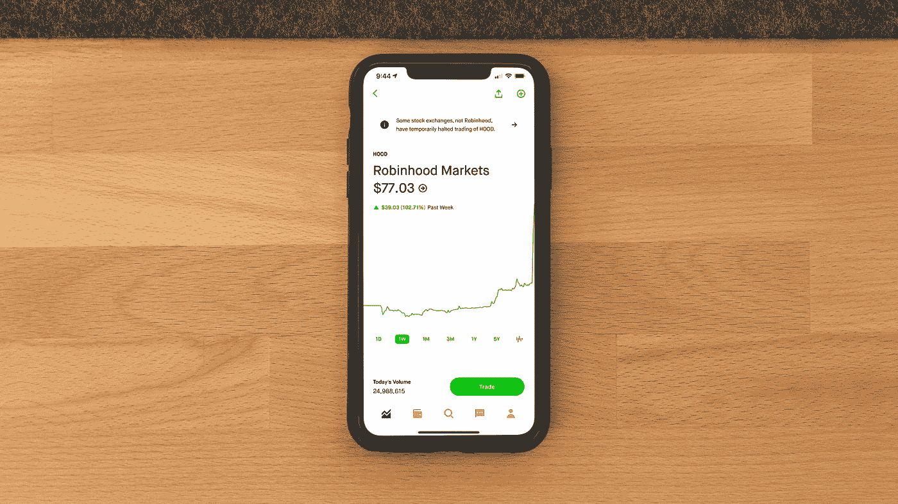

# 在云中使用 Python 进行算法 Robinhood 加密交易

> 原文：<https://medium.com/codex/algorithmic-robinhood-crypto-trading-with-python-in-the-cloud-f85e7c3fe399?source=collection_archive---------4----------------------->

## 使用免费工具，如 AWS 的 Chalice 和 Lambda 框架以及 Tradingview 的 Alert 功能，可以在 Robinhood 上建立完全自动化的交易机器人，而无需人工干预。

[安德鲁·尼尔](https://unsplash.com/@andrewtneel?utm_source=medium&utm_medium=referral)在 [Unsplash](https://unsplash.com?utm_source=medium&utm_medium=referral) 上拍照