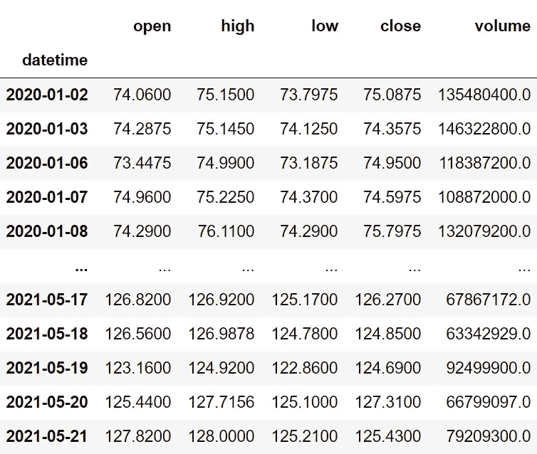
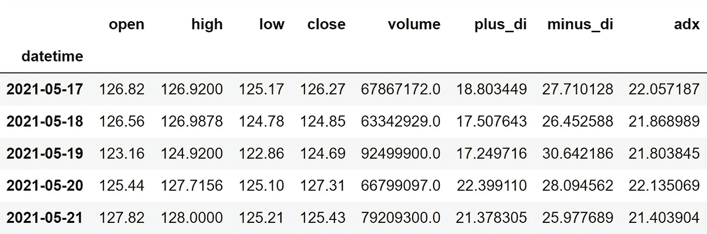
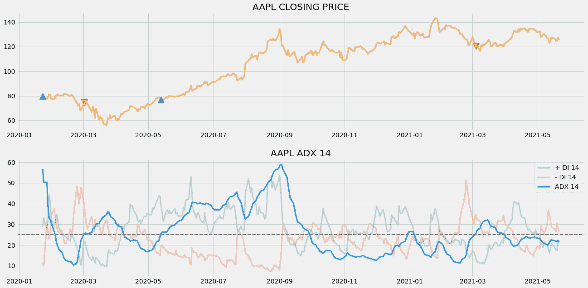
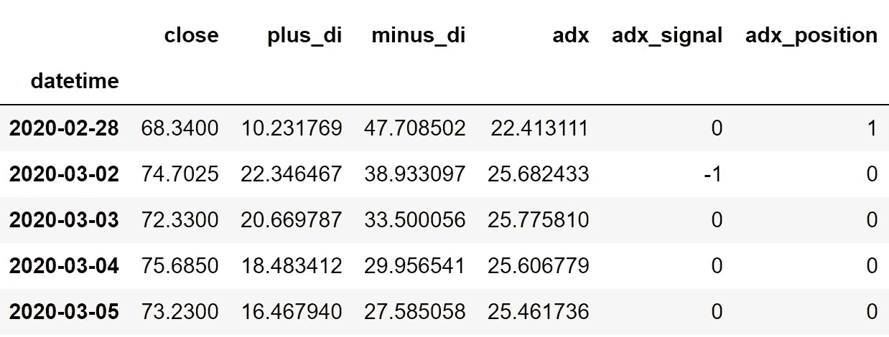

# Python 中的平均方向指数算法交易

> 原文：<https://medium.com/codex/algorithmic-trading-with-average-directional-index-in-python-2b5a20ecf06a?source=collection_archive---------0----------------------->

## 学习从零开始构建 ADX 指标，并用 python 对交易策略进行回溯测试


约翰尼斯·格罗尔在 [Unsplash](https://unsplash.com?utm_source=medium&utm_medium=referral) 上的照片

技术指标有四个不同的分支，但最受欢迎的是趋势指标。这些指标帮助交易者识别市场趋势的方向和强度，并根据它们进行交易。在大多数情况下，趋势类别下的指标揭示了良好的结果，除非我们有效地使用它们。

在本文中，我们将探讨最流行的趋势指标之一，平均方向指数(简称 ADX)。我们将首先对 ADX 及其计算建立一些基本的理解，然后，继续从零开始构建指标，并用 python 构建基于该指标的交易策略。为了评估我们的策略，我们将首先用苹果股票对其进行回溯测试，然后为了更有意义，我们将把我们的策略回报与 SPY ETF 回报(一种专门设计用于跟踪标准普尔 500 指数走势的 ETF)进行比较。

在继续之前，如果你想在没有任何代码的情况下回溯测试你的交易策略，有一个解决方案。这是[的后验区](https://www.backtestzone.com/)。这是一个平台，可以免费对不同类型的可交易资产的任意数量的交易策略进行回溯测试，无需编码。点击这里的链接，你可以马上使用这个工具:[https://www.backtestzone.com/](https://www.backtestzone.com/)

# 平均真实距离

在继续探索 ADX 之前，有必要知道什么是平均真实范围(ATR ),因为它涉及到平均方向指数(ADX)的计算。

平均真实范围是一个技术指标，用来衡量一项资产的平均变动幅度。这是一个滞后指标，意味着它考虑了资产的历史数据来衡量当前价值，但它不能预测未来的数据点。在使用 ATR 时，这不被认为是一个缺点，因为它是更准确地跟踪市场波动的指标之一。ATR 是一个滞后指标，也是一个非方向性指标，意味着 ATR 的运动与市场的实际运动成反比。要计算 ATR，必须遵循两个步骤:

*   **计算真实范围(TR):** 资产的真实范围通过取三个价格差的最大值来计算，这三个价格差是:市场高点减去市场低点，市场高点减去先前的市场收盘，先前的市场收盘减去市场低点。它可以表示如下:

```
**MAX** [ {**HIGH - LOW**}, {**HIGH - P.CLOSE**}, {**P.CLOSE - LOW**} ]where,
MAX = Maximum values
HIGH = Market High
LOW = Market Low
P.CLOSE = Previous market close
```

*   **计算 ATR:** 平均真实范围的计算很简单。我们只需对指定数量的周期取之前计算的真实范围值的平滑平均值。平滑平均线不是普通的均线或均线，而是怀尔德·怀尔斯自己创造的一种平滑平均线，但是使用其他均线没有任何限制。在本文中，为了简单起见，我们将使用 SMA 来计算 ATR，而不是指标创始人创建的自定义移动平均线。以 14 作为周期数的传统设置来计算 ATR 可以表示如下:

```
**ATR 14** = **SMA 14** [ **TR** ]where,
ATR 14 = 14 Period Average True Range
SMA 14 = 14 Period Simple Moving Average
TR = True Range
```

当使用 ATR 作为交易指标时，交易者必须确保他们比以往更加谨慎，因为该指标非常滞后。现在我们已经了解了平均真实范围是什么。现在让我们深入到这篇文章的主要概念，平均方向指数。

# 平均方向指数

ADX 是一种技术指标，广泛用于衡量市场趋势的强度。现在，ADX 并不衡量趋势的方向，无论是看涨还是看跌，而只是代表趋势有多强。所以，为了确定趋势的方向，ADX 结合了一个正方向指数(+ DI)和一个负方向指数(- DI)。顾名思义，+ DI 衡量的是市场的看涨或正趋势，同样地，- DI 衡量的是市场的看跌或负趋势。所有组件的值都限制在 0 到 100 之间，因此充当振荡器。ADX 的传统设置是 14 作为回看周期。

为了计算 ADX 的值，以 14 为回看周期，首先确定正向(+ DM)和负向(- DM)运动。通过查找当前高点和前一个高点之间的差值来计算+ DM，类似地，通过查找前一个低点和当前低点之间的差值来计算- DM。它可以表示如下:

```
**+ DM** = **CURRENT HIGH** - **PREVIOUS HIGH**
**- DM** = **PREVIOUS LOW** - **CURRENT LOW**
```

然后，计算以 14 为回望期的 ATR。现在，使用计算的方向移动和 ATR 值，计算正方向指数(+ DI)和负方向指数(- DI)。要确定+ DI 的值，将正向移动(+ DM)的指数移动平均线(EMA)以 14 作为回望期，所得值除以之前计算的 14 天 ATR，然后乘以 100。这同样适用于确定- DI，但不是采用+ DM 的 14 日均线，而是考虑了负向移动(- DM)。计算+ DI 和- DI 的公式可表示如下:

```
**+ DI** **14** = **100** * [ **EMA 14** ( **+ DM** ) / **ATR 14** ]
**- DI** **14** = **100** * [ **EMA 14** ( **- DM** ) / **ATR 14** ]
```

下一步是使用+ DI 和- DI 来计算方向指数。它可以通过将+ DI 和- DI 之差的绝对值除以+DI 和- DI 之和的绝对值乘以 100 来确定。计算方向指数的公式可表示如下:

```
**DI 14** = | (**+ DI 14**) - (**- DI 14**) | / | (**+ DI 14**) + (**- DI 14**) |  * **100**
```

最后一步是利用确定的方向指数值计算 ADX 本身。ADX 的计算方法是，将之前的方向索引值乘以 13(回望周期- 1)，再加上方向索引，然后乘以 100。计算 ADX 值的公式可表示如下:

```
**ADX 14** = [ ( **PREV DI 14** * **13** ) + **DI 14** ] * **100**
```

ADX 不能按原样使用，需要进行平滑处理。自从 Wilder Wiles(也是 ATR 的创始人)创建以来，ADX 被我们之前讨论过的自定义移动平均线平滑。在计算 ATR 时，我们忽略了使用这种自定义移动平均线，因为可以使用其他类型的移动平均线，但在平滑 ADX 时使用这种移动平均线以获得精确值是必不可少的。

这就是计算 ADX 的值的整个过程。现在，让我们讨论如何构建一个简单的基于 ADX 的交易策略。

**关于我们的交易策略:**在本文中，我们将建立一个简单的交叉策略，每当 ADX 线从下方交叉到 25 上方，并且+ DI 线在- DI 线上方时，该策略就会显示买入信号。类似地，每当 ADX 线从下方交叉到 25 以上，并且- DI 线在+ DI 线上方时，就会产生卖出信号。我们的交易策略可以表述如下:

```
IF **P.ADX < 25** AND **C.ADX** > **25** AND **+ DI LINE** > **- DI LINE** ==> **BUY**
IF **P.ADX** < **25** AND **C.ADX** > **25** AND **+ DI LINE** < **- DI LINE** ==> **SELL**
```

本文的理论部分到此结束。现在，让我们从头开始编写这个指标，用 python 构建讨论过的交易策略，并用苹果股票进行回溯测试，看看一些令人兴奋的结果。我们还将比较我们的 ADX 交叉策略回报和 SPY ETF 的回报，以了解我们的交易策略相对于基准的表现如何。事不宜迟，让我们深入编码部分。

# 用 Python 实现

编码部分分为以下几个步骤:

```
**1\. Importing Packages
2\. Extracting Stock Data from Twelve Data
3\. ADX Calculation
4\. ADX Indicator Plot
5\. Creating the Trading Strategy
6\. Plotting the Trading Lists
7\. Creating our Position
8\. Backtesting
9\. SPY ETF Comparison**
```

我们将按照上面列表中提到的顺序，系好安全带，跟随每一个即将到来的编码部分。

# 步骤 1:导入包

将所需的包导入 python 环境是一个不可跳过的步骤。主要的包是处理数据的 Pandas，处理数组和复杂函数的 NumPy，用于绘图的 Matplotlib，以及进行 API 调用的请求。二级包是数学函数的 Math 和字体定制的 Termcolor(可选)。

**Python 实现:**

```
import pandas as pd
import numpy as np
import requests
import matplotlib.pyplot as plt
from math import floor
from termcolor import colored as cl

plt.style.use('fivethirtyeight')
plt.rcParams['figure.figsize'] = (20,10)
```

现在我们已经将所有需要的包导入到 python 中。我们用十二数据的 API 端点来拉一下苹果的历史数据。

## 步骤 2:从 12 个数据中提取数据

在这一步中，我们将使用 twelvedata.com[提供的 API 端点提取苹果的历史股票数据。在此之前，请注意 twelvedata.com](https://twelvedata.com/):十二数据公司是领先的市场数据提供商之一，拥有大量适用于所有类型市场数据的 API 端点。它非常容易与十二数据提供的 API 进行交互，并且拥有有史以来最好的文档。此外，确保您在[twelvedata.com](https://twelvedata.com/)上有一个帐户，只有这样，您才能访问您的 API 密钥(使用 API 提取数据的重要元素)。

**Python 实现:**

```
def get_historical_data(symbol, start_date):
    api_key = 'YOUR API KEY'
    api_url = f'https://api.twelvedata.com/time_series?symbol={symbol}&interval=1day&outputsize=5000&apikey={api_key}'
    raw_df = requests.get(api_url).json()
    df = pd.DataFrame(raw_df['values']).iloc[::-1].set_index('datetime').astype(float)
    df = df[df.index >= start_date]
    df.index = pd.to_datetime(df.index)
    return df

aapl = get_historical_data('AAPL', '2020-01-01')
aapl
```

**输出:**



作者图片

**代码解释:**我们做的第一件事是定义一个名为‘get _ historical _ data’的函数，它将股票的符号(‘symbol’)和历史数据的起始日期(‘start _ date’)作为参数。在函数内部，我们定义了 API 键和 URL，并将它们存储到各自的变量中。接下来，我们使用“get”函数提取 JSON 格式的历史数据，并将其存储到“raw_df”变量中。在对原始 JSON 数据进行清理和格式化之后，我们将以干净的 Pandas 数据帧的形式返回它。最后，我们调用创建的函数来提取苹果公司从 2020 年开始的历史数据，并将其存储到‘AAPL’变量中。

## 步骤 4: ADX 计算

在这一步中，我们将按照之前讨论的方法计算 ADX 的值。

**Python 实现:**

```
def get_adx(high, low, close, lookback):
    plus_dm = high.diff()
    minus_dm = low.diff()
    plus_dm[plus_dm < 0] = 0
    minus_dm[minus_dm > 0] = 0

    tr1 = pd.DataFrame(high - low)
    tr2 = pd.DataFrame(abs(high - close.shift(1)))
    tr3 = pd.DataFrame(abs(low - close.shift(1)))
    frames = [tr1, tr2, tr3]
    tr = pd.concat(frames, axis = 1, join = 'inner').max(axis = 1)
    atr = tr.rolling(lookback).mean()

    plus_di = 100 * (plus_dm.ewm(alpha = 1/lookback).mean() / atr)
    minus_di = abs(100 * (minus_dm.ewm(alpha = 1/lookback).mean() / atr))
    dx = (abs(plus_di - minus_di) / abs(plus_di + minus_di)) * 100
    adx = ((dx.shift(1) * (lookback - 1)) + dx) / lookback
    adx_smooth = adx.ewm(alpha = 1/lookback).mean()
    return plus_di, minus_di, adx_smooth

aapl['plus_di'] = pd.DataFrame(get_adx(aapl['high'], aapl['low'], aapl['close'], 14)[0]).rename(columns = {0:'plus_di'})
aapl['minus_di'] = pd.DataFrame(get_adx(aapl['high'], aapl['low'], aapl['close'], 14)[1]).rename(columns = {0:'minus_di'})
aapl['adx'] = pd.DataFrame(get_adx(aapl['high'], aapl['low'], aapl['close'], 14)[2]).rename(columns = {0:'adx'})
aapl = aapl.dropna()
aapl.tail()
```

**输出:**



作者图片

**代码解释:**我们首先定义一个名为“get_adx”的函数，它将股票的高点(“高点”)、低点(“低点”)和收盘数据(“收盘”)以及回望期(“回望”)作为参数。

在函数内部，我们首先计算+ DM 和- DM，并分别存储到“正 DM”和“负 DM”中。接下来是 atr 计算，我们首先计算三个差值，并定义一个变量“TR”来存储确定的差值中的最高值，然后，我们计算 ATR 值并将其存储到“ATR”变量中。

使用计算出的方向移动和 ATR 值，我们正在计算+ DI 和- DI，并将它们分别存储到“正 DI”和“负 DI”变量中。在前面讨论的公式的帮助下，我们正在计算方向指数值并将它们存储到“dx”变量中，并将这些值应用到 ADX 公式中以计算平均方向指数值。然后，我们定义了一个变量‘adx _ smooth’来存储 ADX 的平滑值。最后，我们将返回并调用该函数，以 14 作为回望周期来获取 Apple 的+ DI、- DI 和 ADX 值。

## 步骤 4: ADX 图

在这一步中，我们将绘制计算出的苹果公司的 ADX 值，以使其更有意义。这一部分的主要目的不是在编码部分，而是观察图形以获得对平均方向指数的牢固理解。

**Python 实现:**

```
ax1 = plt.subplot2grid((11,1), (0,0), rowspan = 5, colspan = 1)
ax2 = plt.subplot2grid((11,1), (6,0), rowspan = 5, colspan = 1)
ax1.plot(aapl['close'], linewidth = 2, color = '#ff9800')
ax1.set_title('AAPL CLOSING PRICE')
ax2.plot(aapl['plus_di'], color = '#26a69a', label = '+ DI 14', linewidth = 3, alpha = 0.3)
ax2.plot(aapl['minus_di'], color = '#f44336', label = '- DI 14', linewidth = 3, alpha = 0.3)
ax2.plot(aapl['adx'], color = '#2196f3', label = 'ADX 14', linewidth = 3)
ax2.axhline(25, color = 'grey', linewidth = 2, linestyle = '--')
ax2.legend()
ax2.set_title('AAPL ADX 14')
plt.show()
```

**输出:**


作者图片

上面的图表分为两个面板:上面的面板显示苹果的收盘价，下面的面板显示 ADX 的成分。与组件一起，绘制了一条灰色虚线，它只是在水平 25 处绘制的 ADX 的阈值。正如我之前所说，ADX 并不跟踪趋势的方向，而是跟踪趋势的强度，在图表中可以多次看到，当市场显示出强劲的趋势(上涨或下跌)时，ADX 线会上升，当市场必然会盘整时，ADX 线会下降。这与两条方向指标线的情况相同。我们可以看到，当市场表现出强劲的上升趋势时,+ DI 线上升，在下降趋势时下降，反之亦然。

ADX 不仅用于量化市场趋势的强度，而且成为识别区间市场(股票在特定的高低水平之间来回移动，显示零动量的市场)的便捷工具。当两条线越来越近时，市场就开始波动，同样，两条线之间的距离越宽，市场就越趋向于波动。那些第一次接触 ADX 图表的人可能会感到困惑，因为每条线的运动与市场的运动是成正比的。

## 步骤 5:创建交易策略

在这一步，我们将在 python 中实现所讨论的平均方向指数交易策略。

**Python 实现:**

```
def implement_adx_strategy(prices, pdi, ndi, adx):
    buy_price = []
    sell_price = []
    adx_signal = []
    signal = 0

    for i in range(len(prices)):
        if adx[i-1] < 25 and adx[i] > 25 and pdi[i] > ndi[i]:
            if signal != 1:
                buy_price.append(prices[i])
                sell_price.append(np.nan)
                signal = 1
                adx_signal.append(signal)
            else:
                buy_price.append(np.nan)
                sell_price.append(np.nan)
                adx_signal.append(0)
        elif adx[i-1] < 25 and adx[i] > 25 and ndi[i] > pdi[i]:
            if signal != -1:
                buy_price.append(np.nan)
                sell_price.append(prices[i])
                signal = -1
                adx_signal.append(signal)
            else:
                buy_price.append(np.nan)
                sell_price.append(np.nan)
                adx_signal.append(0)
        else:
            buy_price.append(np.nan)
            sell_price.append(np.nan)
            adx_signal.append(0)

    return buy_price, sell_price, adx_signal

buy_price, sell_price, adx_signal = implement_adx_strategy(aapl['close'], aapl['plus_di'], aapl['minus_di'], aapl['adx'])
```

**代码解释:**首先，我们定义一个名为‘implement _ adx _ strategy’的函数，它将股票价格(‘prices’)和 ADX 的组成部分(‘PDI’，‘ndi’，‘ADX’)作为参数。

在该函数中，我们创建了三个空列表(buy_price、sell_price 和 adx_signal ),在创建交易策略时，将在这些列表中追加值。

之后，我们通过 for 循环实施交易策略。在 for 循环内部，我们传递某些条件，如果条件得到满足，相应的值将被追加到空列表中。如果购买股票的条件得到满足，买入价将被追加到“buy_price”列表中，信号值将被追加为 1，表示购买股票。类似地，如果卖出股票的条件得到满足，卖价将被追加到“sell_price”列表中，信号值将被追加为-1，表示卖出股票。

最后，我们返回附加了值的列表。然后，我们调用创建的函数并将值存储到各自的变量中。除非我们画出这些值，否则这个列表没有任何意义。所以，让我们画出创建的交易列表的值。

## 步骤 6:绘制交易信号

在这一步，我们将绘制已创建的交易列表，以使它们有意义。

**Python 实现:**

```
ax1 = plt.subplot2grid((11,1), (0,0), rowspan = 5, colspan = 1)
ax2 = plt.subplot2grid((11,1), (6,0), rowspan = 5, colspan = 1)
ax1.plot(aapl['close'], linewidth = 3, color = '#ff9800', alpha = 0.6)
ax1.set_title('AAPL CLOSING PRICE')
ax1.plot(aapl.index, buy_price, marker = '^', color = '#26a69a', markersize = 14, linewidth = 0, label = 'BUY SIGNAL')
ax1.plot(aapl.index, sell_price, marker = 'v', color = '#f44336', markersize = 14, linewidth = 0, label = 'SELL SIGNAL')
ax2.plot(aapl['plus_di'], color = '#26a69a', label = '+ DI 14', linewidth = 3, alpha = 0.3)
ax2.plot(aapl['minus_di'], color = '#f44336', label = '- DI 14', linewidth = 3, alpha = 0.3)
ax2.plot(aapl['adx'], color = '#2196f3', label = 'ADX 14', linewidth = 3)
ax2.axhline(25, color = 'grey', linewidth = 2, linestyle = '--')
ax2.legend()
ax2.set_title('AAPL ADX 14')
plt.show()
```

**输出:**



作者图片

**代码解释:**我们正在绘制平均方向指数成分以及交易策略产生的买入和卖出信号。我们可以观察到，每当 ADX 线从下方交叉到 25 上方，并且+ DI 线在- DI 线上方时，图表中就会出现绿色的买入信号。类似地，每当 ADX 线从 25 以下交叉到 25 以上，并且+ DI 线在- DI 线以下时，图表中就会出现红色的卖出信号。

## 步骤 7:创建我们的职位

在这一步中，我们将创建一个列表，如果我们持有股票，该列表将指示 1；如果我们不拥有或持有股票，该列表将指示 0。

**Python 实现:**

```
position = []
for i in range(len(adx_signal)):
    if adx_signal[i] > 1:
        position.append(0)
    else:
        position.append(1)

for i in range(len(aapl['close'])):
    if adx_signal[i] == 1:
        position[i] = 1
    elif adx_signal[i] == -1:
        position[i] = 0
    else:
        position[i] = position[i-1]

close_price = aapl['close']
plus_di = aapl['plus_di']
minus_di = aapl['minus_di']
adx = aapl['adx']
adx_signal = pd.DataFrame(adx_signal).rename(columns = {0:'adx_signal'}).set_index(aapl.index)
position = pd.DataFrame(position).rename(columns = {0:'adx_position'}).set_index(aapl.index)

frames = [close_price, plus_di, minus_di, adx, adx_signal, position]
strategy = pd.concat(frames, join = 'inner', axis = 1)

strategy
```

**输出:**



作者图片

**代码解释:**首先，我们创建一个名为‘position’的空列表。我们传递两个 for 循环，一个是为“位置”列表生成值，以匹配“信号”列表的长度。另一个 for 循环是我们用来生成实际位置值的循环。在第二个 for 循环中，我们对“signal”列表的值进行迭代，而“position”列表的值被附加到满足哪个条件上。如果我们持有股票，头寸的价值仍为 1；如果我们卖出或不持有股票，头寸的价值仍为 0。最后，我们正在进行一些数据操作，将所有创建的列表合并到一个数据帧中。

从显示的输出中，我们可以看到，在第一行中，我们在股票中的位置仍然是 1(因为 ADX 信号没有任何变化)，但是当 ADX 交易信号代表卖出信号(-1)时，我们的位置突然变成-1。我们的头寸将保持为 0，直到交易信号发生一些变化。现在是时候实现一些回溯测试过程了！

## 步骤 8:回溯测试

在继续之前，有必要知道什么是回溯测试。回溯测试是查看我们的交易策略在给定股票数据上表现如何的过程。在我们的例子中，我们将对苹果股票数据的平均方向指数交易策略实施回溯测试过程。

**Python 实现:**

```
aapl_ret = pd.DataFrame(np.diff(aapl['close'])).rename(columns = {0:'returns'})
adx_strategy_ret = []

for i in range(len(aapl_ret)):
    returns = aapl_ret['returns'][i]*strategy['adx_position'][i]
    adx_strategy_ret.append(returns)

adx_strategy_ret_df = pd.DataFrame(adx_strategy_ret).rename(columns = {0:'adx_returns'})
investment_value = 100000
number_of_stocks = floor(investment_value/aapl['close'][-1])
adx_investment_ret = []

for i in range(len(adx_strategy_ret_df['adx_returns'])):
    returns = number_of_stocks*adx_strategy_ret_df['adx_returns'][i]
    adx_investment_ret.append(returns)

adx_investment_ret_df = pd.DataFrame(adx_investment_ret).rename(columns = {0:'investment_returns'})
total_investment_ret = round(sum(adx_investment_ret_df['investment_returns']), 2)
profit_percentage = floor((total_investment_ret/investment_value)*100)
print(cl('Profit gained from the ADX strategy by investing $100k in AAPL : {}'.format(total_investment_ret), attrs = ['bold']))
print(cl('Profit percentage of the ADX strategy : {}%'.format(profit_percentage), attrs = ['bold']))
```

**输出:**

```
**Profit gained from the ADX strategy by investing $100k in AAPL : 30375.66**
**Profit percentage of the ADX strategy : 30%**
```

**代码解释:**首先，我们使用 NumPy 包提供的‘diff’函数计算苹果股票的回报，并将其作为数据帧存储到‘AAPL _ ret’变量中。接下来，我们将传递一个 for 循环来迭代' aapl_ret '变量的值，以计算我们从 ADX 交易策略中获得的回报，这些回报值将被追加到' adx_strategy_ret '列表中。接下来，我们将“adx_strategy_ret”列表转换为数据帧，并将其存储到“adx_strategy_ret_df”变量中。

接下来是回溯测试过程。我们将通过投资 10 万美元到我们的交易策略中来回测我们的策略。首先，我们将投资金额存储到“投资值”变量中。之后，我们正在计算使用投资金额可以购买的苹果股票数量。你可以注意到，我使用了 Math 软件包提供的“floor”函数，因为当投资金额除以苹果股票的收盘价时，它会输出一个十进制数。股票数量应该是整数，而不是小数。使用“底数”函数，我们可以去掉小数。请记住,“floor”函数比“round”函数要复杂得多。然后，我们传递一个 for 循环来查找投资回报，后面是一些数据操作任务。

最后，我们打印了我们通过投资 10 万美元到我们的交易策略中得到的总回报，显示我们在一年中获得了大约 3 万美元的利润。那还不错！现在，让我们将我们的回报与 SPY ETF(一种旨在跟踪标准普尔 500 股票市场指数的 ETF)的回报进行比较。

## 步骤 9: SPY ETF 对比

这一步是可选的，但强烈推荐，因为我们可以了解我们的交易策略相对于基准(间谍 ETF)的表现如何。在这一步，我们将使用我们创建的“get_historical_data”函数提取 SPY ETF 的数据，并将我们从 SPY ETF 获得的回报与我们在苹果公司的平均方向指数策略回报进行比较。

**Python 实现:**

```
def get_benchmark(start_date, investment_value):
    spy = get_historical_data('SPY', start_date)['close']
    benchmark = pd.DataFrame(np.diff(spy)).rename(columns = {0:'benchmark_returns'})

    investment_value = investment_value
    number_of_stocks = floor(investment_value/spy[-1])
    benchmark_investment_ret = []

    for i in range(len(benchmark['benchmark_returns'])):
        returns = number_of_stocks*benchmark['benchmark_returns'][i]
        benchmark_investment_ret.append(returns)

    benchmark_investment_ret_df = pd.DataFrame(benchmark_investment_ret).rename(columns = {0:'investment_returns'})
    return benchmark_investment_ret_df

benchmark = get_benchmark('2020-01-01', 100000)

investment_value = 100000
total_benchmark_investment_ret = round(sum(benchmark['investment_returns']), 2)
benchmark_profit_percentage = floor((total_benchmark_investment_ret/investment_value)*100)
print(cl('Benchmark profit by investing $100k : {}'.format(total_benchmark_investment_ret), attrs = ['bold']))
print(cl('Benchmark Profit percentage : {}%'.format(benchmark_profit_percentage), attrs = ['bold']))
print(cl('ADX Strategy profit is {}% higher than the Benchmark Profit'.format(profit_percentage - benchmark_profit_percentage), attrs = ['bold']))
```

**输出:**

```
**Benchmark profit by investing $100k : 21621.6**
**Benchmark Profit percentage : 21%**
**ADX Strategy profit is 9% higher than the Benchmark Profit**
```

**代码解释:**这一步中使用的代码几乎与前一个回溯测试步骤中使用的代码相似，但我们不是投资苹果，而是通过不实施任何交易策略来投资 SPY ETF。从输出可以看出，我们的平均定向指数交易策略已经跑赢了 SPY ETF 9%。那就好！

# 最后的想法！

在粉碎理论和编码部分的漫长过程后，我们成功地了解了平均方向指数是什么，以及如何用 python 实现一个简单的基于 ADX 的交易策略。

从我的角度来看，当 ADX 伴随着另一个技术指标，特别是 RSI 来为你的交易获得高质量的进场点和出场点时，它的全部力量就会释放出来。因此，强烈建议您尝试通过调整 ADX 策略以及其他技术指标来即兴撰写本文，并尽可能多地对其进行回溯测试。这样做可能有助于在现实市场中取得更好的结果。就是这样！希望你能从这篇文章中学到一些有用的东西。如果您忘记了遵循任何编码部分，不要担心。我在本文末尾提供了完整的源代码。

## 完整代码:

```
import pandas as pd
import numpy as np
import requests
import matplotlib.pyplot as plt
from math import floor
from termcolor import colored as cl

plt.style.use('fivethirtyeight')
plt.rcParams['figure.figsize'] = (20,10)

def get_historical_data(symbol, start_date):
    api_key = 'YOUR API KEY'
    api_url = f'https://api.twelvedata.com/time_series?symbol={symbol}&interval=1day&outputsize=5000&apikey={api_key}'
    raw_df = requests.get(api_url).json()
    df = pd.DataFrame(raw_df['values']).iloc[::-1].set_index('datetime').astype(float)
    df = df[df.index >= start_date]
    df.index = pd.to_datetime(df.index)
    return df

aapl = get_historical_data('AAPL', '2020-01-01')
aapl

def get_adx(high, low, close, lookback):
    plus_dm = high.diff()
    minus_dm = low.diff()
    plus_dm[plus_dm < 0] = 0
    minus_dm[minus_dm > 0] = 0

    tr1 = pd.DataFrame(high - low)
    tr2 = pd.DataFrame(abs(high - close.shift(1)))
    tr3 = pd.DataFrame(abs(low - close.shift(1)))
    frames = [tr1, tr2, tr3]
    tr = pd.concat(frames, axis = 1, join = 'inner').max(axis = 1)
    atr = tr.rolling(lookback).mean()

    plus_di = 100 * (plus_dm.ewm(alpha = 1/lookback).mean() / atr)
    minus_di = abs(100 * (minus_dm.ewm(alpha = 1/lookback).mean() / atr))
    dx = (abs(plus_di - minus_di) / abs(plus_di + minus_di)) * 100
    adx = ((dx.shift(1) * (lookback - 1)) + dx) / lookback
    adx_smooth = adx.ewm(alpha = 1/lookback).mean()
    return plus_di, minus_di, adx_smooth

aapl['plus_di'] = pd.DataFrame(get_adx(aapl['high'], aapl['low'], aapl['close'], 14)[0]).rename(columns = {0:'plus_di'})
aapl['minus_di'] = pd.DataFrame(get_adx(aapl['high'], aapl['low'], aapl['close'], 14)[1]).rename(columns = {0:'minus_di'})
aapl['adx'] = pd.DataFrame(get_adx(aapl['high'], aapl['low'], aapl['close'], 14)[2]).rename(columns = {0:'adx'})
aapl = aapl.dropna()
aapl.tail()

ax1 = plt.subplot2grid((11,1), (0,0), rowspan = 5, colspan = 1)
ax2 = plt.subplot2grid((11,1), (6,0), rowspan = 5, colspan = 1)
ax1.plot(aapl['close'], linewidth = 2, color = '#ff9800')
ax1.set_title('AAPL CLOSING PRICE')
ax2.plot(aapl['plus_di'], color = '#26a69a', label = '+ DI 14', linewidth = 3, alpha = 0.3)
ax2.plot(aapl['minus_di'], color = '#f44336', label = '- DI 14', linewidth = 3, alpha = 0.3)
ax2.plot(aapl['adx'], color = '#2196f3', label = 'ADX 14', linewidth = 3)
ax2.axhline(25, color = 'grey', linewidth = 2, linestyle = '--')
ax2.legend()
ax2.set_title('AAPL ADX 14')
plt.show()

def implement_adx_strategy(prices, pdi, ndi, adx):
    buy_price = []
    sell_price = []
    adx_signal = []
    signal = 0

    for i in range(len(prices)):
        if adx[i-1] < 25 and adx[i] > 25 and pdi[i] > ndi[i]:
            if signal != 1:
                buy_price.append(prices[i])
                sell_price.append(np.nan)
                signal = 1
                adx_signal.append(signal)
            else:
                buy_price.append(np.nan)
                sell_price.append(np.nan)
                adx_signal.append(0)
        elif adx[i-1] < 25 and adx[i] > 25 and ndi[i] > pdi[i]:
            if signal != -1:
                buy_price.append(np.nan)
                sell_price.append(prices[i])
                signal = -1
                adx_signal.append(signal)
            else:
                buy_price.append(np.nan)
                sell_price.append(np.nan)
                adx_signal.append(0)
        else:
            buy_price.append(np.nan)
            sell_price.append(np.nan)
            adx_signal.append(0)

    return buy_price, sell_price, adx_signal

buy_price, sell_price, adx_signal = implement_adx_strategy(aapl['close'], aapl['plus_di'], aapl['minus_di'], aapl['adx'])

ax1 = plt.subplot2grid((11,1), (0,0), rowspan = 5, colspan = 1)
ax2 = plt.subplot2grid((11,1), (6,0), rowspan = 5, colspan = 1)
ax1.plot(aapl['close'], linewidth = 3, color = '#ff9800', alpha = 0.6)
ax1.set_title('AAPL CLOSING PRICE')
ax1.plot(aapl.index, buy_price, marker = '^', color = '#26a69a', markersize = 14, linewidth = 0, label = 'BUY SIGNAL')
ax1.plot(aapl.index, sell_price, marker = 'v', color = '#f44336', markersize = 14, linewidth = 0, label = 'SELL SIGNAL')
ax2.plot(aapl['plus_di'], color = '#26a69a', label = '+ DI 14', linewidth = 3, alpha = 0.3)
ax2.plot(aapl['minus_di'], color = '#f44336', label = '- DI 14', linewidth = 3, alpha = 0.3)
ax2.plot(aapl['adx'], color = '#2196f3', label = 'ADX 14', linewidth = 3)
ax2.axhline(25, color = 'grey', linewidth = 2, linestyle = '--')
ax2.legend()
ax2.set_title('AAPL ADX 14')
plt.show()

position = []
for i in range(len(adx_signal)):
    if adx_signal[i] > 1:
        position.append(0)
    else:
        position.append(1)

for i in range(len(aapl['close'])):
    if adx_signal[i] == 1:
        position[i] = 1
    elif adx_signal[i] == -1:
        position[i] = 0
    else:
        position[i] = position[i-1]

close_price = aapl['close']
plus_di = aapl['plus_di']
minus_di = aapl['minus_di']
adx = aapl['adx']
adx_signal = pd.DataFrame(adx_signal).rename(columns = {0:'adx_signal'}).set_index(aapl.index)
position = pd.DataFrame(position).rename(columns = {0:'adx_position'}).set_index(aapl.index)

frames = [close_price, plus_di, minus_di, adx, adx_signal, position]
strategy = pd.concat(frames, join = 'inner', axis = 1)

strategy
strategy[25:30]

aapl_ret = pd.DataFrame(np.diff(aapl['close'])).rename(columns = {0:'returns'})
adx_strategy_ret = []

for i in range(len(aapl_ret)):
    returns = aapl_ret['returns'][i]*strategy['adx_position'][i]
    adx_strategy_ret.append(returns)

adx_strategy_ret_df = pd.DataFrame(adx_strategy_ret).rename(columns = {0:'adx_returns'})
investment_value = 100000
number_of_stocks = floor(investment_value/aapl['close'][-1])
adx_investment_ret = []

for i in range(len(adx_strategy_ret_df['adx_returns'])):
    returns = number_of_stocks*adx_strategy_ret_df['adx_returns'][i]
    adx_investment_ret.append(returns)

adx_investment_ret_df = pd.DataFrame(adx_investment_ret).rename(columns = {0:'investment_returns'})
total_investment_ret = round(sum(adx_investment_ret_df['investment_returns']), 2)
profit_percentage = floor((total_investment_ret/investment_value)*100)
print(cl('Profit gained from the ADX strategy by investing $100k in AAPL : {}'.format(total_investment_ret), attrs = ['bold']))
print(cl('Profit percentage of the ADX strategy : {}%'.format(profit_percentage), attrs = ['bold']))

def get_benchmark(start_date, investment_value):
    spy = get_historical_data('SPY', start_date)['close']
    benchmark = pd.DataFrame(np.diff(spy)).rename(columns = {0:'benchmark_returns'})

    investment_value = investment_value
    number_of_stocks = floor(investment_value/spy[-1])
    benchmark_investment_ret = []

    for i in range(len(benchmark['benchmark_returns'])):
        returns = number_of_stocks*benchmark['benchmark_returns'][i]
        benchmark_investment_ret.append(returns)

    benchmark_investment_ret_df = pd.DataFrame(benchmark_investment_ret).rename(columns = {0:'investment_returns'})
    return benchmark_investment_ret_df

benchmark = get_benchmark('2020-01-01', 100000)

investment_value = 100000
total_benchmark_investment_ret = round(sum(benchmark['investment_returns']), 2)
benchmark_profit_percentage = floor((total_benchmark_investment_ret/investment_value)*100)
print(cl('Benchmark profit by investing $100k : {}'.format(total_benchmark_investment_ret), attrs = ['bold']))
print(cl('Benchmark Profit percentage : {}%'.format(benchmark_profit_percentage), attrs = ['bold']))
print(cl('ADX Strategy profit is {}% higher than the Benchmark Profit'.format(profit_percentage - benchmark_profit_percentage), attrs = ['bold']))
```