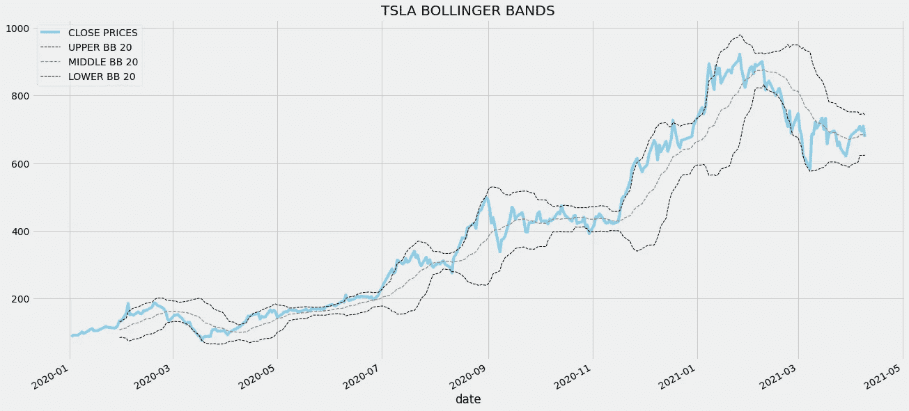
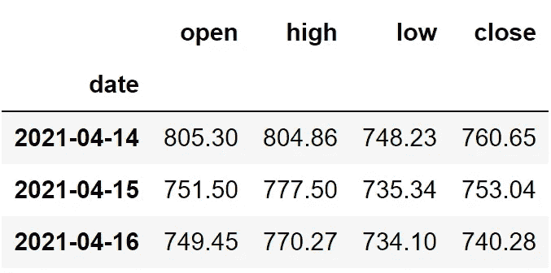
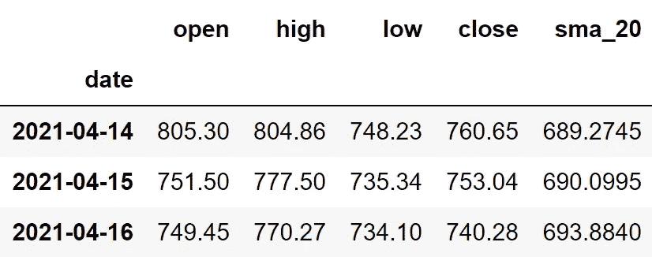
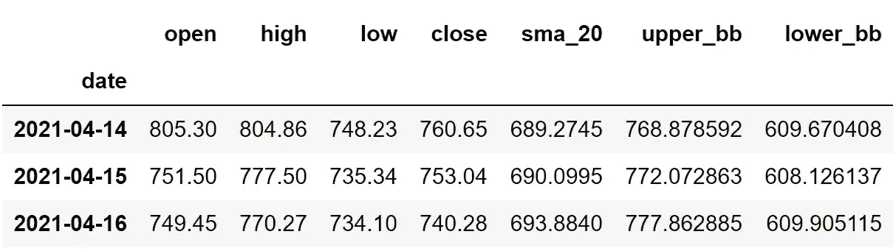
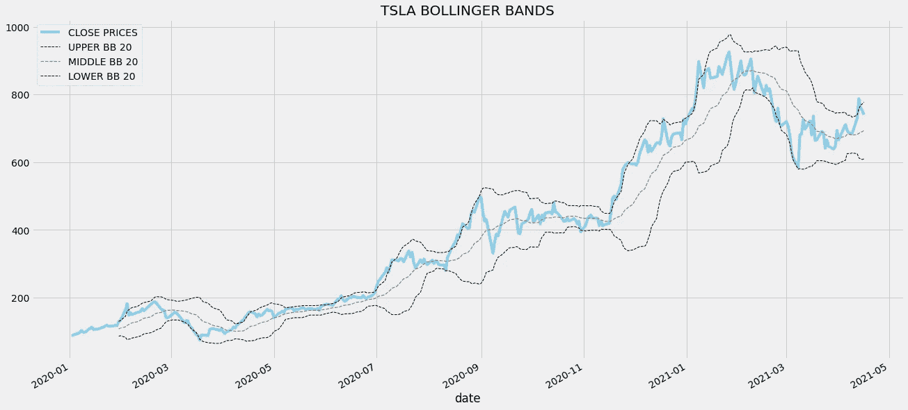
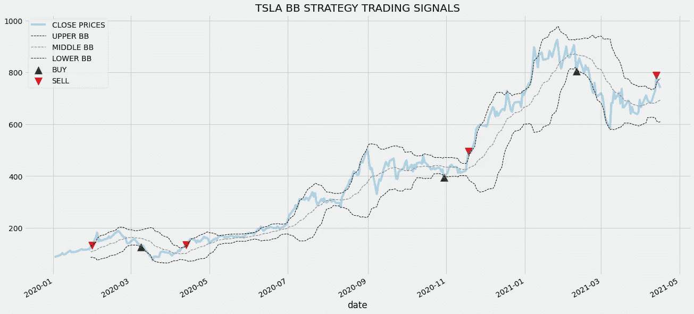
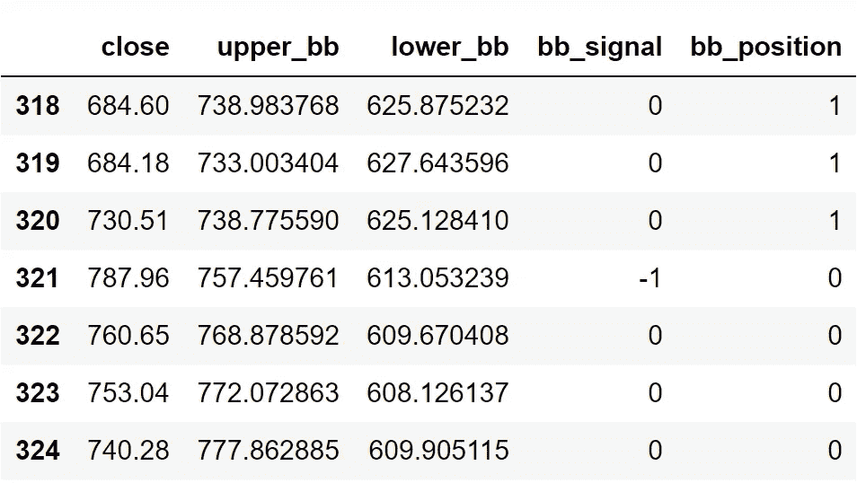

# Python 中的布林线算法交易

> 原文：<https://medium.com/codex/algorithmic-trading-with-bollinger-bands-in-python-1b0a00c9ef99?source=collection_archive---------0----------------------->


[图像来源](https://www.behance.net/gallery/99803753/Stock-Works-Montage-20?tracking_source=search_projects_recommended%7Cstock)

## Python 中使用布林线进行股票交易的自动化方法

**免责声明:**本文仅用于教育目的，不应作为投资建议。

这是我算法交易系列的第二篇文章([查看第一篇](/codex/algorithmic-trading-with-sma-in-python-7d66008d37b1))。在第一篇文章中，我们讨论了什么是算法交易，学习了一个股票技术指标简单移动平均线(SMA)，以及如何在 python 中应用它来交易股票。在本文中，我们将学习一个新的技术指标布林线，以及如何用 python 来创建交易策略。扣好安全带，享受一次美妙的旅程！

在此之前，先说明一下什么是算法交易。算法交易是使计算机能够在一定条件或规则下交易股票的过程。当给定的条件得到满足时，交易将由计算机自动执行。此外，这些条件只不过是人类交易员给计算机的交易策略。

在继续之前，如果你想在没有任何代码的情况下回溯测试你的交易策略，有一个解决方案。是[回测区](https://www.backtestzone.com/)。这是一个平台，可以免费对不同类型的可交易资产的任意数量的交易策略进行回溯测试，无需编码。点击这里的链接，你可以马上使用这个工具:[https://www.backtestzone.com/](https://www.backtestzone.com/)

# 布林线

在开始探索布林线之前，有必要知道什么是简单移动平均线。简单移动平均线只不过是给定一段时间内股票的平均价格。现在，布林线是在特定的标准差水平上，在给定股票的 SMA 上下绘制的趋势线。为了更好地理解布林线，请看下面的图表，它代表了用 SMA 20 计算的特斯拉股票的布林线



作者图片

布林线是观察一段时间内给定股票波动的好方法。当上下波段之间的空间或距离越小时，股票的波动性越低。同样，当上下波段之间的空间或距离越大，股票的波动水平越高。在观察图表时，你可以观察到一条名为“中间 BB 20”的趋势线，它就是特斯拉股票的 SMA 20。计算股票上限和下限的公式如下:

```
**UPPER_BB = STOCK SMA + SMA STANDARD DEVIATION * 2
LOWER_BB = STOCK SMA - SMA STANDARD DEVIATION * 2**
```

现在，我们已经了解了什么是布林线，所以让我们获得一些直觉的交易策略，我们将建立使用布林线。

**关于交易策略:**我们将使用布林线指标实施一项基本交易策略，如果前一天的股价高于前一天的下限，而当前股价低于当天的下限，该指标将发出买入信号。同样，如果前一天的股价小于前一天的上波段，而当前股价大于当天的上波段，该策略将显示卖出信号。我们的布林线交易策略可以表示如下:

```
**IF PREV_STOCK > PREV_LOWERBB & CUR_STOCK < CUR_LOWER_BB => BUY
IF PREV_STOCK < PREV_UPPERBB & CUR_STOCK > CUR_UPPER_BB => SELL**
```

现在我们已经了解了我们的布林线交易策略。所以，让我们继续用 python 来构建和实现它。

# 用 Python 实现

我们将实现之前在 python 中讨论过的交易策略，看看它在现实世界中的效果如何。

## 导入包

在编码我们的交易策略之前，将所需的包导入到我们的 python 环境中是非常重要的。主要的包是用于数据操作的 Pandas，用于绘图目的的 Matplotlib 和用于计算的 NumPy。额外的包将是数学函数的 Math，从 API 提取股票数据的请求，以及字体定制的 Termcolor。

**Python 实现:**

我们已经将所有需要的包导入到我们的 python 环境中。现在让我们从 IEX 云中提取特斯拉(TSLA)的历史数据。在继续之前，如果你不知道什么是 IEX 云，以及如何从中提取数据，我强烈推荐你查看我关于它的文章([点击此处查看文章](/codex/pulling-stock-data-from-iex-cloud-with-python-d44f63bb82e0))。来拉点数据吧！

## 从 IEX 云中提取数据

在这一步中，我们将使用 IEX 云提供的 API 提取 Tesla 的历史数据。

**Python 实现:**

**输出:**



作者图片

**代码解释:**首先，我们定义一个名为“get _ historic _ data”的函数，它将股票的代码(‘symbol’)作为参数。在函数内部，我们将 API 键和 URL 存储到它们各自的变量中，然后使用请求包提供的“GET”方法，以 JSON 格式提取数据。接下来，我们将执行一些数据操作任务来清理数据并使其可用。最后，我们返回数据帧。定义完函数后，我们调用它并将数据存储到‘tsla’变量中。现在，让我们从提取的数据中计算出布林线的值。

## 布林线计算

这一步进一步分为两个部分。第一部分是计算 SMA 值，第二部分是计算布林线。

**计算 SMA 值:**在这一部分，我们将计算周期数为 20 的特斯拉的 SMA 值。

Python 实现:

输出:



作者图片

代码解释:首先，我们定义一个名为“sma”的函数，它将股票价格(“数据”)和周期数(“窗口”)作为参数。在函数内部，我们使用 Pandas 包提供的“滚动”函数来计算给定周期数的 SMA。我们将计算出的值存储到“sma”变量中并返回它。接下来，我们调用函数并计算周期数为 20 的 SMA 值。现在，让我们来计算布林线。

**计算布林线:**在这一部分，我们将使用之前创建的 SMA 值来计算 Tesla 的布林线值。

Python 实现:

输出:



作者图片

代码解释:首先，我们定义一个名为“bb”的函数，它将股票价格(“数据”)、sma 值(“SMA”)和周期数作为参数(“窗口”)。在函数内部，我们使用“滚动”和“标准”函数来计算给定股票数据的标准偏差，并将计算出的标准偏差值存储到“标准”变量中。接下来，我们使用各自的公式计算布林线值，最后，我们返回计算值。我们使用创建的“bb”函数将布林线值存储到我们的“tsla”数据框架中。

## 绘制布林线值

在这一步中，我们将绘制计算出的布林线值，以使它们更有意义。

**Python 实现:**

**输出:**



作者图片

**代码解释:**使用 Matplotlib 包提供的“plot”函数，我们绘制了布林值以及特斯拉的“收盘”价格。现在我们来观察这个图表。浅蓝色线代表特斯拉的“接近”价格，黑色虚线代表较低和较高的波段。类似地，灰色虚线代表特斯拉的中间带或 SMA 20 值。我们还可以观察到，上下波段之间的空间在不同的时间变窄或变宽，代表股票的波动性(`wider == high volatility`，反之亦然)。

## 创建交易策略

在这一步，我们将在 python 中实现讨论过的布林线交易策略。

**Python 实现:**

**代码解释:**首先，我们定义一个名为‘implement _ bb _ strategy’的函数，它将股票价格(‘data’)、较低波段值(‘lower _ bb’)和较高波段值(‘upper _ bb’)作为参数。

在该函数中，我们创建了三个空列表(buy_price、sell_price 和 bb_signal ),在创建交易策略时，将在这些列表中追加值。

之后，我们通过 for 循环实施交易策略。在 for 循环内部，我们传递某些条件，如果条件得到满足，相应的值将被追加到空列表中。如果购买股票的条件得到满足，买入价将被追加到“buy_price”列表中，信号值将被追加为 1，表示购买股票。类似地，如果卖出股票的条件得到满足，卖价将被追加到“sell_price”列表中，信号值将被追加为-1，表示卖出股票。

最后，我们返回附加了值的列表。然后，我们调用创建的函数并将值存储到各自的变量中。除非我们画出这些值，否则这个列表没有任何意义。所以，让我们画出创建的交易列表的值。

## 绘制交易清单

在这一步，我们将绘制已创建的交易列表，以使它们有意义。

**Python 实现:**

**输出:**



作者图片

**代码解释:**我们正在绘制布林线值以及交易策略产生的买入和卖出信号。我们可以观察到，每当股票的收盘价(浅蓝色线)低于较低波段(较低的黑色虚线)时，买入信号用绿色绘制，类似地，每当股票的收盘价越过较高波段(较高的黑色虚线)时，卖出信号用红色绘制。

现在，使用交易信号，让我们建立我们的股票头寸。

## 创建我们的位置

在这一步中，我们将创建一个列表，如果我们持有股票，该列表将指示 1；如果我们不拥有或持有股票，该列表将指示 0。

**Python 实现:**

**输出:**



作者图片

**代码解释:**首先，我们创建一个名为‘position’的空列表。我们传递两个 for 循环，一个是为“位置”列表生成值，以匹配“信号”列表的长度。另一个 for 循环是我们用来生成实际位置值的循环。在第二个 for 循环中，我们对“signal”列表的值进行迭代，而“position”列表的值被附加到满足哪个条件上。如果我们持有股票，头寸的价值仍为 1；如果我们卖出或不持有股票，头寸的价值仍为 0。最后，我们正在进行一些数据操作，将所有创建的列表合并到一个数据帧中。

从显示的输出中，我们可以看到，从第 318–320 行，我们在股票中的头寸保持为 1(因为布林带信号没有任何变化)，但当布林带交易信号代表卖出信号(-1)时，我们的头寸突然变为 0。

现在是时候实现一些回溯测试过程了！

## 回溯测试

在继续之前，有必要知道什么是回溯测试。回溯测试是查看我们的交易策略在给定股票数据上表现如何的过程。在我们的案例中，我们将对特斯拉股票数据的布林线交易策略实施回溯测试流程。

**Python 实现:**

**输出:**

```
**Profit gained from the BB strategy by investing $100k in TSLA : 18426.42**
**Profit percentage of the BB strategy : 18%**
```

**代码解释:**首先，我们使用 NumPy 包提供的‘diff’函数计算 Tesla 股票的回报，并将其作为数据帧存储到‘tsla _ ret’变量中。接下来，我们将传递一个 for 循环来迭代' tsla_ret '变量的值，以计算我们从布林线交易策略中获得的回报，这些回报值将被追加到' bb_strategy_ret '列表中。接下来，我们将“bb_strategy_ret”列表转换为数据帧，并将其存储到“bb_strategy_ret_df”变量中。

接下来是回溯测试过程。我们将通过投资 10 万美元到我们的交易策略中来回测我们的策略。首先，我们将投资金额存储到“投资值”变量中。之后，我们正在计算使用投资金额可以购买的特斯拉股票数量。你可以注意到，我使用了 Math package 提供的“floor”函数，因为当投资金额除以特斯拉股票的收盘价时，它会输出一个十进制数。股票数量应该是整数，而不是小数。使用“底数”函数，我们可以去掉小数。请记住,“floor”函数比“round”函数要复杂得多。然后，我们传递一个 for 循环来寻找投资回报，随后是一些数据操作任务。

最后，我们打印了我们通过投资 10 万到我们的交易策略中得到的总回报，并且显示我们在一年中获得了大约 18500 美元的利润。那还不错！现在，让我们将我们的回报与 SPY ETF(一种旨在跟踪标准普尔 500 股票市场指数的 ETF)的回报进行比较。

## SPY ETF 对比

这一步是可选的，但强烈推荐，因为我们可以了解我们的交易策略相对于基准(间谍 ETF)的表现如何。在这一步中，我们将使用我们创建的“get _ historic _ data”函数提取 SPY ETF 的数据，并将我们从 SPY ETF 获得的回报与我们在 Tesla 上的 Bollinger Bands 策略回报进行比较。

**Python 实现:**

**输出:**

```
**Benchmark profit by investing $100k : 13270.5**
**Benchmark Profit percentage : 13%**
**BB Strategy profit is 5% higher than the Benchmark Profit**
```

**代码解释:**此步骤中使用的代码几乎与前一回测步骤中使用的代码相似，但我们不是投资特斯拉，而是通过不实施任何交易策略来投资 SPY ETF。从输出可以看出，我们的布林带交易策略已经跑赢了 SPY ETF 5%。太好了！

# 结论

在本文中，我们学习了一个新的股票技术指标，即布林线，以及用 python 实现和回溯测试布林线交易策略的方法。我们在这篇文章中实施的交易策略是一个基本的，但也有很多基于布林线的交易策略可以应用。人们认为布林线不适合算法交易，但如果交易策略正确，它们会很有效。还有几种方法可以改进这篇文章，它们是:

*   **选股:**在本文中，我们随机选择了特斯拉，但这在现实世界中并不是一个明智的决定。相反，可以应用机器学习算法来挑选正确的可交易股票。这一步是现实世界中算法交易的一个非常重要的部分，如果股票是随机选择的，结果将是灾难性的。
*   **策略改进:**正如我之前所说，我们在这篇文章中使用的交易策略是初级策略，在现实世界中不会有特别的表现。所以，强烈建议发现更多的布林线策略，并用 python 实现它们。

就是这样！如果您忘记了遵循任何编码部分，不要担心！我在最后提供了本文的完整源代码。希望你从这篇文章中对布林线有所了解。

**完整代码:**