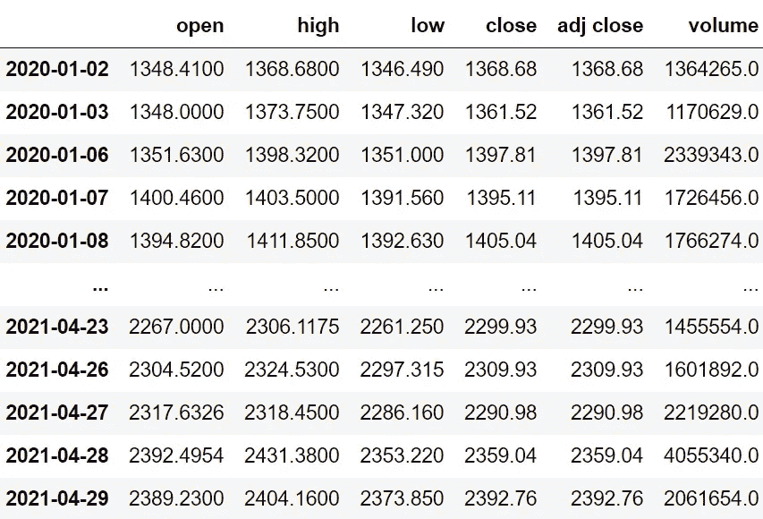

# Python 中 MACD 的算法交易

> 原文：<https://medium.com/codex/algorithmic-trading-with-macd-in-python-1c2769a6ad1b?source=collection_archive---------0----------------------->

## 实施强有力战略的逐步指南


[M. B. M.](https://unsplash.com/@m_b_m?utm_source=medium&utm_medium=referral) 在 [Unsplash](https://unsplash.com?utm_source=medium&utm_medium=referral) 上拍摄的照片

# 介绍

在这个算法交易系列的前一篇文章中，我们看到了如何使用布林线来进行成功的交易。在这篇文章中，我们将发现另一个强大的技术指标，被认为是最受交易者欢迎的指标之一。这不是别人，正是移动平均线收敛/发散(MACD)。我们将首先了解这个交易指标是什么，然后，我们将在 python 中实现并回测基于该指标的交易策略，以了解它在现实世界中的工作情况。让我们深入文章！

在继续之前，如果你想在没有任何代码的情况下回溯测试你的交易策略，有一个解决方案。这是[的后验区](https://www.backtestzone.com/)。这是一个平台，可以免费对不同类型的可交易资产的任意数量的交易策略进行回溯测试，无需编码。点击这里的链接，你可以马上使用这个工具:[https://www.backtestzone.com/](https://www.backtestzone.com/)

# MACD

在学习 MACD 之前，有必要知道指数移动平均线(EMA)是什么意思。EMA 是一种移动平均线(MA ),它自动为最近的数据点分配较大的权重(除了重要性之外),而为遥远过去的数据点分配较小的权重。例如，一份试卷将由 10%的一分问题、40%的三分问题和 50%的长答案问题组成。从这个例子中，您可以观察到，我们根据重要性级别为试卷的每个部分分配了唯一的权重(长答案问题可能比一分问题更重要)。

现在，MACD 是一个趋势跟踪领先指标，通过减去两个指数移动平均线(一个周期较长，另一个周期较短)来计算。MACD 指标有三个显著的组成部分。

*   **MACD 线:**这条线是两个给定的指数均线之差。为了计算 MACD 线，需要计算一个周期较长的均线(慢速线)和一个周期较短的均线(快速线)。最快和最慢的长度分别是 12，26。从快速均线中减去慢速均线可以得到最终的 MACD 线值。计算 MACD 线的公式可以表示如下:

```
**MACD LINE = FAST LENGTH EMA - SLOW LENGTH EMA**
```

*   **信号线:**这条线是 MACD 线本身在给定时间段内的指数移动平均线。计算信号线最流行的时期是 9。由于我们平均了 MACD 线本身，信号线将比 MACD 线更平滑。
*   **直方图:**顾名思义，是特意绘制出来揭示 MACD 线和信号线区别的直方图。这是用来识别趋势的一个很好的组件。计算直方图的公式可表示如下:

```
**HISTOGRAM = MACD LINE - SIGNAL LINE**
```

既然我们已经了解了 MACD 到底是什么。让我们对将要建立的交易策略有一些直觉。

**关于交易策略:**在这篇文章中，我们将建立一个简单的交叉策略，只要 MACD 线穿过信号线，就会显示买入信号。同样，当信号线穿过 MACD 线时，这个策略会显示卖出信号。我们的 MACD 交叉交易策略可以表述如下:

```
**IF MACD LINE > SIGNAL LINE => BUY THE STOCK
IF SIGNAL LINE > MACD LINE => SELL THE STOCK**
```

在继续之前，免责声明:本文的唯一目的是教育人们，必须被视为信息，而不是投资建议或其他。

# 用 Python 实现

在学习了什么是 MACD 并对我们的交易策略有了一些了解之后，我们现在开始用 python 编写我们的策略，并看到一些有趣的结果。编码部分分为以下几个步骤:

```
**1\. Importing Packages
2\. Extracting Data from Alpha Vantage
3\. MACD Calculation
4\. MACD Plot
5\. Creating the Trading Strategy
6\. Plotting the Trading Lists
7\. Creating our Position
8\. Backtesting
9\. SPY ETF Comparison**
```

我们将按照上面列表中提到的顺序，系好安全带，跟随每一个即将到来的编码部分。

## 步骤 1:导入包

将所需的包导入 python 环境是一个不可跳过的步骤。主要的包是处理数据的 Pandas，处理数组和复杂函数的 NumPy，用于绘图的 Matplotlib，以及进行 API 调用的请求。二级包是数学函数的 Math 和字体定制的 Termcolor(可选)。

**Python 实现:**

既然我们已经将所有基本的包导入到 python 环境中。让我们用 Alpha Vantage 强大的股票 API 来提取 Google 的历史数据。

## 步骤 2:从 Alpha Vantage 中提取数据

在这一步，我们将使用 Alpha Vantage 提供的 API 端点提取 Google 的历史数据。在此之前，关于 Alpha Vantage 的一个说明:Alpha Vantage 提供免费的股票 API，用户可以通过这些 API 访问各种数据，如实时更新，以及股票、货币和加密货币的历史数据。确保你在 Alpha Vantage 上有一个帐户，只有这样，你才能访问你的秘密 API 密匙(使用 API 提取数据的一个关键元素)。

**Python 实现:**

**输出:**



作者图片

**代码解释:**我们做的第一件事是定义一个名为‘get _ historical _ data’的函数，该函数将股票的符号(‘symbol’)作为必需参数，将历史数据的开始日期(‘start _ date’)作为可选参数。在函数内部，我们定义了 API 键和 URL，并将它们存储到各自的变量中。接下来，我们使用“get”函数提取 JSON 格式的历史数据，并将其存储到“raw_df”变量中。在对原始 JSON 数据进行清理和格式化之后，我们将以干净的 Pandas 数据帧的形式返回它。最后，我们调用创建的函数来提取 Google 从 2020 年开始的历史数据，并将其存储到“googl”变量中。

## 第三步:MACD 计算

在这一步中，我们将从 Google 提取的历史数据中计算 MACD 指标的所有组成部分。

**Python 实现:**

**输出:**


作者图片

**代码解释:**首先，我们定义一个名为“get_macd”的函数，它获取股票的价格(“prices”)、慢速均线的长度(“slow”)、快速均线的长度(“fast”)以及信号线的周期(“smooth”)。

在函数内部，我们首先使用 Pandas 提供的“ewm”函数计算快速和慢速长度 ema，并将它们分别存储到“ema1”和“ema2”变量中。接下来，我们通过从快速均线中减去慢速均线来计算 macd 线的值，并以熊猫数据帧的形式存储到“MACD”变量中。接下来，我们定义了一个名为“signal”的变量来存储信号线的值，该值是通过在指定的时间段内获取 macd 线值(“MACD”)的均线来计算的。然后，我们通过从信号线的值(“信号”)中减去 macd 线的值(“MACD”)来计算直方图值，并将它们存储到“hist”变量中。

最后，我们使用 Pandas 包的“concat”函数将所有计算出的值合并到一个数据帧中，并返回最终的数据帧。使用创建的函数，我们存储了从 Google 的股票价格计算出的所有 MACD 成分，并将其存储到变量“googl_macd”中。从输出中，您可以看到我们的数据帧包含了我们之前讨论过的所有组件。

## 第四步:MACD 情节

在这一步中，我们将绘制计算出的 MACD 分量，以便更好地理解它们。在继续之前，有必要知道领先指标是在股价下方单独绘制的。作为领先指标的 MACD 也需要以同样的方式绘制。

**Python 实现:**

**输出:**


作者图片

我们不打算深入研究用于生成上述 MACD 图的代码，而是讨论该图。在这个图中有两个面板:顶部面板是谷歌收盘价的图，底部面板是计算的 MACD 成分的一系列图。让我们拆开来看看每一个部件。

底部面板中第一个也是最明显的部分显然是计算直方图值的图。你可以注意到，每当市场显示负趋势时，该图就会变红，每当市场显示正趋势时，该图就会变绿。直方图的这个特性在识别市场趋势时变得非常方便。每当 MACD 线和信号线之间的差异很大时，直方图就扩展得更大，并且值得注意的是，直方图有时收缩，表示两个其他分量之间的差异相对较小。

接下来的两个组件是 MACD 线和信号线。MACD 线是灰色的线图，显示了谷歌股价的慢速均线和快速均线之间的差异。同样，蓝色的线图是代表 MACD 线本身的均线的信号线。正如我们之前讨论的，信号线看起来更像是 MACD 线的平滑版本，因为它是通过平均 MACD 线本身的值计算出来的。这就是上面作为输出显示的图表。让我们进行下一步。

## 步骤 5:创建交易策略

在这一步中，我们将使用 python 实现讨论过的 MACD 交易策略。

**Python 实现:**

**代码解释:**首先，我们定义一个名为‘implement _ macd _ strategy’的函数，它将股票价格(‘data’)和 MACD 数据(‘data’)作为参数。

在该函数中，我们创建了三个空列表(buy_price、sell_price 和 macd_signal ),在创建交易策略时，将在这些列表中追加值。

之后，我们通过 for 循环实施交易策略。在 for 循环内部，我们传递某些条件，如果条件得到满足，相应的值将被追加到空列表中。如果购买股票的条件得到满足，买入价将被追加到“buy_price”列表中，信号值将被追加为 1，表示购买股票。类似地，如果卖出股票的条件得到满足，卖价将被追加到“sell_price”列表中，信号值将被追加为-1，表示卖出股票。

最后，我们返回附加了值的列表。然后，我们调用创建的函数并将值存储到各自的变量中。除非我们画出这些值，否则这个列表没有任何意义。所以，让我们画出创建的交易列表的值。

## 步骤 6:绘制交易清单

在这一步，我们将绘制已创建的交易列表，以使它们有意义。

**Python 实现:**

**输出:**


作者图片

**代码解释:**我们正在绘制 MACD 成分以及交易策略产生的买入和卖出信号。我们可以观察到，每当 MACD 线穿过信号线时，买入信号用绿色绘制，同样，每当信号线穿过 MACD 线时，卖出信号用红色绘制。现在，使用交易信号，让我们建立我们的股票头寸。

## 步骤 7:创建我们的职位

在这一步中，我们将创建一个列表，如果我们持有股票，该列表将指示 1；如果我们不拥有或持有股票，该列表将指示 0。

**Python 实现:**

**输出:**


作者图片

**代码解释:**首先，我们创建一个名为‘position’的空列表。我们传递两个 for 循环，一个是为“位置”列表生成值，以匹配“信号”列表的长度。另一个 for 循环是我们用来生成实际位置值的循环。在第二个 for 循环中，我们对“signal”列表的值进行迭代，而“position”列表的值被附加到满足哪个条件上。如果我们持有股票，头寸的价值仍为 1；如果我们卖出或不持有股票，头寸的价值仍为 0。最后，我们正在进行一些数据操作，将所有创建的列表合并到一个数据帧中。

从显示的输出中，我们可以看到，在第一行中，我们在股票中的位置仍然是 1(因为 MACD 信号没有任何变化)，但是当 MACD 交易信号代表卖出信号(-1)时，我们的位置突然变成了 0。现在是时候实现一些回溯测试过程了！

## 步骤 8:回溯测试

在继续之前，有必要知道什么是回溯测试。回溯测试是查看我们的交易策略在给定股票数据上表现如何的过程。在我们的例子中，我们将针对 Google 股票数据为我们的 MACD 交易策略实现一个回溯测试过程。

**Python 实现:**

**输出:**

```
**Profit gained from the MACD strategy by investing $100k in GOOGL : 55549.26**
**Profit percentage of the MACD strategy : 55%**
```

**代码解释:**首先，我们使用 NumPy 包提供的“diff”函数计算 Google 股票的回报，并将其作为 dataframe 存储到“googl_ret”变量中。接下来，我们将传递一个 for 循环来迭代“googl_ret”变量的值，以计算我们从 MACD 交易策略中获得的回报，这些回报值将被追加到“macd_strategy_ret”列表中。接下来，我们将“macd_strategy_ret”列表转换为数据帧，并将其存储到“macd_strategy_ret_df”变量中。

接下来是回溯测试过程。我们将通过投资 10 万美元到我们的交易策略中来回测我们的策略。首先，我们将投资金额存储到“投资值”变量中。之后，我们正在计算使用投资金额可以购买的谷歌股票数量。你可以注意到，我使用了 Math 软件包提供的“下限”函数，因为当投资金额除以谷歌股票的收盘价时，它会输出一个十进制数。股票数量应该是整数，而不是小数。使用“底数”函数，我们可以去掉小数。请记住,“floor”函数比“round”函数要复杂得多。然后，我们传递一个 for 循环来寻找投资回报，随后是一些数据操作任务。

最后，我们打印了我们通过投资 10 万到我们的交易策略中得到的总回报，并且显示我们在一年中获得了大约 55，500 美元的利润。那还不错！现在，让我们将我们的回报与 SPY ETF(一种旨在跟踪标准普尔 500 股票市场指数的 ETF)的回报进行比较。

## 步骤 9: SPY ETF 对比

这一步是可选的，但强烈推荐，因为我们可以了解我们的交易策略相对于基准(间谍 ETF)的表现如何。在这一步，我们将使用我们创建的“get_historical_data”函数提取 SPY ETF 的数据，并将我们从 SPY ETF 获得的回报与我们在 Google 上的 MACD 策略回报进行比较。

**Python 实现:**

**输出:**

```
**Benchmark profit by investing $100k : 28376.01**
**Benchmark Profit percentage : 28%**
**MACD Strategy profit is 27% higher than the Benchmark Profit**
```

**代码解释:**这一步中使用的代码几乎与前一个回溯测试步骤中使用的代码相似，但我们不是投资谷歌，而是通过不实施任何交易策略来投资 SPY ETF。从输出中，我们可以看到我们的 MACD 交易策略比 SPY ETF 高出 27%。太好了！

# 最后的想法！

MACD 是目前最强有力的策略之一，当应用于现实市场时，它会非常有效。如果你决定在现实市场中使用 MACD，有一件重要的事情要记住。MACD 有泄露虚假交易信号的倾向。因此，除了 MACD 之外，强烈建议使用技术指标来交叉验证所显示的信号是否是真实的交易信号。我们还没有讨论使用多个指标来构建 MACD 策略，因为本文的唯一目的是理解什么是 MACD 以及如何使用 python 来实现它。

你也可以注意到，我们用来执行 MACD 交易策略的股票是随机选择的，这不是一个好方法。处理挑选股票的方法可以通过定量方法或基于 ML 算法的方法来完成。这可以显著改善我们的结果。就是这样！希望你能从这篇文章中学到一些有用的东西。如果您忘记了遵循一些编码部分，不要担心！我在文章末尾提供了完整的源代码。

## 完整代码: