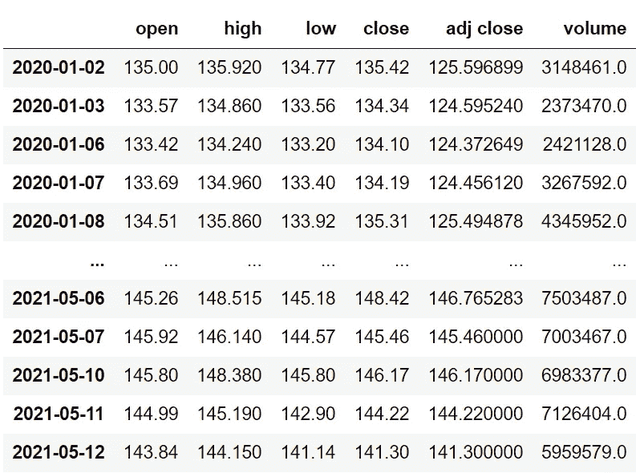
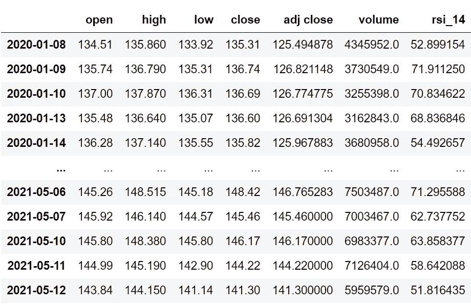
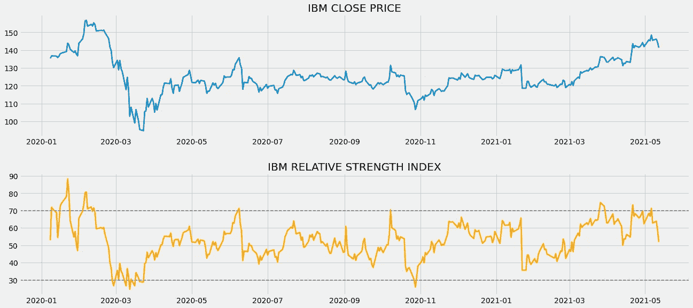
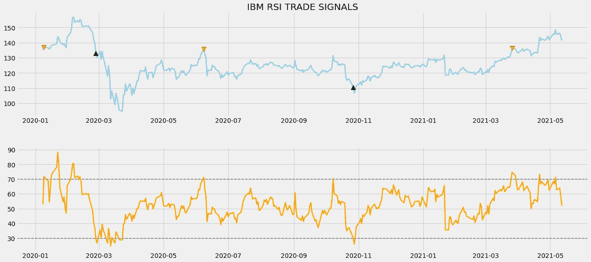
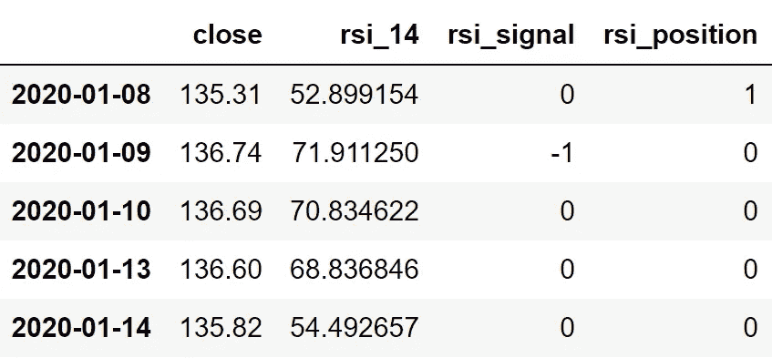

# Python 中的相对强弱指数算法交易

> 原文：<https://medium.com/codex/algorithmic-trading-with-relative-strength-index-in-python-d969cf22dd85?source=collection_archive---------0----------------------->


[来源](https://wallpapercave.com/stock-exchange-wallpapers)

## 学习使用 python 中最流行的交易指标进行更好的交易

虽然还有其他的动量振荡指标，比如随机振荡指标和超棒振荡指标，但是我们今天讨论的这个被认为是交易者中最受欢迎的，也是新手交易者的最佳选择。这就是相对强弱指数，简称 RSI。在本文中，我们将建立一些关于 RSI 及其计算的基本直觉，然后，我们将从头开始创建这个指标，并在 python 中基于它建立一个交易策略。事不宜迟，让我们进入文章。

在继续之前，如果你想在没有任何代码的情况下回溯测试你的交易策略，有一个解决方案。这是[回测区](https://www.backtestzone.com/)。这是一个平台，可以免费对不同类型的可交易资产的任意数量的交易策略进行回溯测试，无需编码。点击这里的链接，你可以马上使用这个工具:【https://www.backtestzone.com/ 

# 相对强度指数

在继续之前，让我们先了解一下在股票交易领域，振荡指标意味着什么。振荡指标是一种技术工具，它构建了一个基于趋势的指标，其值介于高波段和低波段之间。交易者使用这些波段和构建的基于趋势的指标来识别市场状态，进行潜在的买卖交易。同样，振荡指标被广泛用于短期交易，但是在长期投资中没有限制。

由 J. Welles Wilder 于 1978 年创立和发展的相对强度指数是一种动量振荡器，交易者使用它来识别市场是处于超买还是超卖的状态。在继续之前，我们先来探讨一下什么是超买和超卖。当一种资产不断被交易者买入，推动其走向极度看涨的趋势，并注定要盘整时，市场被认为处于超买状态。类似地，当交易者不断卖出某项资产，将其推向熊市趋势并趋于反弹时，市场被视为处于超卖状态。

作为一个振荡器，RSI 的值在 0 到 100 之间。使用相对强度指数评估市场状态的传统方法是，RSI 读数为 70 或以上表明超买状态，类似地，RSI 读数为 30 或以下表示市场处于超卖状态。这些超买和超卖也可以根据你选择的股票或资产来调整。例如，一些资产可能具有 80 和 20 的恒定 RSI 读数。所以在这种情况下，你可以将超买和超卖水平分别设为 80 和 20。RSI 的标准设定是 14 作为回望期。

就价值解释而言，RSI 听起来可能更类似于随机振荡器，但它的计算方式却大不相同。RSI 的计算包括三个步骤。

*   **计算资产损益的指数移动平均线(EMA):**关于指数移动平均线的一句话。EMA 是一种移动平均线(MA ),它自动为最近的数据点分配较大的权重(除了重要性之外),而为遥远过去的数据点分配较小的权重。在这一步，我们将首先计算资产的回报，并将收益与损失分开。使用这些分开的值，可以计算指定数量的期间的两个 EMA。
*   **计算资产的相对实力:**资产的相对实力是通过将资产的收益的指数移动平均值除以资产的损失的指数移动平均值来确定的。它可以用数学方法表示如下:

```
**RS = GAIN EMA / LOSS EMA**where,
RS = Relative Strength
GAIN EMA = Exponential Moving Average of the gains
LOSS EMA = Exponential Moving Average of the losses
```

*   **计算 RSI 值:**在这一步，我们将利用上一步计算的相对强度值来计算 RSI 本身。要计算给定资产在指定时间段内的 RSI 值，我们需要遵循一个公式:

```
**RSI = 100.0 - (100.0 / (1.0 + RS))**where,
RSI = Relative Strength Index
RS = Relative Strength
```

现在我们对什么是相对实力指数以及它是如何计算的有了一些基本的了解。让我们对 RSI 交易策略建立一些直觉。

**关于我们的 RSI 交易策略:**在本文中，我们将实施一个简单的交叉策略，传统设置 30 和 70 分别作为超卖和超买水平，14 作为回望期。我们的策略是，只要前一个 RSI 值高于超卖水平，当前 RSI 值低于超卖水平，我们就发出买入信号。同样地，当先前的 RSI 值低于超卖水平，当前的 RSI 值高于超卖水平时，该策略会显示卖出信号。我们的交易策略可以表述如下:

```
IF **PREVIOUS RSI > 30** AND **CURRENT RSI < 30** ==> **BUY SIGNAL**
IF **PREVIOUS RSI < 70** AND **CURRENT RSI > 70** ==> **SELL SIGNAL**
```

这就结束了我们关于相对强弱指数和交易策略的理论部分。现在让我们用 python 编写交易策略代码，看看一些令人兴奋的结果。在继续之前，关于免责声明的一个注意事项:本文的唯一目的是教育人们，必须被视为一个信息，而不是投资建议等。

# 用 Python 实现

编码部分分为以下几个步骤:

```
**1\. Importing Packages
2\. Extracting Data from Alpha Vantage
3\. RSI calculation
4\. RSI Plot
5\. Creating the Trading Strategy
6\. Plotting the Trading Lists
7\. Creating our Position
8\. Backtesting**
```

我们将按照上面列表中提到的顺序，系好安全带，跟随每一个即将到来的编码部分。

## 步骤 1:导入包

将所需的包导入 python 环境是一个不可跳过的步骤。主要的包是处理数据的 Pandas，处理数组和复杂函数的 NumPy，用于绘图的 Matplotlib，以及进行 API 调用的请求。二级包是数学函数的 Math 和字体定制的 Termcolor(可选)。

**Python 实现:**

```
import pandas as pd 
import matplotlib.pyplot as plt
import requests
import numpy as np
from math import floor
from termcolor import colored as cl 

plt.style.use('fivethirtyeight')
plt.rcParams['figure.figsize'] = (20, 10)
```

既然我们已经将所有基本的包导入到 python 环境中。让我们继续用 Alpha Vantage 强大的股票 API 提取 IBM 的历史数据。

## 步骤 2:从 Alpha Vantage 中提取数据

在这一步，我们将使用 Alpha Vantage 提供的 API 端点提取 IBM 的历史数据。在此之前，关于 Alpha Vantage 的一个说明:Alpha Vantage 提供免费的股票 API，用户可以通过这些 API 访问各种数据，如实时更新，以及股票、货币和加密货币的历史数据。确保你在 Alpha Vantage 上有一个帐户，只有这样，你才能访问你的秘密 API 密匙(使用 API 提取数据的一个关键元素)。

**Python 实现:**

```
def get_historical_data(symbol, start_date = None):
    api_key = open(r'api_key.txt')
    api_url = f'https://www.alphavantage.co/query?function=TIME_SERIES_DAILY_ADJUSTED&symbol={symbol}&apikey={api_key}&outputsize=full'
    raw_df = requests.get(api_url).json()
    df = pd.DataFrame(raw_df[f'Time Series (Daily)']).T
    df = df.rename(columns = {'1\. open': 'open', '2\. high': 'high', '3\. low': 'low', '4\. close': 'close', '5\. adjusted close': 'adj close', '6\. volume': 'volume'})
    for i in df.columns:
        df[i] = df[i].astype(float)
    df.index = pd.to_datetime(df.index)
    df = df.iloc[::-1].drop(['7\. dividend amount', '8\. split coefficient'], axis = 1)
    if start_date:
        df = df[df.index >= start_date]
    return df

ibm = get_historical_data('IBM', '2020-01-01')
ibm
```

**输出:**



作者图片

**代码解释:**我们做的第一件事是定义一个名为‘get _ historical _ data’的函数，该函数将股票的符号(‘symbol’)作为必需参数，将历史数据的开始日期(‘start _ date’)作为可选参数。在函数内部，我们定义了 API 键和 URL，并将它们存储到各自的变量中。接下来，我们使用“get”函数提取 JSON 格式的历史数据，并将其存储到“raw_df”变量中。在对原始 JSON 数据进行清理和格式化之后，我们将以干净的 Pandas 数据帧的形式返回它。最后，我们调用创建的函数来提取 ibm 从 2020 年开始的历史数据，并将其存储到“IBM”变量中。

## 步骤 3: RSI 计算

在这一步中，我们将使用之前讨论过的 RSI 公式计算 14 作为回望期的 RSI 值。

**Python 实现:**

```
def get_rsi(close, lookback):
    ret = close.diff()
    up = []
    down = []
    for i in range(len(ret)):
        if ret[i] < 0:
            up.append(0)
            down.append(ret[i])
        else:
            up.append(ret[i])
            down.append(0)
    up_series = pd.Series(up)
    down_series = pd.Series(down).abs()
    up_ewm = up_series.ewm(com = lookback - 1, adjust = False).mean()
    down_ewm = down_series.ewm(com = lookback - 1, adjust = False).mean()
    rs = up_ewm/down_ewm
    rsi = 100 - (100 / (1 + rs))
    rsi_df = pd.DataFrame(rsi).rename(columns = {0:'rsi'}).set_index(close.index)
    rsi_df = rsi_df.dropna()
    return rsi_df[3:]

ibm['rsi_14'] = get_rsi(ibm['close'], 14)
ibm = ibm.dropna()
ibm
```

**输出:**



作者图片

**代码解释:**首先，我们定义一个名为‘get _ RSI’的函数，它以股票的收盘价(‘close’)和回望期(‘lookback’)作为参数。在这个函数中，我们首先使用 Pandas 包提供的 diff 函数计算股票的回报率，并将其存储到 ret 变量中。这个函数基本上是从以前的值中减去当前的值。接下来，我们在“ret”变量上传递一个 for 循环，以区分收益和损失，并将这些值附加到相关变量(“up”或“down”)。

然后，我们使用 Pandas 软件包提供的“ewm”函数计算“上涨”和“下跌”的指数移动平均值，并将它们分别存储到“上涨 _ewm”和“下跌 _ewm”变量中。使用这些计算出的 EMA，我们按照之前讨论的公式确定相对强度，并将其存储到“rs”变量中。

通过利用计算出的相对强度值，我们按照公式计算 RSI 值。在做了一些数据处理和操作后，我们以熊猫数据框的形式返回计算出的相对强度指数值。最后，我们调用创建的函数来存储 IBM 的 RSI 值，14 作为回顾期。

## 第 4 步:相对强弱图

在这一步中，我们将绘制 IBM 的计算相对优势指数值，以便更好地理解它。这一部分的主要目的不是在编码部分，而是观察情节以获得对 RSI 的牢固理解。

**Python 实现:**

```
ax1 = plt.subplot2grid((10,1), (0,0), rowspan = 4, colspan = 1)
ax2 = plt.subplot2grid((10,1), (5,0), rowspan = 4, colspan = 1)
ax1.plot(ibm['close'], linewidth = 2.5)
ax1.set_title('IBM CLOSE PRICE')
ax2.plot(ibm['rsi_14'], color = 'orange', linewidth = 2.5)
ax2.axhline(30, linestyle = '--', linewidth = 1.5, color = 'grey')
ax2.axhline(70, linestyle = '--', linewidth = 1.5, color = 'grey')
ax2.set_title('IBM RELATIVE STRENGTH INDEX')
plt.show()
```

**输出:**



作者图片

上面的图表分为两个面板:上面的面板显示 IBM 的收盘价，下面的面板显示 IBM 计算的 RSI 14 值。在分析用 RSI 值绘制的面板时，可以看到计算值的趋势和移动与 IBM 的收盘价相同。所以，我们可以认为 RSI 是一个方向性指标。一些指标是非方向性的，这意味着它们的运动将与实际的股票运动成反比，这有时会使交易者困惑，也很难理解。

在观察 RSI 图时，我们可以看到，RSI 图甚至比市场更早地揭示了趋势反转。简单地说，RSI 在实际市场出现之前显示下跌趋势或上涨趋势。这说明 RSI 是先行指标。领先指标只不过是一种考虑到数据序列的当前值来预测未来变化的指标。RSI 作为领先指标有助于及时警告交易者潜在的趋势反转。领先指标的反义词叫做滞后指标。滞后指标是通过考虑数据序列的历史值来表示当前值的指标。

## 步骤 5:创建交易策略

在这一步中，我们将在 python 中实现所讨论的相对强弱指数交易策略。

**Python 实现:**

```
def implement_rsi_strategy(prices, rsi):    
    buy_price = []
    sell_price = []
    rsi_signal = []
    signal = 0

    for i in range(len(rsi)):
        if rsi[i-1] > 30 and rsi[i] < 30:
            if signal != 1:
                buy_price.append(prices[i])
                sell_price.append(np.nan)
                signal = 1
                rsi_signal.append(signal)
            else:
                buy_price.append(np.nan)
                sell_price.append(np.nan)
                rsi_signal.append(0)
        elif rsi[i-1] < 70 and rsi[i] > 70:
            if signal != -1:
                buy_price.append(np.nan)
                sell_price.append(prices[i])
                signal = -1
                rsi_signal.append(signal)
            else:
                buy_price.append(np.nan)
                sell_price.append(np.nan)
                rsi_signal.append(0)
        else:
            buy_price.append(np.nan)
            sell_price.append(np.nan)
            rsi_signal.append(0)

    return buy_price, sell_price, rsi_signal

buy_price, sell_price, rsi_signal = implement_rsi_strategy(ibm['close'], ibm['rsi_14'])
```

**代码解释:**首先，我们定义一个名为‘implement _ rsi _ strategy’的函数，它将股票价格(‘prices’)和 RSI 值(‘RSI’)作为参数。

在这个函数中，我们创建了三个空列表(buy_price、sell_price 和 rsi_signal ),在创建交易策略时，这些值将被追加到这些列表中。

之后，我们通过 for 循环实施交易策略。在 for 循环内部，我们传递某些条件，如果条件得到满足，相应的值将被追加到空列表中。如果购买股票的条件得到满足，买入价将被追加到“buy_price”列表中，信号值将被追加为 1，表示购买股票。类似地，如果卖出股票的条件得到满足，卖价将被追加到“sell_price”列表中，信号值将被追加为-1，表示卖出股票。

最后，我们返回附加了值的列表。然后，我们调用创建的函数并将值存储到各自的变量中。除非我们画出这些值，否则这个列表没有任何意义。所以，让我们画出创建的交易列表的值。

## 步骤 6:绘制交易信号

在这一步，我们将绘制已创建的交易列表，以使它们有意义。

**Python 实现:**

```
ax1 = plt.subplot2grid((10,1), (0,0), rowspan = 4, colspan = 1)
ax2 = plt.subplot2grid((10,1), (5,0), rowspan = 4, colspan = 1)
ax1.plot(ibm['close'], linewidth = 2.5, color = 'skyblue', label = 'IBM')
ax1.plot(ibm.index, buy_price, marker = '^', markersize = 10, color = 'green', label = 'BUY SIGNAL')
ax1.plot(ibm.index, sell_price, marker = 'v', markersize = 10, color = 'r', label = 'SELL SIGNAL')
ax1.set_title('IBM RSI TRADE SIGNALS')
ax2.plot(ibm['rsi_14'], color = 'orange', linewidth = 2.5)
ax2.axhline(30, linestyle = '--', linewidth = 1.5, color = 'grey')
ax2.axhline(70, linestyle = '--', linewidth = 1.5, color = 'grey')
plt.show()
```

**输出:**



作者图片

**代码解释:**我们正在绘制相对强弱指数值以及交易策略产生的买入和卖出信号。我们可以观察到，每当 RSI 线从上方穿越到下方波段或超卖水平下方时，图表中就会绘制出绿色的买入信号。类似地，RSI 线从下方穿过上方波段或超买水平，在图表中绘制了红色的卖出信号。

## 步骤 7:创建我们的职位

在这一步中，我们将创建一个列表，如果我们持有股票，该列表将指示 1；如果我们不拥有或持有股票，该列表将指示 0。

**Python 实现:**

```
position = []
for i in range(len(rsi_signal)):
    if rsi_signal[i] > 1:
        position.append(0)
    else:
        position.append(1)

for i in range(len(ibm['close'])):
    if rsi_signal[i] == 1:
        position[i] = 1
    elif rsi_signal[i] == -1:
        position[i] = 0
    else:
        position[i] = position[i-1]

rsi = ibm['rsi_14']
close_price = ibm['close']
rsi_signal = pd.DataFrame(rsi_signal).rename(columns = {0:'rsi_signal'}).set_index(ibm.index)
position = pd.DataFrame(position).rename(columns = {0:'rsi_position'}).set_index(ibm.index)

frames = [close_price, rsi, rsi_signal, position]
strategy = pd.concat(frames, join = 'inner', axis = 1)

strategy.head()
```

**输出:**



作者图片

**代码解释:**首先，我们创建一个名为‘position’的空列表。我们传递两个 for 循环，一个是为“位置”列表生成值，以匹配“信号”列表的长度。另一个 for 循环是我们用来生成实际位置值的循环。在第二个 for 循环中，我们对“signal”列表的值进行迭代，而“position”列表的值被附加到满足哪个条件上。如果我们持有股票，头寸的价值仍为 1；如果我们卖出或不持有股票，头寸的价值仍为 0。最后，我们正在进行一些数据操作，将所有创建的列表合并到一个数据帧中。

从显示的输出中，我们可以看到，在第一行中，我们在股票中的位置仍然是 1(因为 RSI 信号没有任何变化)，但是当相对强度指数交易信号代表卖出信号(-1)时，我们的位置突然变为 0。我们的头寸将保持为 0，直到交易信号发生一些变化。现在是时候实现一些回溯测试过程了！

## 步骤 8:回溯测试

在继续之前，有必要知道什么是回溯测试。回溯测试是查看我们的交易策略在给定股票数据上表现如何的过程。在我们的例子中，我们将针对 IBM 股票数据为我们的相对优势指数交易策略实现一个回溯测试过程。

**Python 实现:**

```
ibm_ret = pd.DataFrame(np.diff(ibm['close'])).rename(columns = {0:'returns'})
rsi_strategy_ret = []

for i in range(len(ibm_ret)):
    returns = ibm_ret['returns'][i]*strategy['rsi_position'][i]
    rsi_strategy_ret.append(returns)

rsi_strategy_ret_df = pd.DataFrame(rsi_strategy_ret).rename(columns = {0:'rsi_returns'})
investment_value = 100000
number_of_stocks = floor(investment_value/ibm['close'][-1])
rsi_investment_ret = []

for i in range(len(rsi_strategy_ret_df['rsi_returns'])):
    returns = number_of_stocks*rsi_strategy_ret_df['rsi_returns'][i]
    rsi_investment_ret.append(returns)

rsi_investment_ret_df = pd.DataFrame(rsi_investment_ret).rename(columns = {0:'investment_returns'})
total_investment_ret = round(sum(rsi_investment_ret_df['investment_returns']), 2)
profit_percentage = floor((total_investment_ret/investment_value)*100)
print(cl('Profit gained from the RSI strategy by investing $100k in IBM : {}'.format(total_investment_ret), attrs = ['bold']))
print(cl('Profit percentage of the RSI strategy : {}%'.format(profit_percentage), attrs = ['bold']))
```

**输出:**

```
**Profit gained from the RSI strategy by investing $100k in IBM : 21132.23**
**Profit percentage of the RSI strategy : 21%**
```

**代码解释:**首先，我们使用 NumPy 包提供的‘diff’函数计算 IBM 股票的收益，并将其作为 dataframe 存储到‘IBM _ ret’变量中。接下来，我们将传递一个 for 循环来迭代' ibm_ret '变量的值，以计算我们从相对强弱指数交易策略中获得的回报，这些回报值将被追加到' rsi_strategy_ret '列表中。接下来，我们将“rsi_strategy_ret”列表转换为数据帧，并将其存储到“rsi_strategy_ret_df”变量中。

接下来是回溯测试过程。我们将通过投资 10 万美元到我们的交易策略中来回测我们的策略。首先，我们将投资金额存储到“投资值”变量中。之后，我们正在计算使用投资金额可以购买的 IBM 股票数量。您可以注意到，我使用了 Math package 提供的“floor”函数，因为当投资金额除以 IBM 股票的收盘价时，它会输出一个十进制数。股票数量应该是整数，而不是小数。使用“底数”函数，我们可以去掉小数。请记住,“floor”函数比“round”函数要复杂得多。然后，我们传递一个 for 循环来寻找投资回报，随后是一些数据操作任务。

最后，我们打印出我们在交易策略中投入 10 万美元所获得的总回报，结果显示我们在一年中获得了大约 21，000 美元的利润，利润百分比为 21%。太好了！

# 最后的想法！

经过长期的理论和实践，我们已经成功地学习了什么是 RSI，以及如何用 python 实现和回测一个简单的基于 RSI 的交易策略。即使 RSI 是最受欢迎的交易指标之一，它也容易揭示错误的信号。跟随错误的信号，并根据这些信号进行交易，甚至会耗尽资本。幸运的是，有两种方法可以让你远离错误信号:

*   **附加指标:**一些股票可能波动很大，会更频繁地触及超买和超卖水平。在这种情况下，你不应该盲目地跟随 RSI 水平进行交易，而是应该考虑另一个技术指标来验证信号是否真实。
*   **随机应变策略:**我们在本文中采用的策略是最基本的策略之一，但在 RSI 的帮助下，还有很多事情可以做。所以，在直接进入现实世界的市场之前，强烈建议看看其他一些基于相对强弱指数的交易策略。

在这篇文章中，我们没有涵盖任何一个步骤，因为这篇文章的主要目的只是教育人们了解最重要的交易指标之一，而不是赚取利润等。使用 RSI 时，还有一点需要记住。相对强弱指数在区间市场往往表现不佳。区间市场是表现出低动能或无动能的市场。所以，在使用相对强弱指数时，强烈建议远离区间市场。

话虽如此，你已经到了文章的结尾。如果您忘记了遵循任何编码部分，不要担心。我在文章末尾提供了完整的源代码。希望你学到了新的有用的东西。

## 完整代码:

```
import pandas as pd 
import matplotlib.pyplot as plt
import requests
import numpy as np
from math import floor
from termcolor import colored as cl 

plt.style.use('fivethirtyeight')
plt.rcParams['figure.figsize'] = (20, 10)

def get_historical_data(symbol, start_date = None):
    api_key = open(r'api_key.txt')
    api_url = f'https://www.alphavantage.co/query?function=TIME_SERIES_DAILY_ADJUSTED&symbol={symbol}&apikey={api_key}&outputsize=full'
    raw_df = requests.get(api_url).json()
    df = pd.DataFrame(raw_df[f'Time Series (Daily)']).T
    df = df.rename(columns = {'1\. open': 'open', '2\. high': 'high', '3\. low': 'low', '4\. close': 'close', '5\. adjusted close': 'adj close', '6\. volume': 'volume'})
    for i in df.columns:
        df[i] = df[i].astype(float)
    df.index = pd.to_datetime(df.index)
    df = df.iloc[::-1].drop(['7\. dividend amount', '8\. split coefficient'], axis = 1)
    if start_date:
        df = df[df.index >= start_date]
    return df

ibm = get_historical_data('IBM', '2020-01-01')
print(ibm)

def get_rsi(close, lookback):
    ret = close.diff()
    up = []
    down = []
    for i in range(len(ret)):
        if ret[i] < 0:
            up.append(0)
            down.append(ret[i])
        else:
            up.append(ret[i])
            down.append(0)
    up_series = pd.Series(up)
    down_series = pd.Series(down).abs()
    up_ewm = up_series.ewm(com = lookback - 1, adjust = False).mean()
    down_ewm = down_series.ewm(com = lookback - 1, adjust = False).mean()
    rs = up_ewm/down_ewm
    rsi = 100 - (100 / (1 + rs))
    rsi_df = pd.DataFrame(rsi).rename(columns = {0:'rsi'}).set_index(close.index)
    rsi_df = rsi_df.dropna()
    return rsi_df[3:]

ibm['rsi_14'] = get_rsi(ibm['close'], 14)
ibm = ibm.dropna()
print(ibm)

ax1 = plt.subplot2grid((10,1), (0,0), rowspan = 4, colspan = 1)
ax2 = plt.subplot2grid((10,1), (5,0), rowspan = 4, colspan = 1)
ax1.plot(ibm['close'], linewidth = 2.5)
ax1.set_title('IBM CLOSE PRICE')
ax2.plot(ibm['rsi_14'], color = 'orange', linewidth = 2.5)
ax2.axhline(30, linestyle = '--', linewidth = 1.5, color = 'grey')
ax2.axhline(70, linestyle = '--', linewidth = 1.5, color = 'grey')
ax2.set_title('IBM RELATIVE STRENGTH INDEX')
plt.show()

def implement_rsi_strategy(prices, rsi):    
    buy_price = []
    sell_price = []
    rsi_signal = []
    signal = 0

    for i in range(len(rsi)):
        if rsi[i-1] > 30 and rsi[i] < 30:
            if signal != 1:
                buy_price.append(prices[i])
                sell_price.append(np.nan)
                signal = 1
                rsi_signal.append(signal)
            else:
                buy_price.append(np.nan)
                sell_price.append(np.nan)
                rsi_signal.append(0)
        elif rsi[i-1] < 70 and rsi[i] > 70:
            if signal != -1:
                buy_price.append(np.nan)
                sell_price.append(prices[i])
                signal = -1
                rsi_signal.append(signal)
            else:
                buy_price.append(np.nan)
                sell_price.append(np.nan)
                rsi_signal.append(0)
        else:
            buy_price.append(np.nan)
            sell_price.append(np.nan)
            rsi_signal.append(0)

    return buy_price, sell_price, rsi_signal

buy_price, sell_price, rsi_signal = implement_rsi_strategy(ibm['close'], ibm['rsi_14'])

ax1 = plt.subplot2grid((10,1), (0,0), rowspan = 4, colspan = 1)
ax2 = plt.subplot2grid((10,1), (5,0), rowspan = 4, colspan = 1)
ax1.plot(ibm['close'], linewidth = 2.5, color = 'skyblue', label = 'IBM')
ax1.plot(ibm.index, buy_price, marker = '^', markersize = 10, color = 'green', label = 'BUY SIGNAL')
ax1.plot(ibm.index, sell_price, marker = 'v', markersize = 10, color = 'r', label = 'SELL SIGNAL')
ax1.set_title('IBM RSI TRADE SIGNALS')
ax2.plot(ibm['rsi_14'], color = 'orange', linewidth = 2.5)
ax2.axhline(30, linestyle = '--', linewidth = 1.5, color = 'grey')
ax2.axhline(70, linestyle = '--', linewidth = 1.5, color = 'grey')
plt.show()

position = []
for i in range(len(rsi_signal)):
    if rsi_signal[i] > 1:
        position.append(0)
    else:
        position.append(1)

for i in range(len(ibm['close'])):
    if rsi_signal[i] == 1:
        position[i] = 1
    elif rsi_signal[i] == -1:
        position[i] = 0
    else:
        position[i] = position[i-1]

rsi = ibm['rsi_14']
close_price = ibm['close']
rsi_signal = pd.DataFrame(rsi_signal).rename(columns = {0:'rsi_signal'}).set_index(ibm.index)
position = pd.DataFrame(position).rename(columns = {0:'rsi_position'}).set_index(ibm.index)

frames = [close_price, rsi, rsi_signal, position]
strategy = pd.concat(frames, join = 'inner', axis = 1)

print(strategy.head())

ibm_ret = pd.DataFrame(np.diff(ibm['close'])).rename(columns = {0:'returns'})
rsi_strategy_ret = []

for i in range(len(ibm_ret)):
    returns = ibm_ret['returns'][i]*strategy['rsi_position'][i]
    rsi_strategy_ret.append(returns)

rsi_strategy_ret_df = pd.DataFrame(rsi_strategy_ret).rename(columns = {0:'rsi_returns'})
investment_value = 100000
number_of_stocks = floor(investment_value/ibm['close'][-1])
rsi_investment_ret = []

for i in range(len(rsi_strategy_ret_df['rsi_returns'])):
    returns = number_of_stocks*rsi_strategy_ret_df['rsi_returns'][i]
    rsi_investment_ret.append(returns)

rsi_investment_ret_df = pd.DataFrame(rsi_investment_ret).rename(columns = {0:'investment_returns'})
total_investment_ret = round(sum(rsi_investment_ret_df['investment_returns']), 2)
profit_percentage = floor((total_investment_ret/investment_value)*100)
print(cl('Profit gained from the RSI strategy by investing $100k in IBM : {}'.format(total_investment_ret), attrs = ['bold']))
print(cl('Profit percentage of the RSI strategy : {}%'.format(profit_percentage), attrs = ['bold']))
```