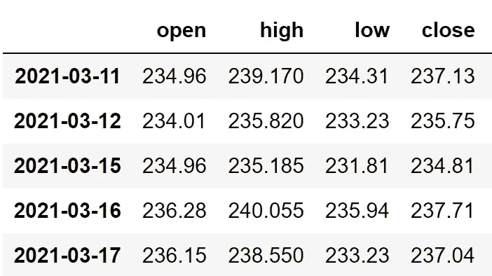
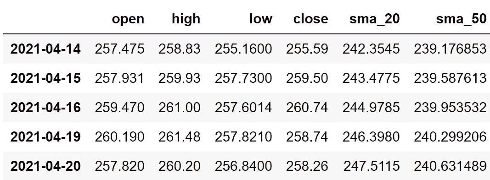
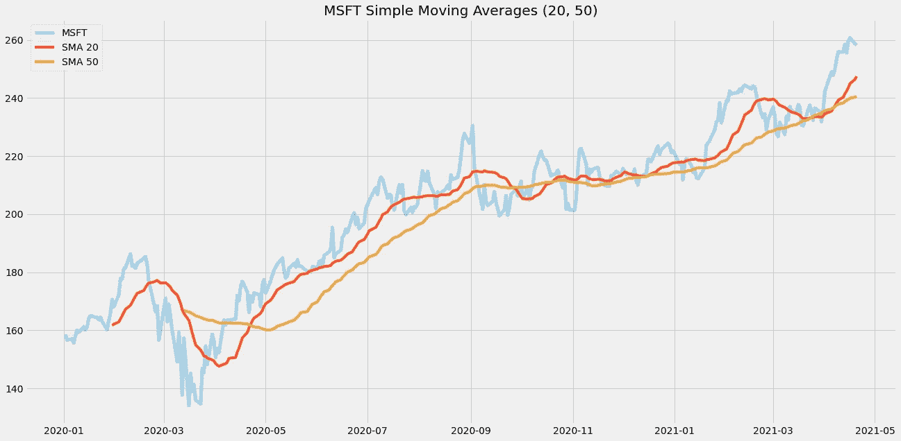
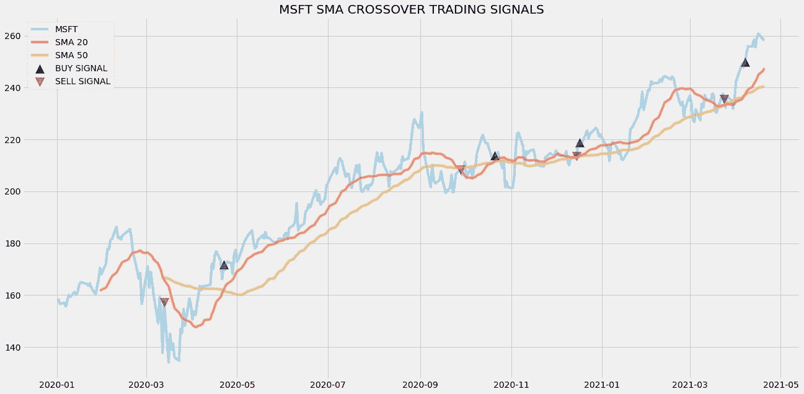
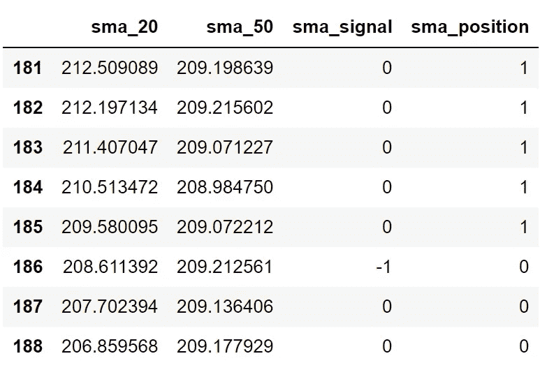

# Python 中使用 SMA 的算法交易

> 原文：<https://medium.com/codex/algorithmic-trading-with-sma-in-python-7d66008d37b1?source=collection_archive---------1----------------------->

## [法典](http://medium.com/codex)

## 用 python 创建和回溯测试 SMA 交易策略


由[马库斯·斯皮斯克](https://unsplash.com/@markusspiske?utm_source=medium&utm_medium=referral)在 [Unsplash](https://unsplash.com?utm_source=medium&utm_medium=referral) 上拍摄的照片

**免责声明:**本文严格用于教育目的，不应作为投资提示。

# 介绍

随着越来越多的技术创新，许多行业摒弃了传统的方法，并希望进入最新的技术，以保持自己的更新。金融业也是如此！在过去的几年里，金融行业发生了很多事情。大量的金融技术解决方案被发明和增强。在这篇文章中，我们将看到金融领域一项引人注目的技术创新，它是股票交易领域的一次巨大飞跃，那就是算法交易！让我们更深入地探讨这个话题。

# 算法交易

在大多数情况下，股票交易会受到人类情绪或非理性思维的影响(有时)。因此，它反映了该交易员所做的大多数交易的糟糕结果。人们在思考一种交易方法，在这种方法中，他们可以把自己的情绪放在一边，算法交易的概念就是在这个时候被发明的。算法交易是使计算机能够在一定条件或规则下交易股票的过程。当给定的条件得到满足时，交易将由计算机自动执行。同样，这些条件是由人类交易员提供给计算机的。交易策略的条件是由人类交易者定义的。

在本文中，我们将使用简单移动平均线(SMA)技术指标来创建交易策略。在继续之前，如果你想在没有任何代码的情况下回溯测试你的交易策略，有一个解决方案。是[回测区](https://www.backtestzone.com/)。这是一个平台，可以免费对不同类型的可交易资产的任意数量的交易策略进行回溯测试，无需编码。点击这里的链接，你可以马上使用这个工具:[https://www.backtestzone.com/](https://www.backtestzone.com/)

# 简单移动平均线

简单移动平均线(SMA)无非是特定时间段的平均价格。它是一个技术指标，广泛用于创建交易策略。通常计算两个 SMA 来构建交易策略，一个周期短，另一个周期比第一个长。现在，让我们对本文中的交易策略有一个直觉。

**关于交易策略:**我们的交易策略将是一个简单的交叉策略，当用较短周期计算的 SMA 在用较长周期计算的 SMA 上方交叉时，计算机进行交易。同样，当用较长周期计算的 SMA 超过用较短周期计算的 SMA 时，计算机卖出股票。这就是我们交易策略的条件:

```
**IF SMA(SHORT PERIOD) > SMA(LONG PERIOD) => BUY
IF SMA(LONG PERIOD) > SMA(SHORT PERIOD) => SELL**
```

至此，我们完成了理论部分。现在让我们用 python 实现交易策略，并看看它的实际效果。

# 用 Python 实现

现在，我们要用 python 编写我们的交易策略，看看效果如何。

## 导入包

在这一步中，我们将把所需的包导入到我们的 python 环境中。主要的包将是处理数据帧的 Pandas，创建绘图的 Matplotlib，进行 API 调用的请求，处理数组的 NumPy。附加的包是 Math，用于执行数学计算，以及 Termcolor，用于在 python 中自定义字体。

**Python 实现:**

我们已经将所有需要的包导入到我们的 python 环境中。现在让我们从 IEX 云中提取微软(MSFT)的历史数据。在继续之前，如果你不知道什么是 IEX 云，以及如何从中提取数据，我强烈推荐你查看我关于它的文章([点击此处查看文章](/codex/pulling-stock-data-from-iex-cloud-with-python-d44f63bb82e0))。来拉点数据吧！

## 从 IEX 云中提取数据

在这一步中，我们将使用 IEX 云提供的 API 提取微软的历史数据。

**Python 实现:**

**输出:**



作者图片

**代码解释:**首先，我们定义一个名为“get _ historic _ data”的函数，它将股票代码作为参数。在函数内部，我们将 API 键和 URL 存储到它们各自的变量中，然后使用请求包提供的“GET”方法，以 JSON 格式提取数据。接下来，我们将执行一些数据操作任务来清理数据并使其可用。最后，我们返回数据帧。定义完函数后，我们调用它并将数据存储到' msft '变量中。让我们从提取的数据中计算出 SMA 值。

## SMA 计算

在这一步中，我们将计算两个 SMA 值(SMA 20，50)并将这些值附加到我们的数据帧中。

**Python 实现:**

**输出:**



作者图片

**代码解释:**首先，我们定义一个名为‘SMA’的函数，它以数据和周期数为参数。在函数内部，我们使用 Pandas 包提供的“滚动”函数来计算给定周期数的 SMA。我们将计算出的值存储到“sma”变量中并返回它。接下来，我们调用函数并计算两个 SMA 值，较短的一个值为周期数 20，较长的一个值为周期数 50。现在，让我们用计算出的 SMA 值做一个图。

## 绘制 SMA 值

在这一步，我们将绘制计算出的 SMA 值，以使它们更有意义。

**Python 实现:**

**输出:**



作者图片

**代码解释:**使用 Matplotlib 包提供的“plot”函数，我们绘制了 SMA 值以及微软的“收盘”价格。现在我们来观察这个图表。浅蓝色线代表微软的“接近”价格，红色和金色线分别代表 SMA 20 & SMA 50。据观察，金线(SMA 50)比红线(SMA 20)平滑得多，因为金线值的指定时间段比红线值高得多。

现在我们有了 SMA 值。所以让我们继续创建交易策略。

## 创建交易策略

在这一步中，我们将使用 python 实现所讨论的交易策略。

**Python 实现:**

**代码解释:**首先，我们定义一个名为‘implement _ sma _ strategy’的函数，它以数据和长短 SMA 的时间段作为参数。

在函数内部，我们首先将指定的时间段存储到“sma1”和“sma2”变量中。接下来，我们将存储三个空列表，在创建交易策略时会将值追加到这些列表中。

之后，我们通过 for 循环实施交易策略。在 for 循环内部，我们传递某些条件，如果条件得到满足，相应的值将被追加到空列表中。如果购买股票的条件得到满足，买入价将被追加到“buy_price”列表中，信号值将被追加为 1，表示购买股票。类似地，如果卖出股票的条件得到满足，卖价将被追加到“sell_price”列表中，信号值将被追加为-1，表示卖出股票。

最后，我们返回附加了值的列表。然后，我们调用创建的函数并将值存储到各自的变量中。除非我们画出这些值，否则这个列表没有任何意义。所以，让我们画出创建的交易列表的值。

## 绘制交易清单

在这一步，我们将绘制已创建的交易列表，以使它们有意义。

**Python 实现:**

**输出:**



作者图片

**代码解释:**我们在绘制 SMA 值以及交易策略产生的买入和卖出信号。我们可以观察到，每当红线(SMA 20)越过金线(SMA 50)时，买入信号用蓝色绘制，类似地，每当金线越过红线时，卖出信号用红色绘制。

现在，使用交易信号，让我们建立我们的股票头寸。

## 创建我们的位置

在这一步中，我们将创建一个列表，如果我们持有股票，该列表将指示 1；如果我们不拥有或持有股票，该列表将指示 0。

**Python 实现:**

**输出:**



作者图片

**代码解释:**首先，我们创建一个名为‘position’的空列表。我们传递两个 for 循环，一个是为“位置”列表生成值，以匹配“信号”列表的长度。另一个 for 循环是我们用来生成实际位置值的循环。在第二个 for 循环中，我们对“signal”列表的值进行迭代，而“position”列表的值被附加到满足哪个条件上。如果我们持有股票，头寸的价值仍为 1；如果我们卖出或不持有股票，头寸的价值仍为 0。最后，我们正在进行一些数据操作，将所有创建的列表合并到一个数据帧中。

从显示的输出中，我们可以看到，从第 181–185 行，我们在股票中的头寸保持为 1(因为 SMA 信号没有任何变化)，但是当 SMA 交易信号代表卖出信号(-1)时，我们的头寸突然变为 0。

现在是时候实现一些回溯测试过程了！

## 回溯测试

在继续之前，有必要知道什么是回溯测试。回溯测试是查看我们的交易策略在给定股票数据上表现如何的过程。在我们的例子中，我们将对微软股票数据实现 SMA 交叉策略的回溯测试过程。

**Python 实现:**

**输出:**

```
**Profit gained from the strategy by investing $100K in MSFT : $19971.23 in 1 Year**
```

**代码解释:**首先，我们使用 NumPy 包提供的“diff”函数计算微软股票的回报率，并将其作为数据帧存储到“msft_ret”变量中。接下来，我们传递一个 for 循环来迭代' msft_ret '变量的值，以计算我们从 SMA 交易策略中获得的回报，这些回报值被附加到' sma_strategy_ret '列表中。接下来，我们将“sma_strategy_ret”列表转换为数据帧，并将其存储到“sma_strategy_ret_df”变量中。

接下来是回溯测试过程。我们将通过投资 10 万美元到我们的交易策略中来回测我们的策略。首先，我们将投资金额存储到“投资值”变量中。之后，我们正在计算使用投资金额可以购买的微软股票数量。你可以注意到，我使用了 Math 软件包提供的“下限”函数，因为当投资金额除以微软股票的收盘价时，它会输出一个十进制数。股票数量应该是整数，而不是小数。使用“底数”函数，我们可以去掉小数。请记住,“floor”函数比“round”函数要复杂得多。然后，我们传递一个 for 循环来寻找投资回报，随后是一些数据操作任务。

最后，我们打印了我们通过投资 10 万美元到我们的交易策略中得到的总回报，并且显示我们在一年中获得了大约 2 万美元的利润。那还不错！

# 最后的想法！

从探索什么是算法交易和 SMA，到用 python 实现和回溯测试我们的交易策略，我们走过了漫长的道路。我们的代码还有很多改进的空间，可以获得更好的结果。一些方法是使用机器学习找到最佳股票来执行交易策略，调整和改进交易策略等。也有很多软件包可以用来对股票进行技术分析，但在本文中，我们只使用了初步的软件包，这样我们就可以直观地了解我们到底要构建什么。就是这样！如果您忘记了遵循任何编码部分，不要担心。我已经提供了本文中使用的完整源代码。希望你能从这篇文章中学到一些有用的东西。

**完整代码:**