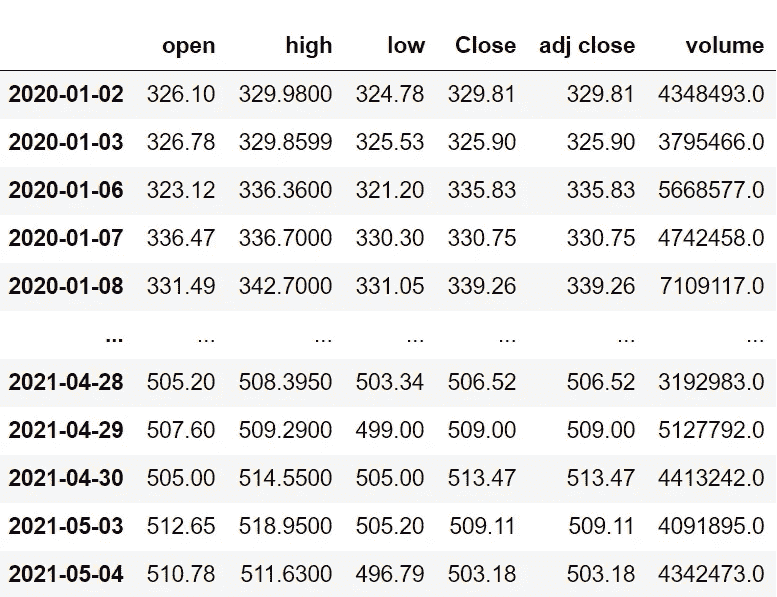
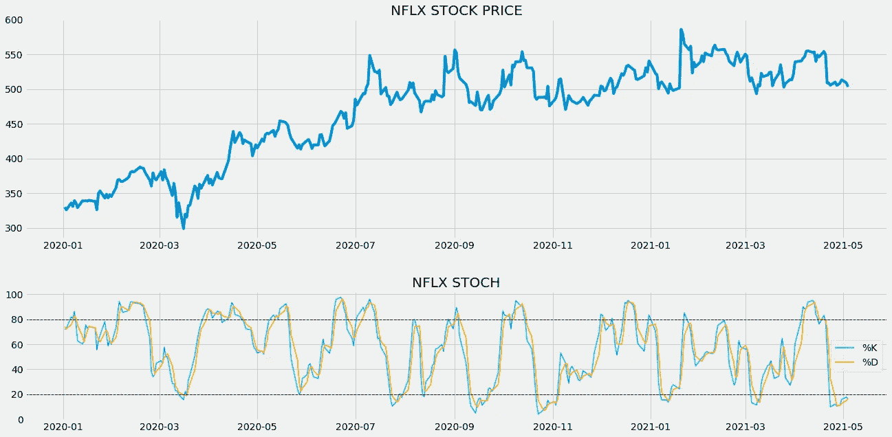
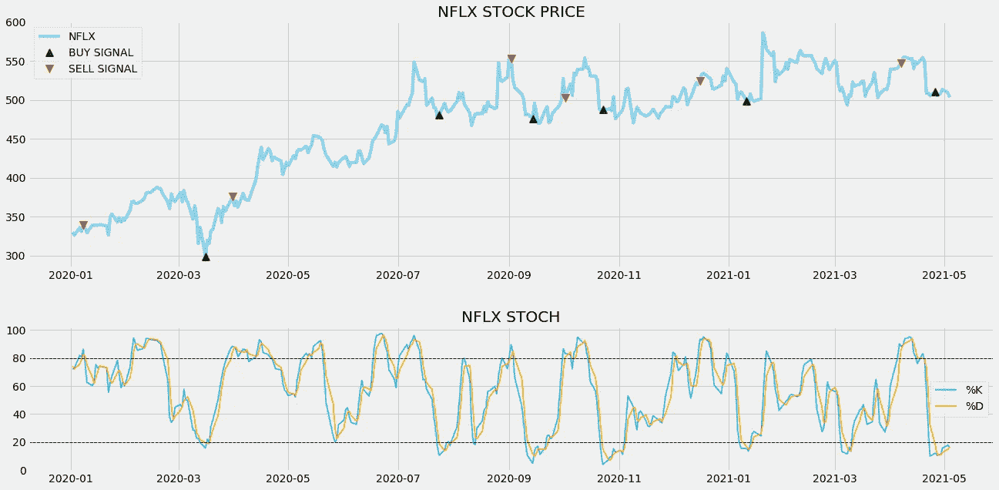
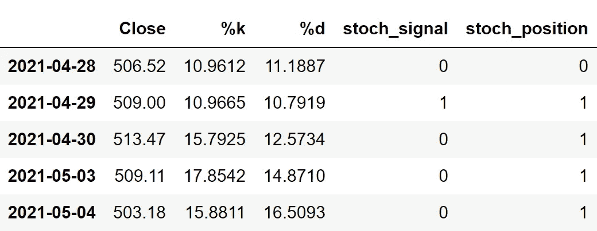

# Python 中带随机振荡器的算法交易

> 原文：<https://medium.com/codex/algorithmic-trading-with-stochastic-oscillator-in-python-7e2bec49b60d?source=collection_archive---------0----------------------->

## 学习用 python 实现和回溯测试最流行的交易指标之一


克里斯·利维拉尼在 [Unsplash](https://unsplash.com?utm_source=medium&utm_medium=referral) 上的照片

有很多技术指标可以用来研究和分析，但我们今天要讨论的是交易者最常用的交易指标之一。这不是别人，正是随机振荡器技术指标。在本文中，我们将使用 python 创建一个基于随机振荡指标的交易策略，并对该策略进行回溯测试，看看它在现实市场中的表现如何。此外，我们还将我们的交易结果与 SPY ETF(一种专门设计用于跟踪标准普尔 500 市场指数的 ETF)进行比较，以此来验证我们的策略。事不宜迟，让我们直接进入文章。

在继续之前，如果你想在没有任何代码的情况下回溯测试你的交易策略，有一个解决方案。这是[的后验区](https://www.backtestzone.com/)。这是一个平台，可以免费对不同类型的可交易资产的任意数量的交易策略进行回溯测试，无需编码。点击这里的链接，你可以马上使用这个工具:[https://www.backtestzone.com/](https://www.backtestzone.com/)

# 随机振荡器

随机振荡器是一种基于动量的领先指标，广泛用于识别市场是处于超买还是超卖的状态。这就引出了我们的下一个问题。在令人担忧的市场中，什么是超买和超卖？当市场的趋势看起来非常看涨并且一定会盘整时，股票被认为是超买。类似地，当市场趋势似乎极度看跌并有反弹趋势时，股票到达超卖区域。

由于其归一化功能，随机振荡器的值总是在 0 到 100 之间。一般超买和超卖水平分别被认为是 80 和 20，但它可能因人而异。随机振荡器包括两个主要组件:

*   **%K 线:**这条线是随机振荡器指标中最重要、最核心的组成部分。它也被称为快速随机指标。这条线的唯一目的是表达市场的当前状态(超买或超卖)。这条线的计算方法是从股票的收盘价中减去股票在指定时间段内达到的最低价格，然后将该差值除以从最高股票价格中减去股票在指定时间段内达到的最低价格所得的值。通过将上述步骤计算出的值乘以 100，得到最终值。用最流行的设置 14 作为周期数来计算%K 线的方法可以表示如下:

```
**%K = 100 * ((14 DAY CLOSING PRICE - 14 DAY LOWEST PRICE) - (14 DAY HIGHEST PRICE - 14 DAY LOWEST PRICE))**
```

*   **%D 线:**又称慢随机指标，无非是%K 线在特定时期的移动平均线。它也被称为%K 线的平滑版本，因为%D 线的线图看起来比%K 线更平滑。%D 行的标准设置是周期数为 3。

现在我们已经了解了随机振荡器实际上是什么。让我们根据指标对我们的交易策略有一些直觉。

**随机振荡器交易策略:**我们的交易策略会在以下情况下显示买入信号:

*   %K 线在 20 以下
*   %D 线低于 20
*   %K 线在%D 线下方

同样，我们的策略会在以下情况下显示卖出信号:

*   %K 线在 80 以上
*   %D 线高于 80
*   %K 线在%D 线之上

正如你所看到的，三个条件必须得到满足，才能显示买入信号或卖出信号。我们的交易策略可以表述如下:

```
**IF %K LINE < 20 AND %D LINE < 20 AND %K LINE < %D LINE => BUY
IF %K LINE > 80 AND %D LINE > 80 AND %K LINE > %D LINE => SELL**
```

这就结束了我们关于随机振荡器和交易策略的理论部分。现在让我们用 python 编写交易策略代码，看看一些令人兴奋的结果。在继续之前，免责声明:本文的唯一目的是教育人们，必须被视为信息，而不是投资建议或其他。

# 用 Python 实现

编码部分分为以下几个步骤:

```
**1\. Importing Packages
2\. Extracting Data from Alpha Vantage
3\. Extracting the Stochastic Oscillator values
4\. Stochastic Oscillator Plot
5\. Creating the Trading Strategy
6\. Plotting the Trading Lists
7\. Creating our Position
8\. Backtesting
9\. SPY ETF Comparison**
```

我们将按照上面列表中提到的顺序，系好安全带，跟随每一个即将到来的编码部分。

## 步骤 1:导入包

将所需的包导入 python 环境是一个不可跳过的步骤。主要的包是处理数据的 Pandas，处理数组和复杂函数的 NumPy，用于绘图的 Matplotlib，以及进行 API 调用的请求。二级包是数学函数的 Math 和字体定制的 Termcolor(可选)。

**Python 实现:**

```
import pandas as pd
import numpy as np
import requests
from termcolor import colored as cl
from math import floor
import matplotlib.pyplot as pltplt.rcParams[‘figure.figsize’] = (20, 10)
plt.style.use(‘fivethirtyeight’)
```

既然我们已经将所有基本的包导入到 python 环境中。让我们用 Alpha Vantage 强大的股票 API 提取网飞的历史数据。

## 步骤 2:从 Alpha Vantage 中提取数据

在这一步，我们将使用 Alpha Vantage 提供的 API 端点提取网飞的历史数据。在此之前，关于 Alpha Vantage 的一个说明:Alpha Vantage 提供免费的股票 API，用户可以通过这些 API 访问各种数据，如实时更新，以及股票、货币和加密货币的历史数据。确保你在 Alpha Vantage 上有一个帐户，只有这样，你才能访问你的秘密 API 密匙(使用 API 提取数据的一个关键元素)。

**Python 实现:**

```
def get_historical_data(symbol, start_date = None):
    api_key = open(r'api_key.txt')
    api_url = f'https://www.alphavantage.co/query?function=TIME_SERIES_DAILY_ADJUSTED&symbol={symbol}&apikey={api_key}&outputsize=full'
    raw_df = requests.get(api_url).json()
    df = pd.DataFrame(raw_df[f'Time Series (Daily)']).T
    df = df.rename(columns = {'1\. open': 'open', '2\. high': 'high', '3\. low': 'low', '4\. close': 'Close', '5\. adjusted close': 'adj close', '6\. volume': 'volume'})
    for i in df.columns:
        df[i] = df[i].astype(float)
    df.index = pd.to_datetime(df.index)
    df = df.iloc[::-1].drop(['7\. dividend amount', '8\. split coefficient'], axis = 1)
    if start_date:
        df = df[df.index >= start_date]
    return df

nflx = get_historical_data('NFLX', '2020-01-01')
nflx
```

**输出:**



作者图片

**代码解释:**我们做的第一件事是定义一个名为‘get _ historical _ data’的函数，该函数将股票的符号(‘symbol’)作为必需参数，将历史数据的开始日期(‘start _ date’)作为可选参数。在函数内部，我们定义了 API 键和 URL，并将它们存储到各自的变量中。接下来，我们使用“get”函数提取 JSON 格式的历史数据，并将其存储到“raw_df”变量中。在对原始 JSON 数据进行清理和格式化之后，我们将以干净的 Pandas 数据帧的形式返回它。最后，我们调用创建的函数从 2020 年开始提取网飞的历史数据，并将其存储到“nflx”变量中。

## 步骤 3:提取随机振荡器值

在这一步，我们将借助 Alpha Vantage 提供的 API 端点来提取网飞的随机振荡器值。这一步和我们上一步做的差不多。

**Python 实现:**

```
def get_stoch(symbol, k_period, d_period, start_date):
    api_key = open(r'api_key.txt')
    url = f'https://www.alphavantage.co/query?function=STOCH&symbol={symbol}&interval=daily&fastkperiod={k_period}&slowdperiod={d_period}&apikey={api_key}'
    raw = requests.get(url).json()
    df = pd.DataFrame(raw['Technical Analysis: STOCH']).T.iloc[::-1]
    df = df[df.index >= start_date]
    df.index = pd.to_datetime(df.index)
    df = df.astype(float)
    return df['SlowK'], df['SlowD']

nflx['%k'], nflx['%d'] = get_stoch('NFLX', 14, 3, '2020-01-01')
nflx = nflx.dropna()
nflx.head()
```

**输出:**


作者图片

**代码解释:**首先，我们定义一个名为“get_stoch”的函数，它将股票的符号(' symbol ')、%K 线的周期数(' k_period ')、%D 线的周期数(' d_period ')和数据的开始日期(' start_date ')作为参数。在函数内部，我们首先分配两个名为“api_key”和“url”的变量，分别存储 api 键和 API URL。使用 Requests 包提供的“get”函数，我们调用 API 并将响应存储到“raw”变量中。在进行了一些数据操作之后，我们将返回%K 值和%D 值。最后，我们调用这个函数来提取网飞的随机振荡值。

## 步骤 4: **随机振荡器图**

在这一步，我们将绘制提取的网飞随机振荡器值，以使其更有意义。这一部分的主要目的不是在编码部分，而是观察图形以获得对随机振荡器的牢固理解。

**Python 实现:**

```
def plot_stoch(symbol, price, k, d):
    ax1 = plt.subplot2grid((9, 1), (0,0), rowspan = 5, colspan = 1)
    ax2 = plt.subplot2grid((9, 1), (6,0), rowspan = 3, colspan = 1)
    ax1.plot(price)
    ax1.set_title(f'{symbol} STOCK PRICE')
    ax2.plot(k, color = 'deepskyblue', linewidth = 1.5, label = '%K')
    ax2.plot(d, color = 'orange', linewidth = 1.5, label = '%D')
    ax2.axhline(80, color = 'black', linewidth = 1, linestyle = '--')
    ax2.axhline(20, color = 'black', linewidth = 1, linestyle = '--')
    ax2.set_title(f'{symbol} STOCH')
    ax2.legend()
    plt.show()

plot_stoch('NFLX', nflx['Close'], nflx['%k'], nflx['%d'])
```

**输出:**



作者图片

该图细分为两个面板:上面板和下面板。上部面板代表网飞收盘价的折线图。下面的面板包括随机振荡器的组件。作为领先指标，随机振荡指标不能和收盘价一起绘制，因为指标值和收盘价变化很大。因此，它与收盘价(在我们的例子中低于收盘价)分开绘制。我们之前讨论过的成分%K 线和%D 线分别用蓝色和橙色绘制。您还可以注意到%K 和%D 线上方和下方的两条额外的黑色虚线。它是被称为波段的随机振荡器的附加组件。这些波段用来突出超买和超卖的区域。如果%K 线和%D 线都在高波段上方交叉，那么股票被认为是超买。同样，当%K 和%D 线都穿过低波段时，股票被认为超卖。

## 步骤 5:创建交易策略

在这一步，我们将在 python 中实现所讨论的随机振荡交易策略。

**Python 实现:**

```
def implement_stoch_strategy(prices, k, d):    
    buy_price = []
    sell_price = []
    stoch_signal = []
    signal = 0

    for i in range(len(prices)):
        if k[i] < 20 and d[i] < 20 and k[i] < d[i]:
            if signal != 1:
                buy_price.append(prices[i])
                sell_price.append(np.nan)
                signal = 1
                stoch_signal.append(signal)
            else:
                buy_price.append(np.nan)
                sell_price.append(np.nan)
                stoch_signal.append(0)
        elif k[i] > 80 and d[i] > 80 and k[i] > d[i]:
            if signal != -1:
                buy_price.append(np.nan)
                sell_price.append(prices[i])
                signal = -1
                stoch_signal.append(signal)
            else:
                buy_price.append(np.nan)
                sell_price.append(np.nan)
                stoch_signal.append(0)
        else:
            buy_price.append(np.nan)
            sell_price.append(np.nan)
            stoch_signal.append(0)

    return buy_price, sell_price, stoch_signal

buy_price, sell_price, stoch_signal = implement_stoch_strategy(nflx['Close'], nflx['%k'], nflx['%d'])
```

**代码解释:**首先，我们定义一个名为‘implement _ stoch _ strategy’的函数，它将股票价格(‘price’)以及% K(‘K’)和%D 行值(‘D’)作为参数。

在该函数中，我们创建了三个空列表(buy_price、sell_price 和 stoch_signal ),在创建交易策略时，将在这些列表中追加值。

之后，我们通过 for 循环实施交易策略。在 for 循环内部，我们传递某些条件，如果条件得到满足，相应的值将被追加到空列表中。如果购买股票的条件得到满足，买入价将被追加到“buy_price”列表中，信号值将被追加为 1，表示购买股票。类似地，如果卖出股票的条件得到满足，卖价将被追加到“sell_price”列表中，信号值将被追加为-1，表示卖出股票。

最后，我们返回附加了值的列表。然后，我们调用创建的函数并将值存储到各自的变量中。除非我们画出这些值，否则这个列表没有任何意义。所以，让我们画出创建的交易列表的值。

## 步骤 6:绘制交易信号

在这一步，我们将绘制已创建的交易列表，以使它们有意义。

**Python 实现:**

```
ax1 = plt.subplot2grid((9, 1), (0,0), rowspan = 5, colspan = 1)
ax2 = plt.subplot2grid((9, 1), (6,0), rowspan = 3, colspan = 1)
ax1.plot(nflx['Close'], color = 'skyblue', label = 'NFLX')
ax1.plot(nflx.index, buy_price, marker = '^', color = 'green', markersize = 10, label = 'BUY SIGNAL', linewidth = 0)
ax1.plot(nflx.index, sell_price, marker = 'v', color = 'r', markersize = 10, label = 'SELL SIGNAL', linewidth = 0)
ax1.legend(loc = 'upper left')
ax1.set_title('NFLX STOCK PRICE')
ax2.plot(nflx['%k'], color = 'deepskyblue', linewidth = 1.5, label = '%K')
ax2.plot(nflx['%d'], color = 'orange', linewidth = 1.5, label = '%D')
ax2.axhline(80, color = 'black', linewidth = 1, linestyle = '--')
ax2.axhline(20, color = 'black', linewidth = 1, linestyle = '--')
ax2.set_title('NFLX STOCH')
ax2.legend()
plt.show()
```

**输出:**



作者图片

**代码解释:**我们在绘制随机振荡器的成分，以及交易策略产生的买入和卖出信号。我们可以观察到，当%K 线和%D 线都在低波段下方交叉，并且%K 线在%D 线下方交叉时，图表中就会出现绿色的买入信号。类似地，当%K 线和%D 线都在高波段上方交叉，并且%K 线在%D 线上方交叉时，图表中就会出现红色的卖出信号。

## 步骤 7:创建我们的职位

在这一步中，我们将创建一个列表，如果我们持有股票，该列表将指示 1；如果我们不拥有或持有股票，该列表将指示 0。

**Python 实现:**

```
position = []
for i in range(len(stoch_signal)):
    if stoch_signal[i] > 1:
        position.append(0)
    else:
        position.append(1)

for i in range(len(nflx['Close'])):
    if stoch_signal[i] == 1:
        position[i] = 1
    elif stoch_signal[i] == -1:
        position[i] = 0
    else:
        position[i] = position[i-1]

k = nflx['%k']
d = nflx['%d']
close_price = nflx['Close']
stoch_signal = pd.DataFrame(stoch_signal).rename(columns = {0:'stoch_signal'}).set_index(nflx.index)
position = pd.DataFrame(position).rename(columns = {0:'stoch_position'}).set_index(nflx.index)

frames = [close_price, k, d, stoch_signal, position]
strategy = pd.concat(frames, join = 'inner', axis = 1)

strategy.tail()
```

**输出:**



作者图片

**代码解释:**首先，我们创建一个名为‘position’的空列表。我们传递两个 for 循环，一个是为“位置”列表生成值，以匹配“信号”列表的长度。另一个 for 循环是我们用来生成实际位置值的循环。在第二个 for 循环中，我们对“signal”列表的值进行迭代，而“position”列表的值被附加到满足哪个条件上。如果我们持有股票，头寸的价值仍为 1；如果我们卖出或不持有股票，头寸的价值仍为 0。最后，我们正在进行一些数据操作，将所有创建的列表合并到一个数据帧中。

从显示的输出中，我们可以看到，在第一行中，我们在股票中的位置保持为 0(因为随机振荡器信号没有任何变化)，但当随机振荡器交易信号代表买入信号(1)时，我们的位置突然变为 1。我们的头寸将保持在 1，直到交易信号发生一些变化。现在是时候实现一些回溯测试过程了！

## 步骤 8:回溯测试

在继续之前，有必要知道什么是回溯测试。回溯测试是查看我们的交易策略在给定股票数据上表现如何的过程。在我们的例子中，我们将对网飞股票数据的随机振荡器交易策略进行回溯测试。

**Python 实现:**

```
nflx_ret = pd.DataFrame(np.diff(nflx['Close'])).rename(columns = {0:'returns'})
stoch_strategy_ret = []

for i in range(len(nflx_ret)):
    try:
        returns = nflx_ret['returns'][i]*strategy['stoch_position'][i]
        stoch_strategy_ret.append(returns)
    except:
        pass

stoch_strategy_ret_df = pd.DataFrame(stoch_strategy_ret).rename(columns = {0:'stoch_returns'})

investment_value = 100000
number_of_stocks = floor(investment_value/nflx['Close'][-1])
stoch_investment_ret = []

for i in range(len(stoch_strategy_ret_df['stoch_returns'])):
    returns = number_of_stocks*stoch_strategy_ret_df['stoch_returns'][i]
    stoch_investment_ret.append(returns)

stoch_investment_ret_df = pd.DataFrame(stoch_investment_ret).rename(columns = {0:'investment_returns'})
total_investment_ret = round(sum(stoch_investment_ret_df['investment_returns']), 2)
profit_percentage = floor((total_investment_ret/investment_value)*100)
print(cl('Profit gained from the STOCH strategy by investing $100k in NFLX : {}'.format(total_investment_ret), attrs = ['bold']))
print(cl('Profit percentage of the STOCH strategy : {}%'.format(profit_percentage), attrs = ['bold']))
```

**输出:**

```
**Profit gained from the STOCH strategy by investing $100k in NFLX : 45001.44
Profit percentage of the STOCH strategy : 45%**
```

**代码解释:**首先，我们使用 NumPy 包提供的“diff”函数计算网飞股票的回报率，并将其作为数据帧存储到“nflx_ret”变量中。接下来，我们将传递一个 for 循环来迭代' nflx_ret '变量的值，以计算我们从随机振荡器交易策略中获得的回报，这些回报值将被附加到' stoch_strategy_ret '列表中。接下来，我们将“stoch_strategy_ret”列表转换为数据帧，并将其存储到“stoch_strategy_ret_df”变量中。

接下来是回溯测试过程。我们将通过投资 10 万美元到我们的交易策略中来回测我们的策略。首先，我们将投资金额存储到“投资值”变量中。之后，我们将使用投资金额计算我们可以购买的网飞股票数量。你可以注意到，我使用了 Math 软件包提供的“下限”函数，因为当投资金额除以网飞股票的收盘价时，它会输出一个十进制数。股票数量应该是整数，而不是小数。使用“底数”函数，我们可以去掉小数。请记住,“floor”函数比“round”函数要复杂得多。然后，我们传递一个 for 循环来寻找投资回报，随后是一些数据操作任务。

最后，我们打印了我们通过投资 10 万美元到我们的交易策略中得到的总回报，并且显示我们在一年中获得了大约 4 万美元的利润。那还不错！现在，让我们将我们的回报与 SPY ETF(一种旨在跟踪标准普尔 500 股票市场指数的 ETF)的回报进行比较。

## 步骤 9: SPY ETF 对比

这一步是可选的，但强烈推荐，因为我们可以了解我们的交易策略相对于基准(间谍 ETF)的表现如何。在这一步，我们将使用我们创建的“get_historical_data”函数提取 SPY ETF 的数据，并将我们从 SPY ETF 获得的回报与我们在网飞的随机振荡器策略回报进行比较。

**Python 实现:**

```
def get_benchmark(start_date, investment_value):
    spy = get_historical_data('SPY', start_date)['Close']
    benchmark = pd.DataFrame(np.diff(spy)).rename(columns = {0:'benchmark_returns'})

    investment_value = investment_value
    number_of_stocks = floor(investment_value/spy[-1])
    benchmark_investment_ret = []

    for i in range(len(benchmark['benchmark_returns'])):
        returns = number_of_stocks*benchmark['benchmark_returns'][i]
        benchmark_investment_ret.append(returns)

    benchmark_investment_ret_df = pd.DataFrame(benchmark_investment_ret).rename(columns = {0:'investment_returns'})
    return benchmark_investment_ret_df

benchmark = get_benchmark('2020-01-01', 100000)
investment_value = 100000
total_benchmark_investment_ret = round(sum(benchmark['investment_returns']), 2)
benchmark_profit_percentage = floor((total_benchmark_investment_ret/investment_value)*100)
print(cl('Benchmark profit by investing $100k : {}'.format(total_benchmark_investment_ret), attrs = ['bold']))
print(cl('Benchmark Profit percentage : {}%'.format(benchmark_profit_percentage), attrs = ['bold']))
print(cl('STOCH Strategy profit is {}% higher than the Benchmark Profit'.format(profit_percentage - benchmark_profit_percentage), attrs = ['bold']))
```

**输出:**

```
**Benchmark profit by investing $100k : 21780.0**
**Benchmark Profit percentage : 21%**
**STOCH Strategy profit is 24% higher than the Benchmark Profit**
```

**代码解释:**此步骤中使用的代码几乎与前一个回溯测试步骤中使用的代码相似，但我们不是投资网飞，而是通过不实施任何交易策略来投资 SPY ETF。从输出可以看出，我们的随机振荡器交易策略跑赢了 SPY ETF 24%。太好了！

# 最后的想法！

经过理论和编码部分的漫长过程，我们最终用 python 构建了一个随机振荡器交易策略。我不能保证我们建立的这种特定策略在现实市场中表现良好，但是您可以通过遵循两个最重要的步骤来期待非凡的结果:

*   **策略调整:**随机振荡指标就是这样一种指标，它往往会多次揭示错误信号。如果你实施随机振荡交易策略而不做任何调整，那么面对灾难性结果的可能性是巨大的。你如何调整随机振荡策略？最推荐的调整策略的步骤是添加一个额外的技术指标。这个额外的指标将作为策略的验证指标，并有助于揭示真实的交易进出。我们没有讨论这一部分，因为这篇文章的唯一目的只是探索随机指标，而不是使用该指标进行任何有利可图的交易。
*   **挑选股票:**在这篇文章中，我们没有采取任何步骤来挑选具有特定因素的股票，而是随机进行，这不是进入现实世界市场的好方法。出于交易目的挑选股票有很多步骤，确保你执行了其中一个步骤来挑选适合你的股票。这一步至关重要，也是必须知道的一步，因为你可能会面临负面交易，即使你有很好的交易策略，但没有在正确的股票上实施。

就是这样！如果您忘记了遵循任何编码部分，不要担心。我在本文末尾提供了完整的源代码。希望你能从这篇文章中学到一些有用的东西。

## 完整代码:

```
import pandas as pd
import numpy as np
import requests
from termcolor import colored as cl
from math import floor
import matplotlib.pyplot as plt

plt.rcParams['figure.figsize'] = (20, 10)
plt.style.use('fivethirtyeight')

def get_historical_data(symbol, start_date = None):
    api_key = open(r'api_key.txt')
    api_url = f'https://www.alphavantage.co/query?function=TIME_SERIES_DAILY_ADJUSTED&symbol={symbol}&apikey={api_key}&outputsize=full'
    raw_df = requests.get(api_url).json()
    df = pd.DataFrame(raw_df[f'Time Series (Daily)']).T
    df = df.rename(columns = {'1\. open': 'open', '2\. high': 'high', '3\. low': 'low', '4\. close': 'Close', '5\. adjusted close': 'adj close', '6\. volume': 'volume'})
    for i in df.columns:
        df[i] = df[i].astype(float)
    df.index = pd.to_datetime(df.index)
    df = df.iloc[::-1].drop(['7\. dividend amount', '8\. split coefficient'], axis = 1)
    if start_date:
        df = df[df.index >= start_date]
    return df

nflx = get_historical_data('NFLX', '2020-01-01')
nflx.head()

def get_stoch(symbol, k_period, d_period, start_date):
    api_key = open(r'api_key.txt')
    url = f'https://www.alphavantage.co/query?function=STOCH&symbol={symbol}&interval=daily&fastkperiod={k_period}&slowdperiod={d_period}&apikey={api_key}'
    raw = requests.get(url).json()
    df = pd.DataFrame(raw['Technical Analysis: STOCH']).T.iloc[::-1]
    df = df[df.index >= start_date]
    df.index = pd.to_datetime(df.index)
    df = df.astype(float)
    return df['SlowK'], df['SlowD']

nflx['%k'], nflx['%d'] = get_stoch('NFLX', 14, 3, '2020-01-01')
nflx = nflx.dropna()
nflx.head()

def plot_stoch(symbol, price, k, d):
    ax1 = plt.subplot2grid((9, 1), (0,0), rowspan = 5, colspan = 1)
    ax2 = plt.subplot2grid((9, 1), (6,0), rowspan = 3, colspan = 1)
    ax1.plot(price)
    ax1.set_title(f'{symbol} STOCK PRICE')
    ax2.plot(k, color = 'deepskyblue', linewidth = 1.5, label = '%K')
    ax2.plot(d, color = 'orange', linewidth = 1.5, label = '%D')
    ax2.axhline(80, color = 'black', linewidth = 1, linestyle = '--')
    ax2.axhline(20, color = 'black', linewidth = 1, linestyle = '--')
    ax2.set_title(f'{symbol} STOCH')
    ax2.legend()
    plt.show()

plot_stoch('NFLX', nflx['Close'], nflx['%k'], nflx['%d'])

def implement_stoch_strategy(prices, k, d):    
    buy_price = []
    sell_price = []
    stoch_signal = []
    signal = 0

    for i in range(len(prices)):
        if k[i] < 20 and d[i] < 20 and k[i] < d[i]:
            if signal != 1:
                buy_price.append(prices[i])
                sell_price.append(np.nan)
                signal = 1
                stoch_signal.append(signal)
            else:
                buy_price.append(np.nan)
                sell_price.append(np.nan)
                stoch_signal.append(0)
        elif k[i] > 80 and d[i] > 80 and k[i] > d[i]:
            if signal != -1:
                buy_price.append(np.nan)
                sell_price.append(prices[i])
                signal = -1
                stoch_signal.append(signal)
            else:
                buy_price.append(np.nan)
                sell_price.append(np.nan)
                stoch_signal.append(0)
        else:
            buy_price.append(np.nan)
            sell_price.append(np.nan)
            stoch_signal.append(0)

    return buy_price, sell_price, stoch_signal

buy_price, sell_price, stoch_signal = implement_stoch_strategy(nflx['Close'], nflx['%k'], nflx['%d'])

ax1 = plt.subplot2grid((9, 1), (0,0), rowspan = 5, colspan = 1)
ax2 = plt.subplot2grid((9, 1), (6,0), rowspan = 3, colspan = 1)
ax1.plot(nflx['Close'], color = 'skyblue', label = 'NFLX')
ax1.plot(nflx.index, buy_price, marker = '^', color = 'green', markersize = 10, label = 'BUY SIGNAL', linewidth = 0)
ax1.plot(nflx.index, sell_price, marker = 'v', color = 'r', markersize = 10, label = 'SELL SIGNAL', linewidth = 0)
ax1.legend(loc = 'upper left')
ax1.set_title('NFLX STOCK PRICE')
ax2.plot(nflx['%k'], color = 'deepskyblue', linewidth = 1.5, label = '%K')
ax2.plot(nflx['%d'], color = 'orange', linewidth = 1.5, label = '%D')
ax2.axhline(80, color = 'black', linewidth = 1, linestyle = '--')
ax2.axhline(20, color = 'black', linewidth = 1, linestyle = '--')
ax2.set_title('NFLX STOCH')
ax2.legend()
plt.show()

position = []
for i in range(len(stoch_signal)):
    if stoch_signal[i] > 1:
        position.append(0)
    else:
        position.append(1)

for i in range(len(nflx['Close'])):
    if stoch_signal[i] == 1:
        position[i] = 1
    elif stoch_signal[i] == -1:
        position[i] = 0
    else:
        position[i] = position[i-1]

k = nflx['%k']
d = nflx['%d']
close_price = nflx['Close']
stoch_signal = pd.DataFrame(stoch_signal).rename(columns = {0:'stoch_signal'}).set_index(nflx.index)
position = pd.DataFrame(position).rename(columns = {0:'stoch_position'}).set_index(nflx.index)

frames = [close_price, k, d, stoch_signal, position]
strategy = pd.concat(frames, join = 'inner', axis = 1)

strategy.tail()

nflx_ret = pd.DataFrame(np.diff(nflx['Close'])).rename(columns = {0:'returns'})
stoch_strategy_ret = []

for i in range(len(nflx_ret)):
    try:
        returns = nflx_ret['returns'][i]*strategy['stoch_position'][i]
        stoch_strategy_ret.append(returns)
    except:
        pass

stoch_strategy_ret_df = pd.DataFrame(stoch_strategy_ret).rename(columns = {0:'stoch_returns'})

investment_value = 100000
number_of_stocks = floor(investment_value/nflx['Close'][-1])
stoch_investment_ret = []

for i in range(len(stoch_strategy_ret_df['stoch_returns'])):
    returns = number_of_stocks*stoch_strategy_ret_df['stoch_returns'][i]
    stoch_investment_ret.append(returns)

stoch_investment_ret_df = pd.DataFrame(stoch_investment_ret).rename(columns = {0:'investment_returns'})
total_investment_ret = round(sum(stoch_investment_ret_df['investment_returns']), 2)
profit_percentage = floor((total_investment_ret/investment_value)*100)
print(cl('Profit gained from the STOCH strategy by investing $100k in NFLX : {}'.format(total_investment_ret), attrs = ['bold']))
print(cl('Profit percentage of the STOCH strategy : {}%'.format(profit_percentage), attrs = ['bold']))

def get_benchmark(start_date, investment_value):
    spy = get_historical_data('SPY', start_date)['Close']
    benchmark = pd.DataFrame(np.diff(spy)).rename(columns = {0:'benchmark_returns'})

    investment_value = investment_value
    number_of_stocks = floor(investment_value/spy[-1])
    benchmark_investment_ret = []

    for i in range(len(benchmark['benchmark_returns'])):
        returns = number_of_stocks*benchmark['benchmark_returns'][i]
        benchmark_investment_ret.append(returns)

    benchmark_investment_ret_df = pd.DataFrame(benchmark_investment_ret).rename(columns = {0:'investment_returns'})
    return benchmark_investment_ret_df

benchmark = get_benchmark('2020-01-01', 100000)
investment_value = 100000
total_benchmark_investment_ret = round(sum(benchmark['investment_returns']), 2)
benchmark_profit_percentage = floor((total_benchmark_investment_ret/investment_value)*100)
print(cl('Benchmark profit by investing $100k : {}'.format(total_benchmark_investment_ret), attrs = ['bold']))
print(cl('Benchmark Profit percentage : {}%'.format(benchmark_profit_percentage), attrs = ['bold']))
print(cl('STOCH Strategy profit is {}% higher than the Benchmark Profit'.format(profit_percentage - benchmark_profit_percentage), attrs = ['bold']))
```