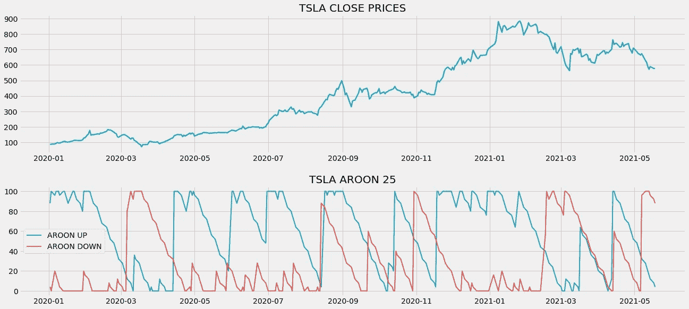

# Python 中带 Aroon 指标的算法交易

> 原文：<https://medium.com/codex/algorithmic-trading-with-the-aroon-indicator-in-python-3d2277d2f664?source=collection_archive---------1----------------------->

## 学习用 python 中强大的指标来检测市场趋势并据此进行交易


[来源](https://wallpapercave.com/stock-exchange-wallpapers)

有很多技术指标可以用于研究或交易目的，但它们有一个共同的相似之处，那就是它们都只服务于一个特定的任务。例如，RSI 可用于识别市场中的超买和超卖水平，波动指数可用于观察市场波动，等等。但是，今天我们要探索一个指标，它既可以用来确认市场趋势，也可以用来确认市场波动。看，阿隆指示器！在本文中，我们将讨论 Aroon 指标是什么，它的用法和计算，以及如何使用 python 构建基于它的交易策略。事不宜迟，让我们直接进入正题。

在继续之前，如果你想在没有任何代码的情况下回溯测试你的交易策略，有一个解决方案。这是[回测区](https://www.backtestzone.com/)。这是一个平台，可以免费对不同类型的可交易资产的任意数量的交易策略进行回溯测试，无需编码。点击这里的链接，你可以马上使用这个工具:【https://www.backtestzone.com/ 

# 阿伦指示器

Aroon 指标由 Tushar Chande 于 1995 年创立，是一种动量振荡器，专门用于跟踪市场的趋势以及趋势的强度。交易者广泛使用这个指标来识别市场的新趋势，并据此确定潜在的进场点和出场点。作为一个振荡器，Aroon 指示器的值在 0 到 100 之间。

Aroon 指标由两部分组成:Aroon 上行线和 Aroon 下行线。阿隆上升线衡量市场上升趋势的强度，同样，阿隆下降线衡量市场下降趋势的强度。Aroon 指标的传统设置是 14(短期)或 25(长期)作为回望期。在本文中，我们将使用 25 作为设置，因为我们将处理一年半的数据。以 25 为回望期计算这两条线的公式如下:

```
AROON UP = [ **25** - **PERIODS SINCE 25 PERIOD HIGH** ] / **25** * [ **100** ]
AROON DOWN = [ **25** - **PERIODS SINCE 25 PERIOD LOW** ] / **25** * [ **100** ]
```

Aroon 上涨线的计算方法是，首先确定股票在 25 天的时间框架内达到新高的时间，然后将该值减去并除以 25，最后乘以 100。这也适用于计算 Aroon 下行线，但这里我们确定的是自出现新低以来的天数，而不是观察到的新高。

Aroon 指标的主要概念是，在强劲的上升趋势中，市场往往会达到更多的新高，同样，在强劲的下降趋势中，市场也必然会达到更多的新低。也就是说，让我们来探讨如何使用 Aroon 指标来建立交易策略。

据我所知，Aroon 指标可以通过两种方式建立交易策略。首先是交叉交易策略。如果上涨线从下方穿越到下跌线上方，这个策略显示出买入信号，同样，如果上涨线从上方移动到下跌线下方，显示出卖出信号。交叉策略可以表示如下:

```
IF **P.UP LINE** < **P.DOWN LINE** AND **C.UP LINE** > **C.DOWN LINE** --> **BUY**
IF **P.UP LINE** > **P.DOWN LINE** AND **C.UP LINE** < **C.DOWN LINE** --> **SELL**
```

第二个策略是构建一个较高和较低的阈值，如果 Aroon 上行线的读数大于等于 70，Aroon 下行线的读数小于等于 30，则代表买入信号。同样，当 Aroon 上升线的读数等于或低于 30，而 Aroon 下降线的读数等于或高于 70 时，就显示出卖出信号。该策略可以表示如下:

```
IF **AROON UP LINE => 70** AND **AROON DOWN LINE <= 30** --> **BUY SIGNAL** IF **AROON UP LINE <= 30** AND **AROON DOWN LINE >= 70** --> **SELL SIGNAL**
```

这两种交易策略都非常有效，可以用来交易任何股票。在这篇文章中，我们将实施第二个交易策略，构建阈值，只是为了使事情变得简单。现在，我们对 Aroon 指标及其计算和使用有了一个概念。让我们进入编程部分，我们将在 python 中从头开始构建第二个 Aroon 指标策略，并在 Tesla 上对其进行回测。在继续之前，关于免责声明的一个注意事项:本文的唯一目的是教育人们，必须被视为一个信息，而不是投资建议等。

# 用 Python 实现

编码部分分为以下几个步骤:

```
**1\. Importing Packages
2\. Extracting Stock Data from Twelve Data
3\. Extracting the Aroon Indicator values
4\. Aroon Indicator Plot
5\. Creating the Trading Strategy
6\. Plotting the Trading Lists
7\. Creating our Position
8\. Backtesting
9\. SPY ETF Comparison**
```

我们将按照上面列表中提到的顺序，系好安全带，跟随每一个即将到来的编码部分。

## 步骤 1:导入包

将所需的包导入 python 环境是一个不可跳过的步骤。主要的包是处理数据的 Pandas，处理数组和复杂函数的 NumPy，用于绘图的 Matplotlib，以及进行 API 调用的请求。二级包是数学函数的 Math 和字体定制的 Termcolor(可选)。

**Python 实现:**

```
import pandas as pd
import numpy as np
import requests
import matplotlib.pyplot as plt
from math import floor
from termcolor import colored as cl

plt.style.use('fivethirtyeight')
plt.rcParams['figure.figsize'] = (20, 10)
```

现在我们已经将所有需要的包导入到 python 中。我们用十二数据的 API 端点来拉特斯拉的历史数据。

## 步骤 2:从 12 个数据中提取数据

在这一步，我们将使用由[twelvedata.com](https://twelvedata.com/)提供的 API 端点提取特斯拉的历史股票数据。在此之前，请注意 twelvedata.com:十二数据公司是领先的市场数据提供商之一，拥有大量各种市场数据的 API 端点。它非常容易与十二数据提供的 API 进行交互，并且拥有有史以来最好的文档。此外，确保你有一个 twelvedata.com[的账户，只有这样，你才能访问你的 API 密匙(用 API 提取数据的重要元素)。](https://twelvedata.com/)

**Python 实现:**

```
def get_historical_data(symbol, start_date):
    api_key = 'YOUR API KEY'
    api_url = f'https://api.twelvedata.com/time_series?symbol={symbol}&interval=1day&outputsize=5000&apikey={api_key}'
    raw_df = requests.get(api_url).json()
    df = pd.DataFrame(raw_df['values']).iloc[::-1].set_index('datetime').astype(float)
    df = df[df.index >= start_date]
    df.index = pd.to_datetime(df.index)
    return df

tsla = get_historical_data('TSLA', '2020-01-01')
tsla
```

**输出:**


作者图片

**代码解释:**我们做的第一件事是定义一个名为‘get _ historical _ data’的函数，该函数将股票的符号(‘symbol’)和历史数据的起始日期(‘start _ date’)作为参数。在函数内部，我们定义了 API 键和 URL，并将它们存储到各自的变量中。接下来，我们使用“get”函数提取 JSON 格式的历史数据，并将其存储到“raw_df”变量中。在对原始 JSON 数据进行清理和格式化之后，我们将以干净的 Pandas 数据帧的形式返回它。最后，我们调用创建的函数来提取特斯拉从 2020 年开始的历史数据，并将其存储到“tsla”变量中。

## 步骤 3:提取 Aroon 指标值

在这一步中，我们将借助于十二数据提供的 API 端点来提取特斯拉的 Aroon 指标值。这一步和我们上一步做的差不多。

**Python 实现:**

```
def get_aroon(symbol, lookback, start_date):
    api_key = 'YOUR API KEY'
    api_url = f'https://api.twelvedata.com/aroon?symbol={symbol}&interval=1day&time_period={lookback}&outputsize=5000&apikey={api_key}'
    raw_df = requests.get(api_url).json()
    df = pd.DataFrame(raw_df['values']).iloc[::-1].set_index('datetime').astype(float)
    df = df[df.index >= start_date]
    df.index = pd.to_datetime(df.index)
    aroon_up = df['aroon_up']
    aroon_down = df['aroon_down']
    return aroon_up, aroon_down

tsla['aroon_up'], tsla['aroon_down'] = get_aroon('TSLA', 25, '2020-01-01')
tsla.tail()
```

**输出:**


作者图片

**代码解释:**首先，我们定义一个名为‘get _ aroon’的函数，它将股票的符号(‘symbol’)、指标的回看周期(‘look back’)和数据的开始日期(‘start _ date’)作为参数。在函数内部，我们首先分配两个名为“api_key”和“url”的变量，分别存储 api 键和 API URL。使用 Requests 包提供的“get”函数，我们调用 API 并将响应存储到“raw”变量中。在做了一些数据操作后，我们返回 Aroon 上线和下线值。最后，我们调用函数来提取 Tesla 的 Aroon 指标值。

## 步骤 4: Aroon 指示图

在这一步，我们将绘制提取的特斯拉 Aroon 指标值，以使其更有意义。这一部分的主要目的不是在编码部分，而是观察图，以获得对 Aroon 指标的牢固理解。

**Python 实现:**

```
ax1 = plt.subplot2grid((11,1), (0,0), rowspan = 5, colspan = 1)
ax2 = plt.subplot2grid((11,1), (6,0), rowspan = 4, colspan = 1)
ax1.plot(tsla['close'], linewidth = 2.5, color = '#2196f3')
ax1.set_title('TSLA CLOSE PRICES')
ax2.plot(tsla['aroon_up'], color = '#26a69a', linewidth = 2, label = 'AROON UP')
ax2.plot(tsla['aroon_down'], color = '#ef5350', linewidth = 2, label = 'AROON DOWN')
ax2.legend()
ax2.set_title('TSLA AROON 25')
plt.show()
```

**输出:**



作者图片

上面的图表分为两个面板:上面的面板包括特斯拉的收盘价，下面的面板包括 Aroon 上涨线和下跌线。我提到过 Aroon 指标不仅有助于识别趋势，也有助于识别区间市场。为了识别波动的市场周期，我们必须仔细观察上涨线和下跌线。每当两条线之间的空间越来越小，那么市场就被认为是在波动。类似地，当两条线之间的空间变宽时，趋势市场被观察到。

你也可以看到，每当市场似乎在一个强劲的上升趋势中上升，Aroon 上升线的读数也上升，平行地，Aroon 下降线的读数下降。同样地，在一个强烈下跌的时期，Aroon 下行线的读数会越过 Aroon 上行线。由此，我们可以说两条直线成反比。

有时，可以观察到 Aroon 上行线在 100 停留一段时间。这代表市场处于一个非常强劲的上升趋势，创造新高。这也适用于 Aroon 下行线。当 Aroon 下行线停留在 100 点一段时间时，市场被认为是高度看跌的，创造了新低。Aroon 指标识别非常强劲的上涨趋势和下跌趋势的这一特性对现实市场中的交易者来说很方便。

## 步骤 5:创建交易策略

这一步，我们要用 python 实现讨论过的 Aroon 指标交易策略。

**Python 实现:**

```
def implement_aroon_strategy(prices, up, down):
    buy_price = []
    sell_price = []
    aroon_signal = []
    signal = 0

    for i in range(len(prices)):
        if up[i] >= 70 and down[i] <= 30:
            if signal != 1:
                buy_price.append(prices[i])
                sell_price.append(np.nan)
                signal = 1
                aroon_signal.append(signal)
            else:
                buy_price.append(np.nan)
                sell_price.append(np.nan)
                aroon_signal.append(0)
        elif up[i] <= 30 and down[i] >= 70:
            if signal != -1:
                buy_price.append(np.nan)
                sell_price.append(prices[i])
                signal = -1
                aroon_signal.append(signal)
            else:
                buy_price.append(np.nan)
                sell_price.append(np.nan)
                aroon_signal.append(0)
        else:
            buy_price.append(np.nan)
            sell_price.append(np.nan)
            aroon_signal.append(0)

    return buy_price, sell_price, aroon_signal

buy_price, sell_price, aroon_signal = implement_aroon_strategy(tsla['close'], tsla['aroon_up'], tsla['aroon_down'])
```

**代码解释:**首先，我们定义一个名为‘implement _ aroon _ strategy’的函数，它将股票价格(‘price’)和 Aroon 指标线(‘up’，‘down’)作为参数。

在这个函数中，我们创建了三个空列表(buy_price、sell_price 和 aroon_signal ),在创建交易策略时，这些值将被追加到这些列表中。

之后，我们通过 for 循环实施交易策略。在 for 循环内部，我们传递某些条件，如果条件得到满足，相应的值将被追加到空列表中。如果购买股票的条件得到满足，买入价将被追加到“buy_price”列表中，信号值将被追加为 1，表示购买股票。类似地，如果卖出股票的条件得到满足，卖价将被追加到“sell_price”列表中，信号值将被追加为-1，表示卖出股票。

最后，我们返回附加了值的列表。然后，我们调用创建的函数并将值存储到各自的变量中。除非我们画出这些值，否则这个列表没有任何意义。所以，让我们画出创建的交易列表的值。

## 步骤 6:绘制交易信号

在这一步，我们将绘制已创建的交易列表，以使它们有意义。

**Python 实现:**

```
ax1 = plt.subplot2grid((11,1), (0,0), rowspan = 5, colspan = 1)
ax2 = plt.subplot2grid((11,1), (6,0), rowspan = 4, colspan = 1)
ax1.plot(tsla['close'], linewidth = 2.5, color = '#2196f3')
ax1.plot(tsla.index, buy_price, marker = '^', color = '#26a69a', markersize = 12)
ax1.plot(tsla.index, sell_price, marker = 'v', color = '#ef5350', markersize = 12)
ax1.set_title('TSLA CLOSE PRICES')
ax2.plot(tsla['aroon_up'], color = '#26a69a', linewidth = 2, label = 'AROON UP')
ax2.plot(tsla['aroon_down'], color = '#ef5350', linewidth = 2, label = 'AROON DOWN')
ax2.legend()
ax2.set_title('TSLA AROON 25')
plt.show()
```

**输出:**


作者图片

**代码解释:**我们正在绘制 Aroon 指标成分以及交易策略产生的买入和卖出信号。我们可以观察到，每当 Aroon 上行线的读数大于等于 70，Aroon 下行线的读数小于等于 30 时，图表中就会出现绿色的买入信号。类似地，当 Aroon 上升线的读数低于 30，Aroon 下降线的读数高于 70 时，图表中就会出现红色的卖出信号。

## 步骤 7:创建我们的职位

在这一步中，我们将创建一个列表，如果我们持有股票，该列表将指示 1；如果我们不拥有或持有股票，该列表将指示 0。

**Python 实现:**

```
position = []
for i in range(len(aroon_signal)):
    if aroon_signal[i] > 1:
        position.append(0)
    else:
        position.append(1)

for i in range(len(tsla['close'])):
    if aroon_signal[i] == 1:
        position[i] = 1
    elif aroon_signal[i] == -1:
        position[i] = 0
    else:
        position[i] = position[i-1]

aroon_up = tsla['aroon_up']
aroon_down = tsla['aroon_down']
close_price = tsla['close']
aroon_signal = pd.DataFrame(aroon_signal).rename(columns = {0:'aroon_signal'}).set_index(tsla.index)
position = pd.DataFrame(position).rename(columns = {0:'aroon_position'}).set_index(tsla.index)

frames = [close_price, aroon_up, aroon_down, aroon_signal, position]
strategy = pd.concat(frames, join = 'inner', axis = 1)

strategy
```

**输出:**


作者图片

**代码解释:**首先，我们创建一个名为‘position’的空列表。我们传递两个 for 循环，一个是为“位置”列表生成值，以匹配“信号”列表的长度。另一个 for 循环是我们用来生成实际位置值的循环。在第二个 for 循环中，我们对“signal”列表的值进行迭代，而“position”列表的值被附加到满足哪个条件上。如果我们持有股票，头寸的价值仍为 1；如果我们卖出或不持有股票，头寸的价值仍为 0。最后，我们正在进行一些数据操作，将所有创建的列表合并到一个数据帧中。

从显示的输出中，我们可以看到，在第一行中，我们在股票中的头寸仍然是 1(因为 Aroon 指标信号没有任何变化)，但当 Aroon 指标交易信号代表卖出信号(-1)时，我们的头寸突然变为-1。我们的头寸将保持为 0，直到交易信号发生一些变化。现在是时候实现一些回溯测试过程了！

## 步骤 8:回溯测试

在继续之前，有必要知道什么是回溯测试。回溯测试是查看我们的交易策略在给定股票数据上表现如何的过程。在我们的案例中，我们将对特斯拉股票数据的 Aroon 指标交易策略实施回溯测试流程。

**Python 实现:**

```
tsla_ret = pd.DataFrame(np.diff(tsla['close'])).rename(columns = {0:'returns'})
aroon_strategy_ret = []

for i in range(len(tsla_ret)):
    returns = tsla_ret['returns'][i]*strategy['aroon_position'][i]
    aroon_strategy_ret.append(returns)

aroon_strategy_ret_df = pd.DataFrame(aroon_strategy_ret).rename(columns = {0:'aroon_returns'})
investment_value = 100000
number_of_stocks = floor(investment_value/tsla['close'][-1])
aroon_investment_ret = []

for i in range(len(aroon_strategy_ret_df['aroon_returns'])):
    returns = number_of_stocks*aroon_strategy_ret_df['aroon_returns'][i]
    aroon_investment_ret.append(returns)

aroon_investment_ret_df = pd.DataFrame(aroon_investment_ret).rename(columns = {0:'investment_returns'})
total_investment_ret = round(sum(aroon_investment_ret_df['investment_returns']), 2)
profit_percentage = floor((total_investment_ret/investment_value)*100)
print(cl('Profit gained from the Aroon strategy by investing $100k in TSLA : {}'.format(total_investment_ret), attrs = ['bold']))
print(cl('Profit percentage of the Aroon strategy : {}%'.format(profit_percentage), attrs = ['bold']))
```

**输出:**

```
**Profit gained from the Aroon strategy by investing $100k in TSLA : 55354.46**
**Profit percentage of the Aroon strategy : 55%**
```

**代码解释:**首先，我们使用 NumPy 包提供的“diff”函数计算 Tesla 股票的回报，并将其作为 dataframe 存储到“tsla_ret”变量中。接下来，我们将传递一个 for 循环来迭代' tsla_ret '变量的值，以计算我们从 Aroon 指标交易策略中获得的回报，并将这些回报值追加到' aroon_strategy_ret '列表中。接下来，我们将“aroon_strategy_ret”列表转换为数据帧，并将其存储到“aroon_strategy_ret_df”变量中。

接下来是回溯测试过程。我们将通过投资 10 万美元到我们的交易策略中来回测我们的策略。首先，我们将投资金额存储到“投资值”变量中。之后，我们正在计算使用投资金额可以购买的特斯拉股票数量。你可以注意到，我使用了 Math package 提供的“floor”函数，因为当投资金额除以特斯拉股票的收盘价时，它会输出一个十进制数。股票数量应该是整数，而不是小数。使用“底数”函数，我们可以去掉小数。请记住,“floor”函数比“round”函数要复杂得多。然后，我们传递一个 for 循环来寻找投资回报，随后是一些数据操作任务。

最后，我们打印了我们通过投资 10 万到我们的交易策略中得到的总回报，并且显示我们在一年中获得了大约 55，000 美元的利润。那还不错！现在，让我们将我们的回报与 SPY ETF(一种旨在跟踪标准普尔 500 股票市场指数的 ETF)的回报进行比较。

## 步骤 9: SPY ETF 对比

这一步是可选的，但强烈推荐，因为我们可以了解我们的交易策略相对于基准(间谍 ETF)的表现如何。在这一步，我们将使用我们创建的“get_historical_data”函数提取 SPY ETF 的数据，并将我们从 SPY ETF 获得的回报与我们在 Tesla 上的 Aroon 指标策略回报进行比较。

**Python 实现:**

```
def get_benchmark(start_date, investment_value):
    spy = get_historical_data('SPY', start_date)['close']
    benchmark = pd.DataFrame(np.diff(spy)).rename(columns = {0:'benchmark_returns'})

    investment_value = investment_value
    number_of_stocks = floor(investment_value/spy[-1])
    benchmark_investment_ret = []

    for i in range(len(benchmark['benchmark_returns'])):
        returns = number_of_stocks*benchmark['benchmark_returns'][i]
        benchmark_investment_ret.append(returns)

    benchmark_investment_ret_df = pd.DataFrame(benchmark_investment_ret).rename(columns = {0:'investment_returns'})
    return benchmark_investment_ret_df

benchmark = get_benchmark('2020-01-01', 100000)

investment_value = 100000
total_benchmark_investment_ret = round(sum(benchmark['investment_returns']), 2)
benchmark_profit_percentage = floor((total_benchmark_investment_ret/investment_value)*100)
print(cl('Benchmark profit by investing $100k : {}'.format(total_benchmark_investment_ret), attrs = ['bold']))
print(cl('Benchmark Profit percentage : {}%'.format(benchmark_profit_percentage), attrs = ['bold']))
print(cl('Aroon Strategy profit is {}% higher than the Benchmark Profit'.format(profit_percentage - benchmark_profit_percentage), attrs = ['bold']))
```

**输出:**

```
**Benchmark profit by investing $100k : 21090.3**
**Benchmark Profit percentage : 21%**
**Aroon Strategy profit is 34% higher than the Benchmark Profit**
```

**代码解释:**此步骤中使用的代码几乎与前一回测步骤中使用的代码相似，但我们不是投资特斯拉，而是通过不实施任何交易策略来投资 SPY ETF。从输出可以看出，我们的 Aroon 指标交易策略已经跑赢了 SPY ETF 34%。太好了！

# 最后的想法！

经过一个漫长的过程，理论和编码部分都粉碎了，我们已经成功地了解了 Aroon 指标是什么，以及如何建立一个基于它的交易策略。Aroon 指标一直是我个人的最爱，因为它有助于同时完成两项工作(识别趋势、波动)，而且它也是独一无二的。尽管我们已经超越了 SPY ETF 的回报，但仍有改进的空间:

*   **策略优化:**在本文中，我们使用了一种基于 Aroon 指标的最基本的交易策略，这种策略仅可用于理解或获得关于该指标的直觉，但不可能在现实市场中预期可见的回报。所以，我强烈推荐你去发现其他先进的基于 Aroon 的交易策略，比如突破策略，拉回策略，等等。除了发现之外，用尽可能多的股票对策略进行回溯测试，因为结果可能会因人而异。
*   **风险管理:**无论是交易还是长期投资，这个话题都是必须要考虑的。只要你紧紧抓住这个概念，你就在市场上拥有强大的优势。我们没有涉及这个话题，因为这篇文章的唯一目的只是理解和集思广益 Aroon 指标的基本思想，而不是为了盈利。但是，在进入疯狂的现实世界市场之前，强烈建议对这个主题进行深入研究。

说到这里，我们已经到了文章的结尾。希望你能从这篇文章中学到一些有用的东西。此外，如果您忘记了遵循任何编码部分，不要担心。我在文章末尾提供了完整的源代码。

## 完整代码:

```
import pandas as pd
import numpy as np
import requests
import matplotlib.pyplot as plt
from math import floor
from termcolor import colored as cl

plt.style.use('fivethirtyeight')
plt.rcParams['figure.figsize'] = (20, 10)

def get_historical_data(symbol, start_date):
    api_key = 'YOUR API KEY'
    api_url = f'https://api.twelvedata.com/time_series?symbol={symbol}&interval=1day&outputsize=5000&apikey={api_key}'
    raw_df = requests.get(api_url).json()
    df = pd.DataFrame(raw_df['values']).iloc[::-1].set_index('datetime').astype(float)
    df = df[df.index >= start_date]
    df.index = pd.to_datetime(df.index)
    return df

tsla = get_historical_data('TSLA', '2020-01-01')
print(tsla)

def get_aroon(symbol, lookback, start_date):
    api_key = 'YOUR API KEY'
    api_url = f'https://api.twelvedata.com/aroon?symbol={symbol}&interval=1day&time_period={lookback}&outputsize=5000&apikey={api_key}'
    raw_df = requests.get(api_url).json()
    df = pd.DataFrame(raw_df['values']).iloc[::-1].set_index('datetime').astype(float)
    df = df[df.index >= start_date]
    df.index = pd.to_datetime(df.index)
    aroon_up = df['aroon_up']
    aroon_down = df['aroon_down']
    return aroon_up, aroon_down

tsla['aroon_up'], tsla['aroon_down'] = get_aroon('TSLA', 25, '2020-01-01')
print(tsla.tail())

ax1 = plt.subplot2grid((11,1), (0,0), rowspan = 5, colspan = 1)
ax2 = plt.subplot2grid((11,1), (6,0), rowspan = 4, colspan = 1)
ax1.plot(tsla['close'], linewidth = 2.5, color = '#2196f3')
ax1.set_title('TSLA CLOSE PRICES')
ax2.plot(tsla['aroon_up'], color = '#26a69a', linewidth = 2, label = 'AROON UP')
ax2.plot(tsla['aroon_down'], color = '#ef5350', linewidth = 2, label = 'AROON DOWN')
ax2.legend()
ax2.set_title('TSLA AROON 25')
plt.show()

def implement_aroon_strategy(prices, up, down):
    buy_price = []
    sell_price = []
    aroon_signal = []
    signal = 0

    for i in range(len(prices)):
        if up[i] >= 70 and down[i] <= 30:
            if signal != 1:
                buy_price.append(prices[i])
                sell_price.append(np.nan)
                signal = 1
                aroon_signal.append(signal)
            else:
                buy_price.append(np.nan)
                sell_price.append(np.nan)
                aroon_signal.append(0)
        elif up[i] <= 30 and down[i] >= 70:
            if signal != -1:
                buy_price.append(np.nan)
                sell_price.append(prices[i])
                signal = -1
                aroon_signal.append(signal)
            else:
                buy_price.append(np.nan)
                sell_price.append(np.nan)
                aroon_signal.append(0)
        else:
            buy_price.append(np.nan)
            sell_price.append(np.nan)
            aroon_signal.append(0)

    return buy_price, sell_price, aroon_signal

buy_price, sell_price, aroon_signal = implement_aroon_strategy(tsla['close'], tsla['aroon_up'], tsla['aroon_down'])

ax1 = plt.subplot2grid((11,1), (0,0), rowspan = 5, colspan = 1)
ax2 = plt.subplot2grid((11,1), (6,0), rowspan = 4, colspan = 1)
ax1.plot(tsla['close'], linewidth = 2.5, color = '#2196f3')
ax1.plot(tsla.index, buy_price, marker = '^', color = '#26a69a', markersize = 12)
ax1.plot(tsla.index, sell_price, marker = 'v', color = '#ef5350', markersize = 12)
ax1.set_title('TSLA CLOSE PRICES')
ax2.plot(tsla['aroon_up'], color = '#26a69a', linewidth = 2, label = 'AROON UP')
ax2.plot(tsla['aroon_down'], color = '#ef5350', linewidth = 2, label = 'AROON DOWN')
ax2.legend()
ax2.set_title('TSLA AROON 25')
plt.show()

position = []
for i in range(len(aroon_signal)):
    if aroon_signal[i] > 1:
        position.append(0)
    else:
        position.append(1)

for i in range(len(tsla['close'])):
    if aroon_signal[i] == 1:
        position[i] = 1
    elif aroon_signal[i] == -1:
        position[i] = 0
    else:
        position[i] = position[i-1]

aroon_up = tsla['aroon_up']
aroon_down = tsla['aroon_down']
close_price = tsla['close']
aroon_signal = pd.DataFrame(aroon_signal).rename(columns = {0:'aroon_signal'}).set_index(tsla.index)
position = pd.DataFrame(position).rename(columns = {0:'aroon_position'}).set_index(tsla.index)

frames = [close_price, aroon_up, aroon_down, aroon_signal, position]
strategy = pd.concat(frames, join = 'inner', axis = 1)

strategy.head()

print(strategy[43:48])

tsla_ret = pd.DataFrame(np.diff(tsla['close'])).rename(columns = {0:'returns'})
aroon_strategy_ret = []

for i in range(len(tsla_ret)):
    returns = tsla_ret['returns'][i]*strategy['aroon_position'][i]
    aroon_strategy_ret.append(returns)

aroon_strategy_ret_df = pd.DataFrame(aroon_strategy_ret).rename(columns = {0:'aroon_returns'})
investment_value = 100000
number_of_stocks = floor(investment_value/tsla['close'][-1])
aroon_investment_ret = []

for i in range(len(aroon_strategy_ret_df['aroon_returns'])):
    returns = number_of_stocks*aroon_strategy_ret_df['aroon_returns'][i]
    aroon_investment_ret.append(returns)

aroon_investment_ret_df = pd.DataFrame(aroon_investment_ret).rename(columns = {0:'investment_returns'})
total_investment_ret = round(sum(aroon_investment_ret_df['investment_returns']), 2)
profit_percentage = floor((total_investment_ret/investment_value)*100)
print(cl('Profit gained from the Aroon strategy by investing $100k in TSLA : {}'.format(total_investment_ret), attrs = ['bold']))
print(cl('Profit percentage of the Aroon strategy : {}%'.format(profit_percentage), attrs = ['bold']))

def get_benchmark(start_date, investment_value):
    spy = get_historical_data('SPY', start_date)['close']
    benchmark = pd.DataFrame(np.diff(spy)).rename(columns = {0:'benchmark_returns'})

    investment_value = investment_value
    number_of_stocks = floor(investment_value/spy[-1])
    benchmark_investment_ret = []

    for i in range(len(benchmark['benchmark_returns'])):
        returns = number_of_stocks*benchmark['benchmark_returns'][i]
        benchmark_investment_ret.append(returns)

    benchmark_investment_ret_df = pd.DataFrame(benchmark_investment_ret).rename(columns = {0:'investment_returns'})
    return benchmark_investment_ret_df

benchmark = get_benchmark('2020-01-01', 100000)

investment_value = 100000
total_benchmark_investment_ret = round(sum(benchmark['investment_returns']), 2)
benchmark_profit_percentage = floor((total_benchmark_investment_ret/investment_value)*100)
print(cl('Benchmark profit by investing $100k : {}'.format(total_benchmark_investment_ret), attrs = ['bold']))
print(cl('Benchmark Profit percentage : {}%'.format(benchmark_profit_percentage), attrs = ['bold']))
print(cl('Aroon Strategy profit is {}% higher than the Benchmark Profit'.format(profit_percentage - benchmark_profit_percentage), attrs = ['bold']))
```