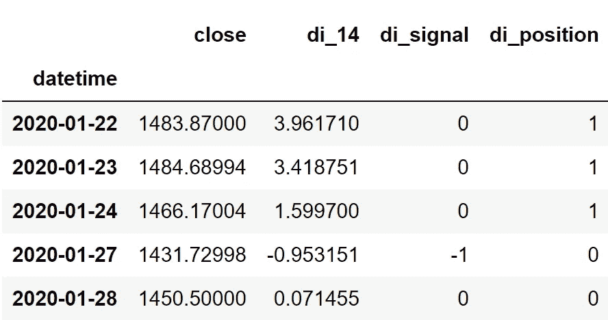

# Python 中带差异指数的算法交易

> 原文：<https://medium.com/codex/algorithmic-trading-with-the-disparity-index-in-python-24a0479c452b?source=collection_archive---------0----------------------->

## 在 Python 中编码和回溯测试一个强大的指示器


杰佛森·桑多斯在 [Unsplash](https://unsplash.com?utm_source=medium&utm_medium=referral) 上拍摄的照片

有大量的技术指标用于交易目的，但是如此挑剔的交易者最终只会选择其中的一小部分，我们今天要讨论的指标无疑会增加这个列表。看，差距指数。在本文中，我们将首先讨论差异指数是什么，该指标背后的数学原理，然后，我们将继续进行编码部分，首先使用 Python 从头构建该指标，基于它构建一个简单的交易策略，对谷歌股票进行回溯测试，并将回报与 SPY ETF(一种旨在跟踪标准普尔 500 市场指数走势的 ETF)的回报进行比较。

在继续之前，如果你想在没有任何代码的情况下回溯测试你的交易策略，有一个解决方案。这是[的后验区](https://www.backtestzone.com/)。这是一个平台，可以免费对不同类型的可交易资产的任意数量的交易策略进行回溯测试，无需编码。点击这里的链接，你可以马上使用这个工具:[https://www.backtestzone.com/](https://www.backtestzone.com/)

# 差异指数

差异指数是一个动量指标，用于测量股票的当前收盘价与其在指定时间段内的移动平均值之间的距离，并以百分比的形式解释读数。与其他动量振荡器不同，差异指数不限制在某些水平之间，因此是一个无界振荡器。

交易者经常使用差异指数来确定市场的当前势头。如果差异指数的读数高于零，则可以观察到市场的上升势头，类似地，如果该指标的读数低于零，则认为市场处于下降势头。

视差指数的计算非常简单。首先，我们必须找出一只股票的收盘价格与指定时间段内的移动平均线之间的差值，并将该差值除以移动平均线，然后乘以 100。以 14 作为回看周期的典型设置的视差指数的计算可以表示如下:

```
**DI 14** = [ **C.PRICE** - **MOVING  AVG 14** ] / [ **MOVING AVG 14** ] * **100**where,
DI 14 = 14-day Disparity Index
MOVING AVG 14 = 14-day Moving Average
C.PRICE = Closing price of the stock
```

这就是计算视差指数读数的整个过程。现在，让我们来分析一个图表，其中绘制了谷歌的收盘价数据及其 14 天差异指数。


作者图片

上面的图表分为两个面板:上面的面板显示谷歌的收盘价，下面的面板显示 14 天差异指数的读数。从上面的图表中，我们可以看到，每当差异指数的读数高于零线时，就会绘制一个绿色直方图，表示市场中的积极或向上的势头，类似地，每当差异指数低于零线时，就会绘制一个红色直方图，表示消极或向下的势头。这是使用差异指数的一种方式。交易者使用这一指标的另一种方式是检测区间市场(价格在一定范围内来回波动，既不显示正价格也不显示负价格运动的市场)。有时，可以看到差异指数的棒线在零线的两侧来回移动，表明市场正在调整或盘整。该指标的这一特性在交易时对交易者来说很方便(对我个人来说)。

据我所知，有两种基于差异指数的交易策略。第一个是突破策略，交易者假设两个极端水平绘制在图的两侧，这种策略在差异指数低于较低水平时显示买入信号，类似地，当差异指数高于较高水平时产生卖出信号。这些阈值因资产而异，因为差异指数是一个无界振荡器。第二个是零线交叉策略，当差异指数从零线以下到零线以上时显示买入信号，当差异指数从零线以上到零线以下时产生卖出信号。

在本文中，我们将实施第二种策略，即零线交叉策略，但由于视差指数易于揭示大量错误信号，我们将调整传统的交叉策略。只有当过去四个读数低于零线，当前读数高于零线时，我们调整的策略才会显示买入信号。同样，只有在过去四个读数高于零线，当前读数低于零线时，才会产生卖出。这样做将大大减少该策略产生的错误信号的数量，从而提高其性能。我们调整后的零线交叉交易策略可以表示如下:

```
IF **PREV.4 DIs** < **ZERO-LINE** AND **CURR.DI** > **ZERO-LINE** ==> **BUY SIGNAL**
IF **PREV.4 DIs** > **ZERO-LINE** AND **CURR.DI** < **ZERO-LINE** ==> **SELL SIGNAL**
```

这就结束了我们关于差异指数的理论部分。现在，让我们转到编程部分，首先从头开始构建指标，构建我们刚刚讨论过的调整过的零线交叉策略，然后将我们的策略与 Python 中 SPY ETF 的性能进行比较。来做点编码吧！在继续之前，关于免责声明的一个注意事项:本文的唯一目的是教育人们，必须被视为一个信息，而不是投资建议等。

# 用 Python 实现

编码部分分为以下几个步骤:

```
**1\. Importing Packages
2\. Extracting Stock Data from Twelve Data
3\. Disparity Index Calculation
4\. Creating the Tuned Zero-line Crossover Trading Strategy
5\. Plotting the Trading Lists
6\. Creating our Position
7\. Backtesting
8\. SPY ETF Comparison**
```

我们将按照上面列表中提到的顺序，系好安全带，跟随每一个即将到来的编码部分。

## 步骤 1:导入包

将所需的包导入 python 环境是一个不可跳过的步骤。主要的包是处理数据的 Pandas，处理数组和复杂函数的 NumPy，用于绘图的 Matplotlib，以及进行 API 调用的请求。二级包是数学函数的 Math 和字体定制的 Termcolor(可选)。

**Python 实现:**

```
**# IMPORTING PACKAGES** 
import numpy as np
import requests
import pandas as pd
import matplotlib.pyplot as plt
from math import floor
from termcolor import colored as cl

plt.style.use('fivethirtyeight')
plt.rcParams['figure.figsize'] = (20,10)
```

现在我们已经将所有需要的包导入到 python 中。我们用十二数据的 API 端点来拉一下 Google 的历史数据。

## 步骤 2:从 12 个数据中提取数据

在这一步中，我们将使用 twelvedata.com[提供的 API 端点提取谷歌的历史股票数据。在此之前，关于](https://twelvedata.com/)[twelvedata.com](https://twelvedata.com/)的一个说明:十二数据是领先的市场数据提供商之一，拥有大量针对所有类型市场数据的 API 端点。它非常容易与十二数据提供的 API 进行交互，并且拥有有史以来最好的文档。此外，确保您在[twelvedata.com](https://twelvedata.com/)上有一个帐户，只有这样，您才能访问您的 API 密钥(使用 API 提取数据的重要元素)。

**Python 实现:**

```
**# EXTRACTING STOCK DATA** 
def get_historical_data(symbol, start_date):
    api_key = 'YOUR API KEY'
    api_url = f'https://api.twelvedata.com/time_series?symbol={symbol}&interval=1day&outputsize=5000&apikey={api_key}'
    raw_df = requests.get(api_url).json()
    df = pd.DataFrame(raw_df['values']).iloc[::-1].set_index('datetime').astype(float)
    df = df[df.index >= start_date]
    df.index = pd.to_datetime(df.index)
    return df

googl = get_historical_data('GOOGL', '2020-01-01')
googl.tail()
```

**输出:**


作者图片

**代码解释:**我们做的第一件事是定义一个名为‘get _ historical _ data’的函数，它以股票的符号(‘symbol’)和历史数据的起始日期(‘start _ date’)作为参数。在函数内部，我们定义了 API 键和 URL，并将它们存储到各自的变量中。接下来，我们使用“get”函数提取 JSON 格式的历史数据，并将其存储到“raw_df”变量中。在对原始 JSON 数据进行清理和格式化之后，我们将以干净的 Pandas 数据帧的形式返回它。最后，我们调用创建的函数来提取 Google 从 2020 年开始的历史数据，并将其存储到“googl”变量中。

## 步骤 3:视差指数计算

在这一步中，我们将按照之前讨论的公式计算视差指数的读数。

**Python 实现:**

```
**# DISPARITY INDEX CALCULATION** 
def get_di(data, lookback):
    ma = data.rolling(lookback).mean()
    di = ((data - ma) / ma) * 100
    return di

googl['di_14'] = get_di(googl['close'], 14)
googl = googl.dropna()
googl.tail()
```

**输出:**


作者图片

**代码解释:**首先，我们定义一个名为“get_di”的函数，它将股票的收盘价(“数据”)和回望期作为参数。在函数中，我们首先计算指定数量的回望期的收盘价数据的移动平均值。然后，我们将确定的值代入视差指数公式来计算读数。最后，我们返回并调用创建的函数来存储 Google 的 14 天差异指数读数。

## 步骤 4:创建交易策略

在这一步中，我们将在 python 中实现所讨论的差异指数调整的零线交叉交易策略。

**Python 实现:**

```
**# DISPARITY INDEX STRATEGY** 
def implement_di_strategy(prices, di):
    buy_price = []
    sell_price = []
    di_signal = []
    signal = 0

    for i in range(len(prices)):
        if di[i-4] < 0 and di[i-3] < 0 and di[i-2] < 0 and di[i-1] < 0 and di[i] > 0:
            if signal != 1:
                buy_price.append(prices[i])
                sell_price.append(np.nan)
                signal = 1
                di_signal.append(signal)
            else:
                buy_price.append(np.nan)
                sell_price.append(np.nan)
                di_signal.append(0)
        elif di[i-4] > 0 and di[i-3] > 0 and di[i-2] > 0 and di[i-1] > 0 and di[i] < 0:
            if signal != -1:
                buy_price.append(np.nan)
                sell_price.append(prices[i])
                signal = -1
                di_signal.append(signal)
            else:
                buy_price.append(np.nan)
                sell_price.append(np.nan)
                di_signal.append(0)
        else:
            buy_price.append(np.nan)
            sell_price.append(np.nan)
            di_signal.append(0)

    return buy_price, sell_price, di_signal

buy_price, sell_price, di_signal = implement_di_strategy(googl['close'], googl['di_14'])
```

**代码解释:**首先，我们定义一个名为“implement_di_strategy”的函数，它将股票价格(“prices”)和差异指数(“di”)的读数作为参数。

在该函数中，我们创建了三个空列表(buy_price、sell_price 和 di_signal ),在创建交易策略时，将在这些列表中追加值。

之后，我们通过 for 循环实施交易策略。在 for 循环内部，我们传递某些条件，如果条件得到满足，相应的值将被追加到空列表中。如果购买股票的条件得到满足，买入价将被追加到“buy_price”列表中，信号值将被追加为 1，表示购买股票。类似地，如果卖出股票的条件得到满足，卖价将被追加到“sell_price”列表中，信号值将被追加为-1，表示卖出股票。

最后，我们返回附加了值的列表。然后，我们调用创建的函数并将值存储到各自的变量中。除非我们画出这些值，否则这个列表没有任何意义。所以，让我们画出创建的交易列表的值。

## 第五步:绘制交易信号

在这一步，我们将绘制已创建的交易列表，以使它们有意义。

**Python 实现:**

```
**# DISPARITY INDEX TRADING SIGNALS PLOT** 
ax1 = plt.subplot2grid((11,1), (0,0), rowspan = 5, colspan = 1)
ax2 = plt.subplot2grid((11,1), (6,0), rowspan = 5, colspan = 1)
ax1.plot(googl['close'], linewidth = 2, color = '#1976d2')
ax1.plot(googl.index, buy_price, marker = '^', markersize = 12, linewidth = 0, label = 'BUY SIGNAL', color = 'green')
ax1.plot(googl.index, sell_price, marker = 'v', markersize = 12, linewidth = 0, label = 'SELL SIGNAL', color = 'r')
ax1.legend()
ax1.set_title('GOOGL CLOSING PRICES')
for i in range(len(googl)):
    if googl.iloc[i, 5] >= 0:
        ax2.bar(googl.iloc[i].name, googl.iloc[i, 5], color = '#26a69a')
    else:    
        ax2.bar(googl.iloc[i].name, googl.iloc[i, 5], color = '#ef5350')
ax2.set_title('GOOGL DISPARITY INDEX 14')
plt.show()
```

**输出:**


作者图片

**代码解释:**我们正在绘制差异指数的读数，以及由调整后的零线交叉交易策略产生的买入和卖出信号。我们可以观察到，每当差异指数的前四个读数低于零线，而当前读数高于零线时，就会在图表中绘制绿色的买入信号。类似地，每当差异指数的前四个读数高于零线，而当前读数低于零线时，图表中就会显示红色的卖出信号。

## 步骤 6:创建我们的职位

在这一步中，我们将创建一个列表，如果我们持有股票，该列表将指示 1；如果我们不拥有或持有股票，该列表将指示 0。

**Python 实现:**

```
**# STOCK POSITION** 
position = []
for i in range(len(di_signal)):
    if di_signal[i] > 1:
        position.append(0)
    else:
        position.append(1)

for i in range(len(googl['close'])):
    if di_signal[i] == 1:
        position[i] = 1
    elif di_signal[i] == -1:
        position[i] = 0
    else:
        position[i] = position[i-1]

close_price = googl['close']
di = googl['di_14']
di_signal = pd.DataFrame(di_signal).rename(columns = {0:'di_signal'}).set_index(googl.index)
position = pd.DataFrame(position).rename(columns = {0:'di_position'}).set_index(googl.index)

frames = [close_price, di, di_signal, position]
strategy = pd.concat(frames, join = 'inner', axis = 1)

strategy.head()
```

**输出:**



作者图片

**代码解释:**首先，我们创建一个名为‘position’的空列表。我们传递两个 for 循环，一个是为“位置”列表生成值，以匹配“信号”列表的长度。另一个 for 循环是我们用来生成实际位置值的循环。在第二个 for 循环中，我们对“signal”列表的值进行迭代，而“position”列表的值被附加到满足哪个条件上。如果我们持有股票，头寸的价值仍为 1；如果我们卖出或不持有股票，头寸的价值仍为 0。最后，我们正在进行一些数据操作，将所有创建的列表合并到一个数据帧中。

从显示的输出中，我们可以看到，在前三行中，我们在股票中的位置保持为 1(因为差异指数信号没有任何变化)，但当差异指数交易信号代表卖出信号(-1)时，我们的位置突然变为-1。我们的头寸将保持为 0，直到交易信号发生一些变化。现在是时候实现一些回溯测试过程了！

## 步骤 7:回溯测试

在继续之前，有必要知道什么是回溯测试。回溯测试是查看我们的交易策略在给定股票数据上表现如何的过程。在我们的例子中，我们将对 Google 股票数据的差异指数交易策略实施回溯测试过程。

**Python 实现:**

```
**# BACKTESTING** 
googl_ret = pd.DataFrame(np.diff(googl['close'])).rename(columns = {0:'returns'})
di_strategy_ret = []

for i in range(len(googl_ret)):
    returns = googl_ret['returns'][i]*strategy['di_position'][i]
    di_strategy_ret.append(returns)

di_strategy_ret_df = pd.DataFrame(di_strategy_ret).rename(columns = {0:'di_returns'})
investment_value = 100000
number_of_stocks = floor(investment_value/googl['close'][0])
di_investment_ret = []

for i in range(len(di_strategy_ret_df['di_returns'])):
    returns = number_of_stocks*di_strategy_ret_df['di_returns'][i]
    di_investment_ret.append(returns)

di_investment_ret_df = pd.DataFrame(di_investment_ret).rename(columns = {0:'investment_returns'})
total_investment_ret = round(sum(di_investment_ret_df['investment_returns']), 2)
profit_percentage = floor((total_investment_ret/investment_value)*100)
print(cl('Profit gained from the DI strategy by investing $100k in GOOGL : {}'.format(total_investment_ret), attrs = ['bold']))
print(cl('Profit percentage of the DI strategy : {}%'.format(profit_percentage), attrs = ['bold']))
```

**输出:**

```
**Profit gained from the DI strategy by investing $100k in GOOGL : 39933.68**
**Profit percentage of the DI strategy : 39%**
```

**代码解释:**首先，我们使用 NumPy 包提供的“diff”函数计算谷歌股票的回报，并将其作为数据帧存储到“googl_ret”变量中。接下来，我们传递一个 for 循环来迭代' googl_ret '变量的值，以计算我们从差异指数交易策略中获得的回报，这些回报值被附加到' di_strategy_ret '列表中。接下来，我们将“di_strategy_ret”列表转换为数据帧，并将其存储到“di_strategy_ret_df”变量中。

接下来是回溯测试过程。我们将通过投资 10 万美元到我们的交易策略中来回测我们的策略。首先，我们将投资金额存储到“投资值”变量中。之后，我们正在计算使用投资金额可以购买的谷歌股票数量。你可以注意到，我使用了 Math 软件包提供的“下限”函数，因为当投资金额除以谷歌股票的收盘价时，它会输出一个十进制数。股票数量应该是整数，而不是小数。使用“底数”函数，我们可以去掉小数。请记住,“floor”函数比“round”函数要复杂得多。然后，我们传递一个 for 循环来查找投资回报，后面是一些数据操作任务。

最后，我们打印了我们通过投资 10 万到我们的交易策略中得到的总回报，并且显示我们在一年中获得了大约 38，000 美元的利润。那还不错！现在，让我们将我们的回报与 SPY ETF(一种旨在跟踪标准普尔 500 股票市场指数的 ETF)的回报进行比较。

## 第八步:间谍 ETF 对比

这一步是可选的，但强烈推荐，因为我们可以了解我们的交易策略相对于基准(间谍 ETF)的表现如何。在这一步中，我们将使用我们创建的“get_historical_data”函数提取 SPY ETF 数据，并将我们从 SPY ETF 获得的回报与我们在 Google 上调整的差异指数零线交叉交易策略回报进行比较。

你可能已经注意到，在我所有的算法交易文章中，我没有将策略结果与标准普尔 500 市场指数本身进行比较，而是与 SPY ETF 进行比较，这是因为大多数股票数据提供商(如 12 Data)不提供标准普尔 500 指数数据。所以，我别无选择，只能选择间谍 ETF。如果你有幸得到标准普尔 500 市场指数数据，建议用它来做比较，而不是任何 ETF。

**Python 实现:**

```
**# SPY ETF COMPARISON** 
def get_benchmark(start_date, investment_value):
    spy = get_historical_data('SPY', start_date)['close']
    benchmark = pd.DataFrame(np.diff(spy)).rename(columns = {0:'benchmark_returns'})

    investment_value = investment_value
    number_of_stocks = floor(investment_value/spy[-1])
    benchmark_investment_ret = []

    for i in range(len(benchmark['benchmark_returns'])):
        returns = number_of_stocks*benchmark['benchmark_returns'][i]
        benchmark_investment_ret.append(returns)

    benchmark_investment_ret_df = pd.DataFrame(benchmark_investment_ret).rename(columns = {0:'investment_returns'})
    return benchmark_investment_ret_df

benchmark = get_benchmark('2020-01-01', 100000)
investment_value = 100000
total_benchmark_investment_ret = round(sum(benchmark['investment_returns']), 2)
benchmark_profit_percentage = floor((total_benchmark_investment_ret/investment_value)*100)
print(cl('Benchmark profit by investing $100k : {}'.format(total_benchmark_investment_ret), attrs = ['bold']))
print(cl('Benchmark Profit percentage : {}%'.format(benchmark_profit_percentage), attrs = ['bold']))
print(cl('DI Strategy profit is {}% higher than the Benchmark Profit'.format(profit_percentage - benchmark_profit_percentage), attrs = ['bold']))
```

**输出:**

```
**Benchmark profit by investing $100k : 23026.52**
**Benchmark Profit percentage : 23%**
**DI Strategy profit is 16% higher than the Benchmark Profit**
```

**代码解释:**此步骤中使用的代码几乎与前一个回溯测试步骤中使用的代码相似，但我们不是投资谷歌，而是通过不实施任何交易策略来投资 SPY ETF。从输出可以看出，我们的视差指数调优零线交叉交易策略已经跑赢 SPY ETF 16%。太好了！

# 最后的想法！

在彻底粉碎了理论和编程部分之后，我们已经成功地了解了差异指数是什么，它背后的数学原理，最后，如何从零开始构建该指标用 Python 构建了一个基于它的调整过的零线交叉交易策略。尽管我们设法建立了一个盈利的策略，但这篇文章仍有许多可以改进的地方，其中一个重要的地方就是构建一个更现实的策略。

我们在本文中实现的程序、步骤和代码可能适用于虚拟交易，但现实世界的市场不会以同样的方式运行，为了在这种情况下蓬勃发展，有必要通过考虑更多外部因素来构建我们的策略，如每次交易涉及的风险、每次交易收取的佣金或费用，以及最重要的市场情绪。

即使建立了一个现实的策略，这个过程也没有结束，但是有必要知道这个策略是否是一个有利可图的策略或者仅仅是浪费时间。为了确定战略的盈利能力和绩效，必须用各种度量标准对其进行回溯测试和评估。这将是文章可以改进的下一个空间。

如果你完成了这些即兴创作，你就可以将它们应用到现实世界的市场中，你盈利的可能性很高。话虽如此，你已经到了文章的结尾。如果您忘记了遵循任何编码部分，不要担心。我在最后提供了完整的源代码。希望你能从这篇文章中学到一些新的有用的东西。

## 完整代码:

```
# IMPORTING PACKAGES

import numpy as np
import requests
import pandas as pd
import matplotlib.pyplot as plt
from math import floor
from termcolor import colored as cl

plt.style.use('fivethirtyeight')
plt.rcParams['figure.figsize'] = (20,10)

# EXTRACTING STOCK DATA

def get_historical_data(symbol, start_date):
    api_key = 'YOUr API KEY'
    api_url = f'https://api.twelvedata.com/time_series?symbol={symbol}&interval=1day&outputsize=5000&apikey={api_key}'
    raw_df = requests.get(api_url).json()
    df = pd.DataFrame(raw_df['values']).iloc[::-1].set_index('datetime').astype(float)
    df = df[df.index >= start_date]
    df.index = pd.to_datetime(df.index)
    return df

googl = get_historical_data('GOOGL', '2020-01-01')
print(googl.tail())

# DISPARITY INDEX CALCULATION

def get_di(data, lookback):
    ma = data.rolling(lookback).mean()
    di = ((data - ma) / ma) * 100
    return di

googl['di_14'] = get_di(googl['close'], 14)
googl = googl.dropna()
print(googl.tail())

# DISPARITY INDEX PLOT

ax1 = plt.subplot2grid((11,1), (0,0), rowspan = 5, colspan = 1)
ax2 = plt.subplot2grid((11,1), (6,0), rowspan = 5, colspan = 1)
ax1.plot(googl['close'], linewidth = 2, color = '#1976d2')
ax1.set_title('GOOGL CLOSING PRICES')
for i in range(len(googl)):
    if googl.iloc[i, 5] >= 0:
        ax2.bar(googl.iloc[i].name, googl.iloc[i, 5], color = '#26a69a')
    else:    
        ax2.bar(googl.iloc[i].name, googl.iloc[i, 5], color = '#ef5350')
ax2.set_title('GOOGL DISPARITY INDEX 14')
plt.show()

# DISPARITY INDEX STRATEGY

def implement_di_strategy(prices, di):
    buy_price = []
    sell_price = []
    di_signal = []
    signal = 0

    for i in range(len(prices)):
        if di[i-4] < 0 and di[i-3] < 0 and di[i-2] < 0 and di[i-1] < 0 and di[i] > 0:
            if signal != 1:
                buy_price.append(prices[i])
                sell_price.append(np.nan)
                signal = 1
                di_signal.append(signal)
            else:
                buy_price.append(np.nan)
                sell_price.append(np.nan)
                di_signal.append(0)
        elif di[i-4] > 0 and di[i-3] > 0 and di[i-2] > 0 and di[i-1] > 0 and di[i] < 0:
            if signal != -1:
                buy_price.append(np.nan)
                sell_price.append(prices[i])
                signal = -1
                di_signal.append(signal)
            else:
                buy_price.append(np.nan)
                sell_price.append(np.nan)
                di_signal.append(0)
        else:
            buy_price.append(np.nan)
            sell_price.append(np.nan)
            di_signal.append(0)

    return buy_price, sell_price, di_signal

buy_price, sell_price, di_signal = implement_di_strategy(googl['close'], googl['di_14'])

# DISPARITY INDEX TRADING SIGNALS PLOT

ax1 = plt.subplot2grid((11,1), (0,0), rowspan = 5, colspan = 1)
ax2 = plt.subplot2grid((11,1), (6,0), rowspan = 5, colspan = 1)
ax1.plot(googl['close'], linewidth = 2, color = '#1976d2')
ax1.plot(googl.index, buy_price, marker = '^', markersize = 12, linewidth = 0, label = 'BUY SIGNAL', color = 'green')
ax1.plot(googl.index, sell_price, marker = 'v', markersize = 12, linewidth = 0, label = 'SELL SIGNAL', color = 'r')
ax1.legend()
ax1.set_title('GOOGL CLOSING PRICES')
for i in range(len(googl)):
    if googl.iloc[i, 5] >= 0:
        ax2.bar(googl.iloc[i].name, googl.iloc[i, 5], color = '#26a69a')
    else:    
        ax2.bar(googl.iloc[i].name, googl.iloc[i, 5], color = '#ef5350')
ax2.set_title('GOOGL DISPARITY INDEX 14')
plt.show()

# STOCK POSITION

position = []
for i in range(len(di_signal)):
    if di_signal[i] > 1:
        position.append(0)
    else:
        position.append(1)

for i in range(len(googl['close'])):
    if di_signal[i] == 1:
        position[i] = 1
    elif di_signal[i] == -1:
        position[i] = 0
    else:
        position[i] = position[i-1]

close_price = googl['close']
di = googl['di_14']
di_signal = pd.DataFrame(di_signal).rename(columns = {0:'di_signal'}).set_index(googl.index)
position = pd.DataFrame(position).rename(columns = {0:'di_position'}).set_index(googl.index)

frames = [close_price, di, di_signal, position]
strategy = pd.concat(frames, join = 'inner', axis = 1)

print(strategy.head())

# BACKTESTING

googl_ret = pd.DataFrame(np.diff(googl['close'])).rename(columns = {0:'returns'})
di_strategy_ret = []

for i in range(len(googl_ret)):
    returns = googl_ret['returns'][i]*strategy['di_position'][i]
    di_strategy_ret.append(returns)

di_strategy_ret_df = pd.DataFrame(di_strategy_ret).rename(columns = {0:'di_returns'})
investment_value = 100000
number_of_stocks = floor(investment_value/googl['close'][0])
di_investment_ret = []

for i in range(len(di_strategy_ret_df['di_returns'])):
    returns = number_of_stocks*di_strategy_ret_df['di_returns'][i]
    di_investment_ret.append(returns)

di_investment_ret_df = pd.DataFrame(di_investment_ret).rename(columns = {0:'investment_returns'})
total_investment_ret = round(sum(di_investment_ret_df['investment_returns']), 2)
profit_percentage = floor((total_investment_ret/investment_value)*100)
print(cl('Profit gained from the DI strategy by investing $100k in GOOGL : {}'.format(total_investment_ret), attrs = ['bold']))
print(cl('Profit percentage of the DI strategy : {}%'.format(profit_percentage), attrs = ['bold']))

# SPY ETF COMPARISON

def get_benchmark(start_date, investment_value):
    spy = get_historical_data('SPY', start_date)['close']
    benchmark = pd.DataFrame(np.diff(spy)).rename(columns = {0:'benchmark_returns'})

    investment_value = investment_value
    number_of_stocks = floor(investment_value/spy[-1])
    benchmark_investment_ret = []

    for i in range(len(benchmark['benchmark_returns'])):
        returns = number_of_stocks*benchmark['benchmark_returns'][i]
        benchmark_investment_ret.append(returns)

    benchmark_investment_ret_df = pd.DataFrame(benchmark_investment_ret).rename(columns = {0:'investment_returns'})
    return benchmark_investment_ret_df

benchmark = get_benchmark('2020-01-01', 100000)

investment_value = 100000
total_benchmark_investment_ret = round(sum(benchmark['investment_returns']), 2)
benchmark_profit_percentage = floor((total_benchmark_investment_ret/investment_value)*100)
print(cl('Benchmark profit by investing $100k : {}'.format(total_benchmark_investment_ret), attrs = ['bold']))
print(cl('Benchmark Profit percentage : {}%'.format(benchmark_profit_percentage), attrs = ['bold']))
print(cl('DI Strategy profit is {}% higher than the Benchmark Profit'.format(profit_percentage - benchmark_profit_percentage), attrs = ['bold']))
```