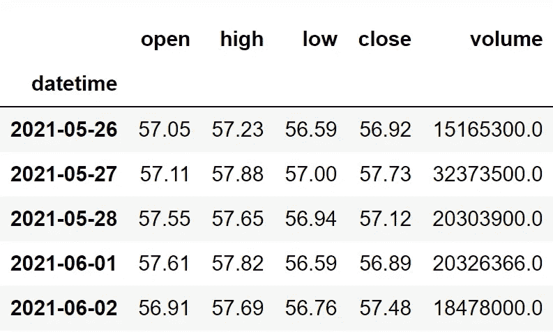

# Python 中 Keltner 通道的算法交易

> 原文：<https://medium.com/codex/algorithmic-trading-with-the-keltner-channel-in-python-9c272051d43d?source=collection_archive---------2----------------------->

## 对所有交易者来说，这是一个必须知道的指标


在 [Unsplash](https://unsplash.com?utm_source=medium&utm_medium=referral) 上由 [Max Duzij](https://unsplash.com/@max_duz?utm_source=medium&utm_medium=referral) 拍照

# 介绍

当你在研究技术指标时，你肯定会遇到一个由精选指标组成的列表，这些指标被广泛认为是“必须知道”的指标，你需要在涉足现实市场之前学会这些指标。鉴于其在市场中的表现，我们今天要探讨的指标将添加到这个列表中。不是别人，正是凯尔特纳频道(KC)。

在本文中，我们将首先讨论凯尔特纳通道是什么，以及指标背后的数学原理。然后，我们将进入编程部分，使用 Python 从头构建指标，基于指标构建简单的交易策略，在英特尔股票上对策略进行回溯测试，最后，将策略回报与 SPY ETF(一种专门用于跟踪标准普尔 500 市场指数走势的 ETF)的回报进行比较。

在继续之前，如果你想在没有任何代码的情况下回溯测试你的交易策略，有一个解决方案。这是[的后验区](https://www.backtestzone.com/)。这是一个平台，可以免费对不同类型的可交易资产的任意数量的交易策略进行回溯测试，无需编码。点击这里的链接，你可以马上使用这个工具:[https://www.backtestzone.com/](https://www.backtestzone.com/)

# 平均真实距离

有必要知道什么是平均真实范围(ATR ),因为它涉及到凯尔特纳通道的计算。

由怀尔德怀尔斯(最受欢迎的指标 RSI 的创始人)创立，平均真实范围是一个技术指标，衡量资产平均移动多少。这是一个滞后指标，意味着它考虑了资产的历史数据来衡量当前价值，但它不能预测未来的数据点。在使用 ATR 时，这不被认为是一个缺点，因为它是更准确地跟踪市场波动的指标之一。ATR 是一个滞后指标，也是一个非方向性指标，意味着 ATR 的运动与市场的实际运动成反比。要计算 ATR，必须遵循两个步骤:

*   **计算真实范围(TR):** 资产的真实范围通过取三个价格差的最大值来计算，这三个价格差是:市场高点减去市场低点，市场高点减去先前的市场收盘，先前的市场收盘减去市场低点。它可以表示如下:

```
**MAX** [ {**HIGH - LOW**}, {**HIGH - P.CLOSE**}, {**P.CLOSE - LOW**} ]where,
MAX = Maximum values
HIGH = Market High
LOW = Market Low
P.CLOSE = Previous market close
```

*   **计算 ATR:** 平均真实范围的计算很简单。我们只需对指定数量的周期取之前计算的真实范围值的平滑平均值。平滑平均线不是普通的 SMA 或 EMA，而是怀尔德·怀尔斯自己创造的一种平滑平均线，它只不过是从指定时间段的真实范围的指数移动平均线中减去 1，然后将差值乘以 2。特定周期数的 ATR 计算可表示如下:

```
**ATR N** = **EMA N** [ **TR** ] **- 1** * **2**where,
ATR N = Average True Range of 'N' period
SMA N = Simple Moving Average of 'N' period
TR = True Range
```

当使用 ATR 作为交易指标时，交易者必须确保他们比以往更加谨慎，因为该指标非常滞后。现在我们已经了解了平均真实范围是什么。现在让我们深入了解这篇文章的主要概念，Keltner 渠道。

# 凯尔特纳海峡

由切斯特·凯尔特纳创建的凯尔特纳通道是一个技术指标，交易者经常用它来识别市场的波动和方向。凯尔特纳通道由三部分组成:上波段、下波段和中线。现在，让我们讨论一下每个分量是如何计算的。

在开始计算凯尔特纳海峡之前，有必要了解计算中涉及的三个重要输入。首先是 ATR 回顾期，它只是计算 ATR 时考虑的周期数。其次，凯尔特纳通道回望期。该输入或多或少类似于第一个输入，但在这里，我们决定了在计算 Keltner 通道本身时要考虑的周期数。最后的输入是乘数，它是一个确定要与 ATR 相乘的值。作为输入的典型值为:10 为 ATR 回望周期，20 为 Keltner 通道回望周期，2 为乘数。记住这些输入，让我们计算一下 Keltner 通道组件的读数。

计算 Keltner 通道分量的第一步是确定 ATR 值，以 10 作为回望周期，可以按照前面讨论的公式计算。

下一步是计算凯尔特纳通道的中线。这个分量不过是股票收盘价的 20 天指数移动平均线。该计算可以表示如下:

```
**MIDDLE LINE 20** = **EMA 20** [ **C.STOCK** ]where,
EMA 20 = 20-day Exponential Moving Average 
C.STOCK = Closing price of the stock
```

最后一步是计算上下波段。让我们从上层乐队开始。其计算方法是，首先将股票收盘价的 20 天指数移动平均值乘以乘数(2)，然后乘以 10 天 ATR。较低波段的计算和较高波段几乎相似，但是我们不是相加，而是用乘数减去 20 天均线。上限和下限的计算可表示如下:

```
**UPPER BAND 20** = **EMA 20** [ **C.STOCK** ] + **MULTIPLIER** * **ATR 10
LOWER BAND 20** = **EMA 20** [ **C.STOCK** ] - **MULTIPLIER** * **ATR 10**where,
EMA 20 = 20-day Exponential Moving Average 
C.STOCK = Closing price of the stock
MULTIPLIER = 2
ATR 10 = 10-day Average True Range
```

这就是计算 Keltner 通道组件的整个过程。现在，让我们来分析一张凯尔特纳通道的图表，以加深对该指标的理解。


作者图片

上图是英特尔的 20 天香奈儿凯尔特纳的图形表示。我们可以注意到，在收盘价线的两边绘制了两条波段，它们只是上下波段，两条波段之间的灰色线条是中线或 20 日均线。凯尔特纳通道有很多用途，但最常用的是识别市场波动和方向。

市场的波动性可以由上下波段之间的空间决定。如果波段之间的空间较宽，那么市场被认为是不稳定的或显示更大的价格波动。另一方面，如果波段之间的空间很窄，则认为市场处于稳定或盘整状态。另一个流行的用法是识别市场方向。市场方向可以通过跟随中线以及上下波段的方向来确定。

当看到凯尔特纳通道的图表时，它可能类似于布林线。这两个指标之间的唯一区别是它们各自的计算方式。布林线使用标准差来计算，而凯尔特纳通道使用 ATR 来计算读数。现在，我们来谈谈本文中我们将要实施的交易策略。

**关于我们的交易策略:**我们将实施最流行的凯尔特纳渠道交易策略，即突破策略。由于凯尔特纳通道容易暴露错误信号，我们将调整传统的突破策略。我们调整的策略将揭示一个买入信号，当收盘价线从上方穿越到下方时，当前收盘价低于股票的下一个收盘价。类似地，当收盘价线从上带下方穿越到上带上方，并且当前收盘价高于股票的下一个收盘价时，就会显示卖出信号。我们的交易策略可以表述如下:

```
IF **C.CLOSE** < **C.KCLOWER** AND **C.CLOSE** < **N.CLOSE** ==> **BUY SIGNAL**
IF **C.CLOSE** > **C.KCUPPER** AND **C.CLOSE** > **N.CLOSE** ==> **SELL SIGNAL**
```

基于 Keltner 渠道指标，还可以实施许多其他策略，但为了便于理解，我们将采用突破策略。这就结束了我们关于凯特纳通道指标的理论部分。现在，让我们转到编程部分，我们首先要从头开始构建指标，构建我们刚刚讨论过的突破策略，然后将我们的策略的性能与 Python 中 SPY ETF 的回报进行比较。来做点编码吧！在继续之前，关于免责声明的一个注意事项:本文的唯一目的是教育人们，必须被视为一个信息，而不是投资建议等。

# 用 Python 实现

编码部分分为以下几个步骤:

```
**1\. Importing Packages
2\. Extracting Stock Data from Twelve Data
3\. Keltner Channel Calculation
4\. Creating the Breakout Trading Strategy
5\. Plotting the Trading Lists
6\. Creating our Position
7\. Backtesting
8\. SPY ETF Comparison**
```

我们将按照上面列表中提到的顺序，系好安全带，跟随每一个即将到来的编码部分。

# 步骤 1:导入包

将所需的包导入 python 环境是一个不可跳过的步骤。主要的包是处理数据的 Pandas，处理数组和复杂函数的 NumPy，用于绘图的 Matplotlib，以及进行 API 调用的请求。二级包是数学函数的 Math 和字体定制的 Termcolor(可选)。

**Python 实现:**

```
**# IMPORTING PACKAGES** 
import requests
import numpy as np
import matplotlib.pyplot as plt
import pandas as pd
from termcolor import colored as cl
from math import floor

plt.rcParams['figure.figsize'] = (20,10)
plt.style.use('fivethirtyeight')
```

现在我们已经将所有需要的包导入到 python 中。让我们用十二数据的 API 端点来拉一下英特尔的历史数据。

# 步骤 2:从 12 个数据中提取数据

在这一步，我们将使用 twelvedata.com[提供的 API 端点提取英特尔的历史股票数据。在此之前，关于](https://twelvedata.com/)[twelvedata.com](https://twelvedata.com/)的一个说明:十二数据是领先的市场数据提供商之一，拥有大量针对所有类型市场数据的 API 端点。它非常容易与十二数据提供的 API 进行交互，并且拥有有史以来最好的文档。此外，确保您在[twelvedata.com](https://twelvedata.com/)上有一个帐户，只有这样，您才能访问您的 API 密钥(使用 API 提取数据的重要元素)。

**Python 实现:**

```
**# EXTRACTING STOCK DATA** 
def get_historical_data(symbol, start_date):
    api_key = 'YOUR API KEY'
    api_url = f'https://api.twelvedata.com/time_series?symbol={symbol}&interval=1day&outputsize=5000&apikey={api_key}'
    raw_df = requests.get(api_url).json()
    df = pd.DataFrame(raw_df['values']).iloc[::-1].set_index('datetime').astype(float)
    df = df[df.index >= start_date]
    df.index = pd.to_datetime(df.index)
    return df

intc = get_historical_data('INTC', '2020-01-01')
intc.tail()
```

**输出:**



作者图片

**代码解释:**我们做的第一件事是定义一个名为‘get _ historical _ data’的函数，它以股票的符号(‘symbol’)和历史数据的起始日期(‘start _ date’)作为参数。在函数内部，我们定义了 API 键和 URL，并将它们存储到各自的变量中。接下来，我们使用“get”函数提取 JSON 格式的历史数据，并将其存储到“raw_df”变量中。在对原始 JSON 数据进行清理和格式化之后，我们将以干净的 Pandas 数据帧的形式返回它。最后，我们调用创建的函数来提取英特尔从 2020 年开始的历史数据，并将其存储到‘intc’变量中。

## 步骤 3: Keltner 渠道计算

在这一步中，我们将按照之前讨论的方法来计算 Keltner 渠道指标的组成部分。

**Python 实现:**

```
**# KELTNER CHANNEL CALCULATION** 
def get_kc(high, low, close, kc_lookback, multiplier, atr_lookback):
    tr1 = pd.DataFrame(high - low)
    tr2 = pd.DataFrame(abs(high - close.shift()))
    tr3 = pd.DataFrame(abs(low - close.shift()))
    frames = [tr1, tr2, tr3]
    tr = pd.concat(frames, axis = 1, join = 'inner').max(axis = 1)
    atr = tr.ewm(alpha = 1/atr_lookback).mean()

    kc_middle = close.ewm(kc_lookback).mean()
    kc_upper = close.ewm(kc_lookback).mean() + multiplier * atr
    kc_lower = close.ewm(kc_lookback).mean() - multiplier * atr

    return kc_middle, kc_upper, kc_lower

intc = intc.iloc[:,:4]
intc['kc_middle'], intc['kc_upper'], intc['kc_lower'] = get_kc(intc['high'], intc['low'], intc['close'], 20, 2, 10)
intc.tail()
```

**输出:**


作者图片

**代码解释:**我们首先定义一个名为“get_kc”的函数，它将股票的高(“高”)、低(“低”)和收盘价数据(“收盘”)、凯尔特纳通道的回望期(“kc _ 回望”)、乘数值(“乘数”)和 ATR 的回望期(“atr _ 回望”)作为参数。函数内部的代码可以分为两个部分:ATR 计算和 Keltner 信道计算。

ATR 计算:为了确定平均真实范围的读数，我们首先计算三个差值，并将它们存储到各自的变量中。然后，我们使用“concat”函数将所有三个差异合并到一个数据帧中，并从三个总体差异中取出最大值，以确定真实范围。然后，使用“ewm”和“mean”函数，我们对特定数量的周期的真实范围进行定制移动平均，以获得 ATR 值。

凯尔特纳通道计算:利用之前计算的 ATR 值，我们首先计算凯尔特纳通道的中线，取特定周期数的 ATR 均线。然后是上下波段的计算。我们将 ATR 值代入之前讨论过的上限和下限公式，以获得每个值的读数。最后，我们返回并调用创建的函数来获取英特尔的 Keltner 渠道值。

## 步骤 4:创建交易策略

在这一步，我们将使用 python 实现讨论过的 Keltner 通道指标突破交易策略。

**Python 实现:**

```
**# KELTNER CHANNEL STRATEGY** 
def implement_kc_strategy(prices, kc_upper, kc_lower):
    buy_price = []
    sell_price = []
    kc_signal = []
    signal = 0

    for i in range(len(prices)):
        if prices[i] < kc_lower[i] and prices[i+1] > prices[i]:
            if signal != 1:
                buy_price.append(prices[i])
                sell_price.append(np.nan)
                signal = 1
                kc_signal.append(signal)
            else:
                buy_price.append(np.nan)
                sell_price.append(np.nan)
                kc_signal.append(0)
        elif prices[i] > kc_upper[i] and prices[i+1] < prices[i]:
            if signal != -1:
                buy_price.append(np.nan)
                sell_price.append(prices[i])
                signal = -1
                kc_signal.append(signal)
            else:
                buy_price.append(np.nan)
                sell_price.append(np.nan)
                kc_signal.append(0)
        else:
            buy_price.append(np.nan)
            sell_price.append(np.nan)
            kc_signal.append(0)

    return buy_price, sell_price, kc_signal

buy_price, sell_price, kc_signal = implement_kc_strategy(intc['close'], intc['kc_upper'], intc['kc_lower'])
```

**代码解释:**首先，我们定义一个名为“implement_kc_strategy”的函数，该函数将股票价格(“prices”)和 Keltner 通道指标的组成部分(“kc_upper”和“kc_lower”)作为参数。

在该函数中，我们创建了三个空列表(buy_price、sell_price 和 kc_signal ),在创建交易策略时，这些值将被追加到这些列表中。

之后，我们通过 for 循环实施交易策略。在 for 循环内部，我们传递某些条件，如果条件得到满足，相应的值将被追加到空列表中。如果购买股票的条件得到满足，买入价将被追加到“buy_price”列表中，信号值将被追加为 1，表示购买股票。类似地，如果卖出股票的条件得到满足，卖价将被追加到“sell_price”列表中，信号值将被追加为-1，表示卖出股票。

最后，我们返回附加了值的列表。然后，我们调用创建的函数并将值存储到各自的变量中。除非我们画出这些值，否则这个列表没有任何意义。所以，让我们画出创建的交易列表的值。

## 第五步:绘制交易信号

在这一步，我们将绘制已创建的交易列表，以使它们有意义。

**Python 实现:**

```
**# TRADING SIGNALS PLOT** 
plt.plot(intc['close'], linewidth = 2, label = 'INTC')
plt.plot(intc['kc_upper'], linewidth = 2, color = 'orange', linestyle = '--', label = 'KC UPPER 20')
plt.plot(intc['kc_middle'], linewidth = 1.5, color = 'grey', label = 'KC MIDDLE 20')
plt.plot(intc['kc_lower'], linewidth = 2, color = 'orange', linestyle = '--', label = 'KC LOWER 20')
plt.plot(intc.index, buy_price, marker = '^', color = 'green', markersize = 15, linewidth = 0, label = 'BUY SIGNAL')
plt.plot(intc.index, sell_price, marker = 'v', color= 'r', markersize = 15, linewidth = 0, label = 'SELL SIGNAL')
plt.legend(loc = 'lower right')
plt.title('INTC KELTNER CHANNEL 20 TRADING SIGNALS')
plt.show()
```

**输出:**


作者图片

**代码解释:**我们正在绘制凯尔特纳通道指标的读数，以及突破交易策略产生的买入和卖出信号。我们可以观察到，每当收盘价线从上方到下方的波段线，当前收盘价低于下一个收盘价，绿色的买入信号在图表中绘制。类似地，当收盘价线从上轨下方穿越到上轨上方，并且当前收盘价高于下一个收盘价时，图表中会显示红色的卖出信号。

## 步骤 6:创建我们的职位

在这一步中，我们将创建一个列表，如果我们持有股票，该列表将指示 1；如果我们不拥有或持有股票，该列表将指示 0。

**Python 实现:**

```
**# STOCK POSITION** 
position = []
for i in range(len(kc_signal)):
    if kc_signal[i] > 1:
        position.append(0)
    else:
        position.append(1)

for i in range(len(intc['close'])):
    if kc_signal[i] == 1:
        position[i] = 1
    elif kc_signal[i] == -1:
        position[i] = 0
    else:
        position[i] = position[i-1]

close_price = intc['close']
kc_upper = intc['kc_upper']
kc_lower = intc['kc_lower']
kc_signal = pd.DataFrame(kc_signal).rename(columns = {0:'kc_signal'}).set_index(intc.index)
position = pd.DataFrame(position).rename(columns = {0:'kc_position'}).set_index(intc.index)

frames = [close_price, kc_upper, kc_lower, kc_signal, position]
strategy = pd.concat(frames, join = 'inner', axis = 1)

strategy
```

**输出:**


作者图片

**代码解释:**首先，我们创建一个名为‘position’的空列表。我们传递两个 for 循环，一个是为“位置”列表生成值，以匹配“信号”列表的长度。另一个 for 循环是我们用来生成实际位置值的循环。在第二个 for 循环中，我们对“signal”列表的值进行迭代，而“position”列表的值被附加到满足哪个条件上。如果我们持有股票，头寸的价值仍为 1；如果我们卖出或不持有股票，头寸的价值仍为 0。最后，我们正在进行一些数据操作，将所有创建的列表合并到一个数据帧中。

从显示的输出中，我们可以看到，在第一行中，我们在股票中的位置仍然是 1(因为在 Keltner 通道指标信号中没有任何变化)，但是当 Keltner 通道指标交易信号代表卖出信号(-1)时，我们的位置突然变成-1。我们的头寸将保持为 0，直到交易信号发生一些变化。现在是时候实现一些回溯测试过程了！

## 步骤 7:回溯测试

在继续之前，有必要知道什么是回溯测试。回溯测试是查看我们的交易策略在给定股票数据上表现如何的过程。在我们的案例中，我们将对英特尔股票数据的 Keltner 渠道指标交易策略实施回溯测试流程。

**Python 实现:**

```
**# BACKTESTING** 
intc_ret = pd.DataFrame(np.diff(intc['close'])).rename(columns = {0:'returns'})
kc_strategy_ret = []

for i in range(len(intc_ret)):
    returns = intc_ret['returns'][i]*strategy['kc_position'][i]
    kc_strategy_ret.append(returns)

kc_strategy_ret_df = pd.DataFrame(kc_strategy_ret).rename(columns = {0:'kc_returns'})
investment_value = 100000
number_of_stocks = floor(investment_value/intc['close'][0])
kc_investment_ret = []

for i in range(len(kc_strategy_ret_df['kc_returns'])):
    returns = number_of_stocks*kc_strategy_ret_df['kc_returns'][i]
    kc_investment_ret.append(returns)

kc_investment_ret_df = pd.DataFrame(kc_investment_ret).rename(columns = {0:'investment_returns'})
total_investment_ret = round(sum(kc_investment_ret_df['investment_returns']), 2)
profit_percentage = floor((total_investment_ret/investment_value)*100)
print(cl('Profit gained from the KC strategy by investing $100k in INTC : {}'.format(total_investment_ret), attrs = ['bold']))
print(cl('Profit percentage of the KC strategy : {}%'.format(profit_percentage), attrs = ['bold']))
```

**输出:**

```
**Profit gained from the KC strategy by investing $100k in INTC : 47786.65**
**Profit percentage of the KC strategy : 47%**
```

**代码解释:**首先，我们使用 NumPy 包提供的‘diff’函数计算英特尔股票的回报，并将其作为数据帧存储到‘intc _ ret’变量中。接下来，我们将传递一个 for 循环来迭代' intc_ret '变量的值，以计算我们从 Keltner 通道指标交易策略中获得的回报，这些回报值将被追加到' kc_strategy_ret '列表中。接下来，我们将“kc_strategy_ret”列表转换为数据帧，并将其存储到“kc_strategy_ret_df”变量中。

接下来是回溯测试过程。我们将通过投资 10 万美元到我们的交易策略中来回测我们的策略。首先，我们将投资金额存储到“投资值”变量中。之后，我们正在使用投资金额计算我们可以购买的英特尔股票数量。您可以注意到，我使用了 Math 软件包提供的“下限”函数，因为当投资金额除以英特尔股票的收盘价时，它会输出一个十进制数。股票数量应该是整数，而不是小数。使用“底数”函数，我们可以去掉小数。请记住,“floor”函数比“round”函数要复杂得多。然后，我们传递一个 for 循环来查找投资回报，后面是一些数据操作任务。

最后，我们打印了我们通过投资 10 万到我们的交易策略中所得到的总回报，并且显示我们在一年中大约获得了 47000 美元的利润。那还不错！现在，让我们将我们的回报与 SPY ETF(一种旨在跟踪标准普尔 500 股票市场指数的 ETF)的回报进行比较。

## 第八步:间谍 ETF 对比

这一步是可选的，但强烈推荐，因为我们可以了解我们的交易策略相对于基准(间谍 ETF)的表现如何。在这一步中，我们将使用我们创建的“get_historical_data”函数提取 SPY ETF 的数据，并将我们从 SPY ETF 获得的回报与我们在英特尔上的 Keltner 渠道突破交易策略回报进行比较。

你可能已经注意到，在我所有的算法交易文章中，我没有将策略结果与标准普尔 500 市场指数本身进行比较，而是与 SPY ETF 进行比较，这是因为大多数股票数据提供商(如 12 Data)不提供标准普尔 500 指数数据。所以，我别无选择，只能选择间谍 ETF。如果你有幸得到标准普尔 500 市场指数数据，建议用它来做比较，而不是任何 ETF。

**Python 实现:**

```
**# SPY ETF COMPARISON** 
def get_benchmark(start_date, investment_value):
    spy = get_historical_data('SPY', start_date)['close']
    benchmark = pd.DataFrame(np.diff(spy)).rename(columns = {0:'benchmark_returns'})

    investment_value = investment_value
    number_of_stocks = floor(investment_value/spy[-1])
    benchmark_investment_ret = []

    for i in range(len(benchmark['benchmark_returns'])):
        returns = number_of_stocks*benchmark['benchmark_returns'][i]
        benchmark_investment_ret.append(returns)

    benchmark_investment_ret_df = pd.DataFrame(benchmark_investment_ret).rename(columns = {0:'investment_returns'})
    return benchmark_investment_ret_df

benchmark = get_benchmark('2020-01-01', 100000)
investment_value = 100000
total_benchmark_investment_ret = round(sum(benchmark['investment_returns']), 2)
benchmark_profit_percentage = floor((total_benchmark_investment_ret/investment_value)*100)
print(cl('Benchmark profit by investing $100k : {}'.format(total_benchmark_investment_ret), attrs = ['bold']))
print(cl('Benchmark Profit percentage : {}%'.format(benchmark_profit_percentage), attrs = ['bold']))
print(cl('KC Strategy profit is {}% higher than the Benchmark Profit'.format(profit_percentage - benchmark_profit_percentage), attrs = ['bold']))
```

**输出:**

```
**Benchmark profit by investing $100k : 22631.16**
**Benchmark Profit percentage : 22%**
**KC Strategy profit is 25% higher than the Benchmark Profit**
```

**代码解释:**此步骤中使用的代码与前一个回溯测试步骤中使用的代码几乎相似，但我们不是投资英特尔，而是通过不实施任何交易策略来投资 SPY ETF。从输出中，我们可以看到，我们的凯尔特纳通道突破交易策略跑赢了间谍 ETF 25%。太好了！

# 最后的想法！

经过一个长期的理论和编码的过程，我们已经成功地学习了凯尔特纳通道指标是什么，指标背后的数学，最后，如何从零开始构建指标和用 Python 构建突破交易策略。我们也确实取得了一些不错的结果，事实上，除了超过间谍 ETF 的回报，我们还通过突破策略超过了英特尔股票的实际回报。

我经常在我的文章中谈论策略调整或优化，今天，我们真的通过调整和对传统突破策略进行一些改变来实现它。因此，我们能够超越实际市场本身的回报。这只是一个小例子，说明了如何调整策略以及结果将如何受到相应的影响，但是，还有更多内容需要探索。策略优化不仅仅是对长期存在的传统策略进行调整或做出一些改变，而是创造一个最佳的交易环境，这包括您用于交易目的的经纪人、风险管理系统等等。所以强烈建议你看看这些空间，把你的策略提升到一个全新的水平。

话虽如此，你已经到了文章的结尾。如果您忘记了遵循任何编码部分，不要担心。我在最后提供了完整的源代码。希望你能从这篇文章中学到一些新的有用的东西。

## 完整代码:

```
**# IMPORTING PACKAGES** 
import requests
import numpy as np
import matplotlib.pyplot as plt
import pandas as pd
from termcolor import colored as cl
from math import floor

plt.rcParams['figure.figsize'] = (20,10)
plt.style.use('fivethirtyeight')

**# EXTRACTING STOCK DATA** 
def get_historical_data(symbol, start_date):
    api_key = 'YOUR API KEY'
    api_url = f'https://api.twelvedata.com/time_series?symbol={symbol}&interval=1day&outputsize=5000&apikey={api_key}'
    raw_df = requests.get(api_url).json()
    df = pd.DataFrame(raw_df['values']).iloc[::-1].set_index('datetime').astype(float)
    df = df[df.index >= start_date]
    df.index = pd.to_datetime(df.index)
    return df

intc = get_historical_data('INTC', '2020-01-01')
print(intc.tail())

**# KELTNER CHANNEL CALCULATION** 
def get_kc(high, low, close, kc_lookback, multiplier, atr_lookback):
    tr1 = pd.DataFrame(high - low)
    tr2 = pd.DataFrame(abs(high - close.shift()))
    tr3 = pd.DataFrame(abs(low - close.shift()))
    frames = [tr1, tr2, tr3]
    tr = pd.concat(frames, axis = 1, join = 'inner').max(axis = 1)
    atr = tr.ewm(alpha = 1/atr_lookback).mean()

    kc_middle = close.ewm(kc_lookback).mean()
    kc_upper = close.ewm(kc_lookback).mean() + multiplier * atr
    kc_lower = close.ewm(kc_lookback).mean() - multiplier * atr

    return kc_middle, kc_upper, kc_lower

intc = intc.iloc[:,:4]
intc['kc_middle'], intc['kc_upper'], intc['kc_lower'] = get_kc(intc['high'], intc['low'], intc['close'], 20, 2, 10)
print(intc.tail())

**# KELTNER CHANNEL PLOT** 
plt.plot(intc['close'], linewidth = 2, label = 'INTC')
plt.plot(intc['kc_upper'], linewidth = 2, color = 'orange', linestyle = '--', label = 'KC UPPER 20')
plt.plot(intc['kc_middle'], linewidth = 1.5, color = 'grey', label = 'KC MIDDLE 20')
plt.plot(intc['kc_lower'], linewidth = 2, color = 'orange', linestyle = '--', label = 'KC LOWER 20')
plt.legend(loc = 'lower right', fontsize = 15)
plt.title('INTC KELTNER CHANNEL 20')
plt.show()

**# KELTNER CHANNEL STRATEGY** 
def implement_kc_strategy(prices, kc_upper, kc_lower):
    buy_price = []
    sell_price = []
    kc_signal = []
    signal = 0

    for i in range(len(prices)):
        if prices[i] < kc_lower[i] and prices[i+1] > prices[i]:
            if signal != 1:
                buy_price.append(prices[i])
                sell_price.append(np.nan)
                signal = 1
                kc_signal.append(signal)
            else:
                buy_price.append(np.nan)
                sell_price.append(np.nan)
                kc_signal.append(0)
        elif prices[i] > kc_upper[i] and prices[i+1] < prices[i]:
            if signal != -1:
                buy_price.append(np.nan)
                sell_price.append(prices[i])
                signal = -1
                kc_signal.append(signal)
            else:
                buy_price.append(np.nan)
                sell_price.append(np.nan)
                kc_signal.append(0)
        else:
            buy_price.append(np.nan)
            sell_price.append(np.nan)
            kc_signal.append(0)

    return buy_price, sell_price, kc_signal

buy_price, sell_price, kc_signal = implement_kc_strategy(intc['close'], intc['kc_upper'], intc['kc_lower'])

**# TRADING SIGNALS PLOT** 
plt.plot(intc['close'], linewidth = 2, label = 'INTC')
plt.plot(intc['kc_upper'], linewidth = 2, color = 'orange', linestyle = '--', label = 'KC UPPER 20')
plt.plot(intc['kc_middle'], linewidth = 1.5, color = 'grey', label = 'KC MIDDLE 20')
plt.plot(intc['kc_lower'], linewidth = 2, color = 'orange', linestyle = '--', label = 'KC LOWER 20')
plt.plot(intc.index, buy_price, marker = '^', color = 'green', markersize = 15, linewidth = 0, label = 'BUY SIGNAL')
plt.plot(intc.index, sell_price, marker = 'v', color= 'r', markersize = 15, linewidth = 0, label = 'SELL SIGNAL')
plt.legend(loc = 'lower right')
plt.title('INTC KELTNER CHANNEL 20 TRADING SIGNALS')
plt.show()

**# STOCK POSITION** 
position = []
for i in range(len(kc_signal)):
    if kc_signal[i] > 1:
        position.append(0)
    else:
        position.append(1)

for i in range(len(intc['close'])):
    if kc_signal[i] == 1:
        position[i] = 1
    elif kc_signal[i] == -1:
        position[i] = 0
    else:
        position[i] = position[i-1]

close_price = intc['close']
kc_upper = intc['kc_upper']
kc_lower = intc['kc_lower']
kc_signal = pd.DataFrame(kc_signal).rename(columns = {0:'kc_signal'}).set_index(intc.index)
position = pd.DataFrame(position).rename(columns = {0:'kc_position'}).set_index(intc.index)

frames = [close_price, kc_upper, kc_lower, kc_signal, position]
strategy = pd.concat(frames, join = 'inner', axis = 1)

print(strategy)
print(strategy[14:19])

**# BACKTESTING** 
intc_ret = pd.DataFrame(np.diff(intc['close'])).rename(columns = {0:'returns'})
kc_strategy_ret = []

for i in range(len(intc_ret)):
    returns = intc_ret['returns'][i]*strategy['kc_position'][i]
    kc_strategy_ret.append(returns)

kc_strategy_ret_df = pd.DataFrame(kc_strategy_ret).rename(columns = {0:'kc_returns'})
investment_value = 100000
number_of_stocks = floor(investment_value/intc['close'][0])
kc_investment_ret = []

for i in range(len(kc_strategy_ret_df['kc_returns'])):
    returns = number_of_stocks*kc_strategy_ret_df['kc_returns'][i]
    kc_investment_ret.append(returns)

kc_investment_ret_df = pd.DataFrame(kc_investment_ret).rename(columns = {0:'investment_returns'})
total_investment_ret = round(sum(kc_investment_ret_df['investment_returns']), 2)
profit_percentage = floor((total_investment_ret/investment_value)*100)
print(cl('Profit gained from the KC strategy by investing $100k in INTC : {}'.format(total_investment_ret), attrs = ['bold']))
print(cl('Profit percentage of the KC strategy : {}%'.format(profit_percentage), attrs = ['bold']))

**# SPY ETF COMPARISON** 
def get_benchmark(start_date, investment_value):
    spy = get_historical_data('SPY', start_date)['close']
    benchmark = pd.DataFrame(np.diff(spy)).rename(columns = {0:'benchmark_returns'})

    investment_value = investment_value
    number_of_stocks = floor(investment_value/spy[-1])
    benchmark_investment_ret = []

    for i in range(len(benchmark['benchmark_returns'])):
        returns = number_of_stocks*benchmark['benchmark_returns'][i]
        benchmark_investment_ret.append(returns)

    benchmark_investment_ret_df = pd.DataFrame(benchmark_investment_ret).rename(columns = {0:'investment_returns'})
    return benchmark_investment_ret_df

benchmark = get_benchmark('2020-01-01', 100000)
investment_value = 100000
total_benchmark_investment_ret = round(sum(benchmark['investment_returns']), 2)
benchmark_profit_percentage = floor((total_benchmark_investment_ret/investment_value)*100)
print(cl('Benchmark profit by investing $100k : {}'.format(total_benchmark_investment_ret), attrs = ['bold']))
print(cl('Benchmark Profit percentage : {}%'.format(benchmark_profit_percentage), attrs = ['bold']))
print(cl('KC Strategy profit is {}% higher than the Benchmark Profit'.format(profit_percentage - benchmark_profit_percentage), attrs = ['bold']))
```