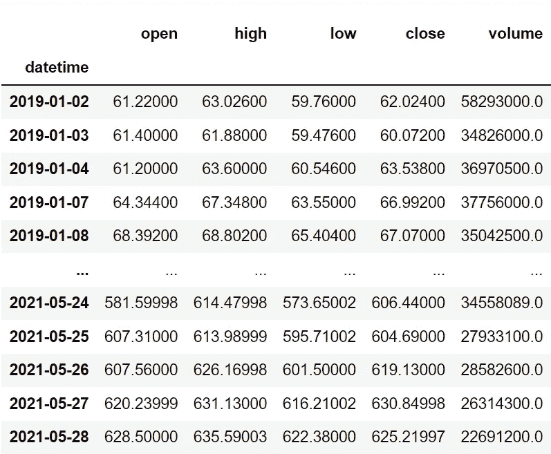
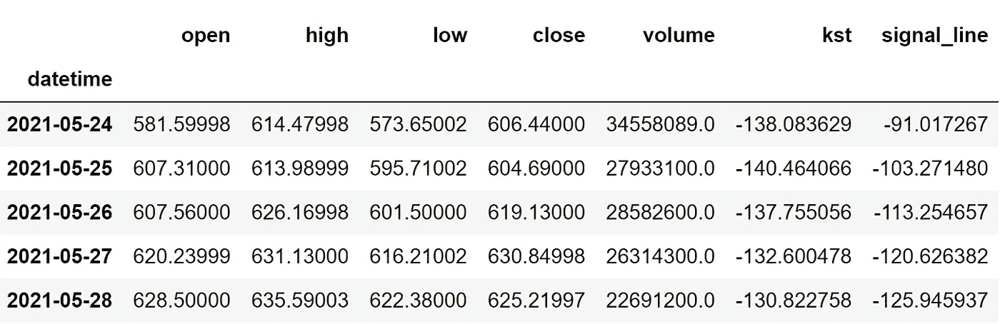
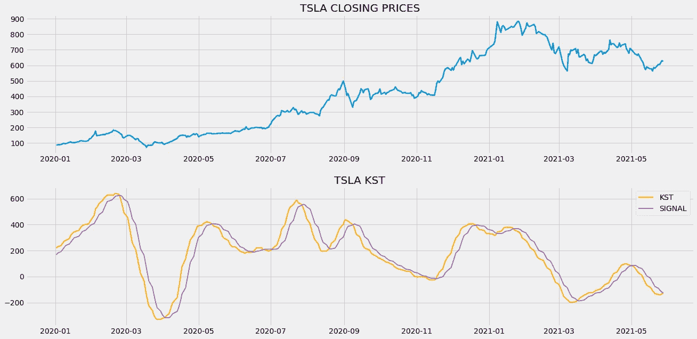
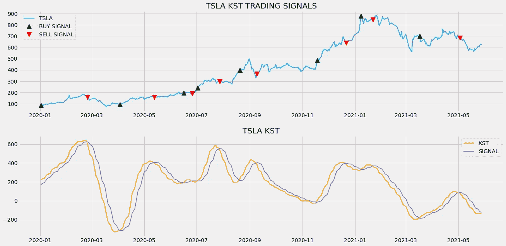
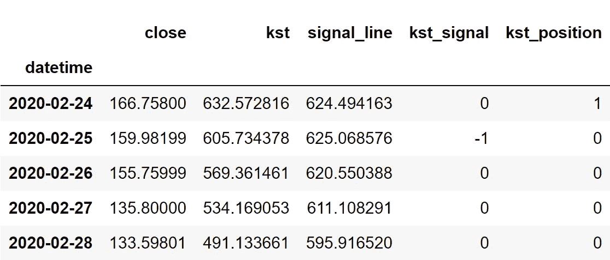

# 使用 Python 中的确定性指标进行算法交易

> 原文：<https://medium.com/codex/algorithmic-trading-with-the-know-sure-thing-indicator-in-python-68860a38a879?source=collection_archive---------3----------------------->

## 关于在 python 中使用和实现 KST 指示器的完整指南


法比奥·巴拉西纳在 [Unsplash](https://unsplash.com?utm_source=medium&utm_medium=referral) 上拍摄的照片

当我用最流行的动量振荡指标之一——移动平均线收敛/发散(MACD)对交易策略进行回溯测试时，结果非常惊人。今天，我发现了一个 MACD 指标的克隆，它的表现甚至更有效率。这正是众所周知的事情，简称为 KST 指标。

在这篇文章中，我们将首先建立一些关于 KST 指标的基本直觉，以及计算该指标的方法。之后，我们将进入编程部分，使用 Python 从头构建指标，基于该指标构建简单的交易策略，在 Tesla 股票上回测该策略，并将其性能与 SPY ETF(一种旨在跟踪标准普尔 500 市场指数走势的 ETF)进行比较。话虽如此，我们还是深入文章吧！

在继续之前，如果你想在没有任何代码的情况下回溯测试你的交易策略，有一个解决方案。这是[的后验区](https://www.backtestzone.com/)。这是一个平台，可以免费对不同类型的可交易资产的任意数量的交易策略进行回溯测试，无需编码。点击这里的链接，你可以马上使用这个工具:[https://www.backtestzone.com/](https://www.backtestzone.com/)

# 变化率

在继续探讨 KST 指标之前，有必要知道变化率指标能提供什么，因为已知事物指标是基于 ROC 的。变化率指标是一个动量指标，交易者使用它作为一种工具来确定价格相对于当前收盘价和指定时间段之前的价格的百分比变化。与 RSI 和 CCI 等其他动量指标不同，变化率指标是一个无界的振荡器，其值不会在一定的范围内波动。

为了计算 ROC 的读数，我们必须首先确定“n”值，这个值就是当前收盘价与多少个周期之前的值进行比较。“n”的确定因交易者而异，但传统的设置是 9(广泛用于短期交易)。将 9 作为“n”值，ROC 指示器的读数计算如下:

首先，从当前收盘价中减去 9 期之前的收盘价。这个差额然后除以 9 期前的收盘价，再乘以 100。该计算可以用数学方法表示如下:

```
**ROC 9** = [ ( **C.CLOSE** - **PREV9.CLOSE** ) / **PREV9.CLOSE** ] * **100**where,
C.CLOSE = Current Closing Price
PREV9.CLOSE = Closing Price of 9 Periods ago
```

通常，ROC 是在股票收盘价相对于零线的下方绘制的。如果观察到 ROC 指标的读数高于零线，则认为市场显示出强劲的上升势头，同样，如果数值低于零线，则认为市场显示出强劲的下降势头。这是使用 ROC 指标的一种方式，其他用途包括生成潜在的买入和卖出信号，识别市场状态(超买或超卖)，以及检测背离。

ROC 和它的计算就是这么回事。现在，我们准备开始探索这篇文章的主要思想，即“确信的事情”指标。

# 知道肯定的事(KST)

确信无疑指标是一个无界动量振荡器，被交易者广泛用于理解 ROC 指标的读数。KST 指标基于平滑 ROC 的四个不同时间框架，并将收集的数据合并到一个振荡器中。已知事物指示器由两部分组成:

**KST 线:**第一个组成部分是 KST 线本身。为了计算 KST 线的读数，我们必须首先确定四个 roc，分别以 10、15、20、30 作为“n”值。然后分别以 10、10、10、15 作为回顾期，使用简单的移动平均来平滑每个 ROC。这种平滑的 ROC 称为 ROCSMA。在获得四个不同时间段的 ROCSMA 后，我们必须将第一个 ROCSMA 乘以 1，第二个 ROCSMA 乘以 2，第三个 ROCSMA 乘以 3，第四个乘以 4。最后，将这四个乘积相加。KST 线的计算可以用数学方法表示如下:

```
**KL** = (**ROCSMA1** * **1**) + (**ROCSMA2** * **2**) + (**ROCSMA3** * **3**) + (**ROCSMA4** * **4**)where,
KL = KST Line
ROCSMA1 = ROC 10 smoothed with SMA 10
ROCSMA2 = ROC 15 smoothed with SMA 10
ROCSMA3 = ROC 20 smoothed with SMA 10
ROCSMA4 = ROC 30 smoothed with SMA 15
```

**信号线:**现在，确知事物指示器的第二个组件是信号线组件。这个分量只不过是 KST 线的平滑版本。为了平滑 KST 线的值，以 9 作为回望周期的简单移动平均线被广泛使用。信号线的计算如下所示:

```
**SIGNAL LINE** = **SMA9** ( **KST LINE** )
```

有许多类型的策略是用 KST 指标构建的，比如背离交易策略，零线交叉，等等。一些人认为它也可以作为一种工具来识别超买和超卖水平，但我个人认为它不会像 RSI 等其他指标那样有效，因为 KST 指标是一个无界的振荡器。在今天的文章中，我们将讨论并实施一个叫做交叉策略的基本策略。

交叉策略揭示了一个买入信号，当 KST 线从信号线的下方交叉到上方时。当 KST 线从信号线的上方或下方穿过时，卖出信号就出现了。该策略可以表示如下:

```
IF **P.KST LINE** < **P.SIGNAL LINE** AND **C.KST LINE** > **C.SIGNAL LINE** => **BUY**
IF **P.KST LINE** > **P.SIGNAL LINE** AND **C.KST LINE** < **C.SIGNAL LINE** => **SELL**
```

这就结束了我们对已知事物指示器的理论部分。现在，让我们进入编程部分，我们将使用 python 从头开始构建指标，构建交叉交易策略，对特斯拉股票进行回溯测试，将交叉策略回报与 SPY ETF 的回报进行比较。事不宜迟，我们直接跳到编程部分，做一些编码吧！在继续之前，关于免责声明的一个注意事项:本文的唯一目的是教育人们，必须被视为一个信息，而不是投资建议等。

# 用 Python 实现

编码部分分为以下几个步骤:

```
**1\. Importing Packages
2\. Extracting Stock Data from Twelve Data
3\. ROC Calculation
4\. Know Sure Thing Calculation
5\. Know Sure Thing indicator Plot
6\. Creating the Trading Strategy
7\. Plotting the Trading Lists
8\. Creating our Position
9\. Backtesting
10\. SPY ETF Comparison**
```

我们将按照上面列表中提到的顺序，系好安全带，跟随每一个即将到来的编码部分。

## 步骤 1:导入包

将所需的包导入 python 环境是一个不可跳过的步骤。主要的包是处理数据的 Pandas，处理数组和复杂函数的 NumPy，用于绘图的 Matplotlib，以及进行 API 调用的请求。二级包是数学函数的 Math 和字体定制的 Termcolor(可选)。

**Python 实现:**

```
**# IMPORTING PACKAGES** 
import pandas as pd
import numpy as np
import requests
import matplotlib.pyplot as plt
from math import floor
from termcolor import colored as cl

plt.style.use('fivethirtyeight')
plt.rcParams['figure.figsize'] = (20,10)
```

现在我们已经将所有需要的包导入到 python 中。我们用十二数据的 API 端点来拉特斯拉的历史数据。

## 步骤 2:从 12 个数据中提取数据

在这一步中，我们将使用由 twelvedata.com[提供的 API 端点提取特斯拉的历史股票数据。在此之前，关于](https://twelvedata.com/)[twelvedata.com](https://twelvedata.com/)的一个说明:十二数据是领先的市场数据提供商之一，拥有大量针对所有类型市场数据的 API 端点。它非常容易与十二数据提供的 API 进行交互，并且拥有有史以来最好的文档。此外，确保您在[twelvedata.com](https://twelvedata.com/)上有一个帐户，只有这样，您才能访问您的 API 密钥(使用 API 提取数据的重要元素)。

**Python 实现:**

```
**# EXTRACTING STOCK DATA** 
def get_historical_data(symbol, start_date):
    api_key = 'YOUR API KEY'
    api_url = f'https://api.twelvedata.com/time_series?symbol={symbol}&interval=1day&outputsize=5000&apikey={api_key}'
    raw_df = requests.get(api_url).json()
    df = pd.DataFrame(raw_df['values']).iloc[::-1].set_index('datetime').astype(float)
    df = df[df.index >= start_date]
    df.index = pd.to_datetime(df.index)
    return df

tsla = get_historical_data('TSLA', '2019-01-01')
tsla
```

**输出:**



作者图片

**代码解释:**我们做的第一件事是定义一个名为‘get _ historical _ data’的函数，它以股票的符号(‘symbol’)和历史数据的起始日期(‘start _ date’)作为参数。在函数内部，我们定义了 API 键和 URL，并将它们存储到各自的变量中。接下来，我们使用“get”函数提取 JSON 格式的历史数据，并将其存储到“raw_df”变量中。在对原始 JSON 数据进行清理和格式化之后，我们将以干净的 Pandas 数据帧的形式返回它。最后，我们正在调用创建的函数来提取特斯拉从 2019 年开始的历史数据，并将其存储到“tsla”变量中。

## 步骤 3: ROC 计算

在这一步中，我们将定义一个函数来计算给定系列的变化率指标的值。

**Python 实现:**

```
**# ROC CALCULATION**def get_roc(close, n):
    difference = close.diff(n)
    nprev_values = close.shift(n)
    roc = (difference / nprev_values) * 100
    return roc
```

**代码解释:**我们首先定义一个名为“get_roc”的函数，它将股票的收盘价(“close”)和“n”值(“n”)作为参数。在该函数中，我们首先使用 Pandas 包提供的“diff”函数来获取当前收盘价和指定时间段之前的收盘价之间的差值。在“shift”函数的帮助下，我们考虑了指定时间段之前的收盘价，并将其存储到“nprev_values”变量中。然后，我们将确定的值代入我们之前讨论的 ROC 指标公式，以计算值并最终返回数据。

## 第四步:了解有把握的事情计算

在这一步，我们将按照我们之前讨论的方法和公式来计算已知事物指标的组成部分。

**Python 实现:**

```
**# KST CALCULATION** 
def get_kst(close, sma1, sma2, sma3, sma4, roc1, roc2, roc3, roc4, signal):
    rcma1 = get_roc(close, roc1).rolling(sma1).mean()
    rcma2 = get_roc(close, roc2).rolling(sma2).mean()
    rcma3 = get_roc(close, roc3).rolling(sma3).mean()
    rcma4 = get_roc(close, roc4).rolling(sma4).mean()
    kst = (rcma1 * 1) + (rcma2 * 2) + (rcma3 * 3) + (rcma4 * 4)
    signal = kst.rolling(signal).mean()
    return kst, signal

tsla['kst'], tsla['signal_line'] = get_kst(tsla['close'], 10, 10, 10, 15, 10, 15, 20, 30, 9)
tsla = tsla[tsla.index >= '2020-01-01']
tsla.tail()
```

**输出:**



作者图片

**代码解释:**首先，我们定义一个名为“get_kst”的函数，该函数将股票的收盘价(“close”)、平滑 ROC 值的四个回顾期(“sma1”、“sma2”、“sma3”、“sma4”)、ROC 的四个“n”值(“roc1”、“roc2”、“roc3”、“roc4”)以及信号线的回顾期(“signal”)作为参数。

在函数内部，我们首先使用 Pandas 包提供的‘rolling’函数和我们之前创建的‘get _ roc’函数来计算四个 ROCSMA 值。然后，我们将计算出的 ROCSMAs 代入我们之前讨论过的公式，以确定 KST 线的读数。然后，我们用“滚动”函数平滑 KST 线的值，以获得信号线的值，并将它们存储到“信号”变量中。

最后，我们将返回 KST 指标的计算分量，并调用创建的函数来存储特斯拉的 KST 线和信号线读数。

## 第五步:了解确定的事情指标图

在这一步中，我们将绘制特斯拉 KST 指标值的计算成分，以便更好地理解它们。这一部分的主要目的不是在编码部分，而是观察情节，以获得对已知事物技术指标的坚实理解。

**Python 实现:**

```
**# KST INDICATOR PLOT** 
ax1 = plt.subplot2grid((11,1), (0,0), rowspan = 5, colspan = 1)
ax2 = plt.subplot2grid((11,1), (6,0), rowspan = 5, colspan = 1)
ax1.plot(tsla['close'], linewidth = 2.5)
ax1.set_title('TSLA CLOSING PRICES')
ax2.plot(tsla['kst'], linewidth = 2, label = 'KST', color = 'orange')
ax2.plot(tsla['signal_line'], linewidth = 2, label = 'SIGNAL', color = 'mediumorchid')
ax2.legend()
ax2.set_title('TSLA KST')
plt.show()
```

**输出:**



作者图片

上面的图表分为两个面板:上面的面板是特斯拉的收盘价，下面的面板是确知事物指标的组成部分。可以注意到，两个组件的读数都是不确定的，并且不在某些界限之间有界，因为已知事物指示器是无界振荡器。这就是为什么在图表中没有超买和超卖水平的原因，这个图表在其他动量振荡指标中被广泛绘制。但是，有些人提出，这个指标可以用来确定超买和超卖水平，但不同的股票有所不同。这意味着，不像其他动量振荡指标有默认的超买和超卖水平，有必要分析 KST 成分的运动和读数来确定超买和超卖水平。在我们的例子中，最好是在 100 点发现超买水平，在-100 点发现超卖水平。

KST 指标的一个特殊特征是，除了确定超买和超卖水平或发现背离外，它还可以用作检测区间市场(没有趋势或动力，但在特定的高低价格区间来回移动的市场)的工具。当两个成分来回交叉时，市场被认为是在波动。由于特斯拉的股票显示出巨大的价格波动，这种现象只能观察到很少几次(实际上是两次:一次是在前一年的 6 月和 7 月左右，另一次是在 2021 年初)。

## 步骤 6:创建交易策略

在这一步中，我们将在 python 中实现我们讨论过的 Know Sure Thing 交叉交易策略。

**Python 实现:**

```
**# KST CROSSOVER TRADING STRATEGY** 
def implement_kst_strategy(prices, kst_line, signal_line):
    buy_price = []
    sell_price = []
    kst_signal = []
    signal = 0

    for i in range(len(kst_line)):

        if kst_line[i-1] < signal_line[i-1] and kst_line[i] > signal_line[i]:
            if signal != 1:
                buy_price.append(prices[i])
                sell_price.append(np.nan)
                signal = 1
                kst_signal.append(signal)
            else:
                buy_price.append(np.nan)
                sell_price.append(np.nan)
                kst_signal.append(0)

        elif kst_line[i-1] > signal_line[i-1] and kst_line[i] < signal_line[i]:
            if signal != -1:
                buy_price.append(np.nan)
                sell_price.append(prices[i])
                signal = -1
                kst_signal.append(signal)
            else:
                buy_price.append(np.nan)
                sell_price.append(np.nan)
                kst_signal.append(0)

        else:
            buy_price.append(np.nan)
            sell_price.append(np.nan)
            kst_signal.append(0)

    return buy_price, sell_price, kst_signal

buy_price, sell_price, kst_signal = implement_kst_strategy(tsla['close'], tsla['kst'], tsla['signal_line'])
```

**代码解释:**首先，我们定义一个名为‘implement _ kst _ strategy’的函数，它将股票价格(‘prices’)、kst 线的读数(‘kst _ line’)和信号线的读数(‘Signal _ line’)作为参数。

在该函数中，我们创建了三个空列表(buy_price、sell_price 和 kst_signal ),在创建交易策略时，将在这些列表中追加值。

之后，我们通过 for 循环实施交易策略。在 for 循环内部，我们传递某些条件，如果条件得到满足，相应的值将被追加到空列表中。如果购买股票的条件得到满足，买入价将被追加到“buy_price”列表中，信号值将被追加为 1，表示购买股票。类似地，如果卖出股票的条件得到满足，卖价将被追加到“sell_price”列表中，信号值将被追加为-1，表示卖出股票。

最后，我们返回附加了值的列表。然后，我们调用创建的函数并将值存储到各自的变量中。除非我们画出这些值，否则这个列表没有任何意义。所以，让我们画出创建的交易列表的值。

## 步骤 7:绘制交易信号

在这一步，我们将绘制已创建的交易列表，以使它们有意义。

**Python 实现:**

```
**# TRADING SIGNALS PLOT** 
ax1 = plt.subplot2grid((11,1), (0,0), rowspan = 5, colspan = 1)
ax2 = plt.subplot2grid((11,1), (6,0), rowspan = 5, colspan = 1)
ax1.plot(tsla['close'], linewidth = 2, label = 'TSLA')
ax1.plot(tsla.index, buy_price, marker = '^', markersize = 12, linewidth = 0, color = 'green', label = 'BUY SIGNAL')
ax1.plot(tsla.index, sell_price, marker = 'v', markersize = 12, linewidth = 0, color = 'r', label = 'SELL SIGNAL')
ax1.legend()
ax1.set_title('TSLA KST TRADING SIGNALS')
ax2.plot(tsla['kst'], linewidth = 2, label = 'KST', color = 'orange')
ax2.plot(tsla['signal_line'], linewidth = 2, label = 'SIGNAL', color = 'mediumorchid')
ax2.legend()
ax2.set_title('TSLA KST')
plt.show()
```

**输出:**



作者图片

**代码解释:**我们正在绘制 KST 指标成分的读数，以及交叉交易策略产生的买入和卖出信号。我们可以观察到，每当 KST 线从信号线的下方穿越到上方时，图表中就会出现绿色的买入信号。同样，每当 KST 线从信号线的上方穿越到下方时，图表中就会出现红色的卖出信号。

## 第八步:确立我们的立场

在这一步中，我们将创建一个列表，如果我们持有股票，该列表将指示 1；如果我们不拥有或持有股票，该列表将指示 0。

**Python 实现:**

```
**# STOCK POSITION** 
position = []
for i in range(len(kst_signal)):
    if kst_signal[i] > 1:
        position.append(0)
    else:
        position.append(1)

for i in range(len(tsla['close'])):
    if kst_signal[i] == 1:
        position[i] = 1
    elif kst_signal[i] == -1:
        position[i] = 0
    else:
        position[i] = position[i-1]

close_price = tsla['close']
kst = tsla['kst']
signal_line = tsla['signal_line']
kst_signal = pd.DataFrame(kst_signal).rename(columns = {0:'kst_signal'}).set_index(tsla.index)
position = pd.DataFrame(position).rename(columns = {0:'kst_position'}).set_index(tsla.index)

frames = [close_price, kst, signal_line, kst_signal, position]
strategy = pd.concat(frames, join = 'inner', axis = 1)

strategy
```

**输出:**



作者图片

**代码解释:**首先，我们创建一个名为‘position’的空列表。我们传递两个 for 循环，一个是为“位置”列表生成值，以匹配“信号”列表的长度。另一个 for 循环是我们用来生成实际位置值的循环。在第二个 for 循环中，我们对“signal”列表的值进行迭代，而“position”列表的值被附加到满足哪个条件上。如果我们持有股票，头寸的价值仍为 1；如果我们卖出或不持有股票，头寸的价值仍为 0。最后，我们正在进行一些数据操作，将所有创建的列表合并到一个数据帧中。

从显示的输出中，我们可以看到，在第一行中，我们在股票中的位置仍然是 1(因为 KST 信号没有任何变化)，但是当 KST 交易信号代表卖出信号(-1)时，我们的位置突然变成了-1。我们的头寸将保持为 0，直到交易信号发生一些变化。现在是时候实现一些回溯测试过程了！

## 步骤 9:回溯测试

在继续之前，有必要知道什么是回溯测试。回溯测试是查看我们的交易策略在给定股票数据上表现如何的过程。在我们的案例中，我们将对 Tesla 股票数据实施 KST 指标交叉交易策略的回溯测试流程。

**Python 实现:**

```
**# BACKTESTING** 
tsla_ret = pd.DataFrame(np.diff(tsla['close'])).rename(columns = {0:'returns'})
kst_strategy_ret = []for i in range(len(tsla_ret)):
    returns = tsla_ret['returns'][i]*strategy['kst_position'][i]
    kst_strategy_ret.append(returns)

kst_strategy_ret_df = pd.DataFrame(kst_strategy_ret).rename(columns = {0:'kst_returns'})
investment_value = 100000
number_of_stocks = floor(investment_value/tsla['close'][0])
kst_investment_ret = []for i in range(len(kst_strategy_ret_df['kst_returns'])):
    returns = number_of_stocks*kst_strategy_ret_df['kst_returns'][i]
    kst_investment_ret.append(returns)kst_investment_ret_df = pd.DataFrame(kst_investment_ret).rename(columns = {0:'investment_returns'})
total_investment_ret = round(sum(kst_investment_ret_df['investment_returns']), 2)
profit_percentage = floor((total_investment_ret/investment_value)*100)
print(cl('Profit gained from the KST strategy by investing $100k in TSLA : {}'.format(total_investment_ret), attrs = ['bold']))
print(cl('Profit percentage of the KST strategy : {}%'.format(profit_percentage), attrs = ['bold']))
```

**输出:**

```
**Profit gained from the KST strategy by investing $100k in TSLA : 295766.23**
**Profit percentage of the KST strategy : 295%**
```

**代码解释:**首先，我们使用 NumPy 包提供的‘diff’函数计算 Tesla 股票的回报，并将其作为数据帧存储到‘tsla _ ret’变量中。接下来，我们将传递一个 for 循环来迭代' tsla_ret '变量的值，以计算我们从我们确信无疑的指标交易策略中获得的回报，并将这些回报值追加到' kst_strategy_ret '列表中。接下来，我们将“kst_strategy_ret”列表转换为数据帧，并将其存储到“kst_strategy_ret_df”变量中。

接下来是回溯测试过程。我们将通过投资 10 万美元到我们的交易策略中来回测我们的策略。首先，我们将投资金额存储到“投资值”变量中。之后，我们正在计算使用投资金额可以购买的特斯拉股票数量。你可以注意到，我使用了 Math package 提供的“floor”函数，因为当投资金额除以特斯拉股票的收盘价时，它会输出一个十进制数。股票数量应该是整数，而不是小数。使用“底数”函数，我们可以去掉小数。请记住,“floor”函数比“round”函数要复杂得多。然后，我们传递一个 for 循环来查找投资回报，后面是一些数据操作任务。

最后，我们打印出我们在交易策略中投入 10 万美元所获得的总回报，结果显示我们在一年中获得了大约 22.9 万美元的利润。太棒了。现在，让我们将我们的回报与 SPY ETF(一种旨在跟踪标准普尔 500 股票市场指数的 ETF)的回报进行比较。

## 第十步:间谍 ETF 对比

这一步是可选的，但强烈推荐，因为我们可以了解我们的交易策略相对于基准(间谍 ETF)的表现如何。在这一步，我们将使用我们创建的“get_historical_data”函数提取 SPY ETF 的数据，并将我们从 SPY ETF 获得的回报与我们在 Tesla 上的 KST 交叉交易策略回报进行比较。

**Python 实现:**

```
**# SPY ETF COMPARISON**
def get_benchmark(start_date, investment_value):
    spy = get_historical_data('SPY', start_date)['close']
    benchmark = pd.DataFrame(np.diff(spy)).rename(columns = {0:'benchmark_returns'})

    investment_value = investment_value
    number_of_stocks = floor(investment_value/spy[-1])
    benchmark_investment_ret = []

    for i in range(len(benchmark['benchmark_returns'])):
        returns = number_of_stocks*benchmark['benchmark_returns'][i]
        benchmark_investment_ret.append(returns)

    benchmark_investment_ret_df = pd.DataFrame(benchmark_investment_ret).rename(columns = {0:'investment_returns'})
    return benchmark_investment_ret_df

benchmark = get_benchmark('2020-01-01', 100000)
investment_value = 100000
total_benchmark_investment_ret = round(sum(benchmark['investment_returns']), 2)
benchmark_profit_percentage = floor((total_benchmark_investment_ret/investment_value)*100)
print(cl('Benchmark profit by investing $100k : {}'.format(total_benchmark_investment_ret), attrs = ['bold']))
print(cl('Benchmark Profit percentage : {}%'.format(benchmark_profit_percentage), attrs = ['bold']))
print(cl('KST Strategy profit is {}% higher than the Benchmark Profit'.format(profit_percentage - benchmark_profit_percentage), attrs = ['bold']))
```

**输出:**

```
**Benchmark profit by investing $100k : 22650.46**
**Benchmark Profit percentage : 22%**
**KST Strategy profit is 273% higher than the Benchmark Profit**
```

**代码解释:**此步骤中使用的代码几乎与前一回测步骤中使用的代码相似，但我们不是投资特斯拉，而是通过不实施任何交易策略来投资 SPY ETF。从输出中，我们可以看到，我们确信无疑的交叉交易策略已经超过间谍 ETF 273%。太好了！

# 最后的想法！

经过一个压倒性的过程，粉碎了理论和编码部分，我们已经成功地了解了什么是确知指标，它背后的数学，以及如何用 python 建立一个简单的 KST 交叉交易策略。

尽管我们通过 KST 策略获得了丰厚的利润，并超越了 SPY ETF，但我们的策略回报仍低于 Tesla 股票的实际回报。这是因为 KST 指标的一个主要缺点。这没什么，但 KST 指标在市场波动期间容易揭示许多错误信号，这可以在我们的交叉交易信号图中观察到，我们的交易策略揭示了许多不必要的交易信号。

优化和解决这个问题的唯一方法是添加另一个技术指标，作为过滤交易策略给出的非真实或虚假信号的标尺。在我看来，波动指数与 KST 指标配合会非常好，因为它是一个专门跟踪市场是否波动的指标，也是最准确的跟踪指标之一。所以强烈建议用 KST 交易策略进行尽可能多的回溯测试，用另一个指标来区分假信号和真信号，这样会让你的结果更上一层楼。

话虽如此，你已经到了文章的结尾。如果您忘记了遵循任何编码部分，不要担心。我在文章底部提供了完整的源代码。希望你能从这篇文章中找到并学到一些有用的东西。快乐学习！

## 完整代码:

```
**# IMPORTING PACKAGES** 
import pandas as pd
import numpy as np
import requests
import matplotlib.pyplot as plt
from math import floor
from termcolor import colored as cl

plt.style.use('fivethirtyeight')
plt.rcParams['figure.figsize'] = (20,10)

**# EXTRACTING STOCK DATA** 
def get_historical_data(symbol, start_date):
    api_key = 'YOUR API KEY'
    api_url = f'https://api.twelvedata.com/time_series?symbol={symbol}&interval=1day&outputsize=5000&apikey={api_key}'
    raw_df = requests.get(api_url).json()
    df = pd.DataFrame(raw_df['values']).iloc[::-1].set_index('datetime').astype(float)
    df = df[df.index >= start_date]
    df.index = pd.to_datetime(df.index)
    return df

tsla = get_historical_data('TSLA', '2019-01-01')
print(tsla)

**# ROC CALCULATION** 
def get_roc(close, n):
    difference = close.diff(n)
    nprev_values = close.shift(n)
    roc = (difference / nprev_values) * 100
    return roc

**# KST CALCULATION** 
def get_kst(close, sma1, sma2, sma3, sma4, roc1, roc2, roc3, roc4, signal):
    rcma1 = get_roc(close, roc1).rolling(sma1).mean()
    rcma2 = get_roc(close, roc2).rolling(sma2).mean()
    rcma3 = get_roc(close, roc3).rolling(sma3).mean()
    rcma4 = get_roc(close, roc4).rolling(sma4).mean()
    kst = (rcma1 * 1) + (rcma2 * 2) + (rcma3 * 3) + (rcma4 * 4)
    signal = kst.rolling(signal).mean()
    return kst, signal

tsla['kst'], tsla['signal_line'] = get_kst(tsla['close'], 10, 10, 10, 15, 10, 15, 20, 30, 9)
tsla = tsla[tsla.index >= '2020-01-01']
print(tsla.tail())

**# KST INDICATOR PLOT** 
ax1 = plt.subplot2grid((11,1), (0,0), rowspan = 5, colspan = 1)
ax2 = plt.subplot2grid((11,1), (6,0), rowspan = 5, colspan = 1)
ax1.plot(tsla['close'], linewidth = 2.5)
ax1.set_title('TSLA CLOSING PRICES')
ax2.plot(tsla['kst'], linewidth = 2, label = 'KST', color = 'orange')
ax2.plot(tsla['signal_line'], linewidth = 2, label = 'SIGNAL', color = 'mediumorchid')
ax2.legend()
ax2.set_title('TSLA KST')
plt.show()

**# KST CROSSOVER TRADING STRATEGY** 
def implement_kst_strategy(prices, kst_line, signal_line):
    buy_price = []
    sell_price = []
    kst_signal = []
    signal = 0

    for i in range(len(kst_line)):

        if kst_line[i-1] < signal_line[i-1] and kst_line[i] > signal_line[i]:
            if signal != 1:
                buy_price.append(prices[i])
                sell_price.append(np.nan)
                signal = 1
                kst_signal.append(signal)
            else:
                buy_price.append(np.nan)
                sell_price.append(np.nan)
                kst_signal.append(0)

        elif kst_line[i-1] > signal_line[i-1] and kst_line[i] < signal_line[i]:
            if signal != -1:
                buy_price.append(np.nan)
                sell_price.append(prices[i])
                signal = -1
                kst_signal.append(signal)
            else:
                buy_price.append(np.nan)
                sell_price.append(np.nan)
                kst_signal.append(0)

        else:
            buy_price.append(np.nan)
            sell_price.append(np.nan)
            kst_signal.append(0)

    return buy_price, sell_price, kst_signal

buy_price, sell_price, kst_signal = implement_kst_strategy(tsla['close'], tsla['kst'], tsla['signal_line'])

**# TRADING SIGNALS PLOT** 
ax1 = plt.subplot2grid((11,1), (0,0), rowspan = 5, colspan = 1)
ax2 = plt.subplot2grid((11,1), (6,0), rowspan = 5, colspan = 1)
ax1.plot(tsla['close'], linewidth = 2, label = 'TSLA')
ax1.plot(tsla.index, buy_price, marker = '^', markersize = 12, linewidth = 0, color = 'green', label = 'BUY SIGNAL')
ax1.plot(tsla.index, sell_price, marker = 'v', markersize = 12, linewidth = 0, color = 'r', label = 'SELL SIGNAL')
ax1.legend()
ax1.set_title('TSLA KST TRADING SIGNALS')
ax2.plot(tsla['kst'], linewidth = 2, label = 'KST', color = 'orange')
ax2.plot(tsla['signal_line'], linewidth = 2, label = 'SIGNAL', color = 'mediumorchid')
ax2.legend()
ax2.set_title('TSLA KST')
plt.show()

**# STOCK POSITION** 
position = []
for i in range(len(kst_signal)):
    if kst_signal[i] > 1:
        position.append(0)
    else:
        position.append(1)

for i in range(len(tsla['close'])):
    if kst_signal[i] == 1:
        position[i] = 1
    elif kst_signal[i] == -1:
        position[i] = 0
    else:
        position[i] = position[i-1]

close_price = tsla['close']
kst = tsla['kst']
signal_line = tsla['signal_line']
kst_signal = pd.DataFrame(kst_signal).rename(columns = {0:'kst_signal'}).set_index(tsla.index)
position = pd.DataFrame(position).rename(columns = {0:'kst_position'}).set_index(tsla.index)

frames = [close_price, kst, signal_line, kst_signal, position]
strategy = pd.concat(frames, join = 'inner', axis = 1)

print(strategy)
print(strategy[35:40])

**# BACKTESTING** 
tsla_ret = pd.DataFrame(np.diff(tsla['close'])).rename(columns = {0:'returns'})
kst_strategy_ret = []

for i in range(len(tsla_ret)):
    returns = tsla_ret['returns'][i]*strategy['kst_position'][i]
    kst_strategy_ret.append(returns)

kst_strategy_ret_df = pd.DataFrame(kst_strategy_ret).rename(columns = {0:'kst_returns'})
investment_value = 100000
number_of_stocks = floor(investment_value/tsla['close'][0])
kst_investment_ret = []

for i in range(len(kst_strategy_ret_df['kst_returns'])):
    returns = number_of_stocks*kst_strategy_ret_df['kst_returns'][i]
    kst_investment_ret.append(returns)

kst_investment_ret_df = pd.DataFrame(kst_investment_ret).rename(columns = {0:'investment_returns'})
total_investment_ret = round(sum(kst_investment_ret_df['investment_returns']), 2)
profit_percentage = floor((total_investment_ret/investment_value)*100)
print(cl('Profit gained from the KST strategy by investing $100k in TSLA : {}'.format(total_investment_ret), attrs = ['bold']))
print(cl('Profit percentage of the KST strategy : {}%'.format(profit_percentage), attrs = ['bold']))

**# SPY ETF COMPARISON** 
def get_benchmark(start_date, investment_value):
    spy = get_historical_data('SPY', start_date)['close']
    benchmark = pd.DataFrame(np.diff(spy)).rename(columns = {0:'benchmark_returns'})

    investment_value = investment_value
    number_of_stocks = floor(investment_value/spy[-1])
    benchmark_investment_ret = []

    for i in range(len(benchmark['benchmark_returns'])):
        returns = number_of_stocks*benchmark['benchmark_returns'][i]
        benchmark_investment_ret.append(returns)

    benchmark_investment_ret_df = pd.DataFrame(benchmark_investment_ret).rename(columns = {0:'investment_returns'})
    return benchmark_investment_ret_df

benchmark = get_benchmark('2020-01-01', 100000)

investment_value = 100000
total_benchmark_investment_ret = round(sum(benchmark['investment_returns']), 2)
benchmark_profit_percentage = floor((total_benchmark_investment_ret/investment_value)*100)
print(cl('Benchmark profit by investing $100k : {}'.format(total_benchmark_investment_ret), attrs = ['bold']))
print(cl('Benchmark Profit percentage : {}%'.format(benchmark_profit_percentage), attrs = ['bold']))
print(cl('KST Strategy profit is {}% higher than the Benchmark Profit'.format(profit_percentage - benchmark_profit_percentage), attrs = ['bold']))
```