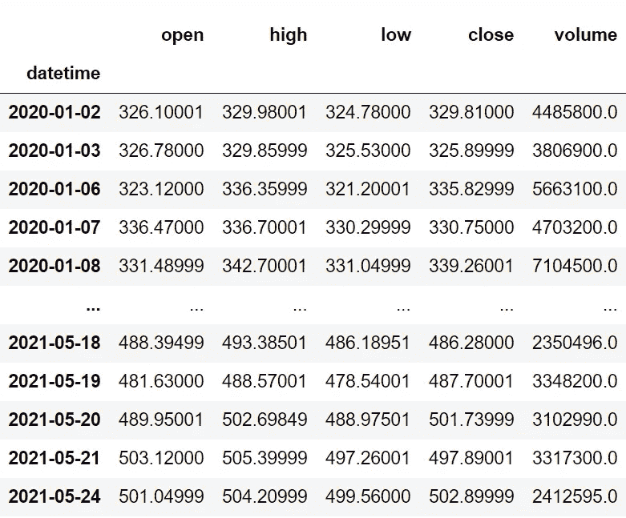
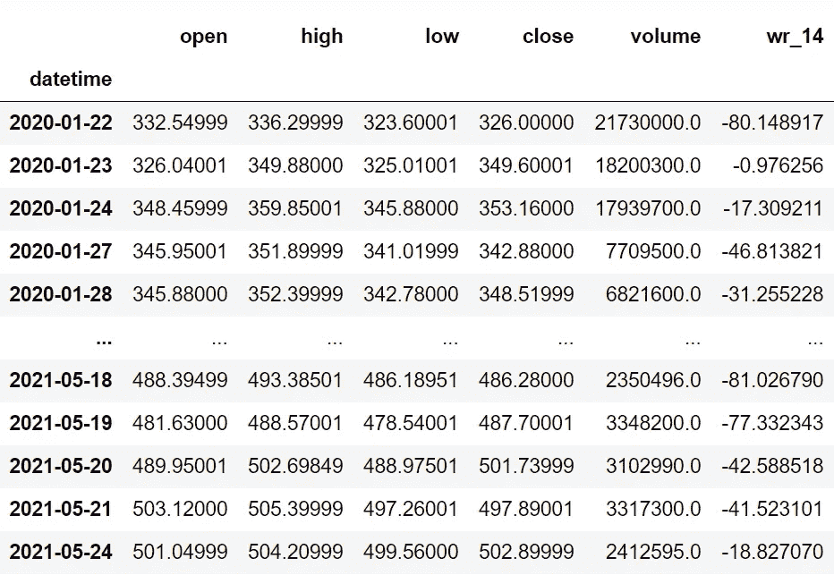
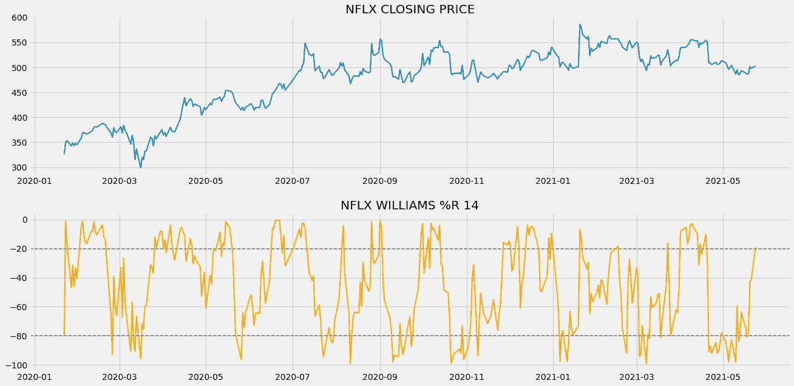
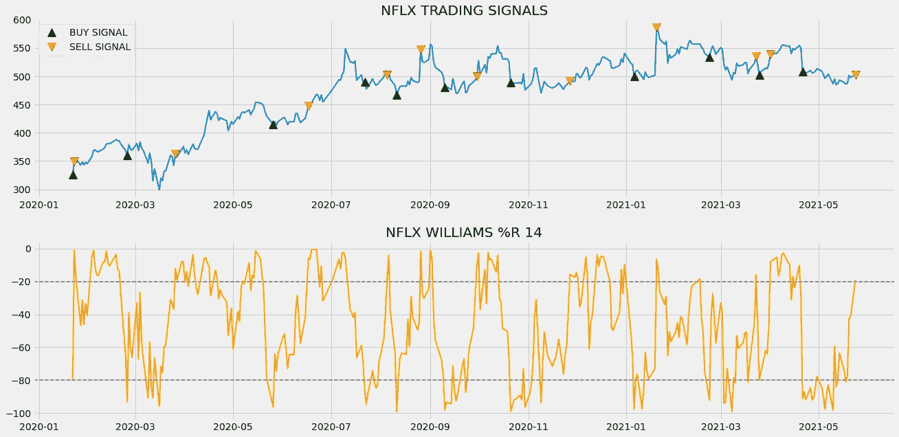
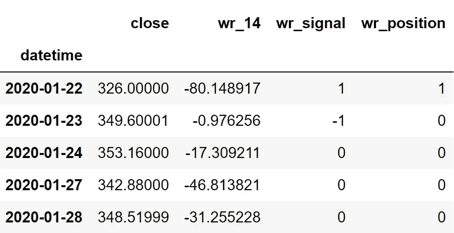

# 用 Python 实现 Williams %R 的算法交易

> 原文：<https://medium.com/codex/algorithmic-trading-with-williams-r-in-python-5a8e0db9ff1f?source=collection_archive---------0----------------------->

## 学习用 python 建立一个强大的技术指标的杀手交易策略


马克西姆·霍普曼在 [Unsplash](https://unsplash.com?utm_source=medium&utm_medium=referral) 上的照片

# 介绍

在查看由相对强弱指数和随机振荡指标组成的最受欢迎的动量指标列表时，我们今天要讨论的这个指标在考虑其在现实市场中的用途和效率时也加入了列表。不是别人，正是威廉姆斯夫妇。

在这篇文章中，我们将探讨威廉姆斯%R 是什么，这个指标背后的数学，以及如何在 python 的帮助下建立基于它的交易策略。作为额外的一步，我们将比较我们的 Williams %R 策略回报与 SPY ETF(一种专门设计用于跟踪标准普尔 500 指数走势的 ETF)的回报，以了解我们的策略在现实市场中的表现如何，并可以作为评估策略的一个步骤。考虑到你的好奇心被激起，让我们深入这篇文章吧！

在继续之前，如果你想在没有任何代码的情况下回溯测试你的交易策略，有一个解决方案。这是[的后验区](https://www.backtestzone.com/)。这是一个平台，可以免费对不同类型的可交易资产的任意数量的交易策略进行回溯测试，无需编码。点击这里的链接，你可以马上使用这个工具:[https://www.backtestzone.com/](https://www.backtestzone.com/)

# 威廉姆斯%R

由拉里·威廉姆斯创立的威廉姆斯%R 是一个动量指标，其值在 0 到-100 之间波动。这个指标和随机振荡指标非常相似，但是计算方法不同。交易者使用这个指标，通过构建超买和超卖两个级别来发现交易的潜在进场点和出场点。在讨论超买和超卖水平之前，先说一句:当市场趋势看起来非常看涨并注定要盘整时，股票被认为是超买。类似地，当市场趋势似乎极度看跌并有反弹趋势时，股票到达超卖区域。超买和超卖水平的传统阈值分别是 20 和 80，但也没有任何禁止采取其他价值。

为了用 14 作为回望周期的传统设置来计算 Williams %R 的值，首先，确定 14 天时间范围内每个周期的最高价和最低价。然后，取两个差值:从最高价到收盘价，从最高价到最低价。最后，将第一个差值除以第二个差值，再乘以-100，以获得 Williams %R 的值。该计算可数学表示如下:

```
**W%R 14** = [ **H.HIGH** - **C.PRICE** ] / [ **L.LOW** - **C.PRICE** ] * ( **- 100** )where,
W%R 14 = 14-day Williams %R of the stock
H.HIGH = 14-day Highest High of the stock
L.LOW = 14-day Lowest Low of the stock
C.PRICE = Closing price of the stock
```

这个指标的基本思想是，当它是一个强劲的上升趋势时，股票将不断达到新高，同样，当它跟随一个强劲的下降趋势时，股票将达到新低。话虽如此，我们还是来讨论一下本文中要实施的交易策略吧。

**关于我们的交易策略:**有很多基于 Williams %R 的交易策略可以在现实市场中实施，但我们今天要讨论的是基于超买和超卖水平的策略。当威廉姆斯%R 的前一个读数低于-20，当前读数高于-20 时，该策略显示买入信号。同样，当威廉姆斯%R 的前一个读数高于-80，当前读数低于-80 时，就会产生卖出信号。我们的交易策略可以表述如下:

```
IF **PREV.W%R** < [ **- 20** ] AND **CURRENT.W%R** > [ **- 20** ] ==> **BUY SIGNAL**
IF **PREV.W%R** > [ **- 80** ] AND **CURRENT.W%R** < [ **- 80** ] ==> **SELL SIGNAL**
```

这就结束了我们关于威廉姆斯%R 的理论部分，它的计算和交易策略。现在，让我们用 Python 从头开始构建这个指标，构建我们讨论过的交易策略，在网飞数据上对其进行回溯测试，并将回报与 SPY ETF 的回报进行比较。事不宜迟，我们来做点编码吧！**在继续之前，免责声明:本文的唯一目的是教育人们，必须被视为一个信息，而不是投资建议等。**

# 用 Python 实现

编码部分分为以下几个步骤:

```
**1\. Importing Packages
2\. Extracting Stock Data from Twelve Data
3\. Williams %R Calculation
4\. Williams %R Indicator Plot
5\. Creating the Trading Strategy
6\. Plotting the Trading Lists
7\. Creating our Position
8\. Backtesting
9\. SPY ETF Comparison**
```

我们将按照上面列表中提到的顺序，系好安全带，跟随每一个即将到来的编码部分。

## 步骤 1:导入包

将所需的包导入 python 环境是一个不可跳过的步骤。主要的包是处理数据的 Pandas，处理数组和复杂函数的 NumPy，用于绘图的 Matplotlib，以及进行 API 调用的请求。二级包是数学函数的 Math 和字体定制的 Termcolor(可选)。

**Python 实现:**

```
import pandas as pd
import numpy as np
import requests
import matplotlib.pyplot as plt
from math import floor
from termcolor import colored as cl

plt.rcParams['figure.figsize'] = (20,10)
plt.style.use('fivethirtyeight')
```

现在我们已经将所有需要的包导入到 python 中。让我们用 12 个数据的 API 端点来获取网飞的历史数据。

## 步骤 2:从 12 个数据中提取数据

在这一步，我们将使用由[twelvedata.com](https://twelvedata.com/)提供的 API 端点提取网飞的历史股票数据。在此之前，请注意 twelvedata.com:十二数据公司是领先的市场数据提供商之一，拥有大量各种市场数据的 API 端点。它非常容易与十二数据提供的 API 进行交互，并且拥有有史以来最好的文档。此外，确保你有一个 twelvedata.com[的账户，只有这样，你才能访问你的 API 密匙(用 API 提取数据的重要元素)。](https://twelvedata.com/)

**Python 实现:**

```
def get_historical_data(symbol, start_date):
    api_key = 'YOUR API KEY'
    api_url = f'https://api.twelvedata.com/time_series?symbol={symbol}&interval=1day&outputsize=5000&apikey={api_key}'
    raw_df = requests.get(api_url).json()
    df = pd.DataFrame(raw_df['values']).iloc[::-1].set_index('datetime').astype(float)
    df = df[df.index >= start_date]
    df.index = pd.to_datetime(df.index)
    return df

nflx = get_historical_data('NFLX', '2020-01-01')
nflx
```

**输出:**



作者图片

**代码解释:**我们做的第一件事是定义一个名为‘get _ historical _ data’的函数，该函数将股票的符号(‘symbol’)和历史数据的起始日期(‘start _ date’)作为参数。在函数内部，我们定义了 API 键和 URL，并将它们存储到各自的变量中。接下来，我们使用“get”函数提取 JSON 格式的历史数据，并将其存储到“raw_df”变量中。在对原始 JSON 数据进行清理和格式化之后，我们将以干净的 Pandas 数据帧的形式返回它。最后，我们调用创建的函数从 2020 年开始提取网飞的历史数据，并将其存储到“nflx”变量中。

## 步骤 3:威廉姆斯%R 计算

在这一步中，我们将按照之前讨论的公式计算 Williams %R 的值。

**Python 实现:**

```
def get_wr(high, low, close, lookback):
    highh = high.rolling(lookback).max() 
    lowl = low.rolling(lookback).min()
    wr = -100 * ((highh - close) / (highh - lowl))
    return wr

nflx['wr_14'] = get_wr(nflx['high'], nflx['low'], nflx['close'], 14)
nflx = nflx.dropna()
nflx
```

**输出:**



作者图片

**代码解释:**我们首先定义一个名为“get_wr”的函数，它将股票的高价格数据(“高”)、低价格数据(“低”)、收盘价数据(“收盘”)和回望期(“周期”)作为参数。在该函数中，我们首先借助 Pandas 软件包提供的“滚动”和“最大”函数来确定特定回看时段内的最高高点，并将其存储到“high”变量中。“滚动”函数的作用是考虑我们指定的 n 周期时间框架，而“最大值”函数过滤给定数据框架中的最大值。

接下来，我们将定义一个名为“lowl”的变量来存储指定回看周期时间范围内的最低低点，我们使用 Pandas 包提供的“滚动”和“最小”函数(顾名思义，过滤给定数据帧中的最小值)来确定该时间范围。

然后，我们将确定的最高最高值和最低低值代入之前讨论的公式，计算 Williams %R 的值，并将其存储到“wr”变量中。最后，我们返回并调用创建的函数来存储网飞的 Williams %R 读数，其中 14 为回看周期。

## 步骤 4:威廉姆斯%R 图

在这一步中，我们将绘制计算出的网飞的 Williams %R 值，以便更好地理解它们。这一部分的主要目的不是在编码部分，而是观察情节，以获得对 Williams %R 技术指标的牢固理解。

**Python 实现:**

```
ax1 = plt.subplot2grid((11,1), (0,0), rowspan = 5, colspan = 1)
ax2 = plt.subplot2grid((11,1), (6,0), rowspan = 5, colspan = 1)
ax1.plot(nflx['close'], linewidth = 2)
ax1.set_title('NFLX CLOSING PRICE')
ax2.plot(nflx['wr_14'], color = 'orange', linewidth = 2)
ax2.axhline(-20, linewidth = 1.5, linestyle = '--', color = 'grey')
ax2.axhline(-80, linewidth = 1.5, linestyle = '--', color = 'grey')
ax2.set_title('NFLX WILLIAMS %R 14')
plt.show()
```

**输出:**



上面的图表分为两个面板:上面的面板是网飞股票数据的收盘价，下面的面板是网飞的 Williams %R 的 14 天读数。现在，该图表可以通过两种方式使用。第一种方法是使用图表作为工具来识别市场的超买和超卖状态。你可以观察到在市场的上方和下方有两条水平的灰色线，这是超买和超卖水平，分别位于-20 和-80。如果威廉姆斯%R 的读数高于上线或超买线，您可以认为市场处于超买状态。同样，如果威廉姆斯%R 的读数低于较低的线或超卖线，你可以假设市场处于超卖状态。

使用威廉姆斯%R 的第二种方法是识别市场中的虚假动量。在强劲的上升趋势中，威廉姆斯%R 的读数往往达到-20 以上。如果该指标下跌，并在下一次下跌前努力达到-20 以上，表明市场的动力不是真实的，可能会出现巨大的下跌趋势。同样，在健康的下降趋势中，威廉姆斯%R 的读数必然会经常低于-80。如果该指标上涨，但在下一次上涨前未能达到-80，表明市场将遵循积极的趋势。

由于威廉姆斯%R 是一个方向指标(其运动与实际市场的运动成正比)，交易者也用这个指标来寻找和确认市场中的强劲上涨趋势或下跌趋势，并沿着它进行交易。一些指标在用于识别或确认市场趋势时没有多大用处，因为它们可能在本质上是滞后的(考虑历史数据点以确定当前读数的指标)，但 Williams %R 是一个有效的指标，因为它是领先指标(考虑先前数据点以预测未来走势的指标)。

## 步骤 5:创建交易策略

在这一步中，我们将使用 python 实现讨论过的 Williams %R 交易策略。

**Python 实现:**

```
def implement_wr_strategy(prices, wr):    
    buy_price = []
    sell_price = []
    wr_signal = []
    signal = 0

    for i in range(len(wr)):
        if wr[i-1] > -80 and wr[i] < -80:
            if signal != 1:
                buy_price.append(prices[i])
                sell_price.append(np.nan)
                signal = 1
                wr_signal.append(signal)
            else:
                buy_price.append(np.nan)
                sell_price.append(np.nan)
                wr_signal.append(0)
        elif wr[i-1] < -20 and wr[i] > -20:
            if signal != -1:
                buy_price.append(np.nan)
                sell_price.append(prices[i])
                signal = -1
                wr_signal.append(signal)
            else:
                buy_price.append(np.nan)
                sell_price.append(np.nan)
                wr_signal.append(0)
        else:
            buy_price.append(np.nan)
            sell_price.append(np.nan)
            wr_signal.append(0)

    return buy_price, sell_price, wr_signal

buy_price, sell_price, wr_signal = implement_wr_strategy(nflx['close'], nflx['wr_14'])
```

**代码解释:**首先，我们定义一个名为“implement_wr_strategy”的函数，它将股票价格(“prices”)和 Williams %R 指标(“wr”)的值作为参数。

在该函数中，我们创建了三个空列表(buy_price、sell_price 和 wr_signal ),在创建交易策略时，将在这些列表中追加值。

之后，我们通过 for 循环实施交易策略。在 for 循环内部，我们传递某些条件，如果条件得到满足，相应的值将被追加到空列表中。如果购买股票的条件得到满足，买入价将被追加到“buy_price”列表中，信号值将被追加为 1，表示购买股票。类似地，如果卖出股票的条件得到满足，卖价将被追加到“sell_price”列表中，信号值将被追加为-1，表示卖出股票。

最后，我们返回附加了值的列表。然后，我们调用创建的函数并将值存储到各自的变量中。除非我们画出这些值，否则这个列表没有任何意义。所以，让我们画出创建的交易列表的值。

## 步骤 6:绘制交易信号

在这一步，我们将绘制已创建的交易列表，以使它们有意义。

**Python 实现:**

```
ax1 = plt.subplot2grid((11,1), (0,0), rowspan = 5, colspan = 1)
ax2 = plt.subplot2grid((11,1), (6,0), rowspan = 5, colspan = 1)
ax1.plot(nflx['close'], linewidth = 2)
ax1.plot(nflx.index, buy_price, marker = '^', markersize = 12, linewidth = 0, color = 'green', label = 'BUY SIGNAL')
ax1.plot(nflx.index, sell_price, marker = 'v', markersize = 12, linewidth = 0, color = 'r', label = 'SELL SIGNAL')
ax1.legend()
ax1.set_title('NFLX TRADING SIGNALS')
ax2.plot(nflx['wr_14'], color = 'orange', linewidth = 2)
ax2.axhline(-20, linewidth = 1.5, linestyle = '--', color = 'grey')
ax2.axhline(-80, linewidth = 1.5, linestyle = '--', color = 'grey')
ax2.set_title('NFLX WILLIAMS %R 14')
plt.show()
```

**输出:**



作者图片

代码解释:我们正在绘制威廉姆斯%R 的读数以及交易策略产生的买入和卖出信号。我们可以观察到，当威廉姆斯%R 线从下方穿越到-20 以上时，图表中就会出现绿色的买入信号。类似地，当威廉姆斯%R 线从上面交叉到-80 和下面时，红色的卖出信号会出现在图表中。

## 步骤 7:创建我们的职位

在这一步中，我们将创建一个列表，如果我们持有股票，该列表将指示 1；如果我们不拥有或持有股票，该列表将指示 0。

**Python 实现:**

```
position = []
for i in range(len(wr_signal)):
    if wr_signal[i] > 1:
        position.append(0)
    else:
        position.append(1)

for i in range(len(nflx['close'])):
    if wr_signal[i] == 1:
        position[i] = 1
    elif wr_signal[i] == -1:
        position[i] = 0
    else:
        position[i] = position[i-1]

close_price = nflx['close']
wr = nflx['wr_14']
wr_signal = pd.DataFrame(wr_signal).rename(columns = {0:'wr_signal'}).set_index(nflx.index)
position = pd.DataFrame(position).rename(columns = {0:'wr_position'}).set_index(nflx.index)

frames = [close_price, wr, wr_signal, position]
strategy = pd.concat(frames, join = 'inner', axis = 1)

strategy.head()
```

**输出:**



作者图片

**代码解释:**首先，我们创建一个名为‘position’的空列表。我们传递两个 for 循环，一个是为“位置”列表生成值，以匹配“信号”列表的长度。另一个 for 循环是我们用来生成实际位置值的循环。在第二个 for 循环中，我们对“signal”列表的值进行迭代，而“position”列表的值被附加到满足哪个条件上。如果我们持有股票，头寸的价值仍为 1；如果我们卖出或不持有股票，头寸的价值仍为 0。最后，我们正在进行一些数据操作，将所有创建的列表合并到一个数据帧中。

从显示的输出中，我们可以看到，在第一行中，我们在股票中的位置仍然是 1(因为威廉姆斯%R 信号没有任何变化)，但是当威廉姆斯%R 交易信号代表卖出信号(-1)时，我们的位置突然变成-1。我们的头寸将保持为 0，直到交易信号发生一些变化。现在是时候实现一些回溯测试过程了！

## 步骤 8:回溯测试

在继续之前，有必要知道什么是回溯测试。回溯测试是查看我们的交易策略在给定股票数据上表现如何的过程。在我们的例子中，我们将对网飞股票数据的 Williams %R 交易策略实施回溯测试过程。

**Python 实现:**

```
nflx_ret = pd.DataFrame(np.diff(nflx['close'])).rename(columns = {0:'returns'})
wr_strategy_ret = []

for i in range(len(nflx_ret)):
    returns = nflx_ret['returns'][i]*strategy['wr_position'][i]
    wr_strategy_ret.append(returns)

wr_strategy_ret_df = pd.DataFrame(wr_strategy_ret).rename(columns = {0:'wr_returns'})
investment_value = 100000
number_of_stocks = floor(investment_value/nflx['close'][-1])
wr_investment_ret = []

for i in range(len(wr_strategy_ret_df['wr_returns'])):
    returns = number_of_stocks*wr_strategy_ret_df['wr_returns'][i]
    wr_investment_ret.append(returns)

wr_investment_ret_df = pd.DataFrame(wr_investment_ret).rename(columns = {0:'investment_returns'})
total_investment_ret = round(sum(wr_investment_ret_df['investment_returns']), 2)
profit_percentage = floor((total_investment_ret/investment_value)*100)
print(cl('Profit gained from the W%R strategy by investing $100k in NFLX : {}'.format(total_investment_ret), attrs = ['bold']))
print(cl('Profit percentage of the W%R strategy : {}%'.format(profit_percentage), attrs = ['bold']))
```

**输出:**

```
**Profit gained from the W%R strategy by investing $100k in NFLX : 57772.45**
**Profit percentage of the W%R strategy : 57%**
```

**代码解释:**首先，我们使用 NumPy 包提供的‘diff’函数计算网飞股票的回报率，并将其作为数据帧存储到‘nflx _ ret’变量中。接下来，我们传递一个 for 循环来迭代' nflx_ret '变量的值，以计算我们从 Williams %R 交易策略中获得的回报，这些回报值被追加到' wr_strategy_ret '列表中。接下来，我们将“wr_strategy_ret”列表转换为数据帧，并将其存储到“wr_strategy_ret_df”变量中。

接下来是回溯测试过程。我们将通过投资 10 万美元到我们的交易策略中来回测我们的策略。首先，我们将投资金额存储到“投资值”变量中。之后，我们将使用投资金额计算我们可以购买的网飞股票数量。你可以注意到，我使用了 Math 软件包提供的“下限”函数，因为当投资金额除以网飞股票的收盘价时，它会输出一个十进制数。股票数量应该是整数，而不是小数。使用“底数”函数，我们可以去掉小数。请记住,“floor”函数比“round”函数要复杂得多。然后，我们传递一个 for 循环来查找投资回报，后面是一些数据操作任务。

最后，我们打印了我们通过投资 10 万到我们的交易策略中得到的总回报，并且显示我们在一年中获得了大约 57，000 美元的利润。那还不错！现在，让我们将我们的回报与 SPY ETF(一种旨在跟踪标准普尔 500 股票市场指数的 ETF)的回报进行比较。

## 步骤 9: SPY ETF 对比

这一步是可选的，但强烈推荐，因为我们可以了解我们的交易策略相对于基准(间谍 ETF)的表现如何。在这一步中，我们将使用我们创建的“get_historical_data”函数提取 SPY ETF 的数据，并将我们从 SPY ETF 获得的回报与我们在网飞的 Williams %R 交易策略回报进行比较。

**Python 实现:**

```
def get_benchmark(start_date, investment_value):
    spy = get_historical_data('SPY', start_date)['close']
    benchmark = pd.DataFrame(np.diff(spy)).rename(columns = {0:'benchmark_returns'})

    investment_value = investment_value
    number_of_stocks = floor(investment_value/spy[-1])
    benchmark_investment_ret = []

    for i in range(len(benchmark['benchmark_returns'])):
        returns = number_of_stocks*benchmark['benchmark_returns'][i]
        benchmark_investment_ret.append(returns)

    benchmark_investment_ret_df = pd.DataFrame(benchmark_investment_ret).rename(columns = {0:'investment_returns'})
    return benchmark_investment_ret_df

benchmark = get_benchmark('2020-01-01', 100000)

investment_value = 100000
total_benchmark_investment_ret = round(sum(benchmark['investment_returns']), 2)
benchmark_profit_percentage = floor((total_benchmark_investment_ret/investment_value)*100)
print(cl('Benchmark profit by investing $100k : {}'.format(total_benchmark_investment_ret), attrs = ['bold']))
print(cl('Benchmark Profit percentage : {}%'.format(benchmark_profit_percentage), attrs = ['bold']))
print(cl('W%R Strategy profit is {}% higher than the Benchmark Profit'.format(profit_percentage - benchmark_profit_percentage), attrs = ['bold']))
```

**输出:**

```
**Benchmark profit by investing $100k : 22431.5**
**Benchmark Profit percentage : 22%**
**W%R Strategy profit is 35% higher than the Benchmark Profit**
```

**代码解释:**这一步使用的代码几乎与前一个回溯测试步骤中使用的代码相似，但我们不是投资网飞，而是通过不实施任何交易策略来投资 SPY ETF。从输出可以看出，我们的 Williams %R 交易策略已经跑赢 SPY ETF 35%。太好了！

# 最后的想法！

在 Williams %R 上经过一个粉碎理论和编码部分的漫长过程后，我们成功地建立了一个盈利的交易策略，其回报超过了间谍 ETF。这很好，但这还不够。当我运行一个单独的回溯测试过程来获得更多关于我们的交易策略性能的信息时，我发现我们基于 Williams %R 的策略回报低于网飞股票的实际回报。这背后最重要的原因可能是策略优化。

什么是策略优化？这是一个调整交易策略的过程，以达到最佳效果。调整策略，尤其是领先指标交易策略的最好方法是添加另一个技术指标作为过滤器。这个过滤器作为一个标尺，确保策略揭示的交易信号是真实的，而不是虚假的。在使用威廉姆斯%R 时，这部分应该被认为是必不可少的，因为这个指标容易暴露很多错误的信号，最终导致我们做了糟糕的交易。回到策略优化，它不仅仅是增加另一个技术指标，还包括有效的风险管理步骤和更好的交易环境。

如果你做到了这些，你就有了一个强大的交易算法，可以在现实市场中做更好的交易。所以我强烈推荐你尝试这些东西。你可能会问我，为什么我没有在文章中提到这些话题，因为文章的唯一动机不是鼓励人们创造有利可图的交易策略，从市场中赚钱，而是教育人们一个强大的交易指标。就是这样！您已到达文章结尾。希望你能从这篇文章中学到一些新的有用的东西。如果您忘记了遵循任何编码部分，不要担心。我在文章末尾提供了完整的源代码。

## 完整代码:

```
import pandas as pd
import numpy as np
import requests
import matplotlib.pyplot as plt
from math import floor
from termcolor import colored as cl

plt.rcParams['figure.figsize'] = (20,10)
plt.style.use('fivethirtyeight')

def get_historical_data(symbol, start_date):
    api_key = 'YOUR API KEY'
    api_url = f'https://api.twelvedata.com/time_series?symbol={symbol}&interval=1day&outputsize=5000&apikey={api_key}'
    raw_df = requests.get(api_url).json()
    df = pd.DataFrame(raw_df['values']).iloc[::-1].set_index('datetime').astype(float)
    df = df[df.index >= start_date]
    df.index = pd.to_datetime(df.index)
    return df

nflx = get_historical_data('NFLX', '2020-01-01')
print(nflx)

def get_wr(high, low, close, lookback):
    highh = high.rolling(lookback).max() 
    lowl = low.rolling(lookback).min()
    wr = -100 * ((highh - close) / (highh - lowl))
    return wr

nflx['wr_14'] = get_wr(nflx['high'], nflx['low'], nflx['close'], 14)
nflx = nflx.dropna()
pint(nflx)

ax1 = plt.subplot2grid((11,1), (0,0), rowspan = 5, colspan = 1)
ax2 = plt.subplot2grid((11,1), (6,0), rowspan = 5, colspan = 1)
ax1.plot(nflx['close'], linewidth = 2)
ax1.set_title('NFLX CLOSING PRICE')
ax2.plot(nflx['wr_14'], color = 'orange', linewidth = 2)
ax2.axhline(-20, linewidth = 1.5, linestyle = '--', color = 'grey')
ax2.axhline(-80, linewidth = 1.5, linestyle = '--', color = 'grey')
ax2.set_title('NFLX WILLIAMS %R 14')
plt.show()

def implement_wr_strategy(prices, wr):    
    buy_price = []
    sell_price = []
    wr_signal = []
    signal = 0

    for i in range(len(wr)):
        if wr[i-1] > -80 and wr[i] < -80:
            if signal != 1:
                buy_price.append(prices[i])
                sell_price.append(np.nan)
                signal = 1
                wr_signal.append(signal)
            else:
                buy_price.append(np.nan)
                sell_price.append(np.nan)
                wr_signal.append(0)
        elif wr[i-1] < -20 and wr[i] > -20:
            if signal != -1:
                buy_price.append(np.nan)
                sell_price.append(prices[i])
                signal = -1
                wr_signal.append(signal)
            else:
                buy_price.append(np.nan)
                sell_price.append(np.nan)
                wr_signal.append(0)
        else:
            buy_price.append(np.nan)
            sell_price.append(np.nan)
            wr_signal.append(0)

    return buy_price, sell_price, wr_signal

buy_price, sell_price, wr_signal = implement_wr_strategy(nflx['close'], nflx['wr_14'])

ax1 = plt.subplot2grid((11,1), (0,0), rowspan = 5, colspan = 1)
ax2 = plt.subplot2grid((11,1), (6,0), rowspan = 5, colspan = 1)
ax1.plot(nflx['close'], linewidth = 2)
ax1.plot(nflx.index, buy_price, marker = '^', markersize = 12, linewidth = 0, color = 'green', label = 'BUY SIGNAL')
ax1.plot(nflx.index, sell_price, marker = 'v', markersize = 12, linewidth = 0, color = 'r', label = 'SELL SIGNAL')
ax1.legend()
ax1.set_title('NFLX TRADING SIGNALS')
ax2.plot(nflx['wr_14'], color = 'orange', linewidth = 2)
ax2.axhline(-20, linewidth = 1.5, linestyle = '--', color = 'grey')
ax2.axhline(-80, linewidth = 1.5, linestyle = '--', color = 'grey')
ax2.set_title('NFLX WILLIAMS %R 14')
plt.show()

position = []
for i in range(len(wr_signal)):
    if wr_signal[i] > 1:
        position.append(0)
    else:
        position.append(1)

for i in range(len(nflx['close'])):
    if wr_signal[i] == 1:
        position[i] = 1
    elif wr_signal[i] == -1:
        position[i] = 0
    else:
        position[i] = position[i-1]

close_price = nflx['close']
wr = nflx['wr_14']
wr_signal = pd.DataFrame(wr_signal).rename(columns = {0:'wr_signal'}).set_index(nflx.index)
position = pd.DataFrame(position).rename(columns = {0:'wr_position'}).set_index(nflx.index)

frames = [close_price, wr, wr_signal, position]
strategy = pd.concat(frames, join = 'inner', axis = 1)

print(strategy)

nflx_ret = pd.DataFrame(np.diff(nflx['close'])).rename(columns = {0:'returns'})
wr_strategy_ret = []

for i in range(len(nflx_ret)):
    returns = nflx_ret['returns'][i]*strategy['wr_position'][i]
    wr_strategy_ret.append(returns)

wr_strategy_ret_df = pd.DataFrame(wr_strategy_ret).rename(columns = {0:'wr_returns'})
investment_value = 100000
number_of_stocks = floor(investment_value/nflx['close'][-1])
wr_investment_ret = []

for i in range(len(wr_strategy_ret_df['wr_returns'])):
    returns = number_of_stocks*wr_strategy_ret_df['wr_returns'][i]
    wr_investment_ret.append(returns)

wr_investment_ret_df = pd.DataFrame(wr_investment_ret).rename(columns = {0:'investment_returns'})
total_investment_ret = round(sum(wr_investment_ret_df['investment_returns']), 2)
profit_percentage = floor((total_investment_ret/investment_value)*100)
print(cl('Profit gained from the W%R strategy by investing $100k in NFLX : {}'.format(total_investment_ret), attrs = ['bold']))
print(cl('Profit percentage of the W%R strategy : {}%'.format(profit_percentage), attrs = ['bold']))

def get_benchmark(start_date, investment_value):
    spy = get_historical_data('SPY', start_date)['close']
    benchmark = pd.DataFrame(np.diff(spy)).rename(columns = {0:'benchmark_returns'})

    investment_value = investment_value
    number_of_stocks = floor(investment_value/spy[-1])
    benchmark_investment_ret = []

    for i in range(len(benchmark['benchmark_returns'])):
        returns = number_of_stocks*benchmark['benchmark_returns'][i]
        benchmark_investment_ret.append(returns)

    benchmark_investment_ret_df = pd.DataFrame(benchmark_investment_ret).rename(columns = {0:'investment_returns'})
    return benchmark_investment_ret_df

benchmark = get_benchmark('2020-01-01', 100000)

investment_value = 100000
total_benchmark_investment_ret = round(sum(benchmark['investment_returns']), 2)
benchmark_profit_percentage = floor((total_benchmark_investment_ret/investment_value)*100)
print(cl('Benchmark profit by investing $100k : {}'.format(total_benchmark_investment_ret), attrs = ['bold']))
print(cl('Benchmark Profit percentage : {}%'.format(benchmark_profit_percentage), attrs = ['bold']))
print(cl('W%R Strategy profit is {}% higher than the Benchmark Profit'.format(profit_percentage - benchmark_profit_percentage), attrs = ['bold']))
```