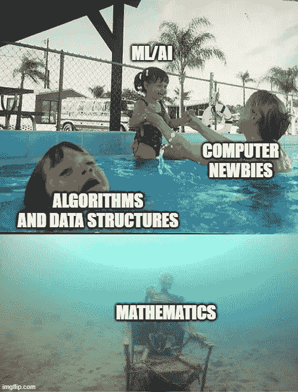

# 算法、数据结构和数据科学

> 原文：<https://medium.com/codex/algorithms-data-structures-and-data-science-6a240db7355e?source=collection_archive---------8----------------------->

克里斯多夫·伯恩斯在 [Unsplash](https://unsplash.com?utm_source=medium&utm_medium=referral) 上拍摄的照片

在我自学机器学习的过程中，我遇到的最大挑战之一是在我会走路之前试图奔跑。2019 年底，我读了李开复的书 *AI Superpowers: China，Silicon Valley，and the New World Order* ，这本书让我进入了数据科学领域。怀着极大的热情，我开始了 Udemy 的机器学习实践课程。大约一个月后，我掌握了许多现代机器学习模型的知识，并急切地想用这项令人兴奋的技术开始许多个人兼职项目。我不知道，还有很多东西要学。

# 从我的错误中吸取教训

在深入研究算法和数据结构在数据科学中的相关性之前，理解它们在计算机科学中的重要性是至关重要的。如果要我用一个词来形容它们的重要性，那就是**高效**。

计算机速度快，速度快。在许多任务中比人类快得多。如此之快，以至于许多人错误地认为他们是无限快。我知道我在大学一年级时错误地得出了这个结论。回想我的第一堂编程课，“低效代码”这个主题出现了。尽管如此，在学习算法和数据结构之前，我从未完全掌握这个概念。在那堂课上，我们用 C++编写了简单的程序。有时候，助教会告诉我某个特定的语法效率很低。尽管如此，我还是会立即质疑这种说法，心想，“但是它以毫秒为单位运行，这怎么会是低效的呢？”。这里有一个问题:如果你写 10 行代码来解析一个 50 个字符的字符串，你将不会欣赏算法和数据结构。相比之下，如果你正在处理一个有数百万(或者更多！)行，并且您不知道如何正确地使用算法和数据结构，那么您的程序要么需要很长时间才能完成。

当我试图预处理从网上获取的数据集时，这个缺陷变得非常明显。我发现了一个 CSV 文件，其中有超过 20 年的美元兑加元外汇数据。每条线代表一分钟的交易价格窗口。做一些快速的数学计算，人们可以确定 20 年的外汇数据，每分钟一个数据点大约等于 10，512，000 个数据点。也就是说，无论从哪方面来看，数据点的数量都相当可观。它甚至还没有被认为是大数据。尽管如此，如果利用了低效的算法和数据结构，这些数据足以在预处理期间使处理器迅速陷入困境。

在检查我的数据时，我注意到许多数据点丢失了。我心想，“这很正常，我能处理好这件事，没问题！”。第一种说法是真实的；在实践数据科学时，最耗时的任务之一是执行数据预处理。第二种说法与事实相去甚远。

出于新手的无知，我打开了 Spyder IDE，导入了 pandas，并将我的整个 csv 文本文件加载到 pandas 数据框中。然后，我编写了几行包含嵌套 for 循环的代码，这些代码会将缺失数据点插入到数据帧中，缺失数据点之前的值是最佳近似值。我检查了我的代码，以确保正确的算法逻辑。当确信它可以无错运行时，我启动了脚本。七个小时后，我停止了脚本，不知道为什么它没有自己完成。我回顾了 IDE 环境，并意识到我还没有完成 10%的数据框架。我不可能花 70 多个小时来清理一个数据集，但我甚至不知道我做错了什么！我的技能中缺少一些基本的东西，无法让我完成数据预处理的这一关键步骤。

# 算法和数据结构

2020 年仲夏的某个时候，我在浏览 Reddit 时发现了下面这个迷因。

图片由作者使用 imgflip.com 的[，灵感来自来源](https://imgflip.com) [Kaggle](https://www.kaggle.com/getting-started/177451)

具有讽刺意味的是，这并不是这个迷因第一次困扰我。大约一周后，我的女朋友给我发来了*一模一样的 meme* 。她毕业于多伦多大学计算机工程专业，是加拿大一家大型电信公司的软件开发员。尽管迷因看起来很幽默，但我开始意识到算法和数据结构是我数据科学之旅中的一块拼图。

为了提高我在数据科学和机器学习方面的技能，我联系了圭尔夫大学的副教授格拉汉姆·泰勒。泰勒曾在多伦多大学师从著名的杰弗里·辛顿。我向泰勒博士讲述了我的故事，并请求他为我的旅程提供指导。泰勒博士对我说，他经常被问到机器学习技能和资源，当然，我想确保我有必要的先决条件。具体来说，线性代数、微积分、概率统计、算法和数据结构(哇，跟迷因一模一样)。

一有机会，我就报名参加了一个在线课程，学习算法和数据结构。我在 Coursera 上注册了斯坦福在线算法专业，老师是斯坦福大学计算机科学副教授 Tim Roughgarden。该专业包括四门单独的课程，涵盖了算法和数据结构中广泛而详细的主题。我不想成为 Coursera schill，但是如果你和我一样，我强烈推荐这个专业。不过要注意的是，要想成功，你需要高水平的数学和编程背景，否则你会迷失方向。

Roughgarden 博士的教学工作非常出色。专业化的一致主题是引导性问题，“我们能做得更好吗？”。这个原则适用于任何编写代码的时候，数据科学也不例外。

为了更好地说明算法和数据结构的重要性，我加入了下面的视频。这个视频演示了 24 种不同的排序算法，都以相同的速度运行。请注意完成时间的变化是如此之大。

# 大 O 符号

为了理解算法和数据结构，理解运行时符号是很重要的。通常，Big-O 符号用于描述算法的效率。如果你已经熟悉这个符号，下面的视频不适合你。否则，我建议您查看视频。

# 数据科学中的算法和数据结构

那么为什么算法和数据结构在数据科学领域很重要呢？我将列举三个原因:

1.  您将不可避免地遇到这样的情况，如果没有正确的算法和数据结构知识，您将无法实现一个程序。不要犯我在尝试使用 pandas 数据框预处理数据时犯的同样的错误。自从第一次尝试预处理 20 多年的数据以来，我已经了解了一种美丽的数据结构，即支持 O(1)插入和搜索次数的哈希表。而且，哈希表可以很容易地通过字典在 Python 中实现(*Python 中所有的*字典都是哈希表)。现在，当我试图获得完全相同的结果时，我可以在不到一分钟的时间内预处理数据集。这实际上比我的原始实现快了 4200 多倍。这个事实本身就强调了正确理解算法和数据结构是多么重要。
2.  这是雇主希望你在技术面试中了解的一个基本话题。技术面试中的一个关键步骤是**总是**使用散列表进行插入和搜索，因为它们的运行时间为 O(1)。我认识的每一个计算机科学领域的专业人士都曾经学习过算法和数据结构。它是高效编程的基础。如果你对数据科学和机器学习很认真，你需要对算法和数据结构很认真。
3.  你的编程能力将会显著提高。我之前提到过，学习算法和数据结构需要良好的编程能力。我知道，当我学习算法和数据结构时，我的 Python 技能得到了极大的提高。我不能保证你会成为一名专业的开发人员。尽管如此，您将被迫使用您可能没有意识到的编程范例。

# 结束语

数据科学领域既令人兴奋又充满希望。像机器学习这样的 IT 技术有可能像 19 世纪的电力一样彻底改变世界。人们很容易被这项技术的宣传所吸引，并迅速发展到不知所措的地步。和任何科学一样，要达到精通，需要对基础知识有扎实的理解。算法和数据结构方面的全面教育会让你领先一步，打开你可能从未意识到的大门和机会。