# 算法入门

> 原文：<https://medium.com/codex/algorithms-primer-54f0471e706e?source=collection_archive---------5----------------------->

## 一些基本算法被认为对开发人员和所有技术人员都很重要。

软件开发人员更关心你创造新算法的能力，而不是记住一个已有的算法。尽管如此，这些经常出现，值得你花时间去记住它们。

# **排序**

对数组排序的两种最常见的*好的*方法是快速排序和合并排序。其他的——冒泡排序、插入排序、基数排序等。—通常效率较低，或者只能在特定假设下工作。

*   **合并排序**通过排序数组的左半部分和右半部分并合并数组来操作。它是如何对左右两半进行排序的？通过合并排序算法(递归)。它取左半部分，分成两半，对每一部分进行排序，然后合并它们。然后它在右半部分做同样的事情。在平均和最坏的情况下，合并排序都是 O(n log(n))。

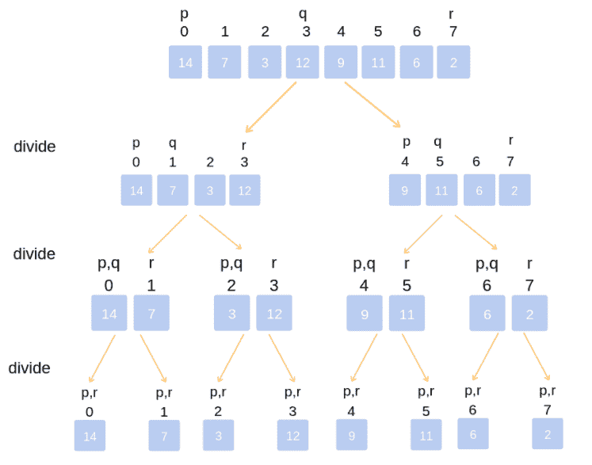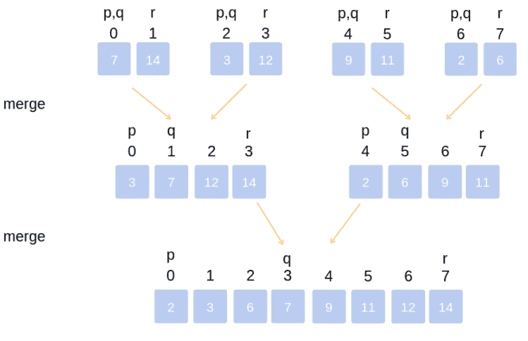

*   **快速排序**通过选择一个随机的“枢纽”元素，并根据元素是小于还是大于枢纽来重新排列数组中的元素，从而对数据进行排序。接下来，它处理枢轴左侧的元素(所有元素都小于或等于枢轴)和枢轴右半部分的元素(所有元素都大于枢轴)。它对每一侧应用相同的策略:选取一个枢轴，重新排列，然后在每一侧选取一个新的枢轴。快速排序在一般情况下是 O(n log(n))，但在最坏情况下是 O(n2)。如果一个坏的“支点”(一个非常低或非常高的元素)被连续选取，最坏的情况将会发生。

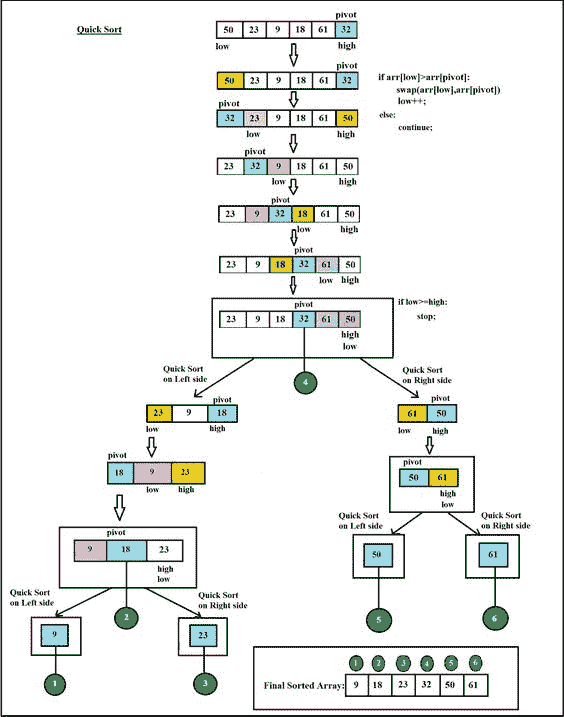

请注意，这两种算法都有一种“分成两部分，然后重新应用算法”的方法

其他的排序算法是你在现实生活中尝试对一堆文件进行排序时可能会用到的简单实现。

*   **插入排序**在数组的开头维护一个排序的元素子列表(最初为 0)。然后，它查看未排序子列表的开头。如果这个元素比排序后的子列表中的最后一个元素大，那么它会保持不变，只增加排序后的部分(因为这个元素已经处于正确的顺序)。如果它比较小，它会将它移动到排序后的子列表中。未排序的部分每次缩小一个。然后，该算法对未排序部分中的每个元素重复该步骤，直到数组被完全排序。插入排序在最好的情况下需要 O(N)时间(如果数组已经排序)，但是在预期和最坏的情况下需要 O(N2)。

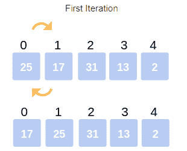

*   **冒泡排序**是一个非常简单的算法。它重复遍历列表，无序地交换每一对元素。一旦没有任何交换的完整迭代发生，数组就被排序。这在最好的情况下(如果数组已排序)取 O(N ),在预期和最坏的情况下取 O(N2)。

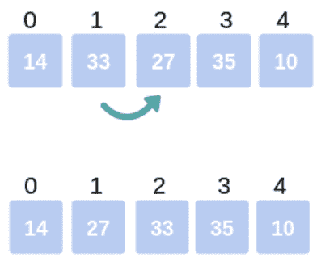

不太可能要求你按名字实现这些算法中的一个，但是理解如何对数据进行排序仍然是有用的。

## **问题 1 —** 给定**两个排序后的数组**，写一个函数让**将它们按照排序后的顺序**合并成一个新的数组。

解决这个问题最有效的方法是利用数组是排序的这一事实。我们可以通过重复获取连续的元素来合并它们，直到到达两个数组的末尾。我们维护指向我们在每个数组中的位置的指针，以便轻松地移动到下一个数组。

让我们以两个数组为例:

甲:1 5 8 9，乙:2 4 9 10 12

我们将从两个数组开头的 p 和 q 指针开始:

甲:1 5 8 9，乙:2 4 9 10 12

p q

A[p]比 A[q]小，所以我们把 A[p]放入结果数组。然后我们将 p 移到下一个值。

甲:1 5 8 9，乙:2 4 9 10 12

p q

结果:1

我们再次比较 A[p]和 A[q]，将较小的元素放入结果数组中。我们还需要跟踪我们在结果数组中的位置。我们重复这个过程，直到我们完成了两个数组。

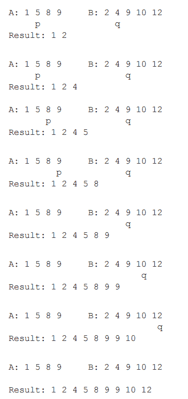

在面试中，详细地浏览这个例子可以减少你犯的错误。

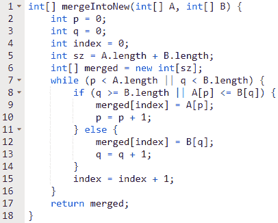

这段代码花费了 **O(M+N)时间**，其中 M 是第一个数组的长度，N 是第二个数组的长度。

## **问题 2 —实现插入排序。**

插入排序通过遍历数组并将每个元素插入到其左侧的元素中来进行操作。

我们可以非常清楚地将它实现为两个不同的函数。第一个函数执行整体算法:选取一个元素，按顺序插入，选取下一个元素，依此类推。

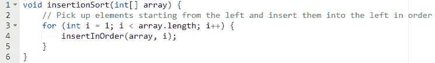

注意，我们的 for 循环从 1 开始，而不是从 0 开始。这是因为第 0 个元素本身永远不会出错。

现在我们只需要实现一个方法，它将接受一个元素 A[k]并将它按顺序插入到它左边的元素中(假设这些元素是已排序的)。要按顺序插入一个[k],我们需要将每个元素移动一位，直到找到该元素的正确位置。

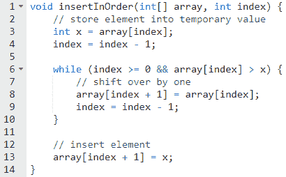

这个算法将花费 **O(N2)时间**。

# **二分搜索法**

二分搜索法是一种在排序列表(通常是数组)中定位值的算法。在二分搜索法，我们将价值与列表的中点进行比较。由于我们的列表已经排序，我们可以确定值应该位于比较元素的左侧还是右侧。然后我们搜索左侧或右侧，重复这个操作:与子列表的中点进行比较，然后搜索该子列表的左半部分或右半部分。

因为我们重复地将数据集分成两半，所以在平均和最坏的情况下，该算法需要 O(log n)时间。

我们经常在现实生活中执行二进制搜索而没有意识到这一点。假设您有一叠按名字排序的学生试卷。如果你有一个像“彼得”这样的名字，你会从栈顶开始搜索吗？大概不会。你会跳到一半然后比较。如果你看到“玛丽”，你知道继续前进。然后，你可以通过不断地将堆栈分成两半来搜索后半部分的考试。

二分搜索法是一种流行的算法，因此是一个需要理解的重要概念。许多算法都是基于二分搜索法的。

## 问题 3——实施二分搜索法。给定一个整数数组和一个值，找出该值的位置。

二分搜索法的工作原理是反复将阵列“减半”成子阵列。在第一次迭代中，我们将值 x 与中点进行比较，并了解 x 是左还是右。然后，我们对这个新的子数组重复这一步:x 是在新的子数组的左半部找到的还是在右边？

我们可以递归地或者迭代地(非递归地)实现它。我们将从递归解决方案开始，因为它对大多数人来说更直观。

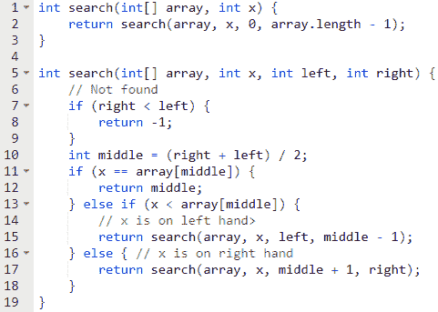

对于迭代解决方案，我们采取非常相似的方法。

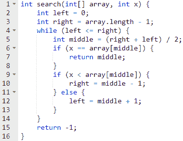

上述两种解决方案的时间复杂度都是 **O(log N)** 。

## **问题 4—** 给你一个整数数组**排序，然后旋转**。它包含所有不同的元素。**求最小值**。例如，数组可能是 6、8、9、11、15、20、3、4、5。最小值应该是 3。

强力解决方案是遍历数组，寻找最小值。我们可以猜测这不是面试官想要的，因为它没有使用排序信息。

为了开发一个更优的解决方案，我们可能希望使用给定的信息——数组是“排序”的，但是是旋转的。因为数组是有序的，所以让我们考虑应用二分搜索法中的一些概念。二分搜索法通过反复查看中点来工作。在这个问题中，中点告诉我们什么？就其本身而言，中点为 15 并不能说明什么。但是，如果我们知道左边是 6，右边是 5，我们就可以得出一些结论。由于 left > right，我们知道数组是无序的。但是由于 left < middle，我们知道左边是有序的，但是右边不是。

6, _, _, _, 15, _, _, _, 5

通过检查上面的数组，我们可以确定拐点(最小元素)在右半部分。我们的问题现在已经解决了一半。为了找到最小元素，我们现在只需递归。

20, _, _, 5

20, 3

3

我们可以递归地实现它。当我们发现左边比右边少时，我们就停下来。这表明数组的这一部分是有序的，因此左边是最小的元素。

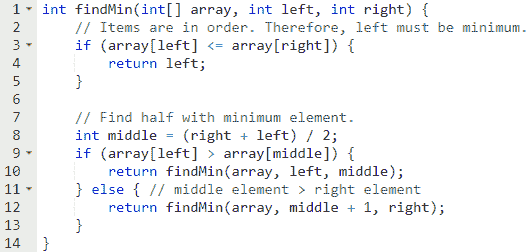

或者，我们可以用 while 循环迭代地实现这个算法。

像这样的问题，要非常小心你的终止和递归条件。想想你为什么让左=中+ 1(为什么是+1？)但是右=中。这些是容易出错的地方。

上述两种解决方案的时间复杂度都是 **O(log N)** 。

# **图形搜索**

搜索一个图有两种常见的算法:深度优先搜索和广度优先搜索。

1.  **深度优先搜索**

在深度优先搜索中，我们将完全搜索节点的第一个子节点，然后再搜索第二个、第三个子节点，依此类推。例如，假设一个节点有两个孩子，A 和 b。如果我们搜索一个值 v，我们在检查 b 之前搜索 A(和连接到 A 的节点)。由于这个原因，它被称为“深度优先搜索”;我们先深入再拓宽。

**2。广度优先搜索**

在深度优先搜索中，我们先宽后深。如果我们从一个初始节点 R 开始，我们首先检查 R，以及所有直接连接到 R 的节点(让我们称这些为“子节点”)。然后，我们向外扩展我们的搜索，搜索连接到 R 的子节点的所有节点。我们重复这个过程，直到我们找到这个值或者完成了整个[子]图的搜索。

我们需要小心，不要在两种算法中永远绕圈子。因此，如果图中存在循环，也就是说，如果从一个节点到另一个节点有多条路径，我们需要将这些节点标记为“已经访问过”，以确保我们不会重复搜索同一个节点。这对于树来说不是问题，因为树中没有循环。

请注意，一个图*可以有两个完全独立的不相连的部分。如果是这种情况，我们需要对每个组件执行我们的搜索算法，以确保我们找到我们正在寻找的项目。*

## **问题 5—** 使用深度优先搜索，**检查树是否包含值**。

深度优先搜索的工作原理是检查值 v 是否等于当前节点的值。如果不是，则逐个搜索节点的每个子节点。

深度优先搜索(DFS)和广度优先搜索(BFS)的区别在于，在 DFS 中，在移动到节点的任何其他子节点之前，会搜索节点的子节点的整个子树。即所有的 *node.child[0]。甚至在您查看 *node.child[1]之前，就会搜索子节点*。*

我们可以递归地实现它。

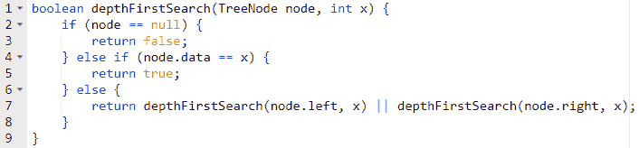

因为这是一棵树，我们不需要关心无限循环。也就是说，我们不需要担心遍历 node 的子节点和 node 的“孙节点”,并意外地返回 node——永远陷入无限循环(哎呀！).树木明确禁止这样的循环。

如果不是这样，如果我们是在一个图中而不是在一棵树中，我们就必须使用 isVisited 标志来表示我们已经访问了这个节点。

## **问题 6—** 为二叉树上的**广度优先搜索**写伪代码。

我们希望逐层搜索一个节点来执行广度优先搜索。我们希望在搜索任何*的*子节点之前，先搜索每个节点的子节点。

您可能还记得，队列是一种数据结构，它允许我们在一端添加条目，在另一端删除条目。这使我们能够将节点标记为“待以后处理”

在 BFS 中，我们通过比较正在搜索的值(x)和当前值来“访问”一个节点。如果匹配，我们就完成了，可以立即返回 true。否则，我们将节点的子节点添加到队列的末尾。然后我们继续前进，从另一边拉出一个节点并搜索它。

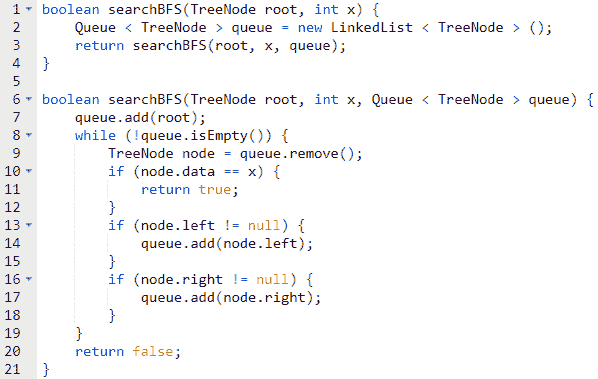

因为这是一棵树，我们不需要担心缠绕在一个循环中。然而，如果不是这种情况，我们将需要使用一个 *isVisited* 标志来避免再次访问同一个节点。

广度优先搜索花费 **O(N)时间**，其中 N 是图(或树)中节点的数量。这是因为我们可能需要搜索所有的节点。