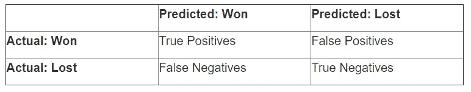
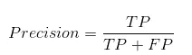
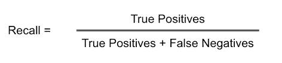
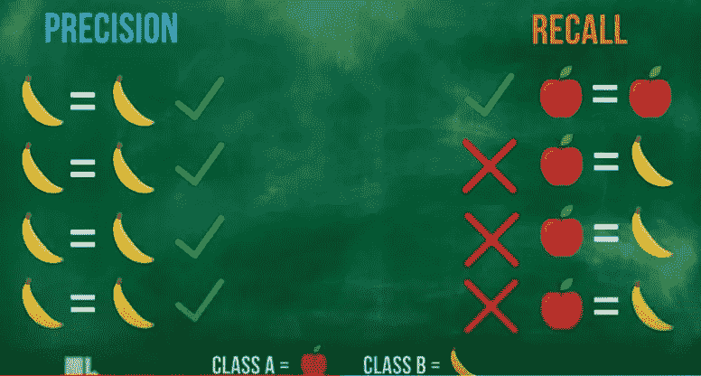

# 分类模型的准确性—第 1 集

> 原文：<https://medium.com/codex/all-about-classification-models-accuracy-episode-1-18ccdf6ccf6d?source=collection_archive---------23----------------------->

## [法典](http://medium.com/codex)

由[艾米丽·莫特](https://unsplash.com/@emilymorter?utm_source=medium&utm_medium=referral)在 [Unsplash](https://unsplash.com?utm_source=medium&utm_medium=referral) 上拍摄的照片

大家好，我们将看看数据科学领域中与分类问题相关的最容易混淆的概念，称为“混淆矩阵”。

下面是这篇文章的索引。

## 第一集

> 1.什么是混淆矩阵？
> 
> 2.准确度分数是多少？
> 
> 3.如果我们已经有了混淆矩阵，为什么还需要进动和回忆？
> 
> 4.什么是精准？
> 
> 5.什么是回忆或敏感度或真阳性率？
> 
> 6.F1 分数或骰子相似系数(DSC)是多少？

## 第二集

> 7.什么是特异性？
> 
> 8.什么是假阳性率？
> 
> 9.什么是假阴性率？
> 
> 10.什么是第一类错误？
> 
> 11.什么是第二类错误？
> 
> 11.什么是 ROC 曲线？
> 
> 12.什么是 AUC 曲线？

# **什么是混淆矩阵？**

混淆矩阵显示了我们的分类模型混淆和做出预测的 4 种方式。

## 下面是四种方式。

**真阳性(TP)** :分类器正确预测印度会赢，印度确实赢了。

**真否定(TN)** :分类器正确预测印度不会赢，印度没有赢的时候。

**假阳性(FP)** :当分类器错误地预测印度不会赢，但印度最终赢得了比赛。

**假阴性(FN)** :当分类器错误地预测印度会赢，但印度最终输掉了比赛。

厘米

# **什么是准确度分数？**

它是预测总数乘以正确预测数。

下面是公式。
准确率得分=(真阳性+真阴性)/(真阳性+真阴性+假阳性+假阴性)

# 如果我们已经有了混淆矩阵，为什么我们还需要进动和回忆？

有时您可能更喜欢更简洁的指标。

下面是回答这个问题的两个要点。

1.  人们希望看到模型相对于实际正面结果的真实准确性。
2.  人们希望看到模型相对于预测的正面结果的真实准确性。

# 什么是精准？

在全部阳性病例中，有多少是阳性正确的。精度较高的模型有利于在完全肯定的情况下预测肯定正确。

精确

# 什么是回忆或敏感度或真阳性率？

在所有阳性预测病例中，有多少是阳性正确的。高召回率——模型擅长在全部肯定预测案例中预测肯定正确。

回忆

# F1 分数或骰子相似系数(DSC)是多少？

让我们考虑一个场景，其中模型在预测一个类别时具有高精度，而在预测另一个类别时具有低召回率。

高精度和低召回率

所以这里我们需要基于这个条件来平衡我们的准确度，所以我们结合了召回率和准确度的结果。

## 两种情况

1.  F1 得分= 1 表示完美的精确度和召回率。
2.  F1 得分= 0 表示精确度或召回率为零。

## 公式

*   F1 得分= 2TP / (2TP + FP + FN)或
*   F1 得分= 2 *(精确度*召回率)/(精确度+召回率)

## 分类准确率第一集我觉得已经足够了。我希望我没有吊你的胃口。

其他媒体文章

 [## 分类模型的准确性—第 2 集

### 你好，这一切都是“关于分类模型的准确性”的第 2 集。去之前请先看第一集…

kishantongs.medium.com](https://kishantongs.medium.com/all-about-classification-models-accuracy-episode-2-84538a194eb)  [## Python 中的数据预处理。

### 喂，伙计们你们听到了吗，看到上面的术语数据预处理了吗？那些我们想成为数据科学家或数据…

kishantongs.medium.com](https://kishantongs.medium.com/data-preprocessing-in-python-6cf7885fc2af)  [## python 中数据集的数据切片或索引。

### 嘿，伙计们，这是一个非常基础和重要的部分。在对数据集执行任何操作之前，我们应该了解一些…

kishantongs.medium.com](https://kishantongs.medium.com/data-slicing-or-indexing-in-python-on-datasets-dd9b345734ac)  [## 数字和非数字 PDF 分离器— Python

### pdf 提取方法有一个问题。当我们使用像 PyPDF2，Pdfplumber 这样的普通库时…

kishantongs.medium.com](https://kishantongs.medium.com/digital-and-non-digital-pdf-segregator-python-35308e1ae3fa)  [## 文档的语言标识符— Adv NLP 和 Python

### 在基于 NLP 的应用程序中，我们必须处理不同的输入文件。那么关于……的鉴定呢

kishantongs.medium.com](https://kishantongs.medium.com/documents-language-identifier-adv-nlp-and-python-6a6fcfd78adb)  [## 数据分析:任何数据集的初始步骤(版本 1)

### 我们经常在阅读一本没有索引的书时感到困惑。

kishantongs.medium.com](https://kishantongs.medium.com/data-analysis-initial-steps-for-any-dataset-version-1-286a1133bedb)  [## 数据分析:任何数据集的初始步骤(版本 1)

### 我们经常在阅读一本没有索引的书时感到困惑。

kishantongs.medium.com](https://kishantongs.medium.com/data-analysis-initial-steps-for-any-dataset-version-1-286a1133bedb)  [## 随机数生成:Numpy

### 随意的:没有方法或有意识的决定而制造、完成、发生或选择的。

kishantongs.medium.com](https://kishantongs.medium.com/random-number-generation-numpy-ef6338720a0e) 

社会联系

链接在:linkedin.com/in/kishan-tongrao-6b9201112

facebook.com/profile.php?脸书 id=100009125915876

推特:twitter.com/kishantongs