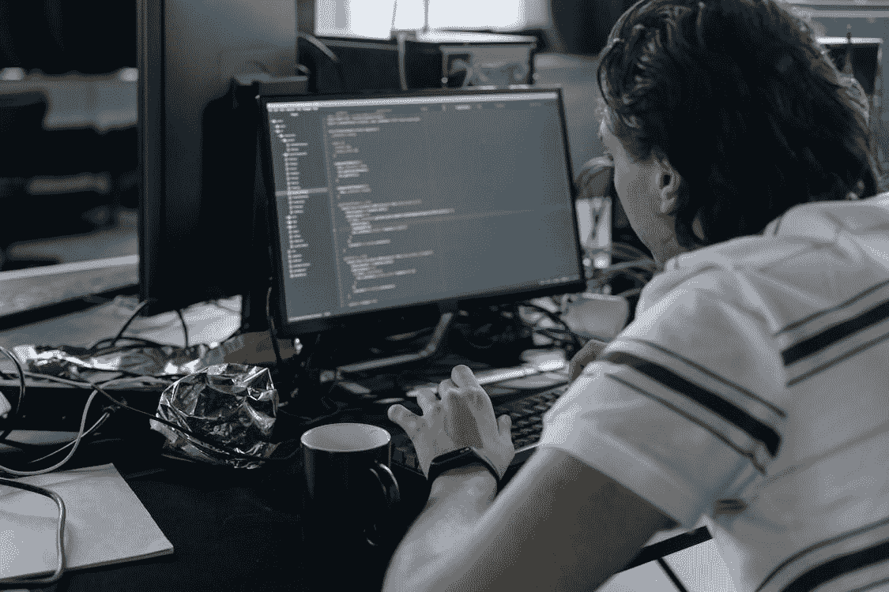

# 所有代码都需要维护:是的，包括测试

> 原文：<https://medium.com/codex/all-code-requires-maintenance-yes-including-tests-1e2674fcbda2?source=collection_archive---------19----------------------->

*免责声明:所有观点都是我自己的*

来自 [Pexels](https://www.pexels.com/photo/man-in-white-t-shirt-sitting-in-front-of-black-flat-screen-computer-monitor-6804604/?utm_content=attributionCopyText&utm_medium=referral&utm_source=pexels) 的 [cottonbro](https://www.pexels.com/@cottonbro?utm_content=attributionCopyText&utm_medium=referral&utm_source=pexels) 摄影

所有的代码都需要维护，这包括所有的测试代码。

人们很容易认为测试是一次性支出。这些年来，我听到许多工程师说，“我们几乎完成了 UI 测试的编写。”潜台词是，“然后我们将让它们运行并转移到另一个项目。”