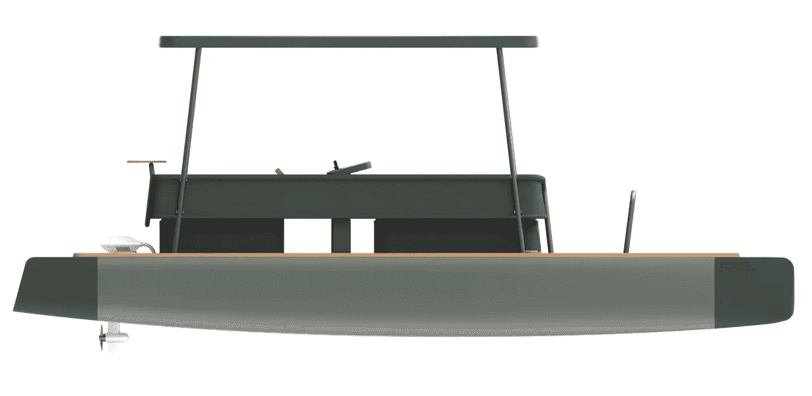

# 在 Pol Lux 双体船上享受全天候水上乐趣

> 原文：<https://medium.com/codex/all-day-and-night-fun-on-the-water-with-the-pol-lux-catamaran-3b80b3df3c7?source=collection_archive---------7----------------------->

## 完全太阳能/电力的体验

[Pol Lux(媒体通过 Pol 船)](https://d2kq0urxkarztv.cloudfront.net/61960ffcd36464002cb6ea38/3244498/upload-721a9388-664b-4bb6-9c4e-7a3eb84ef33e.png?e=webp&nll=true)

今年早些时候，由瑞典设计的 Pol Lux 为首的一种新型适于航海的船只首次亮相。这种独特的休闲车具有稳定的双体船平台，通过太阳能电池板充电的电动动力系统，可展开的帐篷，模块化的甲板布局和水上吊床休息室。这是一个新的…