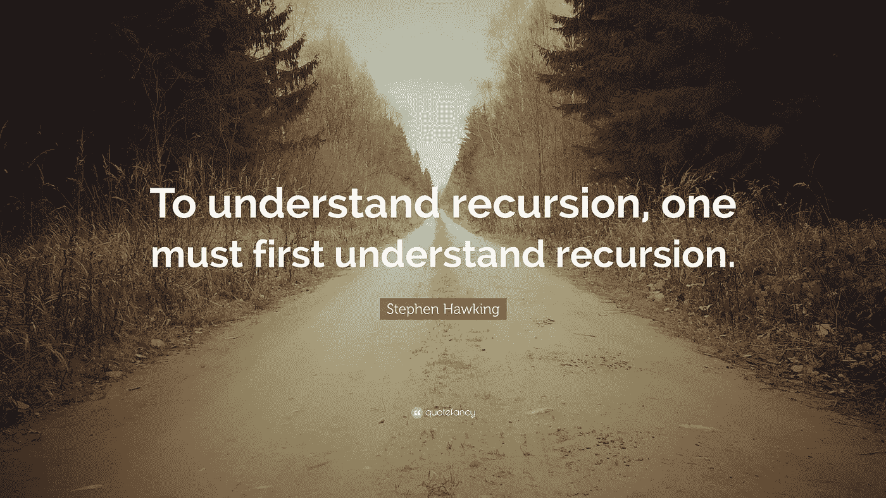

# 关于递归，我们只需要知道！

> 原文：<https://medium.com/codex/all-one-needs-to-know-about-recursion-f195593081bc?source=collection_archive---------13----------------------->

## [法典](http://medium.com/codex)

你可以从其中一位大师那里读到一句名言。

> **要理解递归，首先必须理解递归——斯蒂芬·霍金**

所以，我们先来理解一下递归。

# **什么是递归？**