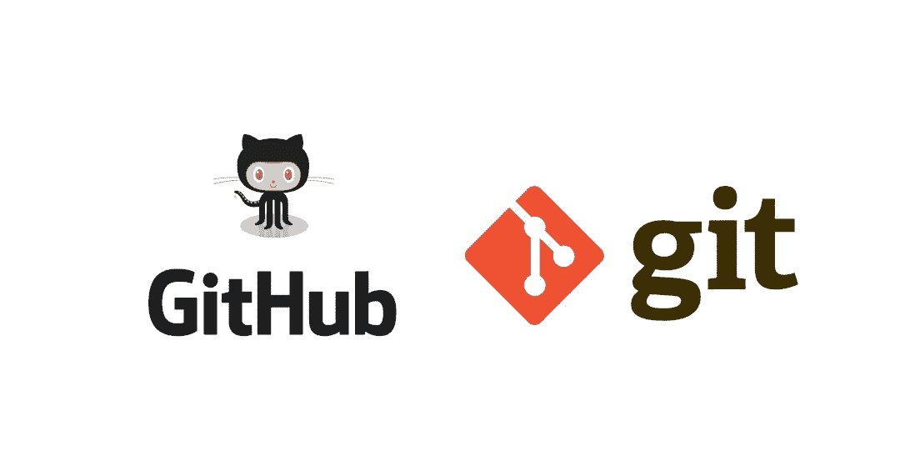
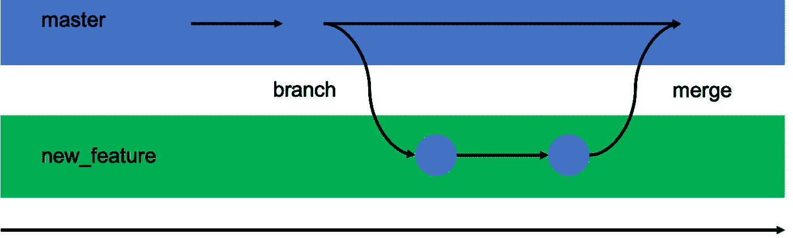

# Git 和 GitHub 一气呵成！

> 原文：<https://medium.com/codex/all-you-need-to-know-about-git-and-github-5bc7276094b8?source=collection_archive---------10----------------------->

这篇文章将帮助你如何在你的项目中使用 Git & GitHub，有助于开源，没有先决条件。



让我们从 Git & GitHub 的基础知识开始，涵盖所有基本命令，包括分支、拉请求、分叉等概念。我们还将涵盖其他概念，如挤压、解决合并冲突、保持代码同步等等。

假设你已经有了 GitHub 的账号。如果没有，请创建一个。

**我们开始吧！**

**下载 git**

请参考下面的链接，该链接详细介绍了如何在多个操作系统中安装 Git:
[**https://Git-SCM . com/book/en/v2/Getting-Started-Installing-Git**](https://git-scm.com/book/en/v2/Getting-Started-Installing-Git)

要验证是否安装了 Git，请在命令提示符下使用下面的命令:

```
$ git --version
```

第一次在系统中使用 git 时，使用以下命令设置全局配置:

```
$ git config —-global user.name “[firstname lastname]”
$ git config --global user.email “[valid-email]”
```

为您的项目创建一个文件夹。让我们将项目文件夹称为 GitPractice。我用的是 git bash，所有的命令都可以用。

```
$ mkdir GitPractice // Create a file
$ cd GitPractice // Change directory
```

我目前在 GitPractice 目录/文件夹中。

1. **git init** 命令将本地 git 存储库添加到项目中。

```
GitPractice$ git init // Initialises an existing directory as Git repository(local repository)GitPractice$ ls -a // Shows hidden files (starting with .files)GitPractice$ ls .git //shows git files
```

2.现在让我们添加一些小代码。

在 GitPractice 文件夹中创建一个名为 gitdemo.txt 的文件。

```
GitPractice$ touch gitdemo.txt //touch command creates files
```

由于本文的主要焦点是 Git，而不是任何特定的编程语言，为了使事情更简单，我们将用纯文本而不是实际代码进行演示。

3.准备和提交代码。

**提交**是将代码添加到本地存储库的过程。在提交之前，代码必须在临时区域中。

**暂存区**跟踪所有要提交的文件。

任何未添加到临时区域的文件都不会被提交。这使得开发人员可以控制哪些文件需要提交。

**分段——使用 git 添加命令**

让我们将 gitdemo.txt 添加到临时区域，然后提交它。

```
GitPractice$ git add gitdemo.txt //gitdemo.txt is now added to the staging area
```

如果要将项目文件夹中的所有文件添加到临时区域，请使用以下命令:

```
GitPractice$ git add .
```

如果您想将多个文件添加到临时区域，

```
GitPractice$ git add file1 file2 file3
```

**提交—使用 git 提交命令**

```
GitPractice$ git commit -m "added gitdemo.txt"
```

“added gitdemo.txt”是这里的提交消息。输入相关的提交消息，以指示在此特定提交中进行了哪些代码更改。

**git stash**

git add 命令将文件添加到临时区域，然后使用 git commit 命令提交文件。有时，如果我们想从暂存区移除文件或变更，我们使用 **git stash** 命令。

假设登台区是一个舞台。有时，当文件在暂存区域时，我们不想提交它们。在这种情况下，我们可以使用 **git stash** 命令从暂存区中删除文件。(认为 stage 中的文件将被移到后台)。

```
GitPractice$ git stash //files not committed will be removed from the staging area.
```

有时，您需要后台的那些文件:

```
GitPractice$ git stash pop //backstage to staging area
```

有时候，你需要从后台删除这些文件:

```
GitPractice$ git stash clear //remove from backstage
```

现在，通过添加一些内容来修改文件 **gitdemo.txt** :

(假设我将下面的内容添加到 gitdemo.txt 中)

```
GitHub...yep, that's it.
```

# Git 状态和 Git 日志

## 状态

使用 git status 命令找出关于修改了哪些文件以及暂存区中有哪些文件的信息——它还显示了其他信息，我们现在可以忽略这些信息。

```
GitPractice$ git status
```

状态显示 **gitdemo.txt** 被修改，还不在暂存区。

```
Changes not staged for commit:(use “git add <file>…” to update what will be committed)(use “git restore <file>…” to discard changes in working directory)modified: gitdemo.txtno changes added to commit (use “git add” and/or “git commit -a”)
```

现在让我们将 **gitdemo.txt** 添加到暂存区，并使用以下命令提交它:

```
git add gitdemo.txt git commit -m "gitdemo.txt file modified"
```

我们可以像以前一样，用一个命令或分别添加和提交更改。

# 原木

使用 git log 命令打印出所有已经完成的提交。

```
GitPractice$ git log
```

该日志显示了每次提交的作者、提交日期和提交消息。

```
commit 593f2aa80f7410b0c24154e9d0b7831c3ebabd7c (**HEAD -> feature2**, **origin/feature2**, **feature**)Date:   Mon Aug 2 09:40:56 2021 +0530modified names.txt filecommit 08f04ab5b07e8262ca8671e0cf1ce1170c3c3543 (**origin/feature**, **master**)Date:   Mon Aug 2 09:38:21 2021 +0530file added
```

每个提交都建立在其他提交的基础上。而且，每个提交都有一个唯一的散列 ID。

假设有 3 个提交 c1、c2 和 c3。要删除提交，请使用 reset 命令。

```
GitPractice$ git reset <hashid_c3> //removes all commits above c3 (c1 and c2 are removed)GitPractice$ git commit
```

# 分支

默认情况下，Git 提交进入**主**分支。

## 什么是分支？

分支只不过是指向 Git 存储库中最新提交的指针。所以目前我们的主分支是指向第二次提交“gitdemo.txt 文件修改”的指针。

```
GitPractice$ git branch new_feature //created a new branch named new_feature
```

## 为什么需要多个分支？

需要多个分支来支持并行开发。

默认情况下，main 是所有人使用的代码。如果一个人把有 bug 的代码推到主页面，也会影响到其他用户。所以，最好创建一个新的分支。

头(指针)最初指向主体。(master 被重命名为 main)。



创建一个分支后，要将头切换到 new_feature 分支，请检出 new_feature 分支。

```
GitPractice$ git checkout new_feature
```

头指向 new_feature 分支。当 head 指向 new_feature 分支时，提交将被添加到 new_feature 分支。

```
GitPractice$ git branch //lists out all branches in local
```

## 在新分支中执行一些提交

通过添加以下代码片段来修改 gitdemo.txt:

```
new branch created...
```

现在，使用一个命令准备并提交:

```
GitPractice$ git commit -am "new Branch Commit"
```

该提交是在新特征分支中完成的，现在新特征分支比主分支领先 1 个提交，因为新特征分支还包括来自主分支的 2 个提交。

记住，永远不要在 main 上提交，创建自己的分支。

您可以使用以下命令验证测试分支中的提交历史记录:

```
GitPractice$ git log
```

# 合并

目前，new_feature 分支领先于主分支 1 个提交。假设现在我们想要合并 new_feature 分支中的所有代码，并将其带回主分支。

首先回到主分支:

```
GitPractice$ git checkout master
```

然后使用合并命令:

```
GitPractice$ git merge new_feature
```

现在，合并应该成功了。在本例中，没有冲突。

但是在实际的项目中，当合并正在进行时会有冲突。

冲突是手动解决的。解决冲突是需要经验的，所以随着你更多地使用 Git，你将能够找到解决冲突的窍门。

现在运行 git log，您会注意到 master 也有 3 次提交。

# **GitHub 远程仓库**

创建一个存储库并从 GitHub 获取 url。

以便将所有代码从本地存储库推送到远程存储库。

```
GitPractice$ git remote add origin [repository url]GitPractice$ git remote remove origin //remove remote
```

# **Git 推送**

为了将所有代码从本地存储库推送到主分支远程存储库，使用 git push 命令。

```
GitPractice$ git push -u origin master //head points on master
```

Git 已经移除了对密码认证的支持，所以我们需要使用个人访问令牌。

```
GitPractice$  
git push https://$(git_token)@github.com/user_name/repo_name
```

# **Git Pull**

要将最新的变更从远程存储库拉入本地存储库，可以使用 git pull 命令。

```
GitPractice$ git pull origin master
```

## Git 克隆

要将现有的远程存储库克隆到您的计算机中，请使用 git clone 命令。

```
GitPractice$ git clone [repository url]
```

# **重设基础**

要返回一次提交，请使用 rebase 命令。

# **在推送到 Git 之前组合多个提交**

如果您有很多提交，而您只想压缩最后的 X 个提交，那么找到您想要开始压缩的提交的提交 ID。

```
GitPractice$ git rebase -i <commit_hash_id>
```

假设有四个提交，c1、c2、c3、c4，c1 位于所有提交的顶部。因此，给定上面命令中的 c1 hashid，c2、c3、c4 提交将合并为 c1 提交(使用 git log 命令查看所有提交)。

另一种方法:

Git 中的 squash 意味着将多个提交合并成一个。

```
GitPractice$ git rebase -i commithashid
```

这将打开您的文本编辑器(`-i`代表“交互式”)和一个如下所示的文件:

```
pick 16b5fcc Code in, tests not passing
pick c964dea Getting closer
pick 06cf8ee Something changed
pick 396b4a3 Tests pass
pick 9be7fdb Better comments
pick 7dba9cb All done
```

将所有的`pick`更改为`squash`(或`s`)，将所有提交的提交消息合并成一个大的提交消息:

```
pick 16b5fcc Code in, tests not passing
squash c964dea Getting closer
squash 06cf8ee Something changed
pick 396b4a3 Tests pass
squash 9be7fdb Better comments
squash 7dba9cb All done
```

创建了两个大的提交。提交`c964dea`和`06cf8ee`合并为`16b5fcc`，`9be7fdb`和`7dba9cb`合并为`396b4a3`。

# **分叉**

这对于开源贡献是有用的。

GitHub fork 是一个存储库的副本，它位于您的帐户中，而不是您获取数据的帐户。一旦您分叉了一个存储库，您就拥有了您的分叉副本，并且您可以编辑分叉存储库的内容，而不会影响父存储库。

**来源** —指您自己的网址

**上游** —指分叉所有者 url(从它分叉的地方)。

```
GitPractice$ git remote add upstream [repository url]
```

**吉特拉**

```
git pull origin master
```

如果您已经进行了更改，并且希望避免添加新的合并提交，请使用 git pull — rebase。

```
GitPractice$ git pull — rebase origin master
```

**git pull——rebase**将会工作，即使你没有做任何改变，这可能是你最好的选择。

**Git 推送**

```
GitPractice$ git push -u upstream master //fails to push as you don't have the owner access.
```

请记住，您将无权推送至上游 URL/存储库。

因此，首先将代码推送到您的本地存储库。

```
GitPractice$ git push origin branch_name
```

如果您正在推送至现有分支，请使用强制推送。

```
GitPractice$ git push origin branch_name -f
```

要推送到上游，请创建一个拉取请求。(你会在 GitHub 的分叉库上找到这个按钮)

上游 url 的所有者将审查和合并拉请求(PR)。

如果一个分支已经有一个相关联的拉请求，则不允许另一个拉请求。在这种情况下，创建另一个分支并发出一个拉请求。

为了确保工作是分布式的，gitHub 添加了这个约束。

因此，一个分支，一个拉请求。

如果上游得到更新，我们的远程分叉存储库将不会自动更新。在我们的远程存储库中，将有按钮**“获取上游”**来更新。

另一种方法是，

```
GitPractice$ git fetch --all --prune (local files will be updated as the upstream remote)
```

**删除标签** —在获取之前，删除任何不再存在于遥控器上的远程跟踪引用。

更多命令请参考 [Git 备忘单](https://github.com/priyasdamodharan/CheatSheet/blob/main/git-cheat-sheet-education.pdf)。

现在您已经知道了如何使用 Git 的基本知识，继续探索更多吧！

***希望有帮助:)***

谢谢，

普丽娅。