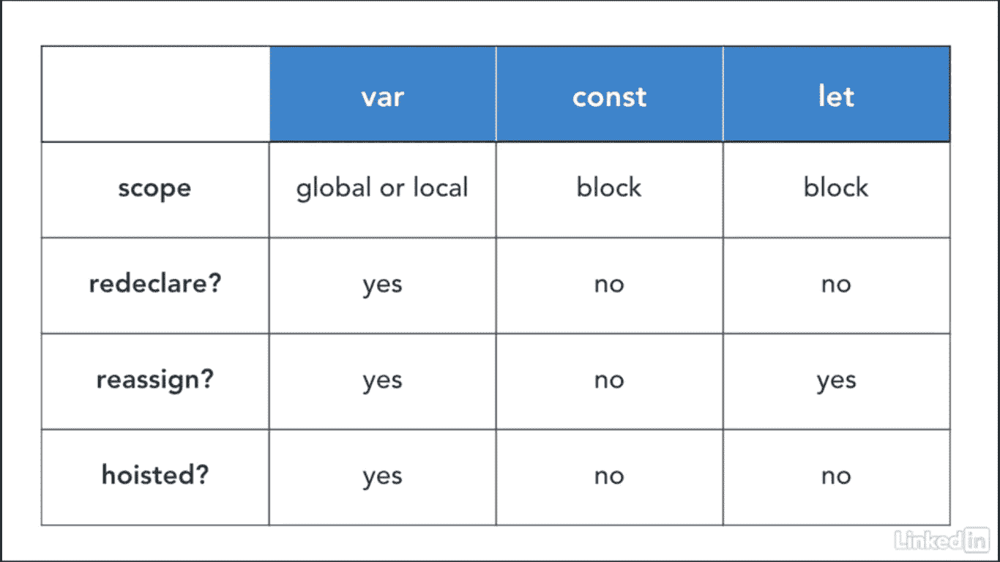

# 关于现代 JavaScript，你需要知道的

> 原文：<https://medium.com/codex/all-you-need-to-know-about-modern-javascript-c4789ca22d90?source=collection_archive---------16----------------------->


# 让我们直接进入 ECMA 脚本

ECMA( *欧洲计算机制造商协会*)脚本是一个官方规范，本质上是通用的。JavaScript 符合 ECMA 脚本规范，这使得 JavaScript **可以跨 web 浏览器互操作**。

被称为 TC39 的 ECMA 文字技术委员会每年发布*ECMA 文字的*版本，现代浏览器每年实现**新功能**。ES6 是 ECMA 脚本 2015 的版本。

# JavaScript 变量和块范围

在 ES2015 之前， **JavaScript** 只支持*函数级作用域*，不像 C++/Java 等其他语言有块级作用域。在 ES2015 中，除了函数级作用域，JavaScript **还支持**块级作用域。

## 什么是块范围？

块范围由一对花括号创建，即{}。它可以应用于变量、if 语句和 for 语句。

```
//variable
{const v=45    //Block Scope}//if-statement
if(!x){
  return;      //Block Scope
}//for-statement
for(const x=0; x>5; x++){
               //Block Scope
}
```

## 使用 Const vs Let 的变量声明

ES6 附带的一个特性是增加了`let`和`const`，可以用于变量声明。那么`let`和`const`与`var`有什么不同呢？

变量的重新定义导致了代码中的许多错误，因为开发人员知道或不知道定义了相同的命名变量。

`let`和`const`阻止你重新声明，但是它们之间也有细微的差别。



var、const 和 let 之间的差异

# 箭头功能

在 JavaScript 中有许多定义函数的方法，但是现代规范引入了一种新的方法——箭头函数。

> 这是一种不用键入关键字 function 而是使用箭头符号( **= >** )来定义函数的方法

```
//Normal function definitionconst a = function(){
  //Code Here
} //Arrow Function definitionconst b = () => {
  //Code Here
}
```

箭头函数的最大用途是在**延迟执行**中，如事件监听器或事件处理程序。

# 对象文字

JavaScript 对象文字是用花括号括起来的逗号分隔的名称-值对列表。对象文字封装数据，将其封装在一个整洁的包中。这最大限度地减少了全局变量的使用，全局变量在组合代码时会导致问题。

例子

```
const myObject = {
    sProp: 'some string value',
    numProp: 2,
    bProp: false
};
```

> 对象文本属性值可以是任何数据类型，包括数组文本、函数和嵌套的对象文本。

# JavaScript 中的去结构化赋值

**去结构化赋值**语法是一个 JavaScript 表达式，它可以将值从以下类型解包到不同的变量中:

*   数组
*   对象的属性
*   功能

## 基本数组去结构化

如果我们想从数组中提取数据，使用去结构化赋值是非常简单的。

```
let introduction = ["Hello", "I" , "am", "Eb"];
let [greeting, pronoun] = introduction;

console.log(greeting);//"Hello"
console.log(pronoun);//"I"
```

## 对象去结构化

假设我们想从一个对象中提取数据并赋给新的变量。在 ES6 之前，这是如何实现的？

```
const user = {
    id: 42,
    is_verified: true
};

const {id, is_verified} = user;

console.log(id); // 42
console.log(is_verified); // true
```

## 用函数分解赋值

我们也可以从函数返回的数组中提取数据。假设我们有一个函数返回一个数组，如下例所示:

```
function getArray() {
    return ["Hello", "I" , "am", "Eb"];
} 
let [greeting, pronoun] = getArray();console.log(greeting);//"Hello"
console.log(pronoun);//"I"
```

# 静止在对象分解中

rest 语法还可以用来挑选非结构化模式尚未挑选的属性键。这些键及其值被复制到一个新对象中:

```
let person = {name: "Eb", country: "Pakistan", job: "Developer" friends: ["Miki", "Meh"]};

let {name, friends, ...others} = person;

console.log(name);//"Eb"
console.log(friends);//["Miki", "Meh"]
console.log(others);// {country: "Pakistan", job: "Developer"}
```

这里的 rest 语法是`...others`。`others`可以重命名任何变量。

# 模板字符串

ES6 [模板字符串](https://www.chromestatus.com/feature/4743002513735680)引入了一种用特定领域语言(DSL)定义字符串的方法，带来了更好的:

*   字符串插值
*   嵌入式表达式
*   多行字符串
*   字符串格式
*   字符串标记的安全 HTML 转义，本地化和更多。

**语法:**

模板字符串使用反勾号(````)，而不是我们习惯的普通字符串的单引号或双引号。因此，模板字符串可以写成如下形式:

```
const greeting = `Asalam!`;
```

## 使用模板字符串进行字符串替换

模板字符串可以包含占位符，用于使用`${ }`语法进行字符串替换，如下所示:

```
// Simple string substitution
let name = "Eb";
console.log(`Salam, ${name}!`); 
```

## 使用模板字符串的多行字符串

一段时间以来，JavaScript 中的多行字符串需要一些巧妙的解决方法，在每个换行符前使用一个`\`(反斜杠)，或者使用字符串连接来伪造多行支持。例如:

```
var greeting = "Yo \
World";var greeting = "Yo " +
"World";
```

虽然这在大多数现代 JavaScript 引擎中应该工作得很好，但行为本身仍然有点不太好。

> 模板字符串大大简化了多行字符串。只需在需要的地方加入换行符，瞧！

```
console.log(`string text line 1
string text line 2`);
```

反斜杠语法中的任何空格也将被视为字符串的一部分。

# ES6 中的类别

类是用于创建对象的*模板。他们用代码封装数据来处理这些数据。*

JS 中的类是建立在原型之上的，但是也有一些语法和语义是 ES5 类语义所没有的。

## 类声明

定义类的一种方法是使用**类声明**。要声明一个类，可以使用带有类名的`class`关键字(这里是“Rectangle”)。

```
class Rectangle {
  constructor(height, width) {
    this.height = height;
    this.width = width;
  }
}
```

# 带有“异步和等待”的异步编程

JavaScript 语言最近增加的是 ECMAScript 2017 中添加的[异步函数](https://developer.mozilla.org/en-US/docs/Web/JavaScript/Reference/Statements/async_function)和`[await](https://developer.mozilla.org/en-US/docs/Web/JavaScript/Reference/Operators/await)`关键字。

## 异步关键字

在函数声明的前面键入`async`关键字，将它变成一个[异步函数](https://developer.mozilla.org/en-US/docs/Web/JavaScript/Reference/Statements/async_function)。

一个异步函数会期望使用`await`关键字来调用异步代码。

下面是普通函数和异步函数的比较:

```
//Normal Function
function hello() { return "Hello" };
hello();//Async Function
async function hello() { return "Hello" };
hello();
```

## await 关键字

异步函数只有在与 [await](https://developer.mozilla.org/en-US/docs/Web/JavaScript/Reference/Operators/await) 关键字一起使用时才变得明显。`await`仅适用于常规 JavaScript 代码中的异步函数。

`await`可以放在任何基于异步承诺的函数前面，暂停代码直到承诺实现，然后返回结果值。

这里有一个简单的例子:

```
async function hello() {
  return greeting = await Promise.resolve("Hello");
};hello().then(alert);
```

感谢你阅读这篇文章，我希望你喜欢并且今天学到了一些新的东西。如果您有任何问题，请随时通过我的博客联系我，我将非常乐意帮助您。

保持安全和愉快的学习！