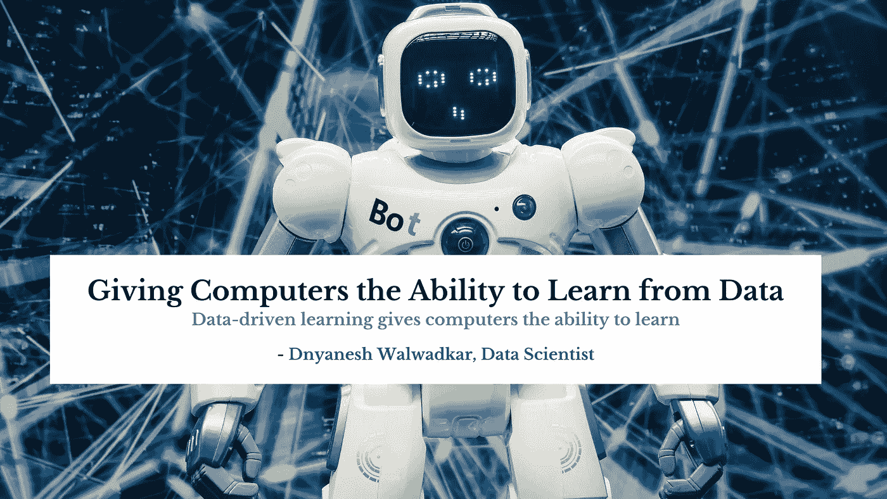

# 让计算机从数据中学习:21 世纪的黄金

> 原文：<https://medium.com/codex/allowing-computers-to-learn-from-data-gold-of-21st-century-62ceaf78813a?source=collection_archive---------11----------------------->

## **数据驱动学习赋予计算机学习的能力**

作为一名数据科学家，我认为机器学习，即能够理解数据的算法的应用和科学，是计算机科学中最令人兴奋的领域。作为一个社会，我们生活在一个数据丰富的时代，我们可以通过使用机器学习领域的自学习算法将这些数据转化为知识。近年来开发的大量强大的开源算法使得现在成为我们学习更多关于机器学习的最佳时机，并学习如何使用它们来发现数据中的模式并预测未来事件，在许多有用的开源库创建之前可能不是这样。

## 建造能够通过使用智能算法从数据中产生知识的机器

尽管我们生活在一个现代技术的时代，但有一种资源是任何人都可以充分利用的:大量的结构化和非结构化数据。20 世纪下半叶发展起来的人工智能的一个子领域是机器学习。它涉及开发自学习算法，从大量数据中提取知识，以便做出预测。

通过捕获数据中的知识来逐步提高预测模型的性能并做出数据驱动的决策，机器学习提供了一种比手动提取规则、从大量数据中构建模型并将其包含在大型数据库中更有效的替代方法。

除了机器学习在计算机科学研究领域越来越重要之外，它在我们的日常生活中也有着越来越重要的意义。多亏了机器学习，很多事情都成为可能。垃圾邮件过滤器、文本和语音识别文件、高可靠性的搜索引擎、富有挑战性的象棋引擎，以及安全高效的自动驾驶汽车，希望不久就能实现。

# 学习如何使用监督学习对未来做出准确的预测

监督学习的主要目标是学习一个基于标记训练数据的模型，我们可以用它来预测尚不存在的新数据。在该上下文中，术语“受监督的”用于指一组样本，其中已标记的输出将已经被预先确定。

以电子邮件的反垃圾邮件过滤为例，我们可以利用有监督的机器学习算法，通过使用标记电子邮件的语料库来预测给定的电子邮件是否属于已经被正确标记为垃圾邮件或不是垃圾邮件的两个类别中的任何一个。与前面的电子邮件垃圾邮件过滤示例一样，具有离散类别标签的监督学习任务也可以称为分类任务。还有一个被称为回归的监督学习子类，其中算法给出的结果信号是连续的。

# 用强化学习解决交互式问题

指的是如何通过强化学习解决交互问题的学习。另一方面，强化学习是关于开发一种智能体，这种智能体由于与环境的交互作用而在性能上有所增长。应该注意的是，由于关于环境当前状态的信息也可能包括所谓的奖励信号，所以强化学习可以被视为监督学习的一个分支。然而，当涉及到强化学习时，这种反馈并不是正确的基础事实标签或价值。更确切地说，这是一个衡量奖励功能如何衡量行为的标准。当代理与环境交互时，它可以使用强化学习技术来学习一系列的动作，这些动作通过基于试错法的与环境的探索性交互或通过深思熟虑的计划来最大化回报。

# 通过无监督学习发现隐藏结构

监督学习的原理是，当我们训练我们的模型时，我们将从一开始就知道正确的答案，而在强化学习中，我们将定义一个奖励系统，对代理采取的行动进行奖励。然而，在无监督学习中，我们必须处理未标记的数据或结构未知的数据。在这项研究中，我们使用无监督学习技术来探索我们数据集的结构，以提取有意义的信息，而无需已知结果变量或奖励函数的指导。

# 通过聚类，我们可以找到子群

顾名思义，聚类是一种在探索性数据分析中使用的技术，用于将一组信息分组到有意义的子组(聚类)中，而无需事先了解这些组的特征。例如，聚类让营销人员根据他们的兴趣发现客户群，以便开发针对他们的特定营销计划。由分析定义的聚类或组可以被认为是与其他聚类中的其他对象具有一定程度的相似性但具有更大程度的不相似性的一组对象，这就是聚类有时被称为“无监督分类”的原因共同创建集群是构建信息和构建知识的强大技术。

# 通过降维进行数据压缩

降维以及无监督学习是另一个研究子领域。我们通常处理的数据具有高维度的特点——每个观察都涉及大量的测量数据——这可能对数据存储以及机器学习算法的计算能力构成挑战。作为一种常用的特征预处理方法，无监督降维是一种可用于从数据中去除降低某些算法结果的噪声的技术，并且能够将数据压缩到更小的维度子空间中，同时保留大部分相关信息。

在某些情况下，也可以降低数据的维数，例如将高维特征集投影到一维、二维或三维图像上。借助于 3D 或 2D 散点图或直方图，我们可以将这些三维特征空间可视化。