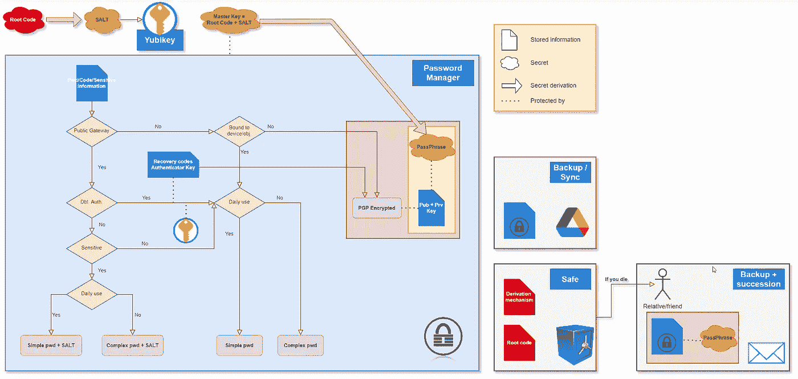
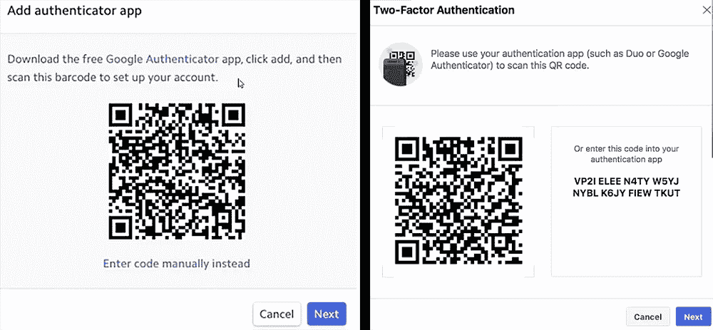

# 安全数字生活的终极密码管理指南

> 原文：<https://medium.com/codex/almost-ultimate-password-management-guide-for-a-safe-digital-life-55507dddd499?source=collection_archive---------15----------------------->


丹·尼尔森在 [Unsplash](https://unsplash.com?utm_source=medium&utm_medium=referral) 上拍摄的照片

> 简而言之，对于那些想要在数字生活安全方面达到更高水平的人，您可以在这里找到一个高级密码管理指南。

这篇文章也可以在我的博客上[找到。](https://jsgonsette.github.io/en/posts/ultimatepasswordguide/)

# 第一部分

由于我们越来越多地大量使用各种数字内容，数字生活安全这一难题在过去几年里变得更加复杂。由于我们的数据背后的金融风险有时可能非常巨大，所以从一开始就引起各种不道德的人的贪婪是正常的。不言而喻，即使各种机制已经到位，以更好地保护我们的数据，窃取它的技术从未停止发展的独创性。

已经有很多指南在讨论什么是区分好密码和坏密码，为什么需要在可能的情况下启用双因素身份验证，甚至如何使用密码管理器。所有这些提示应该能满足绝大多数用户，他们通常只想不受太多限制地访问他们的消息服务或他们最喜欢的社交网络。这些不同帐户的妥协可能看起来不是很严重，因为它通常归结为一些烦恼，以完全恢复它们。甚至像 PayPal 上的一个银行账户的黑客攻击似乎也影响有限，因为提供服务的组织会监视你，可以阻止或退还非法资金转移。

对于所有这些用户，我只建议遵循基本的经验法则:

*   使用密码管理器，目的是为每个帐户存储一个强而唯一的密码；
*   激活双因素身份验证；
*   安装最新的防病毒软件；
*   提防网络钓鱼技术和其他各种各样的骗局。

但是如果你继续阅读，也许你是少数看到这种极简主义方法固有缺点的人之一。也许您觉得需要保护“非常安全”还不够的数据，或者也许您必须应对超出标准用例的约束。

为了解决 2021 年每个人都会理解的一个具体案例，让我们想象一下，如果我再有一点远见，你就是我可能成为的加密货币百万富翁。这项技术基于公钥和私钥对的使用，后者是花钱的关键。在这里，如果你丢失了你的私人钥匙，或者有人偷走了你的私人钥匙并从你的账户中取走了你所有的钱，将不会有 PayPal 来拯救你。在这里，你是孤独的。

当然，在这种情况下，你不会错过投资电子钱包，以防止你的私人钥匙躺在一个潜在的损坏的 PC 上。但问题远未解决:这个钱包可能会被意外毁坏或丢失，因此您需要建立一个机制来保存您的恢复短语。然后推荐的方法是把它刻在金属板上，放在保险箱里(墨水和纸非常易碎，会随着时间的推移而变质)。这个过程是安全的，但是不太方便。此外，如果一些人走这条路来保护他们的加密货币，我怀疑他们也会走这条路来保护其他数字数据。我也很肯定，许多人会简化一些安全步骤，使他们的生活更容易，从而增加他们的脆弱性。那么，最后，如果你碰巧意外死亡，你真的希望你的资产和你一起消失吗？你不希望你的配偶或孩子能够从你的加密货币中受益吗？因为问题是，如果你没有提供一个专门的机制或指令来这样做，它肯定不会发生。

这只是众多例子中的一个，但它的优点是很明显。加密资产确实是数据的良好代表，我们希望在不使其完全不可访问的情况下对其进行特别保护。因此，网络安全是一个难以解决的问题，它当然需要花一点时间来和平地思考这个问题，处理好你自己的约束和目标。对我来说，在看了由 [Charles Hoskinson](https://www.youtube.com/watch?v=fqrAzBAi64c&t=4s) 制作的非常好的视频后，我花了一整天的时间来思考，在此我要感谢他。它激发了我的兴趣，但最重要的是它给了我许多提示和技巧，我将在这里再次使用。

## 可支配性、完整性和保密性三位一体

一个好的 IT 安全解决方案必须不可避免地基于可用性、完整性和保密性这三大支柱。不需要太多的细节，其他人会比我解释得更好，这些概念可以如下应用于我们的密码管理:

*   可发布性:信息必须在需要时能被相关人员获取。然后，整个问题归结为使我们的密码可用，同时确保其完整性和保密性。例如，如果你把这些信息写在便利贴上，贴在你的键盘下，这些信息是很容易得到的，但是也严重影响了其他两个标准。
*   *完整性*:这一标准确保受保护的数据不会被有意或无意地更改或破坏。在我们的例子中，这相当于确保密码存储在一个安全的地方，并有足够的备份副本。
*   *保密性*:密码应该只有使用它的人才能接触到，也就是你。增加确保这一标准的措施会大大恶化可用性标准。例如，如果信息记录在银行保险箱底部的分类账中，其使用将非常保密，但也受到严格限制。

正如我们所看到的，孤立地改进这些标准中的每一个都会对其他标准产生负面影响。因此，有必要根据要保护的系统的要求和限制找到一种折衷方案。没有完美的解决方案，每个情况都是独特的。

无论如何，当你发现我下面的小路线图时，你会注意到我已经试图覆盖尽可能多的情况。因此，即使它可能无法 100%满足您的需求，但它可能是一个非常好的起点。

## **要求**

我想要实现的与密码管理相关的需求非常多，要同时满足这些需求并不容易。

1.  在不破坏至少两层安全保护的情况下，任何敏感数据都不会被窃取。对于安全层，我指的是在黑客和要保护的数据之间设置障碍的任何机制。这可能包括防火墙、电子邮件帐户、访问您的个人计算机、访问您的电话、密码、双重认证等。当然，并非所有这些层都提供相同级别的保护，每个敏感数据都应单独考虑，以确定是否需要额外的安全级别。
2.  密码管理器本身被认为是一个可以被攻破的安全层。我们稍后将回到这种软件的使用。它旨在通过将机密数据安全地保存在一个地方，一种加密的数字保险箱中，来促进机密数据的管理。由于所使用的基本加密技术，当保险箱保持锁定时，这种解决方案提供了几乎万无一失的保护。然而，问题源于这样一个事实，为了被使用，这个保险箱将不得不不时地被打开，潜在地将它的所有内容暴露给潜伏在暗处的流氓间谍。尽管经常有各种机制来防范在数据库解锁后试图窃取信息的恶意软件，但绝对不可能保证只有您能够访问这些数据。
3.  *任何设备*，无论是电话、电脑、u 盘还是其他，*都可以丢失*而不会产生任何后果。它们也可能全部丢失或同时销毁，而不可能恢复您的所有数据和访问。因此，即使想象一下你的整个房子都被烧毁，所有的电子设备和假防火保险箱都被带走的可怕场景，你也必须能够恢复一切。这一标准至关重要，因为任何支持您实施安全策略的工具都很容易丢失、被盗或毁坏。
4.  解决方案必须*尽可能灵活*，并且必须允许每天从一台工作的计算机上访问各种密码。这个问题源于这样一个事实，即每天接触互联网的计算机很可能以这样或那样的方式被破坏，即使采取了谨慎的行为。因此，键盘记录器记录下你从键盘输入的所有内容，或者黑客可以看到你屏幕上显示的内容，这并不是不可能的。从当时亲自玩过*背孔*开始，我可以向你保证这根本不是科幻。尽管如此，在一台没有连接互联网的电脑上专门解锁你的密码管理器当然是谨慎的，但也是非常危险的。所以大部分时间我们不会这么做。
5.  最后，制定的政策必须提供足够的空间，允许你在最坏的情况发生时把你的密码数据库传给你的亲戚。

## 购物单

在构建安全策略时，要考虑的最重要的规则是要认识到没有解决方案是绝对可靠的，但是要突破保护来渗透系统的次数越多，难度就越大。因此，为了防止违规行为蔓延，划分是强制性的，不应该相信任何东西和任何人。这里通常使用“*安全带和背带*”这样的表达方式。

我们将要使用的成分是相当标准的，但最重要的是以正确的方式组合它们，这是解决方案的有效性所在。因此，让我们首先列出我们将需要的不同元素:

1.  **密码管理器**将所有敏感数据集中在一个数字容器中。当然，使用这种解决办法完全违背了我们刚才提到的划分原则。并且知道我们认为这个软件不是完全安全的，额外的安全层将是必要的，以避免把我们所有的鸡蛋放在一个篮子里。然而，这样的工具极大地方便了我们的需求 3 和 5。事实上，它使我们能够将注意力集中在一件事情上，并使在云中创建备份或同步变得容易。把密码到处乱放是丢失密码或以不均衡的保护告终的最好方式。管理者还提供了能够记住各种长而复杂的密码的优势，以及提供扰乱键盘记录器的工具。
2.  **每个受保护账户的唯一密码**。这个原则防止了如果一个密码被泄露，你所有的其他密码也被泄露。请记住，当您使用密码保护任何在线帐户时，您不知道服务提供商将如何处理它。通常情况下，密码不应该以不加密的形式存储在服务器上，但事实并非如此，黑客们获取成千上万个密码的数据库也是很常见的。他们接下来要做的第一件事就是尽可能多地将它们用于其他在线账户。
3.  **强密码**防范各种字典或暴力破解攻击。如今，用适当的软件破解基于任何现有单词变体的密码是轻而易举的。但是，如果密码太短，即使完全随机的密码也有风险。事实上，相当于尽快测试所有可能性的暴力攻击变得越来越现实。某些显卡不成比例的能力甚至可以用来达到令人眩晕的每秒测试速率。[如本文](https://www.extremetech.com/extreme/316266-the-nvidia-rtx-3090-gpu-can-probably-crack-your-passwords)所述，RTX 3090 每秒钟可以在一个加密的 ZIP 文件上测试超过 30 亿个密码。然后快速计算一下，就有可能意识到一个短的一天足以绕过任何 7 个字符或更少的密码。因此，使用允许记忆长的随机密码的管理器是我们拥有的最好的武器之一。
4.  **一个** [一个**一个**一个](https://www.yubico.com)。这种方法提供了在硬件设备上转移部分访问控制安全的可能性，比你的电脑或智能手机要可靠得多。我们将使用它的第一个用法是将密码分成两部分，其中一部分将存储在密钥中。这使得创建非常强的密码成为可能，你甚至不完全了解这些密码。进入你的账户需要两个要素:一个是你记住的或者存储在密码管理器中的，另一个是你通过这个钥匙带来的。此外， *Yubikey* 实现了各种非常安全的加密协议，实现了同类最佳的双因素认证。这些设备还具有非常易于使用的优点，并被越来越多的服务提供商所接受。
5.  **一个 u 盘运行一个** [**尾**](https://tails.boum.org/index.fr.html) **会话**。Tails 是一个基于 Linux 的操作系统，但是它的构建方式使得你的所有活动都是匿名的，并且在你通过之后不会留下任何痕迹。它的强大之处在于它的操作模式完全是在主机 RAM 中进行的，物理介质上的任何文件都不会被修改。因此，即使假设您在一次会话中收集了各种 cookie、病毒或其他不道德的 cookie，这一切在您下次使用时也将完全消失。*尾巴*的确**总是**从一个*完全未开发的*系统开始，并且提供了在一台完全安全的计算机上操作的近乎确定性。从技术上来说，所需要的只是下载*尾巴*的图像，并在一个专用的 USB 闪存盘上进行闪存。然后，任何计算机都可以在它上面启动。尽管启动一个 *Tails* 会话本身并不困难，但对于日常使用来说，这似乎是一种限制。此外，如需求 4 中所述，我们将只在一些非常特殊和不常见的操作中使用它。

## 密码管理器的选择

有许多不同功能和价格的密码管理器，做出选择似乎很困难。它们提供的安全级别并不是一个真正的区别因素，因为它们都采用或多或少相同的技术来加密和保护您的数据。

其中大多数都围绕着一个云服务，要么非常有限，要么是付费的(酌情删除)，一个令人愉快的用户界面和各种各样的功能，使他们的使用非常容易，几乎是透明的。因为他们的简单，他们也是我推荐给没有阅读这篇文章或者已经放弃的人的经理。

但是，如果您管理的数据非常敏感或非常有价值，您真的认为将这些数据交给其他人是个好主意吗？如果出现问题，这些人将不负任何责任。虽然他们不太可能做好自己的工作，但你的数据仍有可能在存放数据的数据中心的大火中消失([是的，这种情况会发生](https://www.reuters.com/article/us-france-ovh-fire-idUSKBN2B20NU))。到时候你得到的只是一个对不便的含糊道歉——而且你每月只需支付 5 美元。

就我个人而言，我更喜欢完全免费的选项，但更技术性一点，即经理 [*基普萨斯*](https://keepass.info/) 所代表的选项。从密码学角度来说，后者非常可靠，完全免费，经过审计，会让你享受到 90 年代图形用户界面的乐趣。很明显，这不是一个可以被称为*用户友好的*，它当然不会牵着你的手去简化你的日常生活。然而，它是非常强大的，你将仍然是你的数据的唯一保存者；对我来说这才是最重要的。

# 设置解决方案

现在我们已经有了我们需要的一切，是时候开始做我答应你的菜了。要做到这一点，让我们先来看看你会在下图中找到的食谱。



占据整个图的中心部分的主要成分显然是密码管理器，在其中你将写下你想要保护的所有信息。唯一你将无法进入的当然是解锁它所需要的*万能钥匙*，它的精心制作需要一点小心。

## 主密钥派生

当然，有几种方法可以做到这一点，但这里是我使用的一种方法，以便拥有一个既非常强大又非常容易恢复的密码。这个想法是从任何容易记住的根代码开始。事实上，这几乎是你需要记住的唯一信息。这段代码不必非常复杂，因为我们不会照原样使用它，而是通过一个*秘密派生机制*来修改它，这将使它更加复杂。

此外，你可以在左上角的图中看到，*根代码*被转换为生成一个 *Salt* ，为了方便起见，它本身将被保存在 *Yubikey* 中。这个推导过程是一种要记住的秘密，并且可以由在线容易获得的各种逻辑或密码操作组成。以下是可以使用的函数的非穷举列表:

*   [MD5、SHA 或 Keccak 等哈希函数](https://encode-decode.com/hashing-functions/)；
*   [编码改变](https://codebeautify.org/string-functions)为十六进制或 Base64 等。；
*   各种不同的排列、移位或旋转；

当然，您可以将这些函数嵌套在一起，创建您自己的复杂秘密派生。为了修正这些想法，假设我们选择`12345`作为*根代码*，也就是说这是我们能想象到的最不安全的密码之一。现在我们来选择下面这个求导函数(很明显，不要选同一个！):

*盐=SHA1(REV(B64(12345)))*

这意味着我们在 *Base64* 中编码字符串`12345`，我们向后读取结果，然后我们获取结果的 *SHA1* 散列。这看起来很复杂，但其实没那么复杂，用好的在线工具几分钟就能完成。在 Linux 中，从命令行也很容易得到相同的结果:

```
rc=12345
echo -n $(echo -n $rc | base64 | rev) | sha1sum
```

然后我们得到:

`SALT = c25061cd9ec4fe948926caeb0d75ec1b5c3dace8` 这是很难猜测的事情。

不言而喻，你既不能独自记住这样一串字符，甚至也不容易编码。这就是为什么我们可以使用 *Yubikey* 的一个非常实用的功能，它包括对它进行编程，当你按住它的中央按钮时播放这个序列，就像你自己在键盘上键入一样。

*主密码*由这个*盐*的**串联**和*根码*组成。这样，你可以确保你有一个不能被暴力破解的密码，没有人可以用你的 Yubikey 做任何事情，因为一个人只有一半的信息可以打开你的密码管理器。

最后，也是非常重要的一点，如果你丢失了你的 *Yubikey* ，你绝对没有任何风险，因为你知道恢复嵌入信息的过程。如果你害怕忘记，把配方刻在金属板上，放在保险箱里。如果您后来决定将*根代码*改为比`12345`稍微微妙一点的代码，它仍然有效。

## 密码管理方法

您将存储在管理器中的每项信息在价值、使用频率或相关安全级别方面都是独一无二的。因此，它们不必都以同样的方式处理，我将在此尝试概述我选择应用的方法。当然，我会让你根据自己的方便来修改它。

图中的*pwd/code/sensitive information*块表示在管理器中需要保护的密码，第一步是根据这三个主要类别对其进行过滤。

1.  首先，有保护在线账户的密码。这些访问，比如你的电子邮件账户，是非常暴露的，因为全世界都有机会试图强行进入。它们由 *<公共网关处理？>* 我的流程图中的块，需要特别注意，因为如果有人窃取了其中的一个，他们就可以先验地直接访问相关的资源。
2.  还有一些与硬件设备相关的密码，比如你的自行车锁、你的 SIM 卡密码、你的电话或电脑密码等等。原则上，它们不太容易受到攻击，因为黑客根本无法利用它们，除非它们也能物理访问相关资源。这些是由*绑定到设备对象的<处理的？>流程图中的*块。
3.  最后，还有不属于上述类别的信息，这些信息本身具有*内在价值*，例如您的加密钱包的恢复短语。这些尤其重要，需要更彻底的方法，因为请记住，当您打开 manager 时，有人窃取其中的数据并非不可能。因此，额外的保护层至关重要，这一点将在后面讨论。

## 处理双因素身份验证

如果它是一个在线帐户，那么下一个要问你自己的问题是它是否有一个双因素认证机制**，你肯定已经激活了**，如方框 *<所示。>* 。一个肯定的回答会立即增加一层保护，因为相关的密码本身并没有多大用处。但是，请注意存在几种双因素身份验证方法，并且它们在安全性方面并不相同。

首先，像躲避瘟疫一样避开那个著名而又荒谬的秘密问题，它唯一的防御等级依赖于一个平庸的问题，比如你眼睛的颜色。如果你被迫输入类似这样的内容(不幸的是，这种情况还是会发生)，要么输入随机垃圾，要么把它当作第二个密码，你也会把它添加到你的经理那里——很好，我眼睛的颜色是`sldk3g1hj4uhzeufi`。

通过 SMS 发送的一次性代码也应该避免，因为这种通信渠道很容易被利用来转移发送的消息。最好使用像*谷歌认证器*这样的认证器应用程序生成的唯一代码，尽管后者也不是万无一失的。事实上[有恶意软件](https://www.tomsguide.com/news/mobile-auth-app-hack-rsa20)有能力提取这种应用程序的秘密种子，如果他们设法渗透到你的手机。您还必须小心地**将该种子保存在密码管理器**中，以便能够在您丢失设备时恢复该访问；我们会马上谈论那件事。

如果网站允许，最好的双因素认证方法实际上是像 *Yubikey* 这样的硬件安全密钥。它整合了许多协议来生成一次性密码，使攻击者无法窃取。Yubikey 的唯一问题是你可能会丢失它，有两种解决方案来处理这种情况。第一种，也是普遍推荐的一种，是让两个 Yubikey 都与你的账户相关联。其中一个必须存放在一个安全的地方，只有在第一个丢失时才使用，只是为了买一个新的。这种技术的缺点是，它不符合我的第 3 条要求，即所有的**电子材料可以同时丢失。**

就我个人而言，如果可能的话，我更喜欢激活两种双因素认证方法:第一种是使用一个应用程序，如 *Google Authenticator* ，它只在紧急情况下使用；第二种是使用一个 *Yubikey* ，它将在日常生活中使用。因此，后者的丢失不再是一个问题，因为如果需要，电话应用程序可以替换它。此外，如果你真的担心恶意软件可能会溜进你的手机，窃取双因素认证应用程序的种子，你可以简单地*从你的设备*移除这种访问。由于该种子必须保存在密码管理器中，如果需要，您可以随时恢复它。

现在，我们必须解释如何保存双因素身份认证应用程序的种子。要做到这一点，让我们先来看看绑定是如何在你的手机上工作的，如下图。在所有情况下，您将被邀请打开应用程序并扫描屏幕上出现的 QR 码。这个实际上包含一个随机生成的秘密种子，将在你的设备和帐户之间共享。这正是必须保存在密码管理器中的种子，以便能够在智能手机丢失的情况下重新建立此链接。



有两个思想流派，因为一些网站会立即以文本形式向您显示种子(在右边)，而另一些网站会隐藏这些信息(在左边)。在后一种情况下，总是可以通过点击链接`enter code manually`来强制显示它。另一个选择也是拍摄二维码的照片，并将其作为附件保存在管理器中。在任何情况下，一旦您扫描了该代码，它将不再可用，因此在此阶段您不能忽略保存它。如果您忘记或犯了错误，不要惊慌:您总是可以删除双因素身份验证方法并重新启动此过程。

## 选择密码

选择密码不能掉以轻心，但是所涉及的约束确实取决于用例。这就是我在流程图中区分 4 种情况的原因，用 4 个绿色矩形表示。

让我们从左边的两个开始，它们对应于无法使用双因素身份验证的在线访问( *< Dbl Auth？=否>* )，但是，如果它被妥协，在负面后果方面哪个会敏感( *<敏感)？=是>* )。这当然不是最常见的情况，因为双因素身份认证通常可用于处理这类帐户。尽管如此，我处理它是为了完整性，但也是为了再次展示基于*盐*的方法，因为这个方法使用起来总是很有趣。

因为我们有 *Yubikey* 来为我们记忆一个复杂的序列，并且它已经被用来解锁密码管理器，我们也可以重用它以便在这里以同样的方式进行。因此，密码将由两部分组成，一部分由密钥生成，另一部分将存储在管理器中。例如，如果你再次选择`12345`，你可以在应用程序中存储`{SALT}12345`，让你一目了然。但是，即使您的经理受到威胁，真实的密码也不会泄露。

如果存在双因素身份验证，那么我们可以加入来自链接到某些硬件资源的密码的路径。这两种情况确实提供了额外的安全级别，我们可以在没有之前看到的 *salt* 技术的情况下继续进行。但是不管有没有*盐*，我还是在流程图中区分了两种可能的情况，通过*日常使用的<？>座*座。

如果不经常使用密码，那么可以使用密码管理器随机生成密码，并让后者记住它。当你需要它的时候，你只需要从经理那里得到它，这就是我在图中所说的*复杂 pwd* 。但是由于各种原因，每次您想要访问一个频繁的应用程序时，或者如果没有办法复制粘贴 40 个随机字符的序列时，必须打开管理器，这可能是限制性的。

因此，有时明智的做法是放松一点我们的约束，无论如何，我们的约束已经很好了。这就是图中我所说的*简单 pwd* 。请注意，我的意思不是说这样的密码应该容易猜测，而是说它应该容易记住，同时具有唯一性和复杂的外观。然后，你就可以在任何地方使用它，没有任何困难，也没有太大的风险。我不会在这里讨论详细说明这种好密码的不同技术，因为我意识到这个指南已经很长了，我还有很多要说的。所以我就点其他文章，像[这篇](https://cybernews.com/best-password-managers/how-to-create-a-strong-password/)，甚至[这篇另一篇](/fleetsmith/the-ultimate-guide-to-strong-passwords-in-2019-488bb8614c83)。

**未完待续**

在本文的下一部分，我将解释如何在密码管理器容器中添加额外的安全级别，以及如何处理关键数据。此外，我还会谈到备份和如何遗赠您的数据，如果你觉得需要它。