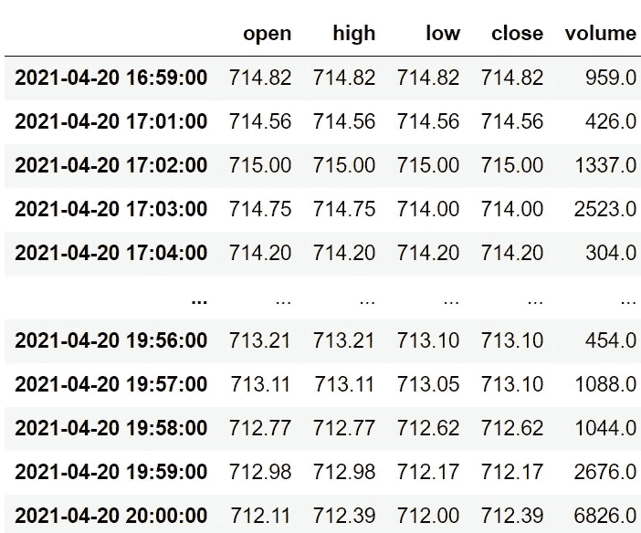
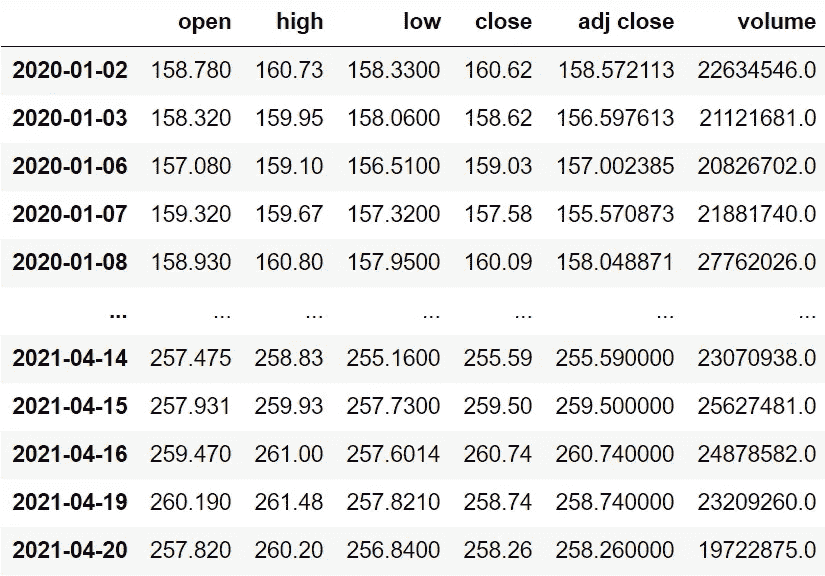
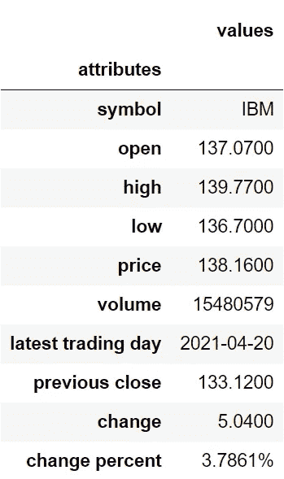

# Alpha Vantage:一个高效免费 API 的介绍

> 原文：<https://medium.com/codex/alpha-vantage-an-introduction-to-a-highly-efficient-free-stock-api-6d17f4481bf?source=collection_archive---------1----------------------->

## 使用 Python 中的 Alpha Vantage 股票 API 提取股票数据的完整指南


沙哈达特·拉赫曼在 [Unsplash](https://unsplash.com?utm_source=medium&utm_medium=referral) 上拍摄的照片

从网站上手动提取股票数据是一项繁琐的任务。找到可靠的数据就更难了。对于初学者来说，这种情况很难处理。这个问题的解决方案是自动化提取数据的过程。我们如何做到这一点？答案很简单，借助股票 API。

# 什么和为什么要使用库存 API？

**什么:**股票 API 是一个托管在云中的数据库，提供实时股票更新、当天数据、历史数据等等。

**原因:**最近几天，几乎每个金融机构都在使用股票 API 进行交易和研究，因为它有助于减少直接从交易所购买股票数据的费用(这需要花费大量资金)。其次，借助编程，很容易与股票 API 进行交互，获取想要的信息。最后，我们可以使用高度可定制的功能访问各种类型的数据。

## **关于 Alpha Vantage 的一个说明:**

Alpha Vantage 提供免费的股票 API，用户可以通过这些 API 访问各种数据，如股票、货币和加密货币的实时更新和历史数据。

# 我们要做什么？

在本文中，我们将使用 python 与 Alpha Vantage 提供的股票 API 进行交互，以提取三种类型的股票数据:日内数据、历史数据和股票的最新更新或信息。在进入编码部分之前，用户必须在 Alpha Vantage([https://www.alphavantage.co/support/#api-key](https://www.alphavantage.co/support/#api-key))上创建一个开发者账户，只有这样，才可以访问 API 密钥(API 的重要部分)来提取数据。

# 导入包

在这篇文章中，我们将只使用两个包:熊猫和请求。Pandas 包用于执行大量的数据操作和处理，Requests 包提供了从 API 提取数据的功能。

**Python 实现:**

```
import pandas as pd
import requests
```

既然我们已经将所需的包导入到 python 环境中。所以，让我们开始提取一些数据！

# 提取当天数据

这部分我们要用 Alpha Vantage 提供的股票 API 来拉特斯拉股票的日内数据。强烈建议将这个特定的 API 用于短期图表或交易策略开发。

**Python 实现:**

**输出:**



TSLA 日内数据(图片由作者提供)

**代码解释:**首先，我们定义一个名为“get_intraday_data”的函数，它以股票的符号(“symbol”)和数据点之间的时间间隔(“interval”)作为参数。在函数内部，我们首先将 Alpha Vantage 提供的秘密 API 密钥(不应该泄露)存储到‘API _ key’变量中。接下来，我们定义一个变量‘api _ url’来存储 API 的 URL，以提取当天数据。在 requests 包提供的“get”函数的帮助下，我们以 JSON 格式将数据提取并存储到“raw_df”变量中。在做了一些数据处理和操作后，我们以清晰的格式返回当天的数据。最后，我们正在调用我们创建的函数，以 1 分钟的时间间隔拉特斯拉股票的日内数据。

在本文中，我使用 1 分钟作为时间间隔只是为了举例说明，这样做没有任何特定的原因。除了选择 1 分钟之外，还有其他选项，如 5 分钟、15 分钟、30 分钟和 60 分钟。

# 提取历史数据

这部分是使用 Alpha Vantage 提供的股票 API 具体提取给定股票的历史数据。

**Python 实现:**

**输出:**



MSFT 的历史资料(图片由作者提供)

**代码解释:**我们做的第一件事是定义一个名为‘get _ historical _ data’的函数，该函数将股票的符号(‘symbol’)作为必需参数，将历史数据的开始日期(‘start _ date’)作为可选参数。像我们在前面的函数中所做的一样，我们定义了 API 键和 URL，并将它们存储到各自的变量中。接下来，我们使用“get”函数提取 JSON 格式的历史数据，并将其存储到“raw_df”变量中。在对原始 JSON 数据进行清理和格式化之后，我们将以干净的 Pandas 数据帧的形式返回它。最后，我们调用创建的函数来提取微软从 2020 年开始的历史数据，并将其存储到' msft_hist '变量中。

# 获取最新更新

在这一步，我们将使用 Alpha Vantage 提供的股票 API 提取给定股票的最新更新和信息。这一步非常有用，因为我们将要创建的函数会不断地、无缝地用最新的数据更新自己。

**Python 实现:**

**输出:**



IBM 最新更新(作者图片)

**代码说明:**该函数的代码结构或格式与我们之前创建的函数基本相似，但是 API 的 URL 发生了变化。在这个函数中，涉及数据处理的步骤稍微有点复杂，因为提取的原始 JSON 数据相对比较混乱。从所表示的输出数据框架中，我们可以观察到股票的几乎每一个基本信息都被揭示了。

# 最后的想法！

在本文中，我们学习了使用 Alpha Vantage 提供的股票 API 提取股票的日内数据、历史数据和最新信息。我们只是探索了 Alpha Vantage 的大量库存 API，以执行各种任务。此外，我们在定义 API 的 URL 时保留了默认的 API 参数，但是 API 附带了许多灵活且可定制的参数。因此，强烈建议尝试使用我们用不同的 API 参数创建的函数。就这样！我们最终使用自由库存 API 自动完成了金融领域的一项艰巨任务。希望你在本文中找到一些有用的东西。