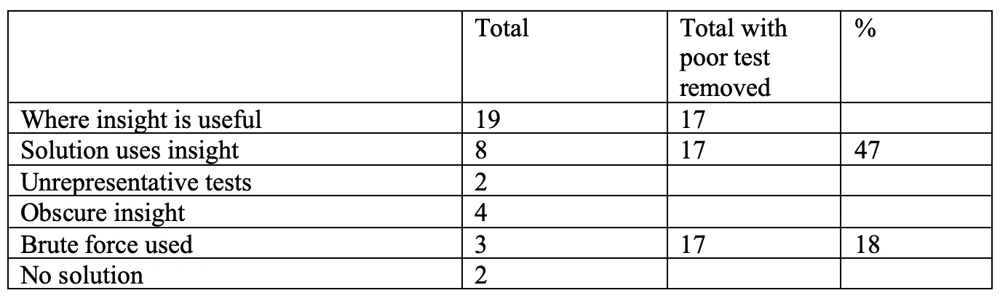

# AlphaCode 的创造力和解决问题的能力

> 原文：<https://medium.com/codex/alphacodes-creativity-and-problem-solving-ability-4f11d8f518a9?source=collection_archive---------24----------------------->


丹尼尔·弗兰奇在 [Unsplash](https://unsplash.com?utm_source=medium&utm_medium=referral) 上的照片


图片来自 [https://elbo.ai](https://elbo.ai/) :编写计算机程序的机器人

# **总结**

当任务是对一组英语指令进行编码时，AlphaCode 非常擅长编写计算机程序。当需要一些洞察力来解决问题集时，AlphaCode 擅长编写代码，但当需要更深入的洞察力时，它就不那么擅长了。

通常，当发现这种洞察力时，它会导致一个与问题集中的指令没有关系的解决方案。有时，在一行代码中会实现多个逻辑操作，并且公认的解决方案通常非常简短。这种创造性的过程是显著的和有趣的，但不容易用转化和注意力的过程来解释。

强调了两个解决方案，它们简洁地显示了创作过程的结果，并将形成如何实现洞察力的进一步工作的基础。

# **背景**

这是我第二篇关于 DeepMind 的名为 AlphaCode 的编写计算机程序的技术的文章。他们的突破似乎不仅仅是人类语言翻译近期发展的延伸:创造性和解决问题都涉及其中。在我的第一篇文章中，我得出结论说 **AlphaCode 很棒，但有缺陷，但可能有用。**

AlphaCode 不知道什么时候出错了，也没有办法自我修复。然而，我认为 AlphaCode 在与人类程序员的合作中可能是有用的，这就像有一个专家团队，总是和立即可用。还有其他协作工具，如 OpenAI Codex 和 GitHub Copilot，我认为它们与 AlphaCode 有本质的不同。有了 Codex 和 Copilot，人类开始这个过程，而有了 AlphaCode，情况正好相反。这是一个关键的区别，因为字母代码似乎提供了创造力，并在事后由人类“收拾”来解决问题。

这篇文章讲的是 AlphaCode 的创造力和解决问题的能力。

# **证据**

AlphaCode 团队决定测试他们的技术，用它参加 CodeForces 的编码比赛。CodeForces 公布了三个实际上来自 AlphaCode 的竞争对手的名字:SelectorUnlimited、Waggle Collide 和 AngularNumeric。这些参赛者使用 Python 语言尝试了 33 个问题，提出了 54 个解决方案。对于两个问题，AlphaCode 的流程没有足够的测试数据。我已经将剩下的问题分类如下表所示:


使用 CodeForces，一个问题用英语提出，并使用一些标准的数学符号。输入和所需的输出都已定义。提供了一小组具有正确输出的示例输入，有时还会提供解释。AlphaCode 使用这套测试数据作为训练过程的一部分来开发解决方案。

当一个潜在的解决方案被开发出来时，它被提交给 CodeForces，然后 code forces 使用以前看不到的测试来测试这个解决方案。如果解决方案对于所有测试都是正确的，并且在时间和内存限制内运行，则该解决方案被接受。这些解决方案被计入上面的“已接受的解决方案”一栏。

通常在 CodeForces 中，会有一些洞察力或知识允许程序员创造性地产生一个简短、优雅、快速和内存高效的解决方案。如果 AlphaCode 发现了此洞察，它将被计入“发现的洞察”列

如果没有认识到这一点，一种较慢的强力方法通常可以完成这项工作，但不会被接受。这些解决方案，连同被接受的解决方案，被计算在上面的“解决方案被接受或时间失败”栏中。这篇专栏文章展示了 AlphaCode 在哪些方面提供了解决方案。

**问题类型**

这 31 个问题被分为两类:

一个简单的问题是通过对一组指令进行编码来获得解决方案。产生一个解决方案不需要洞察力，或许也不需要创造力

一些问题受益于洞察力，这将导致比暴力更优雅的解决方案，并且经常需要避免由于时间或内存问题而导致的失败

**直截了当的结果**

该过程的第一阶段是让 AlphaCode“理解”问题:解释指令并转换成某种内部表示。这显然是该过程中非常重要的一步，AlphaCode 团队报告称，问题语言的人工简化会产生更好的结果。他们还表明，去除问题解释的元素会降低成功。

上表显示，AlphaCode 能够为 13 个简单的问题提供解决方案。我们可以得出结论，AlphaCode 擅长“理解”问题。第十四个问题的解决方案稍微复杂一些，因为它需要用两个独立的变量进行优化。

总的来说，这些结果表明，AlphaCode 擅长提供解决方案，即把问题编码或翻译成计算机语言。鉴于该系统的传统，这也许并不意外。

**真知灼见讨论**

这 17 个包含的问题中，洞察是有用的，在那里我们可以看到 AlphaCode 在工作中的创造性过程。举个例子，附录 A 中更深入探讨的 gcd 问题，可以简化为:给定 n，求 A，b，c 其中 a+b+c = n，gcd(a，b) = c 其中 GCD 是最大公约数。其中的洞见是，通过使用 c = 1，那么只需要求解 gcd (b，n-b-1) = 1 中的 b。

AlphaCode 发现了这种洞察力。当人类产生这样一个解决方案时，我们说他们理解了问题，创造了一个解决方案，然后将它编码。

“创造了一个解决方案”这一点对于机器学习来说是新的，也是有趣的。它从哪里来？AlphaCode 是如何创造任何东西的？

我们知道，AlphaCode 似乎并不是通过复制长代码块来解决问题的。在论文中，该团队指出:我们没有发现证据表明我们的模型从训练数据中复制了核心逻辑。

现在应该可以放心地假设，AlphaCode 只能知道它在训练数据中找到的内容。不过，我们可以假设，字母代码能够通过以新的方式组合现有知识来创造新的知识。毕竟，这通常是人类创造新东西的方式。

通过对 17 个问题的解决方案的详细分析，是否有可能更好地理解这一创造性的过程？

在 9 个没有发现洞见的问题中，有 5 个问题的难度与发现洞见的问题相似。其中，一个强力解决方案被接受，另外两个按时失败。由此我们可以得出结论，创造性解决方案的一个或多个元素在训练数据中缺失。

在另外四个案例中，这个问题需要比平常更深刻的洞察力。这些问题将在附录 a 的末尾详细讨论。在每种情况下，见解都不是直截了当的，但是在一个案例中，AlphaCode 确实提供了一个被接受的暴力解决方案。

**缩小差距**

在发现洞察力的八个问题中，对于人类来说，在五个案例中，洞察力来自对问题的逻辑分析和对数字的良好理解。*消除差距*问题是一个很好的例子，在附录 b 中有更全面的描述。本质上，提出问题时描述的过程被忽略，没有编码。求解是通过求一组数的平均值得到的，输入数据后用五行代码求解。

**矩形上的三角形**

对于其他三个案例，需要特定的知识。例如，矩形上有*个三角形，* 人类编码员需要知道三角形的公式以及如何获得三角形的高度。

矩形上的*三角形*问题在附录 b 中有更全面的描述。总之，给定一个尺寸为 w，h 的矩形，边上有许多点，但不包括角上的点，找出由一边的两点和另一边的一点组成的面积最大的三角形。AlphaCode 实际上在一行计算中实现了一个解决方案，它正确地识别了三角形最大面积的参数，并在正确的方程中使用了这些参数。

**结论**

这一分析表明，在需要对一组指令进行编码的情况下，AlphaCode 在生产计算机程序方面非常成功。

在需要一些洞察力的地方，它在生产计算机程序方面也相当成功(大约 50%)。AlphaCode 在处理需要更深刻洞察力的复杂问题时不太成功。

令人印象深刻的是，AlphaCode 能够展示洞察力并产生创造性的解决方案。不幸的是，与 transformer 模型相关的通常解释，包括模型参与的标记*、*的突出显示，对理解这个过程没有帮助。

两个示例问题，即*闭合矩形*上的间隙和*三角形，已经被识别，这在研究这一创作过程时可能是有用的。在这两种情况下，解决方案都很简短，需要世界知识，并且不是基于对问题描述的编码。*

DeepMind 团队已经表明，解决方案不是基于从训练数据中大量复制。然而，AlphaCode 的洞察力通常出现在短代码中，解决方案的本质可以在一行中。这条线可能隐藏在数百万行训练代码中吗？或者解决方案是两个或更多相关见解的创造性组合？不管怎样，这都是值得注意的。

有一句老话，太阳底下无新事。我们提到的见解来自某个地方，进一步探索将是令人着迷的。也许我的下一步是深入研究训练数据。而我们也不应该因为另一句话“创意只是未被发现的抄袭”而心灰意冷！

# 附录 A:有些见解是有用的，但并不总是能找到

有 19 个问题需要一些洞察力。在八个案例中，AlphaCode 提供了至少一个利用这种洞察力的解决方案。

在另外两种情况下(*建立排列*和*洗牌* ) 初始测试数据不具有代表性，因此给了 AlphaCode 一个对一组不充分解决方案的错误引导。这些案例不包括在以下百分比中。

在其他五种情况下，所需的洞察力与使用洞察力的八个问题所需的水平大致相同。在其中的三个案例中，成功地使用了迭代或蛮力方法。在其他情况下，暴力方法失败了。

在另外四个案例中，所需的洞察力特别模糊，AlphaCode 没有找到洞察力或提供可接受的解决方案。

总的来说，当洞察有用时，AlphaCode 在不到 50%的情况下提供了这种专业知识。对于大约 20%的情况，提供了非最佳解决方案，并且在大约 30%的情况下，AlphaCode 被难倒。



**缺少余数:发现洞察力**

在这个问题中，给你一个长度为 n 的不同正整数的数组。从数组中找出 n/2 个向下舍入的不同整数对 x 和 y，这样 y/x 的余数就不会出现在数组中。如果有多个解决方案，打印任意一个。

所以给定数组 2 7 5 3 4 8，可能的解是:874332。

**洞察**:如果 x 是最小的数，y 可以是其他任何数。

AlphaCode 提供了五种尝试，四种使用暴力方法，一种基于上述见解。

不过，具有洞察力的代码很冗长。它包含不必要的代码、低效的测试和双重循环。在人工生成的代码中，您永远也找不到用臃肿的代码实现的如此聪明的解决方案。他们只是不能在一起。

**而且是一个非零:顿悟发现？**

给定一个包含 l 和 r 之间所有整数的数组，要确保按位 and 产生一个非零值，需要删除的最小元素数是多少？

**洞察:**找出哪个位是最常见的，并计算它出现的频率，比如说 x。那么答案就是集合中的整数个数——x

AC 提供了七种解决方案，但都按时失败。这些方法看起来的确是基于洞察力，但是实现起来太慢了。

**数组与运算:洞察发现**

在这个问题中，给你一个由 n 个整数和另一个整数 k 组成的数组，其中 2k <=n. Perform k operations where two elements of the array, x and y, are removed and your score is increased by the maximum integer less than x/y. After the k operations add the remaining elements to the score. Find the minimum score possible.

**Insight:** 通过将最高的数用作除数，将下一个最高的数用作被除数来获得最小分数。

AlphaCode 提供了两种尝试，两种尝试都是基于上述见解并被接受。这些解决方案包含逻辑上的错误和低效，但不会影响结果。

**构建排列:未找到洞察力**

输入是三个整数 n，a，b。给定整数 1 到 n，排列整数，使得有 a 最大值和 b 最小值

**洞察:**仅当 abs(a-b) < = 1 时才有可能。如果 a > =b 从最大值开始，否则从最小值开始

初始测试数据不包括 a-b = 1 的情况。这是一个重要的案件，六次尝试都失败了。解决方案在正确的轨道上，但不会与更具代表性的测试集一起输入。

**缩小差距:发现真知灼见**

问题是要尽量减小城市街区的高度差。本质上，问题是最小化一组整数之间的差。

**洞察:**整数求和，除以整数个数。如果有余数，答案是 1，否则答案是 0。

六次尝试由 AlphaCode 提供，三次使用迭代方法，三次基于上述见解。基于洞察力的三个包含不影响结果的不必要的代码。

**构建一个矩形:发现洞察力**

有三根长度为整数 l1、l2 和 l3 的棍子。你被要求把其中的一根断成两段，这样你就可以用这 4 根棍子做出一个长方形。

洞察力:如果两根木棒大小相等，第三根一定长度相等。或者，最长的棍子必须与其他两个棍子长度相加的长度相同。

AlphaCode 提供了三种尝试，其中一种不应该被包括在内，因为它没有提供输出，另外两种是基于上面的见解。这两个基于洞察力的实现是不整洁和低效的。

**禁止序列:未发现洞察**

给定两个字符串，S 和 T，找出不包括 T 作为子序列的 S 的最小排列。t 是 abc 的一个置换。如果 a 中的字母在字母表中比 b 中的字母出现得早，则字符串 a 小于 b。如果 a 可以通过从 b 中删除零个或多个字母来生成，则字符串 a 是 b 的子序列。

**洞察:**解决方法就是只要 T < > abc 就行排序。如果 T = abc，则执行 acb 等

AlphaCode 只提供了一个解决方案，而且是错误的。错过了洞察力，并尝试了暴力方法。

**GCD 问题:发现洞察力**

给定 n，求 a，b，c 其中 a+b+c = n，gcd(a，b) = c 其中 gcd 是最大公约数

**洞察:**通过使用 c = 1，那么只需要在一个循环中找到 gcd (b，n-b-1) = 1

AlphaCode 提供了两种尝试，两种都是基于上面的见解并产生干净有效的代码。

**最小化距离:未发现洞察力**

仓库位于原点两侧的数字线上。每个仓库需要交付一个包裹。你从起点出发，最多可以携带 k 个包裹。你要运送到 n 个仓库，在最后一次运送时结束任务。完成任务所需的最小距离是多少？

**洞察力:**避免在原始保存包中移动的低效率。

AlphaCode 提供了两次尝试，一次是错误的，另一次有运行时错误。错误的解决方案解决了号码线两端的起点，但是没有考虑到移动通过原始持有包裹的低效率

**失踪的二元模型:洞察发现**

单词 w 由一系列的 a 和 b 组成。可以从单词中产生一组二元模型，并按照它们在单词中出现的顺序呈现。去掉一个二元模型，问题是找到 w。

**洞察力:**通过将一个二元模型中的第二个字母与下一个二元模型的第一个字母进行比较来检测缺失的二元模型。如果它们是不同的，丢失的二元模型的位置已经被找到。

AlphaCode 提供了 15 次尝试，其中 14 次是错误的，如果最初的测试更加严格，就不会被包括在内，一个解决方案基于上述见解，生成了干净高效的代码。

**绘制数组:未找到洞察力**

给定一个正整数数组，选择一个整数 d，使得数组中每隔一个整数就能被 d 整除，并且后面的整数不能整除。

**洞察:**使用 gcd()查找数组中的偶数和奇数元素。然后对偶数检查是否奇数，对奇数检查是否偶数产生余数。如果找到了，那么 d 存在。

AlphaCode 提供了七次尝试，其中一次是错误的，其他解决方案会及时失败，并且基于迭代方法。AlphaCode 没有发现这种洞察力，尽管一些解决方案确实使用了 gcd()，但是它们是基于强力解决方案的。

.

**辣椒粉和排列:未发现洞察力**

排列是从 1 到 n 的任意顺序的 n 个不同数字的数组。通过对数组的元素执行运算，对给定的数字数组进行排列。操作是用 mod x 替换数组中的元素 a，其中 x 是您可以定义的数字。对于每个操作，a 和 x 可以改变。找出所需的最小操作数。

**洞察**:排序后当发现一个数> n 时，测试:ai mod y 必须< ai/2

AlphaCode 提供了两种尝试，两种方法都使用暴力。一次尝试错误，一次准时失败。没有发现洞察力。

**坡旅甲和子序列的和:未找到洞察力**

从数组 a 中的 3 个正整数，产生一个新的排序数组 b，长度为原始数组 a 中所有子序列之和的 7。给定 b 找到 a。

**洞察:** a 由 b 中两个最小的整数和最大的减去两个最小的整数组成

AlphaCode 提供了三种尝试，虽然都被接受，但都是基于蛮力方法。AlphaCode 找不到洞察力。

**无序播放:未找到洞察力**

从二进制字符串中，选择恰好包含 k 个 1 的子字符串。打乱子字符串，使其成为原始字符串的新版本。通过选择不同的子字符串，可以得到多少种不同版本的原始字符串？

**洞察:**需要组合公式的知识

只有一种尝试，不使用公式组合，容易失败。最初的测试只包含一个例子。

**矩形上的三角形:洞察发现**

给定一个矩形，尺寸为 w，h，边上有许多点，但角上没有，找出由一边的两点和另一边的一点组成的面积最大的三角形。输出面积*2

**洞见**:解答使用了三角形的面积公式。使用最大底部乘以高度

AlphaCode 提供了三种尝试，所有的尝试都被接受，并且都基于洞察力。

# 需要但未找到的模糊见解

**圣诞巧克力**

在一个数组中有一个将整数 a 转换为整数 b 的运算:其中 k 是 2^k>=a，b = 2^k-a。给定一个不同数字的数组，对于数组中的每一对，比如 x 和 y，计算出将 x 转换为 y 所需的最少运算次数。在数组中找出一对，使从一对转换为第二对所需的最少运算次数最大化。

**洞察力:**每一个选项都要尝试，寻找最大最小值。寻找最小值在示例中有所暗示:通过零移动到解决方案

只有一次错误的尝试。该方法没有返回步数的方法。这个问题只提供了两个例子。

**烛台**

给定一个由 0 和 1 组成的字符串 a，确定是否可以使用以下操作获得类似的字符串 b:选择一个 1，该 1 将保持不变，该字符串的所有其他元素将翻转为另一个值。

**洞察:**设 n 为字符串的长度，x 和 y 分别为字符串 a 和 b 中 1 的个数，z 为 a 和 b 中不相同的元素个数。如果 x= y 那么 ans = z，如果 x= n+1-y 那么 ans =n-z。

AlphaCode 提供了两次尝试，一次是错误的，另一次有运行时错误。

**新年难题:**

Vlad 有 n 个朋友，他将访问 m 个商店中的 n-1 个商店，为他的每个朋友买一份礼物。对于每个商店，都有一个 n 整数的列表，用来衡量最好的礼物会给他的每个朋友带来的快乐。弗拉德想最大限度地增加他的礼物所能带来的快乐。

**洞察:**解是朋友最大欢喜和店铺最大欢喜的最小值。通过选择倒数第二个最大值来计算 n-1 次访问，可以获得商店的最大快乐。

AlphaCode 提供了两种尝试，一种是错误的，而另一种解决方案虽然被接受，但是基于迭代方法。AlphaCode 没有发现实际上模糊的洞察力。

**二次集合**

如果一个正整数的元素的阶乘的乘积是一个正整数的平方，那么这个正整数集就是一个二次集。找出集合 1，2，3…n 的子集的最大二次集合

**洞察:**阶乘分析显示哪些数字没有匹配对来提供平方。这种理解产生了一些需要编码的测试条件。

AlphaCode 提供了三次尝试，两次是错误的，另一次有运行时错误。测试代码在测试解决方案的可接受性方面帮助不大。

# 附录 B:所选 AlphaCode 解决方案的详细分析

**缺少余数**

在这个问题中，给你一个长度为 n 的不同正整数的数组。从数组中找出 n/2 个向下舍入的不同整数对 x 和 y，这样 y/x 的余数就不会出现在数组中。如果有多个解决方案，打印任意一个。

所以给定数组 2 7 5 3 4 8，可能的解是:874332。

有一个非常简单的解决方案:将数组按升序排序，对于一个解决方案，x 是列表中的第一个条目，y 可以是任何其他数字:

数组排序为 2 3 4 5 7 8

x = 2

y = 3 余数 1

y = 4 余数 0

y = 5 余数 1

不需要划分或检查。因此，除以数组中最小的数，余数就不会在数组中。

如你所料，解决这个问题的代码很简单。聪明的/创造性的/艰苦的工作是在打开电脑之前完成的:

```
for _ in range(int(input())):
n=int(input())
a=list(map(int,input().split()))
a.sort()
for i in range(n//2):
print(a[i+1], a[0])
```

AlphaCode 对这个问题尝试了 5 次。它有 3 个解决方案被接受，2 个因耗时太长而失败。事实上，被接受的解决方案中有两个与失败的解决方案非常相似，但编码效率略高。这四个解决方案是蛮力尝试，其中代码将所有内容除以所有内容以找到可接受的答案。

**AlphaCode 确实在另一个被接受的解决方案上使用了创造性/巧妙的解决方案(ref)。**

不幸的是，这是一组冗长的代码:与上面的 6 行代码相比，有 31 行代码。它还包含不必要的代码、低效的测试和双重循环。在人工生成的代码中，您永远也找不到用臃肿的代码实现的如此聪明的解决方案。他们只是不能在一起。

**数组和运算**

在这个问题中，给你一个由 n 个整数和另一个整数 k 组成的数组，其中 2k <=n. Perform k operations where two elements of the array, x and y, are removed and your score is increased by the maximum integer less than x/y. After the k operations add the remaining elements to the score. Find the minimum score possible.

The key to this problem is to realise that the minimum score is obtained by using the highest numbers as the divisors and the next highest numbers as the dividends.

There is a very simple solution: sort the array, add each element to the score for the first n-2k elements, then for k steps add int(next highest divided by highest) to the score and move to the next pair.

```
for t in range(int(input())):
n, k = map(int, input().split())
a = [int(i) for i in input().split()]
a.sort()
s = sum(a[:n-(2*k)])
for i in range(n-(2*k), n, 2):
s += a[i]//a[i+1]
print(s)
```

AlphaCode provides two solutions which are identical. The solutions are based on using the highest numbers for the divisions and are accepted. The solutions are not without their problems:

A calculation is done for every value of k from 0 to k. This would never produce a wrong final result as a minimum check is used but it is an unnecessary complication

The switch between adding the elements to dividing them is very clumsy and again unnecessary.

AlphaCode presents no brute force solutions which is understandable as they would be necessarily complex to code.

**填补了缺口**

描述了一个过程(【https://codeforces.com/contest/1615/problem/A】T2)来修改 n 个塔块以最小化最高和最短之间的高度差。这个过程包括从一个塔上移动一块砖，并将其添加到另一个塔上。最高和最低的最小差距是多少？

这个问题的措辞是精心设计的，会把粗心的程序员引向暴力解决方案。本质上，问题是最小化一组整数之间的差，答案只能是 1 或 0。

**洞察:**整数求和，除以整数个数。如果有余数，答案是 1，否则答案是 0。

六次尝试由 AlphaCode 提供，三次使用迭代方法，三次基于上述见解。基于洞察力的三个包含不影响结果的不必要的代码。下面是去掉一些冗余代码后的一个解决方案。

```
for _ in range(int(input())):
n = int(input())
l = list(map(int,input().split()))
s = sum(l)
if s%n == 0:
print(0)
else:
print(1)
```

因此，问题中描述的过程被忽略，解决方案基于求平均值，如果有余数，则答案为 1，否则为 0。

数据输入在前三行代码中完成，解决方案只需要五行代码。

**矩形上的三角形**

给定一个矩形，尺寸为 w，h，边上有许多点，但角上没有，找出由一边的两点和另一边的一点组成的面积最大的三角形。输出面积*2

**洞见**:解答使用了三角形的面积公式。使用最大底部乘以高度

AlphaCode 提供了三种尝试，所有的尝试都被接受，并且都基于洞察力。这里有一个例子:

```
t = int(input())
for i in range(t):
w, h = map(int, input().split())
x1 = list(map(int, input().split()))[1:]
x2 = list(map(int, input().split()))[1:]
y1 = list(map(int, input().split()))[1:]
y2 = list(map(int, input().split()))[1:]
x1.sort()
x2.sort()
y1.sort()
y2.sort()
print(max(x1[-1] * h — x1[0] * h, x2[-1] * h — x2[0] * h, y1[-1] * w — y1[0] * w, y2[-1] * w — y2[0] * w))
```

前七行处理数据输入。这个解是用五行得到的。计算在一行中完成，其中打印了最大底部乘以高度。

计算矩形各边的最大底边时，需要四条排序线。需要三角形的公式来完成计算。人类编码员会知道矩形的邻边是三角形的高度。AlphaCode 怎么知道的？