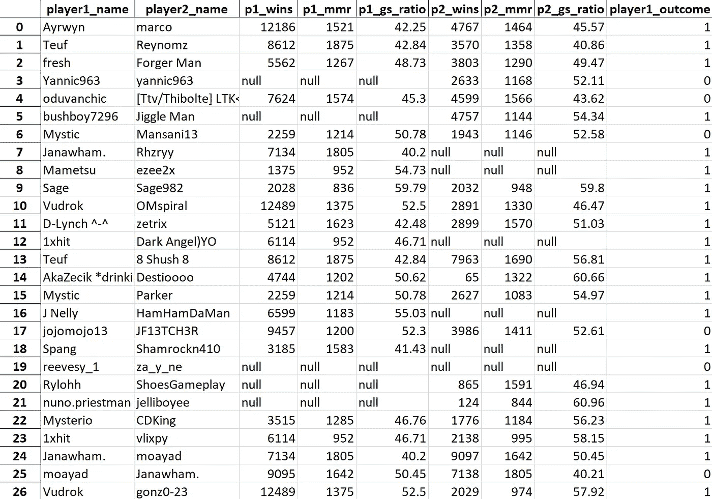

# 用机器学习预测火箭联赛结果

> 原文：<https://medium.com/codex/alternative-data-sources-and-informational-advantages-via-web-scraping-and-machine-learning-8da4ab8aecc3?source=collection_archive---------3----------------------->

图 0。替代数据([来源](/earnest-research/alternative-data-what-is-it-how-can-it-help-consumer-brands-and-investors-14065997bcbd))

我一直着迷于“信息优势”的概念，尤其是在金融界。当教科书中教授的传统经济数据是现状时，投资者(主要是对冲基金)寻求[替代数据来源](https://www.cnn.com/2019/07/10/investing/hedge-fund-drones-alternative-data/index.html)以获得对竞争对手的优势。

这些替代数据源的例子引人注目，而且似乎无穷无尽:

*   瑞士投资公司[瑞银投资研究](https://internationalbanker.com/brokerage/how-satellite-imagery-is-helping-hedge-funds-outperform/)使用卫星图像来估计沃尔玛停车场的占用率，推断季度销售额，从而获得有用的投资见解。例如，持续空置的停车场可能预示着客流量不佳，表明一只基金可能想做空这只股票。
*   另一家数据提供商 Thinknum 使用[网络搜集数据](https://www.cnn.com/2019/07/10/investing/hedge-fund-drones-alternative-data/index.html)来分析 Carvana 和 CarMax 的车辆库存。基金可以根据这些数据预测这些公司即将到来的收益，甚至评估更广泛的汽车行业对特斯拉或福特等感兴趣的制造商的需求。
*   量化对冲基金 Two 适马管理着 600 亿美元的 AUM，它有一个宏观阿尔法捕捉平台，向专业投资者支付费用，让他们提交带有时间表、理由和信念水平的交易想法。这些信息然后(*大概是*)被用在各种机器学习模型中，要么执行交易，要么为两位适马基金经理提供见解。

图一。电子竞技游戏的投注量。[来源](https://www.legalsportsreport.com/esports-betting/)。

考虑到替代数据源，我决定实现自己创造信息优势的尝试。

据预测，到 2028 年，体育博彩将成为价值 1400 亿美元的产业，并且恰好拥有成熟的可利用的、未充分利用的数据集。“体育博彩”的保护伞还包括电子竞技，其中包括 CS:GO、英雄联盟、Dota 2、星际争霸和其他游戏(图 1)。

有一款游戏不在这个列表中，但很可能会在未来出现，那就是火箭联盟(RL)。这是我目前最喜欢的游戏，也很容易解释——基本上是足球，但用会飞的汽车代替了人。如果这听起来很傻，那么，它有点傻，但这是一个美丽的游戏——一个简单的概念与不可思议的高技能上限相结合。而拥有近 [1 亿月活跃玩家](https://afkgaming.com/esports/news/rocket-league-player-count-how-many-people-still-play-in-2021)，没什么好嘲笑的。不难想象 RL 在不久的将来会有一些广泛可用的赌博形式。

考虑到这一点，我的目标开始具体化:**以一种独特的方式利用公开可用的数据，并试图预测火箭联盟的比赛结果，为未来的体育博彩场景创造信息优势。**

这个练习与更广泛的金融世界及其对替代数据集的利用非常相似。数据是否公开？当然可以。普通散户投资者是否拥有知识、技能和资本来收集、汇总和处理这些数据，并将其转化为可操作的见解？绝对不行。公平似乎是不可能的。

> 接下来的三个部分将介绍收集和探索数据集以及机器学习模型评估的技术细节。请随意跳到最后的“经验教训”。

# 替代数据源:抓取 Web

我的想法是收集关于 RL 1v1 比赛和每场比赛所涉及的球员的数据。为了建立预测模型，我需要输入数据:

*   玩家 1 和玩家 2 的统计数据——胜率、总胜率、配对等级(MMR)、进球/射门比率等。*(进球/射门比定义为球员的进球数除以他们的射门数，这是准确性的替代指标。稍后将详细介绍。)*

并输出数据:

*   游戏结果(赢或输，从玩家 1 的角度)。

然后，我会使用输入数据来训练一个机器学习模型，该模型将输出玩家在 1v1 比赛中获胜或失败的概率。如果这个模型的精确度足够高，可以保证有用性，它可以在未来用于比赛博彩。

在概述了我需要的数据后，我最终浏览了两个独立的网站。如果以上所有信息对我来说都是小菜一碟，那就太方便了，但不幸的是，我不得不为这种信息优势而努力工作。我刮到的两个网站描述如下:

*   Ballchasing.com[，允许用户上传自己比赛的回放并自动分析。从这里，我收集了比赛信息和玩家姓名— *玩家 1 _ 姓名、玩家 2 _ 姓名和玩家 1 _ 结局*。](https://ballchasing.com/)
*   rocket league . tracker . network，自动跟踪玩家档案，并为每个档案创建汇总统计数据。从这里，我收集了两个球员的技能统计数据——总胜率、MMR 和进球/射门比率。

代码是一个老鼠窝，连我都不知道它是如何工作的，但如果你有虐待狂般的好奇心，你可以在我的 GitHub 上查看一下。我将在这里简要描述这个过程:

*   Ballchasing.com 有一个 API。使用像 *JSON* 、 *requests* 、 *pandas* 这样的 Python 包，我访问了网站 200 页的 JSON 数据，将相关信息刮入字典，转换成 DataFrame，保存为 excel 电子表格。这产生了大约 40，000 个数据点，每场比赛一个。
*   我获取了这些数据，并用它来解析 Rocketleague.tracker.network，不幸的是它没有公共 API。我从 Ballchasing.com 导入数据，遍历每场比赛，并根据每个玩家的 steam 档案或 xbox/psn/psynet 名称为他们构建自定义 URL。然后，对于每一个档案，我将球员的数据收集到另一个数据框和 excel 电子表格中。

最终结果可以在下面的**图 2** 中看到。

**图二**。通过抓取各种网站得到的数据集。(图片由作者提供)

# **探索性数据分析&特征工程**

下一步是清理数据，设计一些新功能，用作机器学习模型的输入。在删除了具有空值的数据(例如，具有私人档案或已删除帐户的球员，或者简单的 HTTP 请求超时)之后，我最终得到了大约 10，000 个可用的数据点。

我还喜欢探索数据集，找出任何有趣的趋势或变量之间的关系。开始探索的一个快速方法是获取汇总统计数据:

从上面可以看出一些有趣的地方:

*   将回放上传到 Ballchasing.com 的玩家 1 平均赢了 5954 场。他们的平均死亡率是 1240。
*   其中一名玩家赢得了 35，000 次胜利。他们的名字是 *Scripts_RL* ，虽然他们在总获胜次数方面属于前 0.1%的玩家，但在排名方面他们只属于前 40%的玩家。*(作为参考，我赢了大约 3000 场比赛，排名前 1%。我不确定这是我的骄傲还是他们的谦卑。)*
*   假设比赛时间约为 7 分钟，胜率为 50%，这相当于 8，000 小时的比赛时间。自从 RL 在 2015 年 7 月发布以来，这相当于连续六年每天玩近**四个小时的游戏。**野生。

检查平衡的数据集也很重要，这很容易做到:

然后我继续讨论各种特征之间的关系，比如 MMR 和进球/射门比(**图 3** )。

**图三。**进球/射门比与技能等级(MMR)。(图片由作者提供)

从图表中我们可以看到 MMR 和进球/射门比率之间明显的负相关。随着技术水平的提高，这个指标应该降低，这是有意义的，因为一个熟练的球员会比一个不熟练的球员在网上救球或盖帽更多。由于这种关系，我可能想从我的模型训练过程中排除该特征，以避免[多重共线性](https://statisticalhorizons.com/multicollinearity)。

为了训练 ML 模型，我需要做一些特征工程来基于我收集的数据创建预测器。最终的数据集，准备分成训练和测试子集，如下所示:

# **模型拟合&结果**

我用了两种不同的模型来预测比赛结果。当您有非生产代码和静态数据时，摆弄各种模型是微不足道的，所以我选择同时实现 [XGBoost](https://xgboost.readthedocs.io/en/latest/) 和 [scikit-learn 的逻辑回归](https://scikit-learn.org/stable/modules/generated/sklearn.linear_model.LogisticRegression.html)。

XGBoost 是一种相对较新的算法(2014 年发布)，由于在各种机器学习比赛中取得成功而广受欢迎。这是一个易于访问的“[梯度增强决策树](https://machinelearningmastery.com/gentle-introduction-xgboost-applied-machine-learning/)的实现，旨在提高速度和性能”。该算法可用于回归和分类问题(以及其他问题)。(注意，XGBoost，一种基于决策树的算法，不需要特征缩放/归一化。)

逻辑回归是一种受监督的机器学习分类算法，它预测因变量为 0(在我们的情况下，是输)或 1(赢)的概率。

两者之间的一个显著区别是 XGBoost 是一个集合模型(新的模型按顺序添加，在以前的模型上改进，直到某一点)，而 Logistic 回归是一个线性模型。此外，XGBoost 比逻辑回归更难解释，这是一个重要的考虑因素，取决于手头的主题。

结果如下:

*   XGBoost 的准确率为 57%。
*   **逻辑回归的准确率也达到了 57%。**

这就带来了一个问题——什么样的准确度是可接受的？在这种情况下，我的目标是让模型在预测比赛的获胜者时比人类更加**。**为了建立这个基线，我根据训练模型的相同数据手动分类了大约 100 个匹配。使用 bootstrap 抽样，我获得了平均 57.3%的准确率。

**图 4。**玩家 1 对玩家 2 的总胜率。(图片由作者提供)

我使用这两个模型的结果提出了一个基本且经常被忽视的问题:**机器学习并不是适用于*所有*数据集的工具。如果一个训练有素的人不能令人满意地分类数据点，你也不应该指望机器学习模型能做到这一点。**

我收集的数据集存在一些问题，可以解释这种相对较差的准确性。首先，看一下左边的**图 4** 。图上的每个点代表两个玩家之间的一场比赛。橙色点表示玩家 1 赢了，蓝色点表示玩家 1 输了。你能通过简单地看图表把数据分成橙色或蓝色的点吗？我知道我不能——没有明显的趋势或线性断点可以表明 1 号玩家应该赢还是输。我们也不应该期望 ML 模型能够神奇地做出这些预测。

当我们考虑每个特性实际上表达了什么时，另一个问题出现了，许多人可能会说知识需要“领域专业知识”。我选择刮玩家 MMR，或者匹配制作评级，用它来训练 ML 模型。乍一看，这听起来是一个好主意，但是当我们停下来想一想，MMR 在预测比赛结果方面的可用性开始瓦解。火箭联盟分配一个 MMR，它在每场比赛后根据你的 MMR 和对方球员的 MMR 之间的差异以及你是赢还是输进行更新。一般来说，MMR 存在的原因是*让玩家与相同技能水平的其他玩家*进行比赛。因此，在大多数 1v1 比赛中，球员的 MMR 即使不相等，也是相似的。提供给该模型的洞察很难解析——如果绝大多数匹配是均匀配对的，则 MMR 差异与匹配结果之间没有容易辨别的关系。

尽管这些模型的准确性相对较差，但它们可能并非完全不可用。您可以使用 [k 重交叉验证](https://machinelearningmastery.com/k-fold-cross-validation/)来评估模型性能的可变性。如果每个模型的可变性较低(例如，每个模型的精确度在相同值附近徘徊{57.5%、56.7%、57.2%等。})那么在生产中使用该模型来下实际赌注可能是安全的。具体来说，假设你有 95%的信心，你的模型精度是 57%正负几个百分点。这意味着，在足够多的赌注下，你的正确几率将接近 57%，所以你将执行期望值为正的赌注。相反，如果你对模型输出的可变性不太有信心，你应该小心在任何实际能力中使用它。

# 经验教训

可供利用的替代数据源已经成熟，尤其是在互联网上。Web 抓取是一项强大而有用的技能，允许您生成以前从未被利用过的独特数据集。虽然这个例子是虚构的，但可能有更具表现力和直接可操作性的类似数据集，从而创造信息优势，带来真正的收益。

再次重申，机器学习是一个非常有价值和有用的工具，但它的适用性并不普遍。**如果你的数据集中的特征不足以让人类以高精度预测结果，那么你就不能指望机器学习算法做得更好。**

最后，即使你的模型准确性很差，你也可以在这个过程中学到一些东西，让你更有知识，更好地准备利用未来的机会。正如马修·麦康纳曾经说过的，

> “我随时会选择一个有经验的 C，而不是一个无知的 A。”

感谢阅读！