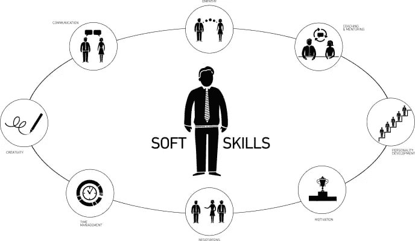

# 我是高级前端开发人员吗？

> 原文：<https://medium.com/codex/am-i-a-senior-front-end-developer-6596142bf647?source=collection_archive---------1----------------------->

大家好，我是尼玛，Trengo.com 的一名前端开发人员。我想和你分享我的资历经验，这并不意味着我是(不是)高级开发人员，但我发现这条路还是不错的。我来解释一下路径。

# 如何评价自己的资历水平？

# 真实的故事

让我从一个真实的故事开始，当我在 2012 年经历成为 CTO 时，那是我在一家公司的第一个正式角色。在此之前，我是自由职业者，没有任何团队合作经验。糟糕的经历会让你对未来有更好的洞察力。那时我 21 岁，公司还没有技术团队，我有机会让他们相信我是一名优秀的开发人员，我那时是一名 Java 和 PHP 开发人员，在我看来，这是他们相信我的技能的原因。没有技术人员来采访我。我可以说，我是团队中第一个可以采访比我更好的人的技术人员。那时我明白了，我的资历将由公司级别来评定。对我来说，当首席技术官不是一个好的选择，这也是候选人比我优秀的原因。几年后，我作为一名候选人参加了一次面试，这很有趣，他们拒绝了我，因为我的水平超过了一名高级开发人员，但事实并非如此，面试官的态度是错误的。所以你不能确定你在任何地方都是高级开发人员，影响资历的因素有很多。

# 面试官的影响

这是我想出来的一个术语。公司的决定非常有效，如果你想评估我们的资历水平，你需要确定有一个人比你更好(甚至不是和你一样)。在大多数面试中，你会知道面试官的名字，如果你看看她/他的 Linkedin 页面会很有帮助。

# 硬技能

正如你所猜测的，“硬技能”是非常重要的，在我看来，这是成功的一半。
硬技能是通过实践、重复和教育获得和增强的学习能力。硬技能是必不可少的，因为它们可以提高员工的生产力和效率，进而提高员工的满意度。 [investopedia](https://www.investopedia.com/terms/h/hard-skills.asp#:~:text=Hard%20skills%20are%20learned%20abilities,and%20subsequently%20improve%20employee%20satisfaction.) 。
硬技能可以很好地表明你是一名资深人士。谁的能力更强，谁就有机会被评为公司的高管。开发人员最多是误解了“更多能力”的意思，通常面试官会把你已经掌握的技能算在他们身上，而不是一堆你在他们身上是初学者的技能。所以要小心你在简历上写的内容。

## 怎样才能提高自己的「硬技能」？

我强烈推荐你通过“Udemy”和“Frontend masters”课程，用学到的东西来定义你在 Github 上的项目。这将是一个开始，掌握设计模式、算法、解决问题(你可以尝试[https://leetcode.com/](https://leetcode.com/))、实现像素完美的设计、交付更少错误的实现、软件设计方法和编写测试是将你与众不同的因素。我想提的是不要找很多编程语言，语言只是工具，你需要了解软件工程的概念和知识。
由于有成吨的资源可供学习，很难选择最好的一个，这取决于开发人员的资历水平，你必须找出问题到底是什么？
让我们从一些基本的例子开始:

**基本问题(1 级):**
**例如:**我如何将值从 Vue 子组件传递给父组件？
这类问题都是跟基础有关的，你得先过基础课或者看 Vuejs 文档。
所以请记住，做一名软件工程师，比用吸尘器工作更难；)

**二级问题:**
**例如:**需要用 Typescript 创建一个 React 原生底层表单。
有多个插件和工具可以创建一个漂亮的 React 原生底部表单。它们都有用吗，能满足你的需求吗？**当然不是**，所以你需要知道他们是如何工作的，然后你就可以用 Typescript 写你的“底稿”了。首先，你可以阅读 Github 源码，(这是一个著名的例子:【https://github.com/gorhom/react-native-bottom-sheet】T21)。视频和课程对解决这类问题没有用，因为你需要定制你的解决方案。

**三级问题:
例如:**最佳实践中如何用 Vite 和 Svelte 实现微前端？这是一个编程的深度挑战(架构问题)，你需要阅读相关的技术书籍或文章，我也强烈建议你有一个可以指导你最佳实践的导师。
**注:**一个导师不可能帮你做所有的事情，最好每个具体的板块都有一个导师。

# 软技能

**“软技能**，又称**通用技能**或**核心技能**，是所有职业都能胜任的技能。这些包括批判性思维、解决问题、公共演讲、专业写作、团队合作、数字素养、领导力、职业态度、职业道德、职业管理和跨文化流利度。这与硬技能形成对比，硬技能是针对个别职业的。”因为“软技能”是一门广泛的知识，所以我可以和你分享我的经验。这些是你必须成为 it 专家的头衔:团队合作、领导力、职业态度和公开演讲是最重要的。
**团队合作**:团队中在项目、会议和其他事情上有良好的协作是很重要的一点。

**怎么才能改善呢？
-** 有问题尽管提。
-请求同事的力量帮你解决问题。
-明确任务并为此组织会议。
-与你的同事组织结对编程会议。

**数字素养** :
不要害怕使用新技术，这并不意味着体验新的编程语言(不要在语言之间切换太多)，这意味着增加你使用新工具的知识和使用新框架/库/架构/技术的勇气，以增加你的信心。

**领导力** :
提高领导能力有 9 个著名的步骤，让我们一起来看看吧。
- **实践纪律:**
好领导有好纪律，如果你天生无序，可能会缩短工作量。承担更多的项目:承担更多的责任会让你更有纪律性。
- **学会跟随:** 一个真正的领导者在必要的时候把控制权转移给另一个人是没有问题的，试着对你的团队保持透明。
- **培养情境意识:**
一个好的领导者能够在大问题发生之前就预见到，这将有助于他人更加信任你。
- **激励他人** :
激励是让你成为一名优秀领导者的最重要的事情之一，一名优秀的领导者会努力鼓励团队学习更多，更有活力。
- **不断学习:** 你要成为团队中最新的。不管你在编码方面有多好，试着跟上时代，增强你的体验。
- **化解冲突:** 每个团队都有很多因文化和性格不同而产生的冲突，一个好的领导者能够化解团队中的这类冲突。
- **做一个有眼光的倾听者。**
- **为队友赋能。**

如果你喜欢提高你的领导能力，强烈推荐你阅读一些自助书籍，如戴尔·卡耐基**的**如何赢得朋友和影响他人**这是最著名的增强信心的书。**

# 结论:

如果你想成为一名高级前端开发人员，你必须提高你的软技能和硬技能。有一个著名的前端路线图，你可以用它来提高你的硬技能:[https://roadmap.sh/frontend](https://roadmap.sh/frontend)，我强烈建议你有一个任务清单，并努力实现它们。根据他们对你的办公室需求的优先级来给他们打分。将你的问题分类，并尝试找到解决问题的最佳方法。
获取软技能有点难，看你的性格和努力程度。在我看来，作为一名导师，请一位领导者来帮助你实现目标是非常有用的。

我希望这篇文章是有用的，并喜欢它🚀