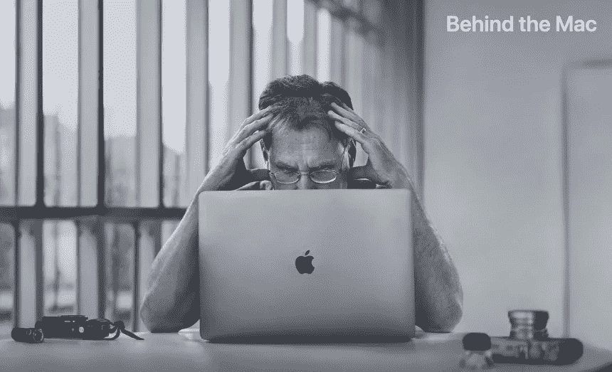
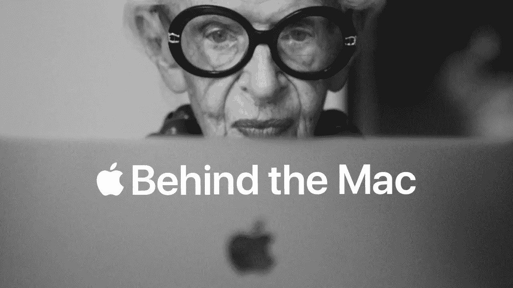
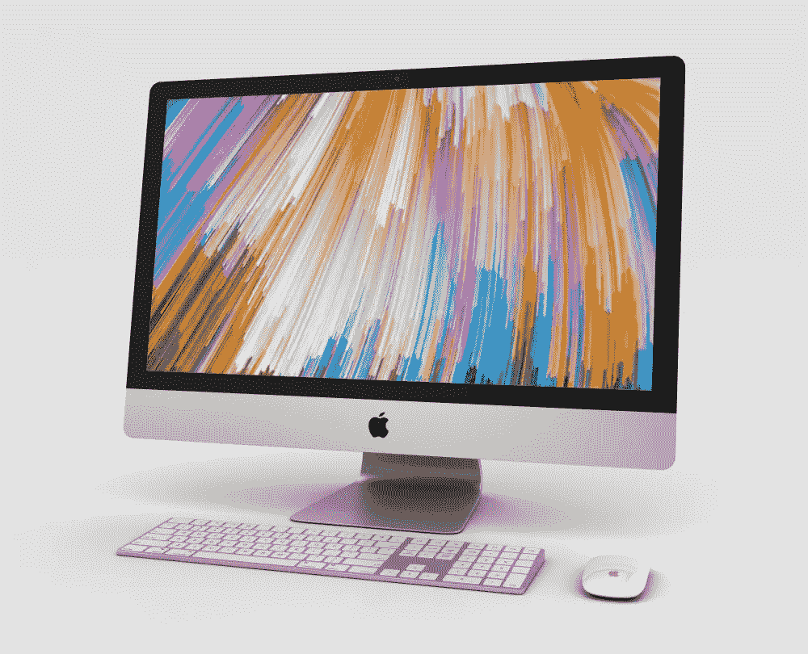

# 我是苹果粉丝还是仅仅是逻辑上的？

> 原文：<https://medium.com/codex/am-i-an-apple-fanboy-or-just-logical-5bb91e895127?source=collection_archive---------9----------------------->

## 看来我注定再也不会使用装有 Windows 系统的电脑了。为什么不呢，我想知道？

很多年前，也许我不愿承认，我有一台个人电脑。这是我的第一台个人电脑。天啊，那次经历太糟糕了，但是我不知道还有更好的，所以坚持了下来。无休止的更新，缓慢，无尽的塑料海洋，以及它似乎不合逻辑的运行方式。然后我在创意工作室和平面设计师呆了一段时间，并有了音乐行业的朋友。普遍来说，他们似乎在使用这些非常酷的铝制设备，有着惊人的显示，没有更新！

## 尴尬，但是…

事实上，我要把这个放到博客上，这一点也不酷！当我深陷电脑深渊的时候，我能做到的最好的事情就是…使用 macOS 屏保！是的，你没看错！我*实际上*非常渴望苹果“钟声”的世界，以至于我使用了 Mountain Lion OS 屏幕保护程序，只是用来做好梦。

## 第一步

我的第一台苹果电脑是 MacBook Air。到家后，我很快发现它没有足够的存储空间来存放我的 iTunes 音乐库。商店里可爱的人们很快就用外部驱动解决了这个问题，随后，我就完全投入了。事实上，在接下来的几个月里，我每周日都会回到店里，学习如何充分利用我的新机器和新世界。我非常想和*的酷人们一起体验苹果的生态系统。*

## 欲望

从职业的角度来看，我正走向改变。这种改变就是 Adobe Creative Cloud 应用程序套件将成为我最好的朋友，因为我开始了一家设计公司。虽然现在，你可以用 Indesign 和 Photoshop 在 PC 上像在 Mac 上一样工作，但那时候它还不常见。你从代理处收到的文件将是 Mac 创建的，或者使用 Mac 系统字体。为了融入那个世界，T4 必须成为 Mac，这就是我需要的所有借口。

## 银色的海洋

即使是现在，如果我拜访创意人员，而他们在 Mac 上是*而不是*，那么我仍然会悄悄地怀疑他们是否是适合我的团队。我能想象自己和他们一起工作吗？我知道这很傻，但创意和苹果电脑似乎很管用。你希望你的年轻的，打着顶结的，斯坦·史密斯·阿迪达斯穿着有创意的衣服在苹果电脑上工作，对吗？如果 Mac 上有贴纸就更好了！这就是我想要的氛围。我知道，这一切让我看起来既可笑又肤浅。在一个好的日子里，我是一个相当精明的商人，不要认为我是任何人的傻瓜，但这种与 Mac 合作的欲望直到现在仍然存在。在我的辩护中，这种现象甚至有一些研究进行了调查。

研究人员闪现了 IBM 的标志，然后是苹果，并测量了神经反应。信不信由你，大脑的创造性一侧在看到苹果标志时开始表现出更有创造性的迹象。有趣的是，大多数反应都以非常相似的方式产生共鸣，除了两个不同的领域，即能力和创造力。这些结果得到了一组独立评论者的证实，证实了调查结果。

 [## 你害怕 iOS 更新吗？

### 不要…你会更安全

medium.com](/codex/are-you-afraid-of-ios-updates-a60c037ec0a) 

## 从一开始

和以往一样，苹果有点不同。苹果开始一次改变一个人的世界。即使在他们黑暗贫瘠的日子里，这一点仍然显而易见。是胶水将愿景粘合在一起。仅仅生产产品从来都不是目标，而是最初使命的具体体现。对他们来说，改变世界的方法是开发更明亮、更有吸引力的产品，以及旨在激发创造力的产品。你有没有注意到，你是多么想在 Mac 上花更多的时间？诱惑还在。苹果从未忽视他们与终端用户的某种个人联系。

## 久经考验

苹果电脑一直将用户体验放在首位。追溯到四十年前，Mac 在桌面设计和渲染字体方面取得了领先地位。事实上，通过利用 PostScript 和 PageMaker，一些人认为苹果实际上对创建整个桌面出版业负有责任。当然，他们的营销活动总是会引起情绪化的反应。但是，他们用硬件来支持这些活动。我们不要忘记，第一个有吸引力的、用户友好的 GUI(图形用户界面)也是在 Mac 上发现的，这并不奇怪。

 [## iOS 15.4——你激动吗？

### 目前，仅处于测试阶段，但很快就会出现在你身边的 iOs 设备上！

medium.com](/codex/ios-15-4-are-you-excited-886be765138c) 

## 体验

这一经历绝非偶然。他们最早的操作系统之一 System 7 是通过一些头脑风暴会议实现的，使用索引卡来记录想法。简单的功能，比如给用户界面添加颜色，被写在蓝色卡片上。被认为有点难以实现的目标，如真正的多任务处理，被写在粉红色的卡片上，而当时只是幻想的想法被归入红色卡片。

无论是坐在 Mac 电脑前还是后面，一切似乎都更具设计感，更倾向于创造性地发挥你的最大潜能。我们现在认为理所当然的简单事物，如空投、一流的触控板和 Retina 5K 显示器，所有这些都有助于使下一个创造性挑战更容易实现。

因此，在 Mac 背后的运动诞生了，我在整个博客中用图片向它致敬。说明了一切！

## 结论

与苹果电脑一起工作的诱惑和渴望是真实的。否认是没有意义的。这么想吧。你可以开着一辆破旧的迷你去上班，或者开着一辆崭新的宾利去上班。当然，你会到达相同的目的地，但是我知道我宁愿如何到达那里！

## 在你走之前

[**加入我的幕后邮件列表**](https://www.talkingtechandaudio.com)

**原载于 2022 年 2 月 23 日 https://www.talkingtechandaudio.com/blog****[**。**](https://www.talkingtechandaudio.com/blog)**

****

**查看并订阅我的负十六播客。每两周在 Spotify、苹果播客和谷歌播客上发布新剧集。[https://podcast . apple . com/GB/podcast/the-MINUS-16-podcast/id 1608899642？i=1000550310853](https://podcasts.apple.com/gb/podcast/the-minus-sixteen-podcast/id1608899642?i=1000550310853)**