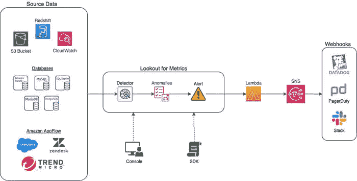
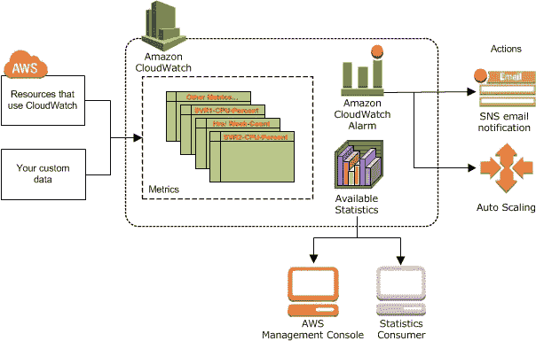

# 亚马逊 Lookout 和 Cloudwatch 度量流

> 原文：<https://medium.com/codex/amazon-lookout-and-cloudwatch-metric-streams-3f43dad5abdd?source=collection_archive---------15----------------------->

可观察性技术。图片来源:新闻专线报道

在利用 AWS 的过程中，会涉及到数据流、需要考虑的指标以及最重要的需要分析的基础设施。AWS 的好处是他们倾向于每周更新，所以每个人都有更新日志，让客户对产品有更好的体验。有过几次更新，但我对亚马逊 Lookout 和 CloudWatch metrics 感兴趣。我们将在空间中就最近的更新进行一些小的交谈。

## 亚马逊了望台

企业和组织拥有经过多次量化和分析的时间序列数据，但对于一些非常大规模的数据，即使是小数据，了解数据中是否存在异常也是有利的——这就是**亚马逊了望台**的特色。根据定义，它用于检测业务指标中的异常。这些数据包括价格、收入、日期以及与业务相关的许多其他信息。它可以从控制台进行设置，用户可以使用某些指标来指导服务如何报告任何形式的数据异常。AWS 还更新了它支持至少 19 种不同的数据存储，包括 cloudwatch、salesforce 等。

AWS Lookout 是一个非常重要的工具，您可以在其中设置异常检测的指标，获取所需服务的特定部分的警报，检索数据集和许多其他有趣的系统数据选择。AWS 描述的操作基础设施的概念如下所示:

在理解了从数据源/银行到用于各种检测的度量标准，然后最终到将向 webhooks 报告的几个 AWS 服务的基础设施的流程之后；现在是勇敢面对困难，尝试新事物的时候了。我本来可以做一个教程，但我认为有一个仓库做得更好，请参与并返回问题，如果需要的话。查看 [**这里**](https://github.com/aws-samples/amazon-lookout-for-metrics-samples) 但是如果你对通用文档感兴趣，请随意[**这里**](https://aws.amazon.com/blogs/machine-learning/introducing-amazon-lookout-for-metrics-an-anomaly-detection-service-to-proactively-monitor-the-health-of-your-business/?sc_channel=EL&sc_campaign=Launch_2021_vid&sc_medium=YouTube&sc_content=Video8940&sc_detail=LAUNCH-NEW&sc_country=US)

## 云观察指标

对于 AWS 用户，我相信你理解 CloudWatch 在监控你的服务、检查日志、跟踪系统等方面的重要性。很多时候，很难收集任何交付的指标、日志和数据，我相信这就是 CloudWatch 指标工具在 Kinesis Data Firehose(注册表)中存储相关数据的原因。

现在，在系统中使用聚集指标可能是有用的，但是在指标发布中可能存在某种滞后，并且可能影响系统的一般操作和监控。因此，Datadog、New Relic 和其他合作伙伴正在使用 CloudWatch 指标来帮助向客户提供解决方案。AWS 使用户能够将数据传送到不同的数据存储器成为可能；红移，S3 桶和其他几个。

CloudWatch Metric Streams 现已推出，您可以使用它将指标传输到您自己或 AWS 合作伙伴的 Kinesis 数据消防软管。除了自动气象站中国(北京)区域和自动气象站中国(宁夏)区域之外，所有自动气象站区域都提供这些数据流。此外，支付有利于业务，但要有更深入的了解，查看 [**这里**](https://aws.amazon.com/cloudwatch/pricing/) 。最后，查看文档 [**这里**](https://aws.amazon.com/blogs/aws/cloudwatch-metric-streams-send-aws-metrics-to-partners-and-to-your-apps-in-real-time/?sc_channel=EL&sc_campaign=Launch_2021_vid&sc_medium=YouTube&sc_content=Video8940&sc_detail=LAUNCH-NEW&sc_country=US) ，获得如何完成的一步一步的过程

现在，为了记录，这个内容对社区中的各种人开放。如果你有问题，有评论，有投稿，在这里拍或者**联系我上**[**Twitter**](https://twitter.com/SamuelArogbonlo)**和**[**Github**](https://github.com/samuelarogbonlo)**。**

**感谢阅读❤️**

如果你对这个话题有任何想法，请留下评论——我乐于学习和探索知识。

# 我可以想象这个帖子有多有用，请留下掌声👏下面几次来表示你对作者的支持