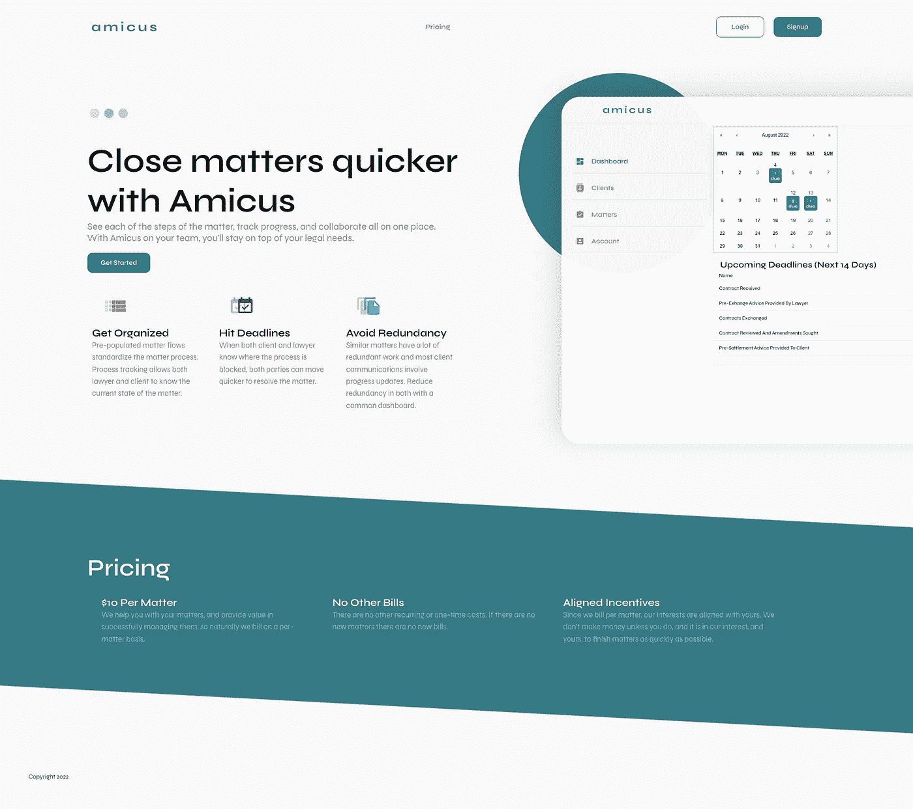
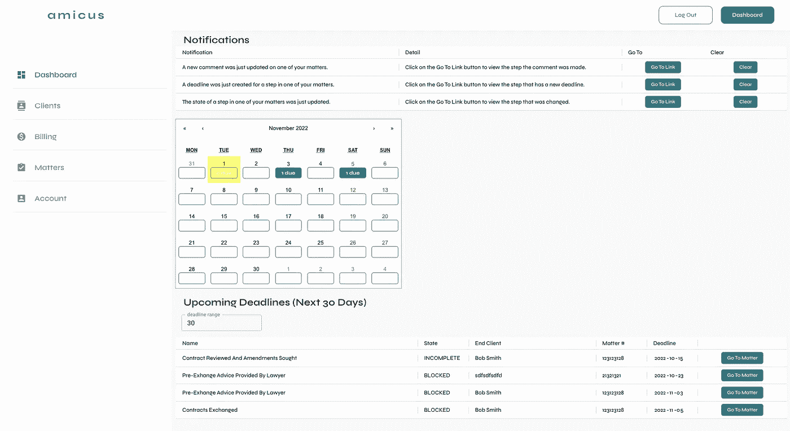

# Amicus:看看 Erlis 如何用 Wasp 为法律团队建立了一个 SaaS，并获得了首次付费的客户！

> 原文：<https://medium.com/codex/amicus-see-how-erlis-built-a-saas-for-legal-teams-with-wasp-and-got-first-paying-customers-b2949791deb6?source=collection_archive---------8----------------------->

[Erlis Kllogjri](https://github.com/ErlisK) 是旧金山的一名工程师，拥有从机械工程和 C/C++微控制器编程到 Python 和 web 应用程序开发的丰富经验。在空闲时间，Erlis 喜欢做一些兼职项目，这也是 Amicus 的初衷。

Amicus 是法律团队的 SaaS——可以把它想象成“律师的体式”,但其功能和工作流程是为法律领域量身定制的。

请继续阅读，了解 Erlis 用 Wasp 开发第一版 SaaS 花了多长时间，他是如何获得第一批付费客户的，以及他下一步计划添加什么功能！

# 寻找全栈“一体化”解决方案，React & Node.js

Erlis 第一次了解 Wasp 是在 HackerNews 上，它立即引起了他的注意，尤其是配置语言部分。他过去工作过的一家公司在硬件领域有自己的内部 DSL，他知道这对快速移动和避免样板文件有多大帮助。

Erlis 之前也有过 web 开发的经验，尤其是 React 和 Javascript 的前端经验，这使得 Wasp 成为一个合理的选择。

> *我在寻找其他解决方案，但没有一个是全栈式的，听起来像是要做大量的工作才能将所有东西缝合在一起并开始使用。我只想完成工作，并不关心自己挑选堆栈细节。Wasp 真的很有帮助，因为它为我提供了最佳实践，我在几分钟内就让一切都运行起来了！*
> 
> *— Erlis Kllogjri — Amicus*

# 构建 Amicus v1.0 并获得第一批客户！

Amicus 的想法来自他的兄弟，他在一家律师事务所工作——谈到他们的过程和执行过程中的挑战，Erlis 认为这将是一个有趣的兼职项目，特别是考虑到有一个真正的问题需要解决。

很快，Amicus 的第一个版本上线了！它是以一种真正的精益创业方式制作的，从基本功能开始，并立即接受用户测试。

Amicus 的仪表板，使用材料-用户界面

Erlis 使用 Material-UI 作为 UI 库，因为它附带了 Wasp 内置的一个示例应用程序(Beta 版引入了顺风支持！).用户可以跟踪他们的客户，积极的法律事务，甚至有与条纹集成计费！Amicus 还广泛使用 Wasp 的[异步作业](https://wasp-lang.dev/blog/2022/06/15/jobs-feature-announcement)功能来定期更新发票、发送提醒电子邮件和清除数据库中的旧数据。

在与 Amicus 的测试用户(例如，通过角色添加对不同类型用户的支持)的法律团队进行了几次迭代之后，他们已经准备好加入并成为付费客户了！来自一家公司的 20 多人每天都在使用 Amicus 进行工作，这使得它成为一个为进一步发展提供持续反馈的惊人来源。

Erlis 最喜欢每周用 Wasp 快速进步和发布功能。有了前端、后端和数据库集，并从一开始就完全配置为协同工作，他可以专注于开发功能，而不是花时间搞清楚特定堆栈的复杂性。

> *如果不是 Wasp，Amicus 大概永远也完不成。我估计它从一开始就为我节省了 100 多个小时，我仍然惊讶于我作为一个团队完成了所有这些工作。能够快速更改现有功能并添加新功能是 Wasp 对我来说最大的优势。*
> 
> *— Erlis Kllogjri — Amicus*

# 超越 MVP 与黄蜂

尽管 Erlis 已经有了一个产品在生产中运行，有了第一批付费客户，他想看看他能走多远，并对下一个功能有很多想法(也有要求)。(实际上，当我们聊天时，Erlis 身后的墙上有一个很大的看板，上面贴着便利贴，专门写给 Amicus——这让人印象深刻！)。

一些最紧迫的问题是:

*   在律师和客户之间上传和共享文件
*   使用记录和分析
*   用于通知的交易电子邮件

由于 Wasp 正在使用 React、Node.js 和 PostgreSQL(通过 Prisma)等当今主流的、经过生产测试的技术生成代码，随着 Amicus 的发展和吸引更多用户，扩展 Amicus 没有任何技术限制。

此外，假定`wasp build` CLI 命令为后端生成一个就绪的 Docker 映像(并为前端生成静态文件)，部署选项是无限的。由于 Heroku 正在关闭其免费计划，我们增加了如何在 [Fly.io](http://fly.io/) 和 Railway(免费增值)上免费部署您的项目的指南。

> 当我还在 Alpha 的时候，我就在使用 Wasp，它的一切运行得如此之好给我留下了深刻的印象，尤其是我得到了这么多东西。我只有几个小问题，团队对不和谐的地方反应非常快，并帮助我解决了它。
> 
> *—埃尔利斯·克洛格里—阿米库斯*