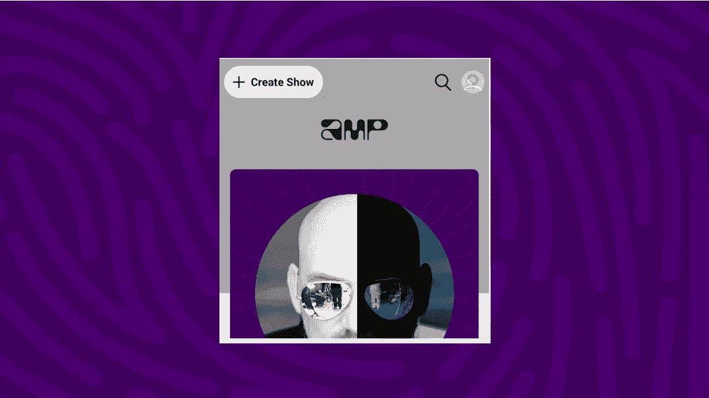

# 亚马逊的 Amp 彻底改造了无线电

> 原文：<https://medium.com/codex/amp-reinvented-radio-449a9e719a65?source=collection_archive---------7----------------------->

今天，我打开了我最喜欢的社交音频应用— [Amp](https://www.onamp.com/) 。Amp 是亚马逊的最新平台，为下一代音乐潮流引领者提供支持。在这篇文章中，我将介绍产品、竞争对手以及未来的增长和盈利策略。

***你听说过 Amp 吗？*** Amp 通过解锁一个授权音乐目录创建了一个围绕音频的在线社区，创作者可以从中制作音乐广播节目。每个用户立刻成为网络音乐节目主持人和电台主持人，制作他们自己的节目。当主持人“直播”时，他们向听众播放音乐和讲故事。Amp 在测试模式下适用于 iOS。

Amp 的有限发布并没有模糊平台愿景。Amp 由用户生成的内容驱动，从第一次迭代开始，就内置了双向互动的机会(听众可以通过“打电话进来”加入对话)。创作者教育的重点是鼓励观众参与，这反过来提高了个人节目的参与度，推动了平台的发展。

***方便为王。*** Amp 立足于科技和音频行业的发展趋势。

其中最显著的是 Amp 利用人们对广播的重新兴趣以及播客向新音频格式扩展的方式。领先的音频服务(Spotify 和苹果播客)正在投资[现场音频](https://www.spotify.com/us/live/)、[视频播客](https://podcasters.spotify.com/blog/video-podcasts)、[有声读物](https://investors.spotify.com/investor-day-2022/)和[语音新闻](https://investors.spotify.com/investor-day-2022/)。这些公司的方法是增加可用内容的数量。Amp 用不同的方法进行实验。通过将播客、广播和音乐融合到一个产品中，Amp 提供了一种便捷的收听解决方案。Amp 的独特定位是成为音频中心；它具有社会和美学功能，同时又是最新的和易于使用的。

***每个听众都是潜在的创造者。***
减少制作内容的障碍吸引了那些原本不会出现的新创作者。Twitter 通过增加 140 个字符的限制、喜欢和转发，打破了 RSS 博客帖子的单向信息流，鼓励每个用户加入对话。Amp 是首批成功实现双向互动的音频应用之一。以听众来电的身份参与一个节目后，主持一个节目只需在主页上点击一下。

Amp 的主页鼓励你创作自己的节目。

***保持真实。*** 互联网的潮流应用( [Clubhouse](https://www.clubhouse.com/) 、 [Callin](https://www.callin.com/) 、抖音和贝里尔)标志着一个未经编辑内容的新时代。虽然过滤时刻曾主导社交媒体，但消费者现在寻求与当代问题相关的真实体验。Amp 的低制作门槛(一切都是预先许可的，在应用程序内录制和播放)确保创作者可以快速发布内容。此外，Amp 通过研究音频来挖掘我们与生俱来的对声音和情感的偏好。

***平台的下一步是什么？Amp 目前专注于用户测试、反馈和产品实验。当它变得广泛可用时，亚马逊将能够通过利用品牌(雇佣有影响力的人)和现有用户群(通过时事通讯和品牌光环产生注册)来增加 Amp 受众。***

Amp 节目可以免费直播。引入订阅模式为创作者提供了一条将作品货币化的途径。我设想在未来，粉丝们可以每月向 Amp 付费(类似于苹果播客订阅)，并点播电台节目。Substack、Medium 和 Patreon 证明了订阅费可以为创作者提供有意义的报酬，从而开启传统媒体看门人之外的新机会。创作者得到补偿，听众可以在通勤、日常活动以及作为个人 DJ 参加聚会和活动时随身携带他们最喜爱的广播节目。

**Amp 重新展望了 21 世纪的无线电。亚马逊的音乐授权交易和整合平台降低了创作者的内容制作壁垒。对于消费者来说，将播客、广播和音乐融合到一个产品中，为收听提供了多方面的解决方案。最后，Amp 通过鼓励交互性和用户生成的内容来重新划分创作者和听众之间的界限。**