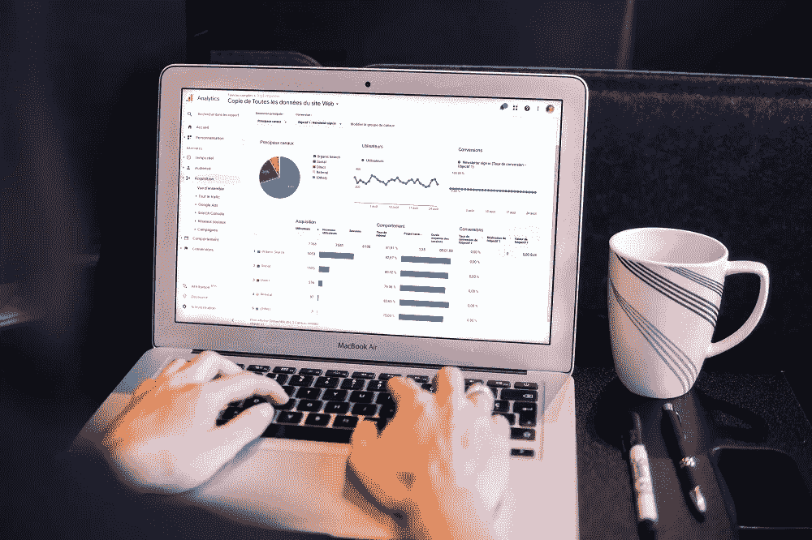
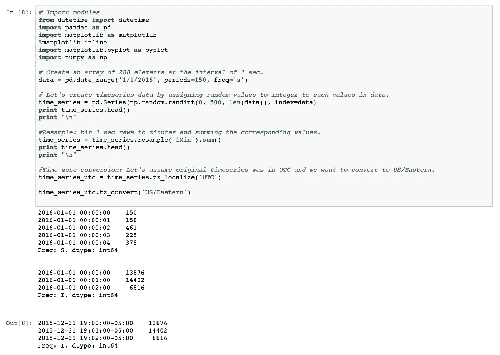

# 关于数据争论的绝对初学者指南。

> 原文：<https://medium.com/codex/an-absolute-beginners-guide-on-data-wrangling-a82be0bf32f5?source=collection_archive---------3----------------------->

数据争论被认为是每个数据科学家经历的最重要的过程。然而，这是最耗时的过程之一，也是迅速做出决策的关键解决方案之一。分解它；简单来说什么是数据角力？在这篇文章中，我们将了解更多关于熊猫的数据争论。

# 时间消费者

数据争论被认为是每个数据科学家经历的最重要的过程。然而，这是最耗时的过程之一，也是用于快速决策的关键解决方案之一。分解它；简单来说什么是数据角力？在这篇文章中，我们将了解更多关于熊猫的数据争论。

***系好安全带，马上开始吧！！***

# 数据争论

在数据科学项目中，经常会遇到这样的情况，您必须处理混乱或不完整的数据。我们从不同数据源获得的原始数据在开始时往往是不可用的。您对原始数据进行的使其“干净”到足以输入到您的分析算法中的活动被称为数据争论或数据管理。如果你想创建漂亮的数据可视化，你应该准备好做大量的数据争论。

正如大多数统计学家、数据分析师和数据科学家承认的那样，实现分析的大部分时间都花在清理数据本身上，而不是编码或运行使用数据的特定模型。根据 O'Reilly 的 2016 年数据科学薪酬调查，69%的数据科学家将在日常工作中花费大量时间处理基本的探索性数据分析，而 53%的人将时间花在清理数据上。数据辩论是数据科学角色的一个重要组成部分，如果你获得了数据辩论技能并精通它，你将很快被认为是一个能够为前沿数据科学工作做出贡献并能够作为数据专业人员坚持自己的人。

总而言之:获取混乱、不完整或过于复杂的数据，并对其进行清理，以便可用于分析。

现在我们将借助例子来说明一些流行的 Pandas 技术，这些技术用于使数据争论过程更容易。

# 与熊猫的数据争论

[Pandas](http://pandas.pydata.org/) 是最流行的用于数据辩论的 Python 库之一。我们将使用 Pandas 数据框，这些数据框以表格的形式构建，您可以使用 Python 代码轻松操作行和列。

你可以通过阅读 Julia Evans 的熊猫食谱和了解 Python 的基础知识来开始接触熊猫。

我们将使用为 Kaggle 的 [Titanic:机器从灾难中学习](https://www.kaggle.com/c/titanic)提供的“train.csv”作为我们的实验数据集。如果您愿意，可以下载并跟随它。

让我们以熊猫数据框架的形式读取数据，并对其进行研究。

# 删除丢失的值

您将使用的数据会有一些缺失的数据点。理解“如何处理缺失数据”真的很重要。随着您对数据科学了解的加深，您将了解数据插补。在这里，我们将学习查找缺失的数据点，然后我们将从数据集中删除这些点，以免影响我们的分析偏差。我们将尝试找出“train.csv”中的哪些列包含缺失值，并删除这些缺失值，这样您将拥有整洁的数据。

正如我们从输出中看到的，列“Age”、“Cabin”和“Embarked”包含缺失值或空值，因为它们表明如果该列中有任何空值，则该语句为真。我们希望删除所有缺少值的行。

当打印出数据帧中的前五个值时,“Cabin”列中有一些空值。在进行任何深入分析之前，我们必须放弃这些值！

在下一个命令中，我们将删除 PassengerIds 1、3 和 5——我们希望删除的空行，因为我们缺少关于他们的客舱的信息！

这种数据争论对于不完整的数据集来说很方便。你不想在分析中出错，因为你处理的是不完整的数据。例如，您可能会收到一份商店及其销售额的列表。有些商店为您提供了空值，而您只想计算那些具有有效条目的商店的平均值。您必须删除空值来进行数据分析。知道如何丢弃没有任何意义的值只会有助于增强你在这种情况下的数据分析技能。

# 过滤数据

在探索性数据分析阶段，您可能对使用数据子集或使用某些标准过滤掉部分数据感兴趣。假设您只想查看人的“年龄”大于 30 或“性别”为“女性”的数据点。

让我们从隔离那些乘客年龄超过 30 岁的排开始。

现在，让我们从隔离那些女性乘客开始。

我们也可以用多个条件过滤数据。现在让我们看看如何隔离 30 岁以上的女性乘客。

我们可以使用这种过滤对一部分人群进行探索性数据分析。分离出特定群体的某些特征是很重要的。

在这种情况下，我们可以发现，如果你是一名 30 岁以上的女性，你的生存机会超过 80%。你应该对你的数据进行辩论和过滤，直到你得到你正在查看的特定细分市场的代表性视图——也许你下次比较成为顾客和没有成为顾客的网站或商店访问者之间的差异时，你会想要使用这种技术。

# 分组数据

让我们转向更有挑战性的东西。如果我们想了解一个人的性别是否与他的生存有任何关联呢？Pandas group by 返回一个 DataFrameGroupBy 对象，它有多种方法。调用 value_count()返回列中每个唯一值的计数。

看起来，如果你是男性，你的生存几率会比女性低得多。

例如，您可能有来自不同商店的单个销售额，但是您可能希望按它们所属的地理区域对它们进行分组，以便您可以逐个城市地查看趋势，而不是逐个商店地查看。

# 时间序列数据处理

时间序列数据是最重要的数据形式之一。在处理金融数据、天气数据等时，您会发现这些类型的数据。你需要观察特定时期的气候模式，或者金融增长和停滞之间的差异。

这里我们将使用 Python 的熊猫来理解时间序列数据。根据分析结果，您可能想要更改时区，将数据从秒重新采样为分钟，等等。让我们尝试使用 Pandas 和 Python 的 DateTime 库来执行这些操作。

# 导出数据

每当你完成数据分析时，这是一个需要考虑的重要步骤:如何最好地分享你的结果。您需要仔细考虑您的同事使用的不同数据格式。确保数据以最好的方式呈现给他们。

# 结论

数据争论是任何数据分析的重要组成部分。在对数据应用任何算法之前，您需要确保您的数据已准备就绪，可以方便地使用。数据准备是优秀数据分析的关键部分。通过丢弃空值、过滤和选择正确的数据以及处理时间序列，您可以确保应用于已清理数据的任何机器学习算法都是完全有效的。

我希望你喜欢这篇文章！别忘了留下你的回答。

*敬请期待！为了把我的故事发到你的邮箱里，请* ***订阅我的简讯。***

*感谢您的阅读！不要忘记给你的掌声，分享你的回答，并与朋友分享！*