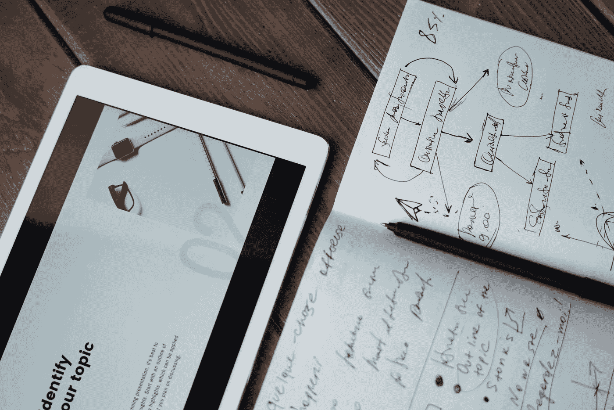

# 人工智能如何改变营销格局的分析

> 原文：<https://medium.com/codex/an-analysis-of-how-ai-is-changing-the-marketing-landscape-f2138360d37?source=collection_archive---------22----------------------->

众所周知，技术和数字创新已经永远改变了我们做生意的方式。但你可能不知道的是，人工智能正在如何改变营销格局，从根本上改变企业在其数字空间吸引和留住客户的能力，以及营销人员如何通过使用分析和自动化来简化他们的多渠道战略，从而推动增长。让我们来看看人工智能是如何改变我们今天所知的营销格局的。

## 介绍人工智能及其在市场营销中的潜力

人工智能(AI)允许营销人员做出更明智的决策，自动化日常任务，并与客户进行更深入的对话。在您的营销团队中使用人工智能，您可以通过使用机器学习来推动可操作的结果，从而从客户数据中发现新的见解。AI 在营销方面的潜力已经不容忽视。对于营销人员来说，现在是时候超越将人工智能视为自动化分析的工具，并开始利用它来改变他们在客户旅程的每个阶段与客户互动的方式。

## 人工智能如何用于定向广告和个性化内容

人工智能(AI)有望在许多方面改变世界，从改善我们的健康和交通到提高我们的学习和生产力。人工智能技术可以增强的一个具体领域是在线营销。在线营销人员一直在寻找更好的方法来为用户定向广告和个性化内容——人工智能可以帮助高效和大规模地做到这一点。例如，只需几行代码，广告商就可以自动确保人们根据他们的浏览历史或搜索历史看到广告(假设他们已经同意看到这种定向广告)。或者，他们可以确保有人在访问特定商店时收到折扣券。

虽然这两个例子涉及使用人工智能算法根据人们过去的行为将他们与相关内容进行匹配，但另一种方法涉及使用人工智能系统作为助手，为客户创造更个性化的体验。例如，网飞使用了一种叫做“电影技术”的算法来分析你的观看习惯，并推荐你可能喜欢的其他电影。利用这些机会的企业将比没有利用这些机会的竞争对手更有优势。

另外，AI 提供的不仅仅是定向广告和提供定制内容；企业还将受益于自动化带来的成本节约、更有效的目标定位策略带来的销售增长、需要更少人力投入的流程带来的效率提升、预测分析和实时数据收集/分析带来的准确性提升等等。难怪专家预测人工智能将很快成为每个公司商业战略的核心组成部分！

## 在营销中实施人工智能的优势

数字营销和自动化都是为了让工作变得更容易，提高生产力，赚钱。有什么比人工智能更好的方法呢？我们仍然处于在营销中使用人工智能的早期，但这里有一些企业可以立即使用它来赚更多钱的方法。Juniper Research 的一份新报告预测，到 2022 年，人工智能将使美国零售商的电子商务收入翻一番。这对每个人来说都是好消息！

将人工智能用于营销意味着能够更加智能地将广告瞄准特定人群。已经有了像亚马逊的赞助产品工具这样的服务，它可以根据你客户的购物习惯自动推荐相关产品——只有当有人点击你的广告或通过它买东西时，你才需要付费。

## 在营销中使用人工智能的挑战

使用人工智能来改善营销工作存在一些挑战。人工智能系统需要大量的数据来进行适当的训练，这意味着你需要为你的机器学习算法提供大量的历史数据。你还需要给它详细的指标和关于每个指标的足够信息，以便它可以确定什么是成功的营销活动。这可能具有挑战性，因为您可能没有您想要的那么多可用的历史数据，尤其是在开始时。

最后，人工智能需要巨大的计算能力来快速运行算法，这使得没有专门 IT 人员或大量计算资源的中小型企业难以实施。

尽管存在这些挑战，但市场营销人员仍有办法利用人工智能。如果你已经从过去的活动中获得了大量历史数据，人工智能系统可以分析这些数据，并帮助你找到隐藏的模式，否则这些模式将不会被注意到。例如，如果一项活动的销售额比另一项活动多 10%，人工智能系统可以指出哪里出了问题，以确保未来的成功。

## 人工智能在市场营销中的未来

随着 AI 的不断完善，它将通过提供人类营销团队无法比拟的数据驱动的洞察力来重塑营销。例如，虚拟个人助理使用人工智能为客户及时提供他们确切需要的东西。为了在今天的市场中保持相关性，所有企业都必须采用人工智能策略。从客户服务到销售，所有营销团队都应该尝试人工智能，并将其作为公司未来的一部分。最终，公司将不再依赖人工营销人员，而转向由技术驱动的全自动方法。这并不意味着人类在营销中没有任何空间——相反，人工智能将为人类营销人员腾出时间，专注于更具战略性的任务。