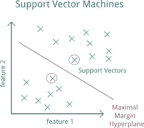

# 支持向量机剖析。

> 原文：<https://medium.com/codex/an-anatomy-of-the-support-vector-machines-19e1cdcbe4c5?source=collection_archive---------9----------------------->


照片由 [JJ 英](https://unsplash.com/@jjying?utm_source=medium&utm_medium=referral)在 [Unsplash](https://unsplash.com?utm_source=medium&utm_medium=referral)

# 介绍

支持向量机(SVM)是一种监督机器学习算法，同样强大和通用。它能够执行线性或非线性分类和回归，还可以执行异常值检测等任务。这是机器学习中最广为人知的模型之一，任何热衷于机器学习的人都必须学习这个模型。它非常适合于复杂但小型或中型数据集的分类。

# 说明



从 iconspng.com 检索的图像

让我们更生动地讨论线性 SVM 分类。借助一张图来解释任何概念都很方便。看一下上面的图片，它显示了一些绘制在图表上的数据点。数据点由一条红线分隔，这条红线称为“决策边界”。这条直线清楚地将数据点分成两组或两类，这表明数据点是线性可分的。这仅仅意味着通过这些点的一条直线可以将它们分成两个不同的类，从而成为一个很好的线性分类器。该直线不仅将两个类别分开，而且尽可能远离最近的训练数据点。

您可以将 SVM 分类器视为适合最宽的街道，其中街道由类之间中间的红线表示。这就是所谓的大幅度分类。当我们在“街道之外”添加更多的训练实例时，它根本不会影响决策边界，因为它完全由位于街道边缘的数据点的示例来确定或“支持”。这些实例被称为支持向量(用红色圈出)。

如果我们严格规定所有示例数据点必须远离红色决策边界线并位于右侧，这就是所谓的硬边界分类。硬边界分类产生了问题，因为它仅对线性可分的数据点有效，并且它对异常值非常敏感，在某些情况下可能不能很好地概括。

因此，使用不太严格的模型更为可取。我们这里的主要目标是通过保持决策边界尽可能大来找到一个好的平衡，同时也限制边界违规。限制边界违规是指数据点位于决策边界的中间或位于错误的一边。该分类遵循上述条件，允许一些固定数量的边界违规，并且具有多一点的灵活性，被称为软边界分类。

在 scikit-learn 的 SVM 类中，我们可以使用 C 超参数来控制这种平衡。较小的 C 导致较宽的决策边界，但更多的边际违规，另一方面，较高的 C 值导致较少的边际违规，但最终得到较小的决策边界或边际。有时，如果边际违规在边际的正确一侧，边际违规可以导致更少的预测错误。

# 用 Python 实现

以下 scikit-learn 代码加载 iris 数据集，缩放要素，并使用 C=1 的 LinearSVC 类和铰链损失函数来训练线性 SVM 模型以检测 Iris-Virginica 花朵。

```
import numpy as np
from sklearn import datasets
from sklearn.pipeline import Pipeline
from sklearn.preprocessing import StandardScaler
from sklearn.svm import LinearSVC
iris = datasets.load_iris()
x = iris[“iris_data”][:, (2, 3)] # petal length, petal width
y = (iris[“iris_target”] == 2).astype(np.float64) # Iris-Virginica
svm_clf = Pipeline([
(“scaler”, StandardScaler()),
(“linear_svc”, LinearSVC(C=1, loss=”hinge”)),
])
svm_clf.fit(x, y)
svm_clf.predict([[5.5, 1.7]])
output — array([1.])
```

SVM 分类器不像逻辑回归分类器那样输出每个类别的概率。我们也可以使用 SVC(kernel=" linear "，C=1)来使用 SVC 类，但是由于它非常慢，特别是对于大型训练集，所以不建议这样做。另一个替代方案是使用 SGDClassifier 类，其中 SGDClassifier(loss="hinge "，alpha=1/(m*C))。该技术使用规则随机梯度下降来训练线性 SVM 分类器。它的收敛速度不如 LinearSVC 类快，但在处理不适合内存的大型数据集或处理在线分类任务时，它会很有用。

LinearSVC 类调整偏差，因此我们必须首先通过减去其平均值来确定训练数据的中心。如果使用 StandardScaler 缩放数据，这将自动完成。此外，我们应该确保将损耗超参数设置为“铰链”，因为它不是默认值。

因此，为了获得更好的性能，您应该将对偶超参数设置为 False，除非有比训练示例更多的特征。也有可能进行非线性和多项式 SVM 分类，我希望在另一篇博客中讨论。

# 结束语

今天到此为止。非常感谢你阅读我的文章并支持我。:)

想了解我更多，想获得更多类似的内容，请在我的 LinkedIn、Twitter 或脸书页面上关注我

领英—[https://www.linkedin.com/in/salman-ibne-eunus-09255a144/](https://www.linkedin.com/in/salman-ibne-eunus-09255a144/)

推特——https://twitter.com/ibne_eunus

https://www.facebook.com/salmaneunus27 脸书—