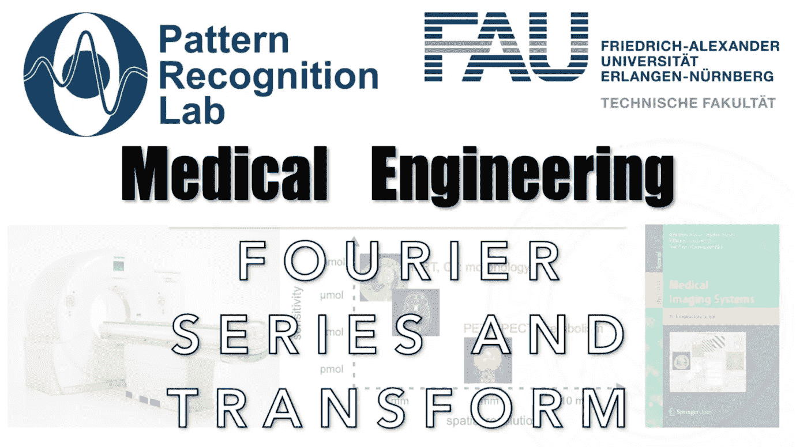

# 傅立叶变换的动画介绍

> 原文：<https://medium.com/codex/an-animated-introduction-to-the-fourier-transform-574380df6c55?source=collection_archive---------6----------------------->

## 医学工程讲义

## 从时域到频率，然后返回

**这些是 FAU 的 YouTube 讲座** [**医学工程**](https://www.youtube.com/watch?v=vvftvjnXzsY&list=PLpOGQvPCDQzsgK1XuhUXO8r9M4WRqhvDf) **的讲义。这是与幻灯片匹配的讲座视频&的完整文本。课程由相应的** [**开放存取书**](https://link.springer.com/book/10.1007/978-3-319-96520-8#about) **和开源幻灯片** …