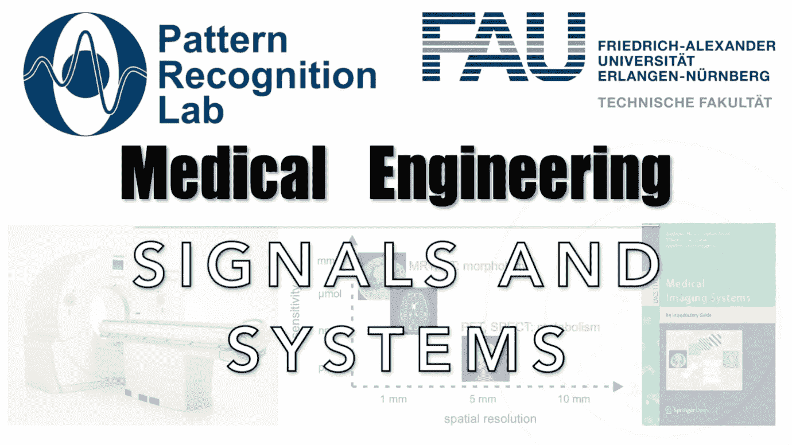

# 信号和系统的动画故事

> 原文：<https://medium.com/codex/an-animated-tale-of-signals-and-systems-38a72630d5e0?source=collection_archive---------11----------------------->

## 医学工程讲义

## 数字信息处理的基石导论

**这些是 FAU 的 YouTube 讲座** [**医学工程**](https://www.youtube.com/watch?v=vvftvjnXzsY&list=PLpOGQvPCDQzsgK1XuhUXO8r9M4WRqhvDf) **的讲义。这是与幻灯片匹配的讲座视频&的完整文本。该课程由相应的** [**打开**](https://link.springer.com/book/10.1007/978-3-319-96520-8#about) …