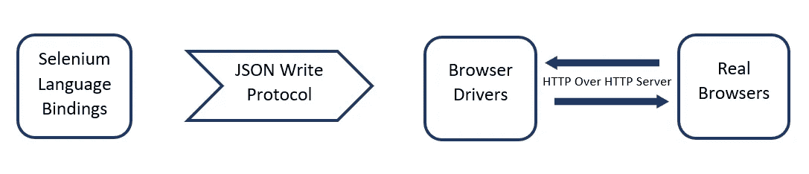

# 一种使用 SELENIUM 跨 web 浏览器自动测试的方法。

> 原文：<https://medium.com/codex/an-approach-to-automate-the-testing-across-web-browsers-using-selenium-51c2271ac85c?source=collection_archive---------20----------------------->

克里斯托夫·高尔在 [Unsplash](https://unsplash.com/s/photos/an-approach-to-automate-the-testing-across-web-browsers-using-selenium?utm_source=unsplash&utm_medium=referral&utm_content=creditCopyText) 上拍摄的照片

在关注测试自动化之前，我们应该对手工测试及其局限性有所了解。手动测试是一种原始的软件测试方法。它包括执行测试用例的物理方法，以在没有自动化工具帮助的情况下识别缺陷。

## 那么，手工测试的局限性是什么？

测试人员一次只能关注一个验证点，因此，测试的范围是有限的。此外，测试的准确性很低，因为必然会出现人为错误。手动测试有很高的出错风险。手动测试也是一种耗时的方法，因为测试人员必须手动创建手动报告、日志和存储库。另一方面，性能测试和批量测试不能成功地手工完成。

因此，需要测试自动化来加速测试，减少错误，更频繁地执行测试。这就是“硒”登场的时候。

## 硒是什么？

Selenium 是一个开源的自动化测试工具，用于在各种浏览器和平台上运行的 web 应用程序。它主要用 Javascript 开发，测试脚本可以用多种编程语言编写，如 C#、Java、Python、露比等...

## **Selenium 由一组工具组成，用于方便测试，如下所示。**

*   **硒集成开发环境(IDE)**

Selenium IDE 是一个 Firefox 插件，用于构建自动化测试脚本。它是 selenium 套件中最简单的工具，因为它包含一个易于使用的界面。因此，它可以被用作原型工具，而不是用来构建完整的测试用例。Selenium IDE 的功能是记录用户在浏览器上的交互，并将它们导出为可重用的脚本。测试用例可以被记录为，

***。Java*Java 的**

***。cs*** 为 C#

***。py*** 为 python

***。rb* 为红宝石**

Selenium 的自动完成模式支持测试人员更快地输入命令，并限制输入无效命令。调试脚本、提供控制流语句、可重用性、定位器功能和 Selenium side-runner 是 Selenium IDE 的进步。

-硒 IDE 的局限性

Selenium IDE 无法提供详细的测试报告。脚本也不能导出到 WebDriver 脚本。与 Selenium Web Driver 不同，数据库测试和数据驱动测试不能用 IDE 来执行。

*   **Selenium Web 驱动程序**

Selenium Web driver 的引入是为了克服 Selenium RC 作为跨平台 Selenium RC 的局限性。它是一个基于 web 的自动化工具，被称为开源 API 的集合。测试脚本可以使用任何支持的编程语言编写，比如 Java、C#、Python、Perl、Ruby、PHP 等。由于 WebDriver 能够直接调用浏览器，所以它比 RC 快得多。虽然 Firefox 充当 web 驱动程序的内置浏览器，但其他浏览器如 Google Chrome、Opera、Internet Explorer 和 Safari 也可以用来插入其特定的驱动程序。

Selenium WebDriver 架构由四个基本组件组成。

*   **硒遥控器**

Selenium RC 是一个测试框架，允许用任何编程语言(Perl、C#、Java、PHP、Python)编写测试用例。它是一个不需要任何其他特殊安装的 jar 文件。服务器和客户端库是 Selenium IDE 的两个部分。服务器充当 Selenium 命令和浏览器之间的中介，接受来自用户的命令，并将它们作为 Selenium-core js 命令传递给浏览器。在运行测试脚本之前，应该安装并启动 Selenium RC 服务器。

硒 RC 的局限性

Selenium RC 的架构很复杂，因为它包含一个额外的服务器。命令的执行也需要很长时间。

*   **硒栅**

Selenium Grid 是一个代理服务器，它允许在不同平台的多台机器上并行运行测试用例。Selenium 网格的两个主要组件是集线器和节点。这里，一个服务器充当集线器，命令被路由到远程 web 浏览器实例。

集线器将 JSON 测试命令节点定向到远程驱动器，从 web 驱动程序客户机获取指令。它也可以被称为本地机器，它触发测试用例并将它们分配给节点。然后，节点执行这些测试用例，并自动化浏览器。

## **在考虑 Selenium 的发展时，每个版本分别用这些工具介绍**

*硒 1* →硒 IDE +硒 RC +硒网格

*硒 2* →硒 IDE +硒 Web 驱动+硒 RC +硒网格

*硒 3* →硒 IDE +硒 Web Drive 7r +硒网格

## 硒怎么入门？

要开始使用 Selenium，不需要下载整个 Selenium，计算机只需要它的一些组件来运行自动化的浏览器实例。需要选择一种语言和一个框架，然后可以在任何支持的浏览器上运行一些示例测试。