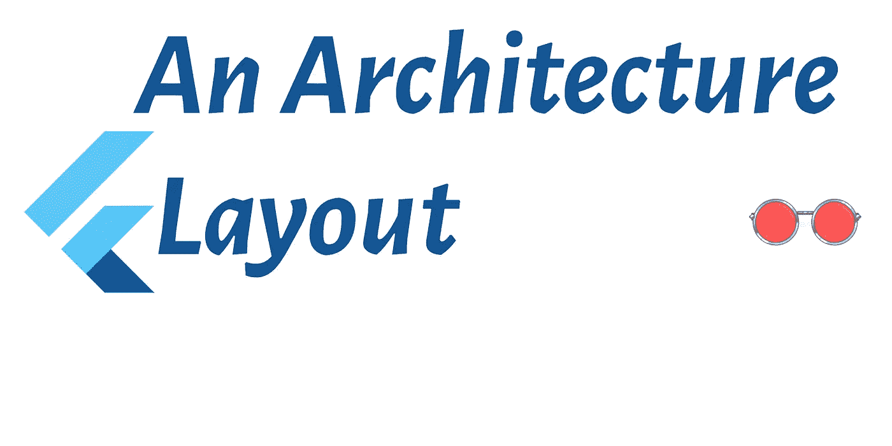

# 建筑布局

> 原文：<https://medium.com/codex/an-architecture-layout-8f414271b2b4?source=collection_archive---------5----------------------->

我正在展示我自己的 flutter 应用程序项目的 lib 文件夹的架构布局，并深入了解 Flutter 如何实现 reactive。你会发现我的布局是一种简单的方法，可以让你对所有的状态管理、架构实现和解决方案保持清醒的头脑。

# **来源**

fapp_template 和 fproject_layout 都是我的 flutter_rose_glasses git 报告中的 git 子模块…