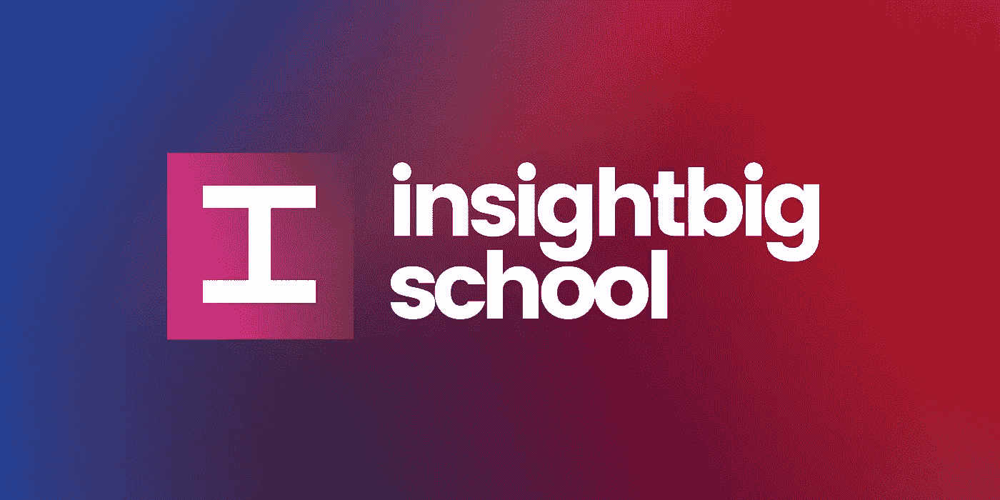

# 找到最适合你的在线课程的简单方法

> 原文：<https://medium.com/codex/an-easy-way-to-find-the-best-online-course-for-you-c37079934da1?source=collection_archive---------10----------------------->

## 是时候抛开你的困惑，理顺你的学习之路了

[JESHOOTS.COM](https://unsplash.com/@jeshoots?utm_source=medium&utm_medium=referral)在 [Unsplash](https://unsplash.com?utm_source=medium&utm_medium=referral) 上拍照

# 介绍

近年来，由于疫情和封锁的情况，人们对在线课程和在线教育的兴趣普遍高涨。从年轻学生到职场人士，每个人都选择参加在线课程，以提高自己的技能，用必要的知识武装自己。

但现在的问题是，由于人们对这种类型的教育表现出比预期更多的兴趣，互联网上可用的课程数量也同样增加，使学习者很难选择和挑选正确的课程。

对于那些对在线教育有足够经验的人来说，他们可能不会觉得这是个问题，因为他们知道自己在特定的环境中寻找什么，但是对于刚刚进入在线教育领域的学习者来说，他们看到无数组织和教师提供的大量课程而感到困惑的可能性相对较高。

# 解决方案

作为一名学习者，当面对庞大的课程库时，我也面临着同样的迷路问题。所以决定解决这个问题。基本想法是创建一个应用程序，存储来自不同来源的在线课程，并使用户能够通过有效的分类系统根据他们的需求进行筛选。现在该应用以 insight big School(【https://www.insightbigschool.com/】)的名义成功上线。

[https://www.insightbigschool.com/](https://www.insightbigschool.com/)

在 InsightBig School 的帮助下，您可以轻松浏览 Coursera、Udemy、edX 等资源，并使用各种强大的过滤器缩小为您提供的课程范围。您可以查看所有课程的详细信息，如价格、持续时间、讲师、评级等，如果您觉得找到了适合自己的课程，可以通过应用程序轻松注册。

目前，该应用程序包括由知名讲师、世界一流大学和大型机构和组织提供和开展的 10K+在线课程。确实有一个增加这一数字的计划，同时增加其他几个在线教育途径，如在线学位、专业、大师班、专业证书等等。这些课程由 Udemy、edX 和 Coursera 整合而成，旨在通过与其他知名提供商合作来扩大课程范围。

# 结束语

现在，鉴于学习者和学生的能力和有用性，在线课程是上帝给他们的礼物，不能访问这些资源的人是不公平的。在 InsightBig School，我们正在努力摆脱这个问题，让在线教育和课程比以往任何时候都更容易获得。

这个项目的主要目的不是完成任何种类的财务目标，而是帮助和服务那些努力寻找完美在线课程的人。因此，如果你想支持这个平台，最好的方法就是与你认为可能从中受益的学习者分享这个应用。话虽如此，学习愉快！