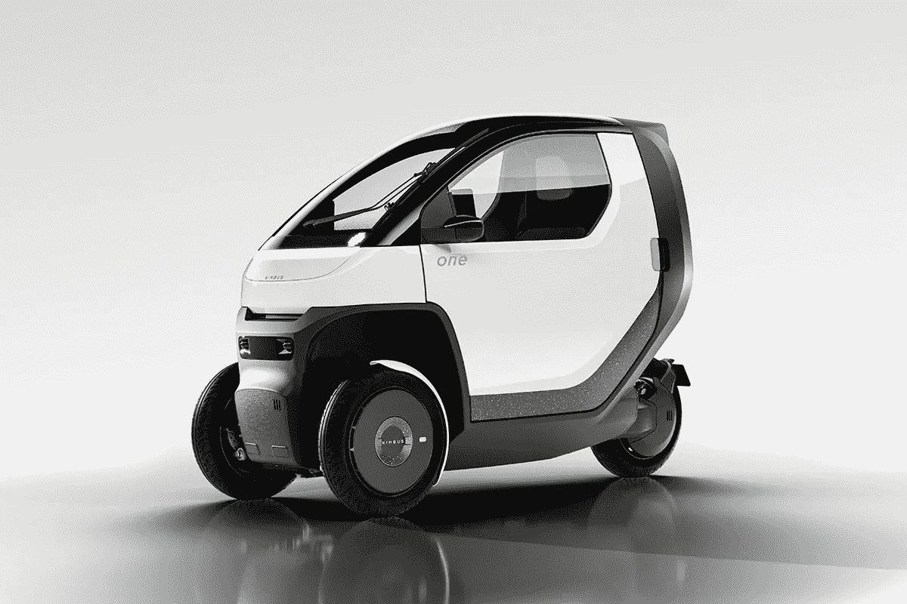

# 电动三轮有篷摩托车

> 原文：<https://medium.com/codex/an-electric-3-wheeled-covered-motorcycle-847134f61b44?source=collection_archive---------6----------------------->

## 又一个有趣的 EV 加入到一个不断增长的产品中！

[光轮一号(光轮媒体)](https://assets.website-files.com/5fae0d8638578f3a18305d17/6287dabd25f4640e6da79632_Future_Of_Urban.jpg)

Nimbus 是一家总部位于密歇根州安阿伯的公司，希望通过他们的 **Nimbus One 在电动汽车的微移动市场掀起波澜。**

[米丽娅姆·韦伯斯特](https://www.merriam-webster.com/dictionary/nimbus)字典将[雨云](https://www.merriam-webster.com/dictionary/nimbus)定义为意义。

> 围绕神或女神的发光的蒸汽、云或大气…