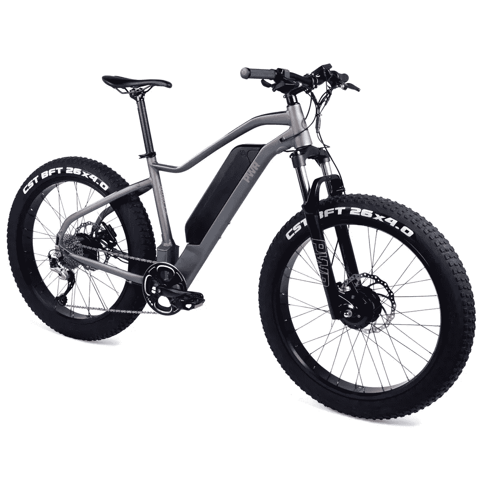

# 多了一点活力的电动自行车！

> 原文：<https://medium.com/codex/an-electric-bike-with-a-little-extra-oomph-2d5878af61b1?source=collection_archive---------15----------------------->

## 压水堆的“双轮”有全轮驱动！

[Dually(媒体通过 PWR)](https://pwrbike.com/products/dually-all-wheel-drive-electric-bike)

如今市场上有如此多的电动自行车，很难整理出各种功能和对骑行者的好处。[“dual ly”](https://pwrbike.com/products/dually-all-wheel-drive-electric-bike)就是这样一辆自行车，它提供了一些独特的东西。这款电动自行车采用全轮驱动，双电机为前轮和车轮轮胎提供动力。