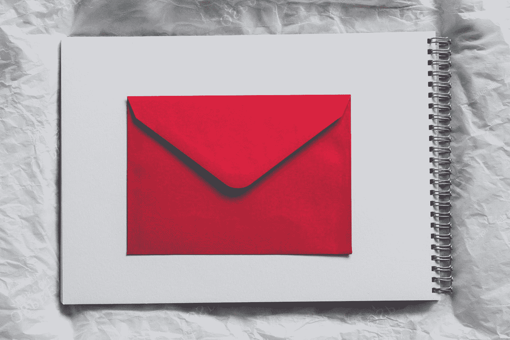
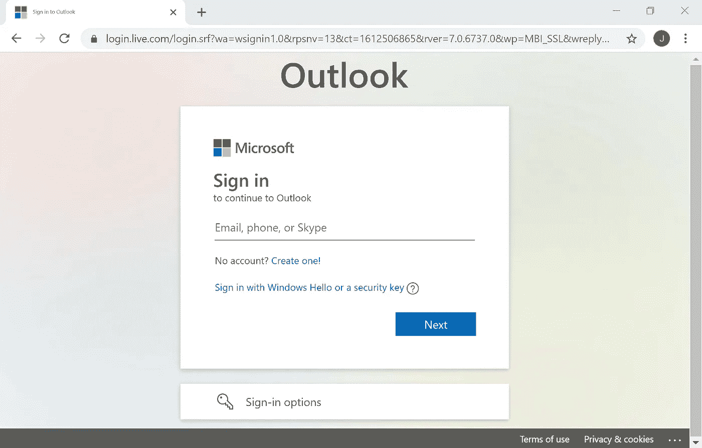
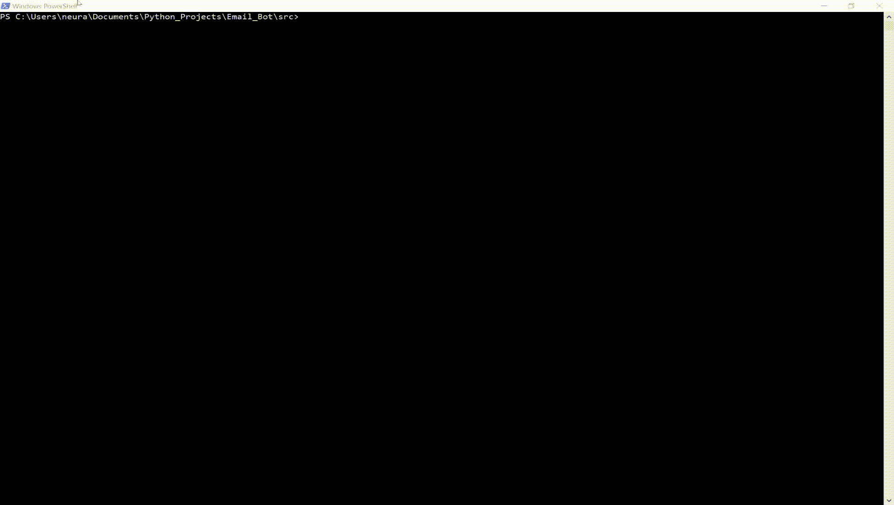

# 面向大众的电子邮件机器人

> 原文：<https://medium.com/codex/an-email-bot-for-the-masses-173efbc4e307?source=collection_archive---------2----------------------->

## [法典](http://medium.com/codex)

## 一点硒元素的知识是如何大有帮助的

照片由 [Siora 摄影](https://unsplash.com/@siora18?utm_source=medium&utm_medium=referral)在 [Unsplash](https://unsplash.com?utm_source=medium&utm_medium=referral) 上拍摄

## 什么是机器人？

bot 是一种与 web 元素(来自网站、web 应用程序等的元素)交互的程序。).这让它看起来像是一个真实的人在使用某个 web 应用程序，但实际上，它实际上是一个程序。机器人可以用来测试网站功能，在应用程序中为用户提供信息，以及生成对话消息(聊天机器人)。

## 硒是什么？

Selenium 是一个测试 web 应用程序功能的框架。Selenium 有许多方法可以执行类似人类的过程。点击按钮和在输入字段中输入数据只是实现的一些事情。有些库和框架只支持单一的编程语言(比如 BeautifulSoup 只支持 Python)。然而，Selenium 可以跨多种语言使用。这些语言包括:Python、Java、C#、JavaScript 和 Ruby。

## 电子邮件机器人解释

作者图片

本文中详细描述的机器人主要关注发送电子邮件(一个电子邮件机器人)。Outlook 将是派生实现的首选电子邮件。我将使用 Python 和 Selenium 框架来创建所需的电子邮件机器人。上图显示了 Outlook 电子邮件**登录**页面的 URL。这个 URL 被用作机器人执行其功能的起点。

发送电子邮件是一个可以自动化的过程。可自动化的任务包括:输入您的电子邮件地址、密码，并为您撰写的电子邮件编写适当的详细信息。除了获取正常信息，还有其他事情需要解决。

机器人通常被编写来再现个人如何自然地与一些网页或应用程序交互。因此，我们还需要考虑在尝试发送电子邮件时会被点击的任何按钮。在 Outlook 的情况下，我们需要点击**下一个**、**签到**、**新消息**和**发送**按钮。

## 需要硒方法

*   单击()
*   发送键()
*   直到()
*   find_element_by_xpath()

以上四种方法构成了这个构建的主要部分。

click()方法允许您单击 web 元素。当编写一个机器人时，我们必须为我们试图点击的元素找到正确的标识。如果没有确定核心元素，那么我们的 bot 将无法正常工作。

send_keys()可用于执行按键操作。我们可以给 send_keys()参数来按 enter、tab 和箭头键(以及许多其他键)。也可以使用此方法将字符串发送到输入字段。这是将 send_keys()整合到电子邮件机器人中的主要方式。

直到()被 WebDriverWait 对象调用。WebDriverWait 接受驱动程序的参数和等待某事发生的时间(以秒为单位)。until()与我们希望达到的某些标准结合使用。有些 web 元素在我们想要点击它们的时候可能还没有完全加载。可以调用 element_to_be_clickable(要单击的 web 元素)作为 until 方法的参数。这将确保我们在 web 元素(作为 element_to_be_clickable()的参数给出)变为可点击之前，等待一段指定的时间(由 WebDriverWait 对象的秒数参数决定)。

find_element_by_xpath()方法允许我们设置定位特定 web 元素的规范。Selenium 还提供了通过 id 和类名搜索元素的方法。然而，find_element_by_xpath()在指定不常用的 HTML 元素和属性时提供了更多的自由。

我还想提一下 Chrome()和 get()方法。虽然这些方法没有构成 bot 的主要功能，但它们仍然值得一提。

Chrome()创建了一个 Chrome web 驱动的实例。Selenium 使用 web 驱动程序来与相应的浏览器交互。在执行下面的电子邮件机器人之前，需要下载驱动程序。Selenium 支持许多不同的浏览器(Chrome、Firefox、Internet Explorer 等)。).

get()将创建一个新的 web 浏览器实例。作为此方法的参数提供的 URL 将在新的浏览器实例中打开。

## 电子邮件机器人实现

注意:上面的实现将 Options()对象作为参数传递给 Chrome()方法。这是用来摆脱不必要的信息栏和弹出窗口。

该代码可细分如下:

*   打开 Outlook 登录页面
*   将您的电子邮件发送到电子邮件输入字段
*   点击**下一个**按钮
*   将您的密码发送到密码输入字段
*   点击**签到**按钮
*   点击**新消息**按钮
*   将收到消息的电子邮件发送到“收件人”输入字段
*   将文本发送到主题输入字段
*   将您的消息发送到消息输入字段
*   点击**发送**按钮

注意:无论是否抛出异常，都需要执行 driver.quit()。quit()方法清除 web 驱动程序正在使用的任何资源。如果 quit()没有被执行，那么内存将不会被正确释放，并可能导致内存泄漏。此方法还会在调用浏览器实例后将其关闭。因此，需要 time.sleep()来保持浏览器打开足够长的时间，以确保代码正确运行。

## 观看机器人的运行

作者 GIF

在上面的 GIF 中，电子邮件机器人输入我的电子邮件信息，编写一封电子邮件，并发送它。我在 GIF 的末尾显示了接收 bot 消息的收件箱。该消息看起来完全正常(就好像我亲自输入并发送了它)。据我所知，没有办法知道这封邮件是否是由一个真实的人发出的。这种认识既令人兴奋又令人恐惧。在测试这个机器人时，我注意到了一些非常有趣的事情。发送的电子邮件仅显示在接收电子邮件的收件箱中。如果您重新加载用于发送消息的电子邮件，那么您将看不到自己发送的任何新消息。

注意:用于发送邮件的电子邮件是基于大学的 Outlook 电子邮件。普通的 Outlook 电子邮件(某些大学不使用)可能需要与上面不同的实现。这是因为一些 web 元素可能具有与所讨论的属性相对应的稍微不同的值。

注意:我为一个 GIF 创建了一个非常长的视频。我还必须在将视频转换成 GIF 之前对其进行编辑。所以帧率极慢。大约需要 15 秒左右才能看到消息最终到达(由于帧速率较慢)。

## 总结想法

弗洛里安·范·杜恩在 [Unsplash](https://unsplash.com?utm_source=medium&utm_medium=referral) 上拍摄的照片

我用最少的硒知识做了一个邮件机器人。我不需要使用任何复杂的从一个窗口/框架到另一个的切换(这显然依赖于这个机器人的电子邮件平台)。使用的最高级的主题是调用 find_element_by_xpath()方法。我真的相信使用 find_element_by_xpath()在定位包含不太常见的属性的元素方面给了我更多的自由。令人难以置信的是，一个电子邮件机器人只用 60 行代码就能编写出来(如果不考虑注释和空格，就更少了)。希望你也可以用这篇文章来构建你自己的电子邮件机器人！

## 参考

文艺复兴工程师。(2019 年 5 月 25 日)。Selenium WebDriver Python 教程-安装和快速入门。【YouTube 视频】。文艺复兴工程师。检索自[https://www.youtube.com/watch?v=W5GrTVwRlD4&t = 8s](https://www.youtube.com/watch?v=W5GrTVwRlD4&t=8s)

文艺复兴工程师。(2019 年 5 月 31 日)。Selenium WebDriver Python 教程-制作一个简单的 Bot。【YouTube 视频】。文艺复兴工程师。从 https://www.youtube.com/watch?v=eZNIgKEYstQ[取回& t=1072s](https://www.youtube.com/watch?v=eZNIgKEYstQ&t=1072s)

Muthukadan，B. (2018 年)。硒与 Python。从 https://selenium-python.readthedocs.io/[取回](https://selenium-python.readthedocs.io/)

我的 [GitHub repo](https://github.com/wormhole85/email-bot) 邮件机器人代码。