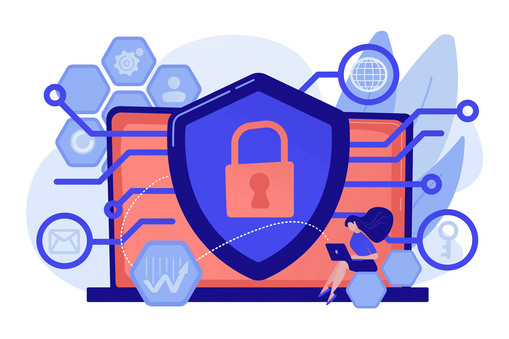
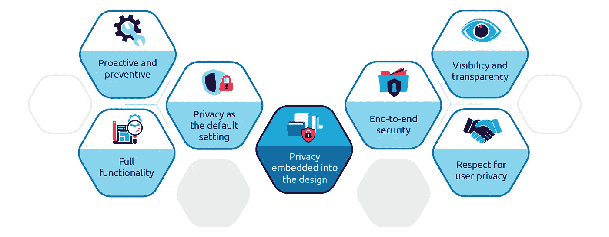
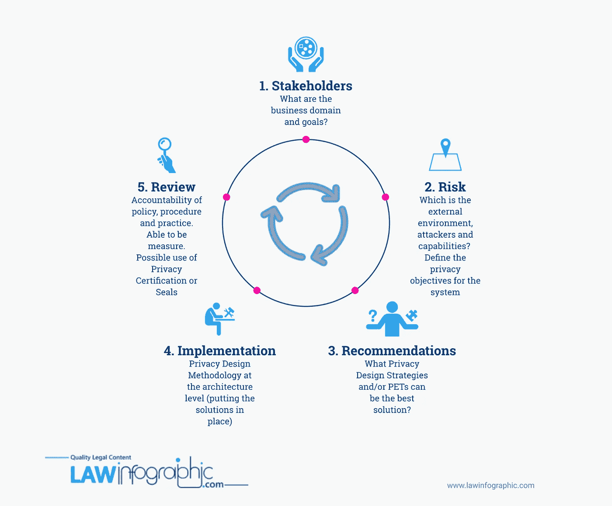

# 工程师设计隐私指南

> 原文：<https://medium.com/codex/an-engineers-guide-to-privacy-by-design-f487d16dcbbc?source=collection_archive---------6----------------------->

## 没有一种“正确的”方法可以通过设计来实现隐私。但一系列新兴的最佳实践，即所谓的“隐私工程”，帮助那些想要构建产品、系统和流程的人，在不损害创新的情况下，将隐私和信任融为一体。

> “我们的论点是，隐私将成为下一波技术革命不可或缺的一部分，那些强调隐私是产品生命周期不可或缺的一部分的创新者正走在正确的道路上。”
> 
> ——隐私工程师的宣言

## **什么是设计隐私？**

“设计隐私”(PbD)是由前加拿大安大略省信息和隐私专员安·卡沃基安(Ann Cavoukian)于 1995 年创造并发展出来的[，然而它仍然是一个模糊不清的概念。](https://iab.org/wp-content/IAB-uploads/2011/03/fred_carter.pdf)

PbD 因缺乏实践指导和留下太多关于其实施的未决问题而饱受批评。

> **有些人** [**认为**](https://theconversation.com/the-privacy-by-design-approach-for-mobile-apps-why-its-not-enough-164090) **律师和应用程序开发人员说的不是同一种语言，因此开发人员可能不知道如何将抽象的法律原则转化为具体的工程步骤(或者如何评估他们实施的技术隐私措施是否足以达到合规目的)。**

PbD 的核心是通过将隐私融入到数字产品、服务、商业实践和基础设施的开发中来确保个人隐私得到保护。这一概念的灵感来自于[公平信息惯例](https://en.wikipedia.org/wiki/FTC_fair_information_practice#Principles)，该惯例于 20 世纪 70 年代和 80 年代在美国发展起来，以应对包含个人信息的自动化数据系统的使用日益增多。

PbD 是“ [**隐私工程**](https://en.wikipedia.org/wiki/Privacy_engineering) ”的一种形式，类似于土木、电气和机械工程中的“安全工程”，确保道路、桥梁或汽车等工程系统提供可接受的安全水平。

请注意，当我们说“隐私”时，我们并不仅仅是指安全。这两个术语经常互换使用，但是，正如您将看到的，虽然遵守 PbD *包括*安全性，但是它是一个更广泛的概念。

## **基本原则**

PbD 概念包括 7 个关键原则(也称为“基本原则”)。虽然这些原则是开始您的 PbD 之旅的好地方，但它们只提供了一个**高层次的框架，即**它们没有告诉您*如何*着手实施 PbD，也没有提供关于您如何衡量您的 PbD 实践的成功的任何指标:

1.  **主动不被动；预防性而非补救性** —在隐私侵犯事件发生之前预测并阻止它们。不要坐等隐私风险出现，而是在侵犯隐私行为发生之前就想出解决方案。在任何产品设计过程中提前考虑隐私，而不是事后才想到。
2.  **隐私作为默认设置** —确保个人数据在任何给定的产品、系统、架构或业务实践中得到*自动保护*。用户不应该采取任何行动来保护他们的隐私(比如明确选择退出跟踪、数据收集或锁定)——隐私应该内置于系统中。
3.  **隐私嵌入设计** —将隐私嵌入任何系统或产品的设计和架构以及相关流程和协议中。一旦产品或系统发布，隐私问题出现，不要简单地在以后安装。让隐私成为产品核心功能的重要组成部分。
4.  **完整的功能——正和而非零和—** 不要将隐私视为功能的拖累，而是要找到创造性的方法，以“双赢”的方式满足所有合法利益(即用户和企业的利益)。
5.  **端到端安全性—全生命周期保护** —在整个数据生命周期中应用隐私和安全性—从收集到存储、使用和销毁。确保端到端的从摇篮到坟墓的安全信息生命周期管理。
6.  **可见性和透明度—** 保持公开—您的隐私实践应该对用户和所有其他利益相关方可见且透明。隐私声明/政策应该清晰、易于查找且不具有误导性。
7.  **尊重用户隐私—以用户为中心—** 将用户利益放在首位。提供强大的隐私默认设置、关于如何收集、存储和使用数据的适当通知，并授权用户更新、删除或访问他们的数据。

PbD 基本原则—来源:[https://www . capgemini . com/2020/06/addressing-the-challenge-of-privacy-engineering/](https://www.capgemini.com/2020/06/addressing-the-challenge-of-privacy-engineering/)

在实践中，PbD 要求将上述原则的****翻译成工程和产品原则和实践。**这可能意味着，例如:**

*   **PbD 包含在 SDLC/产品开发流程中，在具体的、可测试的和可测量的需求中，包括后端和 UX/UI 设计。**
*   **隐私问题是产品架构和系统设计考虑的一部分。**
*   **以用户为中心的产品是针对与隐私相关的最终用户目标、需求、愿望和限制而开发的。**

## **PbD 是强制性的吗？**

****GDPR****

**在欧盟，自 2018 年引入《通用数据保护条例》( GDPR)以来，PbD 现已成为一项法定义务，违规将被处以高额罚款——违规的最高罚款为 2000 万€或全球年营业额的 4%,以较高者为准。在 GDPR 生效的三年里，€因违反 PbD 义务而被开出了超过 10 亿英镑的罚单。**

**值得注意的是，由于 GDPR 的域外适用，[任何其活动被 GDPR](https://www.mondaq.com/australia/data-protection/1051714/privacy-by-design-protecting-personal-information-from-the-wire-frame-up) 捕获的澳大利亚企业(即其在欧盟运营并从欧盟公民处收集个人数据)，都应实施 PbD 以确保遵守 GDPR。**

****澳大利亚隐私法改革****

**虽然澳大利亚目前没有具体的法律要求企业实施 PbD，但澳大利亚政府目前正在对隐私法进行全面审查。此次审查后，**澳大利亚企业将承担广泛的 GDPR 式法律义务，包括 PbD，对未能遵守的处罚可能会更加严厉。****

**预计改革将把严重或重复侵犯隐私的最高民事罚款从 210 万美元提高到以下两项中的较高数额:**公司年度国内营业额的 10%；1000 万美元；或者，通过滥用信息获得的任何利益价值的三倍**。这些彻底的改变预计将在 2022 年生效；没有做好准备的企业可能会面临巨额罚款和失去消费者的信任。**

****澳大利亚隐私最佳实践****

**在澳大利亚，PbD 被认为是隐私最佳实践，并被 OAIC 、[新南威尔士州信息和隐私专员](https://www.ipc.nsw.gov.au/fact-sheet-privacy-design)、[维多利亚州隐私专员办公室&数据保护专员](https://ovic.vic.gov.au/wp-content/uploads/2018/07/Privacy-by-Design-Background-Paper.pdf)和[国家数据专员推荐。](https://www.datacommissioner.gov.au/media-hub/privacy-design-approach)[联邦政府](https://www.afr.com/politics/federal/privacy-by-design-approach-for-covidsafe-app-20200426-p54nct)也在 2020 年 4 月对(现已退役的)COVIDSafe 应用程序实施了 PbD 方法。**

****澳大利亚消费者数据权****

**最近推出的澳大利亚[消费者数据权利](https://www.oaic.gov.au/consumer-data-right/cdr-privacy-safeguard-guidelines/) (CDR)旨在为澳大利亚人如何使用和披露他们的数据提供更多的选择和控制。它允许消费者访问个人数据，并指示企业将该数据安全地传输给经认可的数据接收者。CDR 制度目前适用于**银行业**，并将很快推广到**能源和电信**行业，更多行业(保险、医疗保健、零售、超市)将被纳入其中。**

**CDR 制度伴随着 **13 隐私保护**(包含在*竞争和消费者法案*中，并由*消费者数据规则*补充)。这些隐私保护措施规定了 CDR 计划用户的隐私权利和义务，而且——重要的是——是以 PbD 原则为模型的，例如要求公司在收集、披露、持有或使用个人数据时获得消费者的知情同意；公开和透明；匿名数据；将数据用于直接营销；数据的海外披露；数据安全和消费者更正数据的权利。[客户数据、账户数据和交易数据](https://www.gtlaw.com.au/insights/safeguarding-privacy-under-cdr)是隐私保护措施适用的 CDR 消费者数据类型。**

****根据隐私保护措施**(与现有的澳大利亚隐私原则相比)，处理 CDR 数据的公司面临的风险大大增加，这不仅是因为最高处罚现在明显更高(见上文)，还因为**消费者现在拥有直接向侵权公司提出索赔的合法权利**(根据《隐私法》，这目前不可用)。**

## ****设计隐私有商业意义吗？****

**毫无疑问，隐私是一种“美好的东西”，但它也具有商业意义，因为有以下三个关键趋势:**

*   **由于对基本隐私权力失衡的意识增强，消费者对隐私的期望发生了转变；**
*   **需要建立**用户的信任和信心，**保护公司的**品牌和声誉**并避免侵犯隐私；和**
*   ****法律和合规性**原因——因不遵守全球日益增多的隐私法规而被处以巨额**罚款。****

## ****为什么设计隐私很难做到****

**PbD 是一项复杂的任务，可能难以实现，原因有三:**

1.  **缺乏隐私第一的文化——为了 PbD 的成功，组织必须承认隐私的重要性。最佳实践通常要求任命一名专门的**隐私官**或隐私团队负责隐私保护；拥有高级管理层批准的健全的**隐私政策**；高管们承诺将隐私视为公司价值观。定期的隐私影响评估和审计；并推出了**隐私教育/意识培训计划**。**
2.  ****缺乏多学科协作** — PbD 本质上是一项多学科活动。PbD 的实施需要不同利益主体(有时是司法管辖区)之间持续一致的合作。法律、产品、工程、采购、营销、人力资源、财务和合规/风险管理都应参与 PbD 工作。由于资源有限，PbD 对初创公司和中小企业来说可能是一个挑战。在大型组织中，由于繁琐的政治、普遍的官僚主义或缺乏高管的支持，PbD 合作也可能受到阻碍。**
3.  ****缺乏数据卫生—** 多个孤立系统可能导致“孤立数据集”、重复、不一致或未知的数据。许多公司对于收集什么数据、数据存储在哪里以及如何全面使用数据(或者谁负责数据治理和管理)没有一个单一的清晰的企业视图。这意味着隐私风险无法正确识别或预先防范，公司更有可能不遵守其法律义务。**

## ****如何通过设计实现隐私****

**底线是**做 PbD 没有一个正确的方法。** PbD 应由多个利益相关方在全公司范围内解决，并根据每个组织的背景和具体情况量身定制。下面是一些隐私工程的最佳实践，这些实践帮助工程师和产品经理将 PbD 集成到他们的产品和系统中。**

****

**隐私工程—来源:[https://www . lawinfographic . com/what-is-privacy-Engineering _ by _ Jessica _ lam/](https://www.lawinfographic.com/what-is-privacy-engineering_by_jessica_lam/)**

1.  ****从设计之初就考虑隐私&持续****

**遵守 PbD 原则并将隐私嵌入产品功能、系统和流程的关键是尽早并持续地解决隐私问题**。**应触发**提前考虑隐私**的事件包括:**

*   **设计或部署涉及收集个人信息的**产品、服务或项目**(无论是来自用户、客户还是员工)。**
*   **组织或内部任何特定团队**收集、存储或使用**个人数据的方法变更。**
*   **规划新的**营销产品或活动**涉及使用用户/客户个人信息进行目标定位。**
*   **合并、操作或转换多个包含个人数据的数据库的计划。**
*   **当包含个人数据的系统被淘汰时。**
*   **当计划将从**公共或商业来源/数据库**获得的个人数据整合到现有数据库中时。**
*   **涉及个人数据的**重大新收集、使用或披露**的**新业务流程**。**
*   **使用能够访问、存储或使用个人数据的第三方供应商。**

****2。识别个人数据****

**评估您的项目/产品中的任何隐私风险的第一步是清楚地识别所涉及的个人数据:**

*   **收集、处理或使用哪些个人数据**
*   **收集的时间和方式**
*   **存储/定位的位置**
*   **它是如何被使用的**
*   **谁在访问/使用它**
*   **它如何在各种系统之间移动/它将与谁共享**
*   **它将保留多长时间(以及在哪里)**

****3。确定隐私影响****

**目标是在非常基本的层面上理解隐私风险在哪里——侵犯隐私的可能性是什么，以及这种侵犯可能产生什么影响。**

**识别:**

*   **可能侵犯个人隐私的**主要威胁人物****
*   **隐私可能被侵犯的**关键人物****

****威胁参与者** —不仅要考虑恶意威胁参与者，还要考虑第三方，如供应商(托管提供商、计费提供商、网络提供商、审计公司、呼叫中心运营商、人力资源平台、CRM 等)、政府、竞争对手等。**

****个人** —考虑:**

*   **高级类别或细分市场(用户与员工、特定类型的用户或位置)。**
*   **用户(或其他数据主体)的隐私期望是什么？**
*   **哪些法律/法规问题可能会影响风险—从易受攻击的数据主体(例如，儿童、患者等)收集的个人数据是否会受到特定法律/法规要求的约束？**

**一旦您清楚了解将收集或处理哪些个人数据以及潜在的风险，您可能需要让您的隐私官或法律团队评估是否需要**隐私影响评估(PIA)** 。PIA 是对与产品、服务或流程相关的个人数据处理相关的隐私风险的分析。PIA 还可以包括降低风险的建议，作为 PIA 的一部分。根据您组织的规模，可能会有关于何时需要 PIA 以及谁应该执行 PIA 的政策或流程。**

****4。确定具体的隐私产品要求****

**每个产品或项目都有自己的技术、可用性、商业和法律需求，这些需求来自不同的利益相关者。您可能需要确定并遵守**特定的隐私要求**，例如:**

*   **软件应**仅收集其预期功能或目的所需的**个人数据；**
*   **软件应包括适当的**机制，以获得最终用户对个人数据收集的同意**；**
*   **数据库应该有适当的机制来**避免未来的数据链接**；**
*   **默认情况下，软件应**使用标准化加密机制和安全管理的加密密钥对所有个人数据进行加密**;**
*   **只要有可能，所有个人数据都应该**匿名**；**
*   **应该有一个与收集的所有个人数据相关的**截止日期**；**
*   **所有收集的个人数据在过期后应被适当地**删除**；**
*   **该软件应提供**审计跟踪**显示如何收集，处理和删除个人数据；**
*   **该软件应接受彻底的**安全风险和威胁评估；****
*   **系统应允许消费者/用户请求**个人数据编辑、更改或删除**(以及即时响应)；或者**
*   **用户可以**控制**他们自己的个人数据(查看、访问、编辑、删除、与第三方共享)。**

****5。采用基于架构的隐私保护方法****

**通过*减少威胁者对个人数据的* *访问*或*通过技术、管理或运营手段控制威胁者的行为*，可以将侵犯隐私的风险降至最低。这涉及**系统架构**以及各种战略、战术和流程，共同确保风险得到管理和缓解。**

**系统设计的“基于架构的隐私”方法认为，系统的隐私友好性可以通过以下方式来衡量:**

*   ****如何识别**的个人资料；和**
*   **架构是如何集中的。**

**当数据不容易识别和集中时，一个系统对隐私更加友好。**

**根据这种方法，您可以通过匿名化数据并将数据推向更加以客户端或用户为中心的架构来降低隐私风险。最隐私友好的可识别级别是匿名和不可链接的系统。完美的匿名化在实践中很难实现，但[隐私增强技术](https://en.wikipedia.org/wiki/Privacy-enhancing_technologies)(特别是新兴技术，如[同态加密](https://en.wikipedia.org/wiki/Homomorphic_encryption#:~:text=Homomorphic%20encryption%20is%20a%20form,data%20without%20first%20decrypting%20it.&text=This%20allows%20data%20to%20be,for%20processing%2C%20all%20while%20encrypted.)(HE)[可信执行环境](https://en.wikipedia.org/wiki/Trusted_execution_environment)、[安全多方计算](https://en.wikipedia.org/wiki/Secure_multi-party_computation)和[差分隐私](https://en.wikipedia.org/wiki/Differential_privacy))为可识别性问题提供了巧妙的方法。**

**当数据集中时，与直接在用户域中存储和使用的数据相比，侵犯隐私的风险更高。因此**去中心化**是另一种据说可以让系统更加隐私友好的技术。例如，[联合学习](https://en.wikipedia.org/wiki/Federated_learning)是一种新颖的机器学习技术(主要由[谷歌](https://ai.googleblog.com/2017/04/federated-learning-collaborative.html)使用)，它在多个分散的边缘设备或保存本地数据样本的服务器上训练算法，而无需交换它们。**

****其他保护隐私的策略包括:****

*   ****基于角色的访问控制**(只有特定用户有权访问特定数据，例如将人力资源数据与财务数据分开)；**
*   ****隔离** —将个人数据保存在单独的服务器上，或在单独的数据库或系统中独立处理个人数据(出于不同目的)。数据可以按地理位置、人口统计、每个客户、每个人等进行隔离。**
*   ****尽量减少**收集的个人数据。**
*   ****从收集中排除**某些个人数据。**
*   ****从与第三方**共享的数据**中剥离**个人数据，并纳入合同条款，要求供应商在不再必要时或根据数据主体的数据删除请求删除数据。**
*   **删除——定期删除不再需要的个人数据。**

**6。将隐私写入 SDLC**

**[将隐私融入 SDLC](https://stackoverflow.blog/2021/07/19/privacy-is-an-afterthought-in-the-software-lifecycle-that-needs-to-change/) 以及 CI/CD 管道中更好的工具是一种新兴的最佳实践，类似于安全性向开发周期的上游转移。这使得系统能够尊重用户的隐私，无需创可贴或缓慢的手动流程。系统将清楚地识别数据流(这样数据发现和映射工作是多余的)，并且您的产品堆栈将在部署后立即自我描述其数据操作。**从自动化隐私编码到自动化风险分析和同意跟踪、治理和报告，连续的应用程序隐私**可以在整个 SDLC 中实现。**

****工具**如[ethic a](https://ethyca.com/)、 [Privitar](https://www.privitar.com/) 和 [Dastra](https://www.dastra.eu/en/) (以及许多其他隐私技术和 GRC 工具)有助于实现隐私合规，并涵盖数据映射、客户数据请求和同意管理以及分析和数据科学隐私解决方案等方面。**

## ****前进的道路****

**毫无疑问，今天，数字隐私和信任是技术领域及其他领域的关键问题。消费者希望确保他们使用的数字产品在设计时考虑了诚信、安全和道德。**

**未来无疑为那些能够提供创新和隐私的人提供了令人兴奋的机会，能够利用这些能力的公司将赢得信任竞赛。工程师将在实现这些胜利的过程中发挥关键作用。**

**_________________________________**

****资源&最佳实践****

1.  **[IAAP 的战略隐私设计](https://iapp.org/store/books/a191a00000345yDAAQ/)**
2.  **免费电子书— [隐私工程师的宣言](https://link.springer.com/book/10.1007%2F978-1-4302-6356-2)**
3.  **[在软件工程中应用隐私设计—欧洲视角](https://thinkmind.org/download.php?articleid=softeng_2016_3_20_65061)作者 Karin Bernsmed，SINTEF ICT 安全与安保部软件工程**
4.  **[技术隐私指标:伊莎贝尔·瓦格纳和大卫·埃克霍夫的系统调查](https://arxiv.org/abs/1512.00327)(2018 年 6 月)**
5.  **[工程隐私](https://papers.ssrn.com/sol3/papers.cfm?abstract_id=1085333)Sarah Spiekermann(维也纳经济和商业大学)& Lorrie Faith Cranor 卡内基梅隆大学计算机科学学院和卡内基理工学院**
6.  **[隐私工程&诺基亚保险](https://www.w3.org/2014/privacyws/pp/Hirsch.pdf)**
7.  **[将 GDPR 嵌入安全开发生命周期(SDLC)](https://www.gdpr.associates/embedding-gdpr-in-the-secure-development-lifecycle-sdlc/)**
8.  **EY 文章:[如何通过设计成功嵌入隐私文化](https://www.ey.com/en_au/cybersecurity/how-to-successfully-embed-a-culture-of-privacy-by-design)**
9.  **[人工智能道德:Salesforce 如何帮助开发人员在考虑道德使用和隐私的情况下构建产品](https://www.zdnet.com/article/ai-ethics-how-salesforce-is-helping-developers-build-products-with-ethical-use-and-privacy-in-mind/)**
10.  **[‘设计隐私’:谷歌给人们更多的权力来控制他们的个人数据](https://www.dailyadvent.com/gb/news/37a55e269ec6fa29900a7cc9d14cb799-Privacy-by-design-Google-to-give-people-more-power-over-their-personal-data)**
11.  **[优步隐私&安全](https://medium.com/uber-security-privacy)博客**
12.  **[LinkedIn Engineering 在人工智能/人工智能系统中的公平、隐私和透明设计](https://engineering.linkedin.com/blog/2019/fairness-privacy-transparency-by-design)**
13.  **[左移:创建快速、安全的开发生命周期](https://www.credera.com/insights/shift-left-create-a-fast-secure-development-lifecycle)**
14.  **Stackoverflow 的博客— [隐私是软件生命周期中的一个事后想法。这需要改变。](https://stackoverflow.blog/2021/07/19/privacy-is-an-afterthought-in-the-software-lifecycle-that-needs-to-change/)**