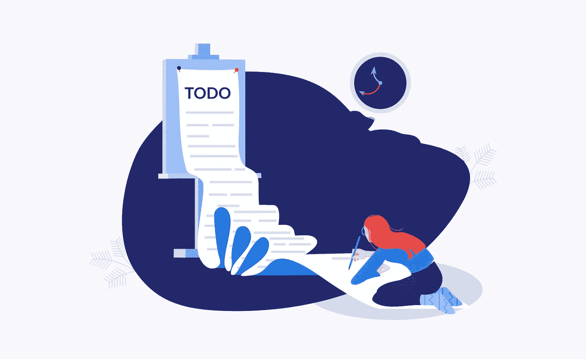

# TODOs 工程师指南:如何完成工作

> 原文：<https://medium.com/codex/an-engineers-guide-to-todos-how-to-get-things-done-a01b281b8f3b?source=collection_archive---------11----------------------->

我们早就被许诺，在这个世界里，自动化和其他技术将解放我们的时间，让我们专注于更有创造性、更有回报的追求。

但是，我们仍然发现自己在和一些微小但耗费时间的任务做斗争。我们都想让自己专注于完成更重要的工作，但是过去有两个大问题: