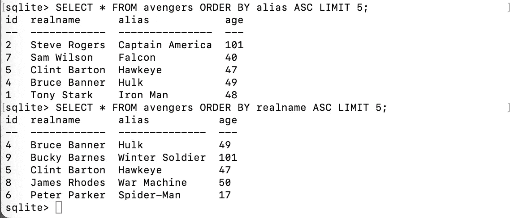

# 精疲力尽的学生 SQL 基础指南

> 原文：<https://medium.com/codex/an-exhausted-students-guide-to-sql-basics-da8e91a46b30?source=collection_archive---------23----------------------->

如果你正在读这篇文章，那么可以肯定的是，你已经因为整天学习如何编码而筋疲力尽了。我绝对能理解，有时在花了几个小时试图记下一些东西后，你只是想直接得到某些信息。嗯，这就是为什么我创造了这个。我想直截了当地向您介绍 SQL 基础知识，这样您就可以抓住您需要的东西并开始使用。

*(这里涉及的所有内容都将在 sqlite3 中完成)*

我们开始吧！

## **将涉及的主题:**

*   [创建表格](#8790)
*   [更改表格](#b293)
*   [下降表](#a758)
*   [在表格中插入数据](#cee6)
*   [从表格中选择数据](#c9e1)
*   [更新数据](#f2a2)
*   [从表格中删除数据](#ed86)
*   [聚合函数](#c813)
*   [对数据进行分组和排序。](#4efb)
*   [访问以前的数据库](#f953)

# 创建表格

## 第一步

要进入 SQLite3，请在您的终端中键入以下内容。请随意使用任何适合您的数据库和表的名称。

```
sqlite3 (database_name).db
```

**示例**

```
sqlite3 avengers.db
```


这是我们将储存一切的数据库。(桌子还没做好)

## 第二步

当我们创建表时，我们需要列结构，如

```
CREATE TABLE table_name (
id INTEGER PRIMARY KEY,
name TEXT,
age INTEGER
);
```

*(主键表示自动递增)*

*所有的小写单词(id，name，age)都将是列的名称。大写的单词将被定义。id 将是数字，所以我们可以跟踪有多少数据。名字会用文字来表示，这就是为什么文字会写在它的旁边，年龄会是一个数字，所以我们用整数来定义它。* [*点击此处了解四种基本数据类型。*](#e72e)

**示例**

```
CREATE TABLE avengers (
id INTEGER PRIMARY KEY,
realname TEXT,
alias TEXT
);
```


## 第三步

要检查一切是否正常，请在终端中键入以下内容。

```
.tables
```

当您看到表名如下所示时，您就会知道什么时候一切都做对了:


您还可以通过在终端中键入以下内容来检查表结构。

```
.schema
```


## 第四步

现在您已经创建了表，您可以通过输入

```
.quit
```

耶！你已经做到了。您在 SQL 中创建了第一个表

**额外信息**

*   数据类型有四种基本类别

```
TEXT - ALPHANUMERIC CHARACTERS
INTEGER - WHOLE NUMBERS
REAL - DECIMALS 
BLOB - HOLDS BINARY DATA
```

*   要在创建表格后添加行，请键入:

```
ALTER TABLE (table_name) ADD COLUMN (column_name) (text, integer, etc)
```

**示例**


*   要删除已创建的表，请键入以下内容:

```
DROP TABLE (table_name)
```

# 插入数据

*   要将数据插入表中，请遵循以下语法

```
INSERT INTO (table_name) (date1, data2, data3) VALUES ('VALUE1', 'VALUE2', 'VALUE3');
```

**举例**


# 选择数据

*   要从表中获取所有数据，请键入

```
SELECT * FROM (table_name);
```

将显示放入表格的所有数据

**例子**


*   要仅选择一列或多列(而非全部),请遵循以下语法

```
SELECT (column name(s)) FROM (table_name);
```

**示例**


*   基于条件选择数据

```
SELECT * FROM (table_name) WHERE (column) = (value) ;
```

**示例**


# 更新数据

*   要更新数据，请遵循以下语法

```
UPDATE (table_name) SET (column) = (new_value) WHERE (column) = (value);
```

例子


# 删除数据

*   要删除数据，请遵循以下语法

```
DELETE FROM [table name] WHERE [column name] = [value];
```

**示例**


# 聚合函数

*   要计算平均值:

```
SELECT AVG(column_name) FROM (table_name);
```

**示例**


*   要查找计数:

```
SELECT COUNT(column_name) FROM (table_name);
```

**示例**


*   要找到最大值:

```
SELECT MAX(column_name) FROM (table_name);
```

**例子**


*   要找到最小值:

```
SELECT MIN(column_name) FROM (table_name);
```

**示例**


*   要计算总和:

```
SELECT SUM(column_name) FROM (table_name);
```

**示例**


# 分组和排序数据

*   `ORDER BY()`

```
SELECT (column_name) FROM (table_name) ORDER BY (column_name) ASC;
```

**例子**


*   `LIMIT`

```
SELECT * FROM (insert table_name) ORDER BY(insert column_name) DESC LIMIT (insert number);
```

例子



*   `ASC` / `DESC`


# 访问以前的数据库

如果您想随时重新打开以前创建的数据库，请键入

```
.open (database_name).db
```

然后打字

```
SELECT * FROM (table_name)
```

它将向您显示之前存储在该表中的所有数据。

你完了！耶！我希望这是有帮助的，我完成了我的目标，确保这是直截了当的点，因为它可以！希望你做得好，并祝你编码之旅好运:)。

如果你对我过去的文章[“你可能会读到的第 100 篇刮痧教程”](/@asz_/the-100th-scraping-tutorial-youll-probably-read-a891e65dab7a)感兴趣，请点击这里