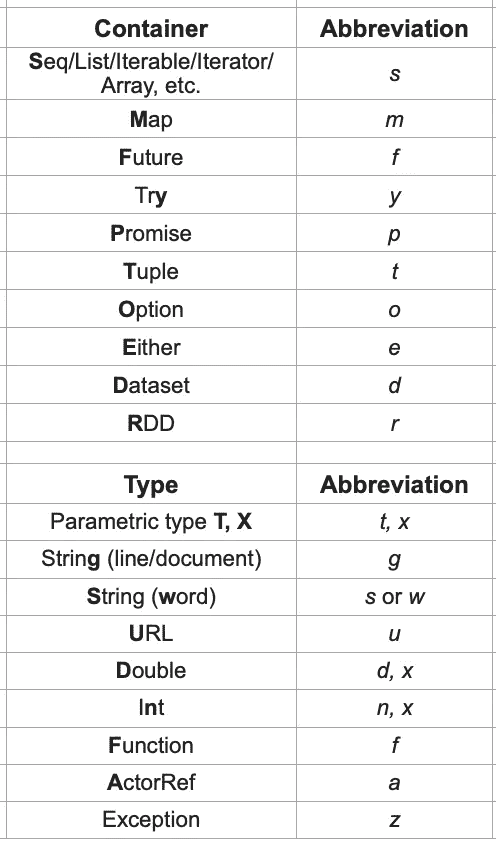

# 一个标识符，以任何其他名称，…

> 原文：<https://medium.com/codex/an-identifier-by-any-other-name-c9c8f32b1477?source=collection_archive---------8----------------------->

有时候，我们应该如何称呼变量或方法参数是显而易见的:

```
val *radius* = 1
val *circumference* = 2 * *radius* * Math.*PI*
```


但是很多时候，花时间去想该如何称呼某样东西是没有意义的。为一个名字而苦恼(*一朵玫瑰，或者其他名字*，等等)实际上可能会阻止我们在真正需要的时候拆分一个表情。令人费解的表达是审查者或维护者生活的祸根。例如，当我们不把他们分开时，Codacy 会给我们一个轻微的警告。

那么，在强类型语言(比如 Scala)中，变量的重要之处是什么呢？类型。我们通常很容易看到价值。但是，除非你习惯于给所有的变量添加类型注释，否则类型可能不会如此明显。那么，为什么不根据类型来命名呢？简单！

你可能已经注意到这样的代码(摘自 *Artima* 网站:[使用列表](https://www.artima.com/pins1ed/working-with-lists.html)):

```
def isort(xs: List[Int]): List[Int] =
    if (xs.isEmpty) Nil
    else insert(xs.head, isort(xs.tail))
```

其中 *xs* 用于事物序列，发音为 *x 的*(*x*的复数)。每个人都这样做。而且，Scala 语言鼓励使用短标识符。因此，我简单地整理了一组更通用的规则(实际上是指导原则)来涵盖大多数可能发生的情况，从而得到一个简洁、简短且有意义的标识符。

同理， *x* 的一个序列( *Seq* )写成 *xs* ，那么 *x* 的一个*未来*应该写成 *xf* 。一个 *x* 的 *Try* 可能会写成 *xt* 但是我要推荐稍微不同的东西( *xy* )，因为 *t* 对*元组*有用。所以，总的方案是:

```
trait C[X]
type A
val *ac*: C[A] = *???*
```

其中 *C* 是某个容器类型(不一定是这里显示的特征)，而 *A* 是某个类型，那么我们用 *ac* 表示 A*C【A】*。显然，这些可以这样组合，如果 *A* 恰好是 *X* 的序列(例如)，那么我们最终得到:

```
val *xsc*: C[Seq[X]] = *???*
```

请注意，容器/类型定义的顺序与标识符的名称相对应。所有这一切的好处是，当读者(甚至您自己)以后阅读代码时，即使没有明确显示，也可以清楚地知道标识符的类型。如果您不是通过 IDE 阅读代码，那么有一个类型指示将会非常有帮助。这也使得调试变得更加容易。

为了便于理解(假设 *C* 是一个函子，即定义了*映射*)，模式/生成器看起来非常自然:

```
for (a <- *ac*) yield a
```

以下是我对缩写的建议(当然，你应该自己选择):



有时，您可能有多个相同类型的标识符，在这种情况下，您可以在单个字母后加上 1、2 等。或者，您可以使用单个大写字符来添加上下文，例如用 *gD* 表示文档字符串，用 *gL* 表示行字符串。你也可以决定用 *t2* 来表示*连音 2* 等等。在我们有一个形式为*的*或者*或者【String，X】*或者*或者【Throwable，X】*的情况下，我们简单地使用标识符 *xe* ，忽略左侧(险恶的)类型。

在作为*未来*的 *f* 和作为*功能*的 *f* 之间可能会产生一些混淆。但是，这一点应该很清楚，因为容器位于标识符字符串的末尾。

下面是一些使用这种思想的代码示例:

```
def flatten[X](xyf: Future[Try[X]])(implicit ec: ExecutionContext): Future[X] = for (xy <- xyf; x <- *asFuture*(xy)) yield xdef asFuture[X](xy: Try[X]): Future[X] = xy match {
  case *Success*(x) => Future.*successful*(x)
  case *Failure*(z) => Future.*failed*(z)
}def sequence[X](xos: Seq[Option[X]]): Option[Seq[X]] = xos.foldLeft(*Option*(*Seq*[X]())) {
  (xso, xo) => for (xs <- xso; x <- xo) yield xs :+ x
}
```

一个稍微尴尬的情况是当使用一个 *Map* 或者其他接受两个底层类型的容器时。我通常将第一个底层类型(在标识符中第二个出现)用大写字母表示，以试图阐明发生了什么。例如，这里有一种方法，将带有可选值的*映射*展平为带有所需值的*映射*。

```
def flatten[K, V](voKm: Map[K, Option[V]]): Map[K, V] = for ((k, vo) <- voKm; v <- vo) yield k -> v
```

此外，一个 *(K，V)* 元组可能有一个名为 kV 或 _kv_ 的标识符，而不是使用 *t* 作为某种泛型类型。或者，您可以通过使用带括号的标识符来发挥真正的创造力，例如:

```
val *`[wx]m`* = *Map*[String,Int]()
```

好好享受吧。这绝对比绞尽脑汁去想一个合适的、简短的名字要好。