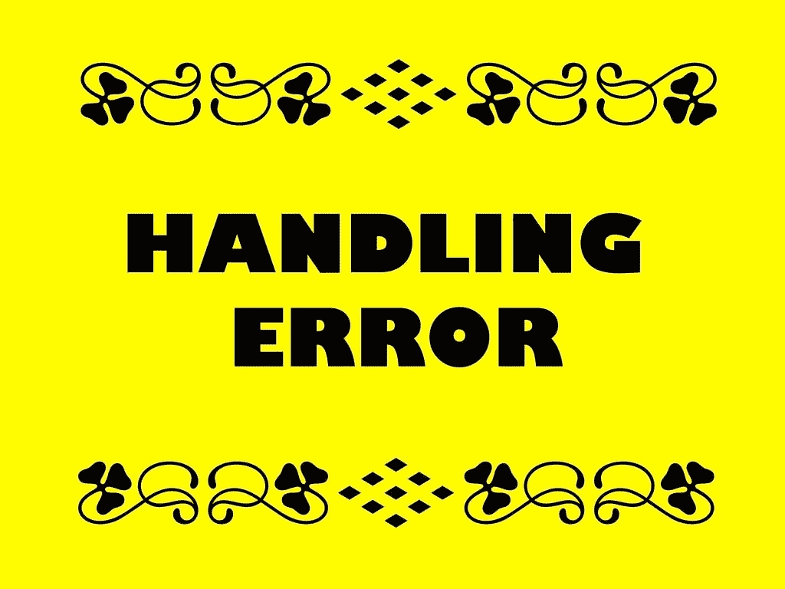

# Python 中输入错误处理的初始示例

> 原文：<https://medium.com/codex/an-initial-example-of-input-error-handling-in-python-40b33da4fd28?source=collection_archive---------3----------------------->

随着我对 Python 编程研究的进展，我开始研究错误处理，这对于确保脚本的健壮性很重要。一种错误是输入错误，这是用户在输入数据时出现的错误。

我已经包括了我最近写的一个简短的脚本代码。下面的脚本是一个非常小的程序，将…